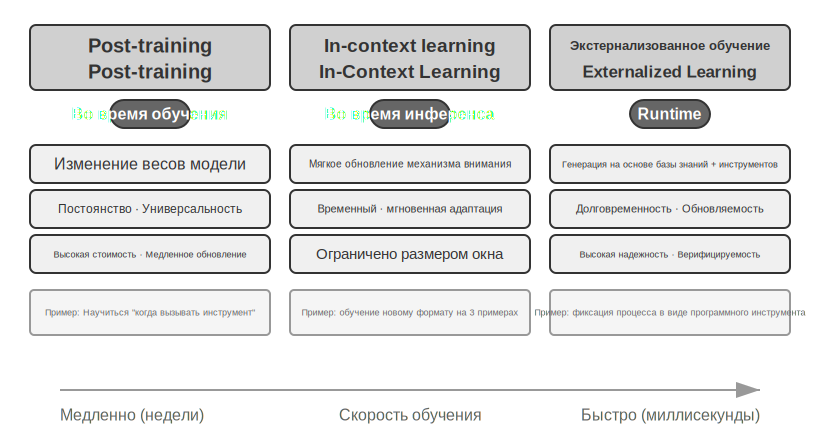
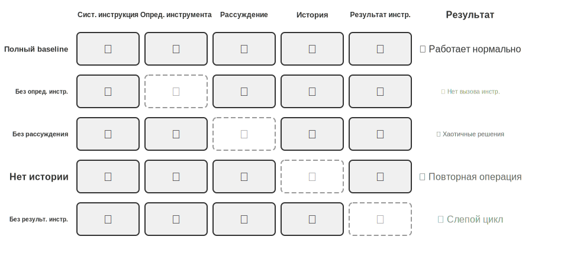
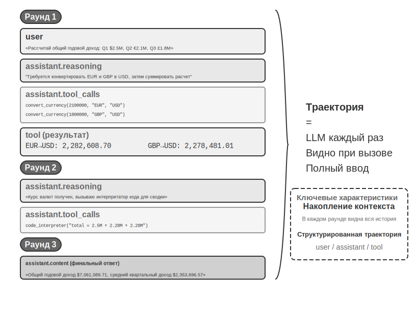
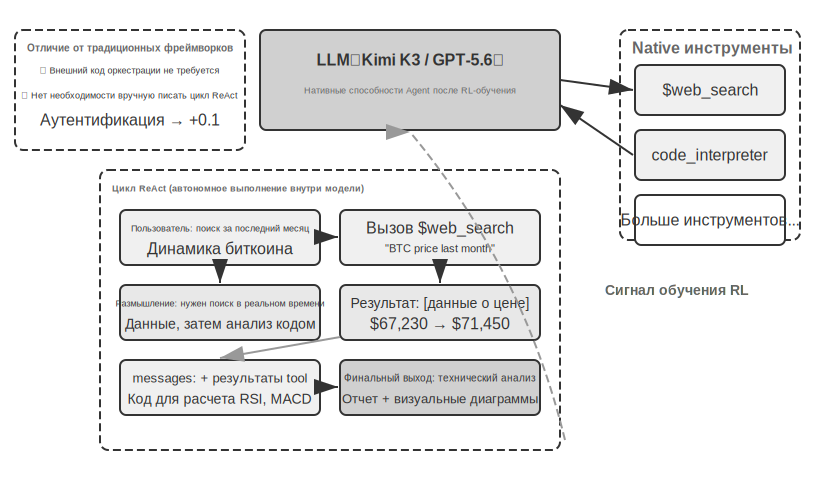
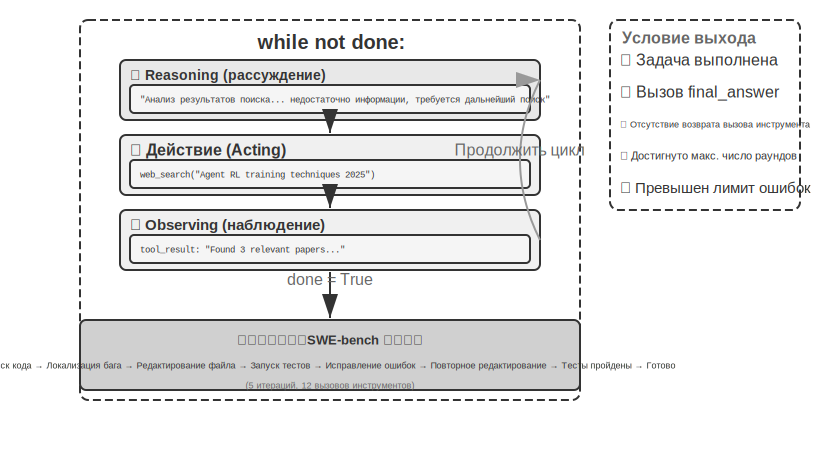

# Введение в AI Agent

Шаг 1: Объявление инструментов          Шаг 2: Модель принимает решение о вызове

Формы этих продуктов разнообразны, но у них есть общая черта: это больше не пассивный диалог в формате «вы спрашиваете — он отвечает», а интеллектуальные системы, способные самостоятельно планировать шаги выполнения, вызывать различные инструменты для завершения задач и постоянно корректировать стратегию на основе результатов. AI Agent становится совершенно новым способом нашего взаимодействия с компьютерами.

Эта глава поможет вам понять основные компоненты AI Agent, исходя из практики. Мы на собственном опыте изучим возможности современных Agent, разберем стоящие за ними архитектурные принципы, а также освоим Design Patterns (шаблоны проектирования) и Best Practices (лучшие практики) для построения систем агентов.

> **Совет по чтению**: Эта глава является концептуальной картой всей книги. Она быстро вводит основные формулы Agent, циклы работы, инженерные фреймворки и шаблоны проектирования, создавая единую терминологию и систему координат для последующих глав. При первом чтении не обязательно запоминать все концепции; рекомендуется сначала сформировать общее впечатление. В последующих главах каждый аспект, упомянутый здесь, будет разобран подробно, и вы всегда сможете вернуться сюда для сверки.

## Современный Agent = LLM + Контекст + Инструменты

Суть современной системы Agent можно выразить лаконичной формулой: **Agent = LLM (Large Language Model, большая языковая модель) + Контекст + Инструменты**. Эта формула проста и практична, но каждое слово в ней требует широкого понимания:

- **LLM — это мозг Agent**: Это не просто набор параметров модели, а все решающее ядро Agent — понимание намерений, размышление, планирование и вынесение суждений. Подобно тому как человеческий мозг — это не только совокупность нейронов, но и сформированный опытом образ мышления, способности LLM также складываются из двух частей: знаний о мире и языковых навыков, накопленных в процессе **Pre-training** (предобучение), и стратегий принятия решений, закрепленных в ходе **Post-training** (постобучение) — конкретные технологии последнего (такие как SFT и Reinforcement Learning) будут подробно рассмотрены в седьмой главе.
- **Контекст — это глаза Agent**: Это не просто фрагмент текста, подаваемый на вход модели, а вся информация, которую Agent видит в каждой точке принятия решения: данные о среде, память о пользователе, знания в предметной области, собственное состояние и прогресс выполнения задачи. Подобно тому как человеку для принятия решения нужно ясно видеть текущую ситуацию, вспоминать соответствующий опыт и просматривать справочные материалы, Context Window (контекстное окно) агента — это всё, что он видит в данный момент.
- **Инструменты — это руки и ноги Agent**: Это не просто несколько вызываемых функций API, а совокупность всех действий, которые может совершать Agent: от предопределенного Tool Calling (вызов инструментов) до загружаемых по требованию Skills (навыки), от динамической генерации кода для создания новых способностей до делегирования задач субагентам, от активного общения с пользователем до реагирования на внешние события.

Иными словами, более наглядно: **Agent = Мозг + Глаза + Руки и ноги**. Мозг отвечает за мышление и принятие решений, глаза предоставляют всю необходимую для этого информацию, а руки и ноги преобразуют решения в изменения в реальном мире.

Эти три компонента точно соответствуют трем основным концепциям в RL (Reinforcement Learning (обучение с подкреплением), подробнее в седьмой главе). Таблица ниже предназначена для **факультативного чтения** — если у вас нет опыта в RL, вы вполне можете её пропустить, это не повлияет на дальнейшее понимание; она лишь помогает читателям с бэкграундом в RL соотнести имеющиеся знания с терминологией этой книги:

| Интуитивное понимание | Компонент реализации | Академическая концепция (опционально) | Значение |
|---------|---------|---------|------|
| **Мозг** | LLM | **Policy** (Стратегия) | Логика принятия решений Agent: «что делать дальше» — выбор наиболее подходящего действия из всех доступных на основе текущей информации |
| **Глаза** | Контекст | **Observation Space** (Пространство наблюдений) | Вся информация, которую видит Agent: что он может видеть, читать, помнить и к каким системам имеет доступ |
| **Руки и ноги** | Инструменты | **Action Space** (Пространство действий) | Совокупность всего, что может делать Agent: какие «средства» доступны, от отправки сообщений до выполнения кода и управления интерфейсом |

Понимание роли этих трех компонентов и их взаимосвязей является фундаментом для построения эффективных систем Agent. Мы начнем знакомство с самого конкретного — с рук и ног (инструментов), постепенно переходя к мозгу (LLM) и глазам (контексту). Для начала посмотрим, как разные типы Agent проявляют себя в этих трех измерениях:

| Agent (агент)-продукт | Глаза (восприятие) | Руки и ноги (действия) | Стратегия |
|---------|------|---------|------|
| **Coding Agent (агент для кодинга), такие как Cursor** | Документация требований, кодовая база, среда терминала | Открытого типа (внутренние рассуждения, поиск по коду, чтение/запись файлов, выполнение команд и т. д.) | Инкрементальная разработка: понимание требований → поиск релевантного кода → редактирование кода → тестирование и проверка → отладка и исправление |
| **Search Agent (поисковый агент), такие как Deep Research** | Сетевые ресурсы, академические базы данных, локальные файлы | Открытого типа (внутренние рассуждения, поисковые запросы, чтение веб-страниц, генерация саммари) | Итеративное углубление: корректировка направления поиска на основе имеющейся информации, постепенный синтез полного отчета |
| **Computer Use Agent (агент для управления компьютером), такие как Manus** | Экран компьютера, страницы браузера, файловая система | Открытого типа (внутренние рассуждения, клики, ввод текста, прокрутка, скриншоты, выполнение кода и т. д.) | Визуальное восприятие + манипуляции: наблюдение за экраном → идентификация целевых элементов → выполнение действий → проверка результата |
| **Mobile Assistant Agent (мобильный агент-помощник), такие как Doubao** | Экран телефона, установленные приложения | Открытого типа (внутренние рассуждения, клики, свайпы, ввод текста, запуск приложений и т. д.) | Понимание намерений + управление приложениями: понимание потребностей пользователя → локализация целевого приложения → выполнение действий → подтверждение завершения |
| **Personal Assistant Agent (персональный агент), такие как Pine AI** | Информация об аккаунте пользователя, история счетов, база знаний сервис-провайдеров | Открытого типа (внутренние рассуждения, телефонные звонки, отправка email, заполнение форм, подтверждение у пользователя) | Выполнение многошаговых задач: сбор информации → разработка стратегии переговоров → связь с сервис-провайдером → переговоры → отчет о результатах |

Эти системы Agent (агент) имеют несколько общих характеристик: все они используют **открытое пространство действий** — они не выбирают из ограниченного набора кнопок, а способны генерировать произвольный естественный язык и код; все они способны к **внутреннему рассуждению** — обдумыванию и планированию перед принятием мер; все они способны к **непрерывному взаимодействию** — постоянной корректировке стратегии на основе обратной связи от среды. Эти способности проистекают именно из синергии мозга, глаз, рук и ног — то есть LLM, контекста и инструментов.

### Инструменты: руки и ноги Agent

Инструменты — это мост для взаимодействия Agent с внешним миром. Подобно человеческим рукам и ногам, они позволяют Agent превратиться из пассивного наблюдателя в активного исполнителя. Без инструментов Agent может лишь «рассуждать на бумаге»; с инструментами он может по-настоящему менять мир.

Для систематического обсуждения инструментов их можно разделить на пять категорий в зависимости от направления взаимодействия Agent с внешним миром. Ниже приведем краткий обзор типичных сценариев для каждой категории, чтобы сформировать общее представление; подробный разбор последует в следующих главах.

**Инструменты восприятия** позволяют Agent получать доступ к информации: поисковые системы предоставляют сетевые данные в реальном времени, файловые системы читают локальные документы, а API и базы данных подключаются к внешним сервисам и основным корпоративным данным.

**Инструменты исполнения** позволяют Agent менять мир: выполнение кода, операции с файлами, системные команды, вызовы внешних API — именно здесь решения превращаются в реальные действия.

**Инструменты коллаборации** позволяют Agent распределять работу с другими Agent: делегировать специализированные задачи суб-агентам, запрашивать подтверждение человека в критических точках принятия решений или координировать действия в мультиагентных системах.

**Инструменты, запускаемые по событиям**, принципиально отличаются от первых трех категорий по способу вызова — они не вызываются Agent активно, а служат внешними входными данными, побуждающими Agent начать выполнение задачи. Например, получение нового электронного письма, наступление определенного времени или получение Webhook-уведомления от другой системы. Эти события активируют Agent, инициируя последующие рассуждения и действия. Хотя триггеры событий не вызываются Agent самостоятельно, они являются одним из каналов взаимодействия Agent с внешним миром, поэтому включаются в широкую систему инструментов.

**Инструменты коммуникации с пользователем** — это каналы, через которые Agent активно устанавливает связь с пользователем и передает информацию. В отличие от инструментов исполнения, которые меняют внешний мир, инструменты коммуникации с пользователем сосредоточены на передаче информации и взаимодействии — через текстовые сообщения, голосовые звонки, электронную почту и т. д., донося до пользователя прогресс выполнения задач или проявляя инициативу в общении.

Полная система классификации и принципы проектирования этих пяти категорий инструментов будут подробно рассмотрены в четвертой главе. Качество проектирования инструментов напрямую определяет, как далеко сможет зайти Agent: если определения интерфейсов нечеткие, модель будет использовать инструменты беспорядочно; если обработка ошибок не на должном уровне, сбой инструмента приведет к взаимной блокировке Agent; если контроль прав слишком широк, последствия ошибки Agent могут стать необратимыми. Продвижение стандарта MCP (Model Context Protocol) делает подключение инструментов все более похожим на установку плагинов — экосистема быстро расширяется, но принципы проектирования остаются актуальными.

**Tool Calling (вызов инструментов)** (также называемый Function Calling) — это ключевая способность современных LLM Agent, которая позволяет модели вызывать внешние инструменты структурированным способом. Эта способность превращает LLM из чистого генератора текста в интеллектуальную систему, способную выполнять реальные операции. В дальнейшем в этой книге будет единообразно использоваться термин «Tool Calling».

Процесс Tool Calling делится на четыре этапа: сначала в контексте модели сообщается, какие инструменты доступны (включая названия, назначение и параметры); затем модель самостоятельно определяет, нужно ли вызывать инструмент, какой именно и с какими параметрами; далее, после завершения работы инструмента, результат добавляется в контекст; наконец, на основе этого модель принимает решение о следующем шаге. Этот цикл является основой ReAct, который будет представлен позже.

На примере сценария запроса погоды упрощенное представление четырехэтапного процесса на уровне API выглядит следующим образом:

```
    city: "string"                     arguments: {city: "北京"}
tools: [{                          assistant: {
  name: "get_weather",               tool_calls: [{
  parameters: {                        function: "get_weather",
Шаг 3: Добавление результата в контекст   Шаг 4: Ответ модели на основе результата
  }                                  }]
}]                                 }

  tool_call_id: "call_1",            content: "北京今天 28°C，晴。"
tool: {                            assistant: {
content: '{"temp":28,"sky":"晴"}'  }

}
```

Разработчику нужно лишь определить инструменты и реализовать выполнение их вызовов, а модель самостоятельно принимает решение о том, «нужно ли выполнять вызов, какой именно инструмент выбрать и какие параметры передать». Во второй главе эта структура API будет рассмотрена подробно.

При проектировании инструментов для Agent (агент) следует максимально сохранять их универсальность, предоставляя LLM больше пространства для маневра. Например, вместо того чтобы проектировать специализированный инструмент-калькулятор, лучше предоставить интерпретатор кода Python и создать для Agent безопасную песочницу для выполнения. Вместо инструмента для записи рабочих логов лучше предоставить инструменты чтения и записи файлов и создать для Agent виртуальную файловую систему. Универсальные инструменты позволяют Agent творчески решать задачи, комбинируя базовые возможности.

### LLM: Brain (мозг) агента

Large Language Model (LLM, большая языковая модель) является ядром принятия решений Agent. Получив запрос пользователя, она должна сначала проанализировать истинное намерение (пользователь часто говорит не совсем то, что ему на самом деле нужно), а затем разбить неясную или сложную задачу на исполнимые шаги. В процессе выполнения ей также необходимо постоянно принимать решения: что делать дальше, нужно ли вызывать инструмент, какой именно и с какими параметрами. Эта способность к «пониманию-планированию-выполнению» проистекает из знаний, накопленных в процессе Pre-training (предобучение), и является фундаментом, на который опираются как рабочие процессы, так и автономные Agent.

Уникальной способностью LLM Agent являются **внутренние размышления** — прежде чем предпринять реальные действия, Agent может сначала провести планирование и логический вывод. Этот процесс не изменяет внешнюю среду, но может значительно повысить качество последующих действий. Способность LLM к эффективному внутреннему выводу обусловлена навыками, приобретенными на этапе Pre-training (начальное обучение на огромных массивах интернет-текстов, позволяющее модели усвоить языковые закономерности и знания о мире). При построении рассуждений модель следует логическим правилам, уже заложенным в человеческих знаниях, включая математические законы, причинно-следственные связи, стратегии декомпозиции задач и т. д. Таким образом, логический вывод Agent — это не слепое случайное исследование, а процесс, разворачивающийся в рамках структурированной системы знаний.

Эта способность к структурированному выводу позволяет LLM Agent приступать к выполнению совершенно новых задач без предварительной подготовки — поясним это через концепции Zero-shot и Few-shot. Прямым проявлением этой способности является **Zero-shot Generalization** (зеро-шот обобщение): даже сталкиваясь с никогда ранее не встречавшейся задачей, LLM Agent может справиться с ней, комбинируя имеющиеся знания без каких-либо примеров. Например, вы никогда не учили его писать стихи о квантовой физике, но он может создать достойное произведение на основе имеющихся знаний о языке и физике.

Более того, LLM Agent может реализовать **Few-shot Adaptation** (фью-шот адаптация) с помощью минимального количества примеров — достаточно дать в промпте два-три демонстрационных примера, и модель сможет освоить новый паттерн задачи. Например, если показать ей несколько примеров «отзыв пользователя -> метка тональности», она научится классифицировать новые отзывы. Проще говоря, Zero-shot — это «могу сделать без примеров», а Few-shot — «могу научиться, посмотрев на несколько примеров».

#### Model as Agent: когда модель сама становится продуктом

Новая парадигма «Model as Agent» (модель как агент) представляет собой новейшее направление развития AI Agent. Продвинутые модели с помощью Post-training (постобучение), особенно Reinforcement Learning (обучение с подкреплением), превращают способность к Tool Calling (вызов инструментов) в нативную возможность: когда вызывать инструмент, какой именно и с какими параметрами — всё это модель решает сама, без ручного проектирования цепочек. Но это не означает, что уровень фреймворков становится неважным. Напротив, чем мощнее модель, тем критичнее становится Harness (обвязка), построенная вокруг неё. Слово Harness изначально означало конскую сбрую — узду и упряжь. Она нужна не для того, чтобы ограничить способность лошади бежать, а для того, чтобы направить эту силу в нужное русло. В контексте Agent модель — это мощная, но непредсказуемая лошадь, а Harness — это инженерная оболочка, которая направляет её способности на надежное выполнение задач. Это также можно представить как систему обеспечения безопасности вокруг гонщика: ремни безопасности, ограждения трассы, команда на пит-стопе. Чем быстрее водитель (модель), тем важнее эта система. В Agent обвязка включает инфраструктуру для Context Management (управление контекстом), интерфейсы инструментов, ограничения безопасности, верификацию и коррекцию (подробнее см. в последнем разделе этой главы).

Чем больше пространства у модели для автономного принятия решений, тем больше зона влияния в случае ошибки, поэтому требуются более тонкие механизмы ограничений, верификации и коррекции для обеспечения надежности. Истинное преимущество производителей моделей заключается не в «утончении фреймворка», а в возможности совместной оптимизации и непрерывной итерации модели и внешней Harness.

#### Механизмы обучения Agent: Post-training, In-Context Learning и экстернализированное обучение

Ранее мы обсудили, как модели превращают вызов инструментов в нативную способность через Reinforcement Learning. Но обучение Agent происходит не только на этапе тренировки — некоторые читатели, думая об обучении Agent на опыте, полагают, что это обязательно требует обучения модели. На самом деле, Post-training — не единственный способ обучения Agent на основе опыта. Механизмы обучения Agent можно резюмировать в виде трех взаимодополняющих парадигм (рис. 1-1):



- **Post-training (пост-обучение)**: использование Reinforcement Learning (обучение с подкреплением) для закрепления опыта в параметрах модели, что обеспечивает максимальную кросс-задачную универсальность, но требует высоких затрат на обновление (подробнее в главе 7).
- **In-Context Learning (обучение в контексте)**: быстрая адаптация через механизм поиска паттернов в контексте с помощью Attention Mechanism (механизм внимания — механизм, определяющий, на какой информации модель «сосредотачивается» при обработке входных данных). Например, если в промпте показать модели несколько примеров обработки диалогов службы поддержки (например, «жалоба пользователя → успокоение + вариант компенсации»), она сможет обрабатывать новые диалоги аналогичным образом — это и есть In-Context Learning. Оно позволяет быстро адаптироваться, но носит временный характер и исчезает после завершения сессии. Стоит уточнить, что, несмотря на название «обучение», его внутренний механизм ближе к **сопоставлению паттернов (pattern matching), а не к истинному обучению**. Приведем аналогию: если вам покажут три однотипные математические задачи с ответами, а затем дадут четвертую, вы, скорее всего, сможете решить ее по образцу — именно этим занимается In-Context Learning. Но если четвертая задача потребует совершенно нового подхода к решению, ответов на первые три задачи будет недостаточно. Иными словами, In-Context Learning позволяет модели **применять уже виденные паттерны**, но не **обнаруживать принципиально новые закономерности** — в этом его фундаментальное отличие от Post-training (во второй главе этот тезис будет подробно разобран с точки зрения механизмов внимания).
- **Externalized Learning (экстернализированное обучение)**: вынос знаний и процессов вовне в виде баз знаний и исполняемого кода инструментов, что сочетает в себе долговечность и интерпретируемость.

Эти три парадигмы дополняют друг друга на разных временных шкалах: Post-training дает базовые способности, In-Context Learning обеспечивает быструю адаптацию, а Externalized Learning гарантирует надежность и эффективность. В главе 8 будет системно рассмотрено их взаимодействие.

Для сравнения: Post-training подобен систематическому изучению учебника — после завершения способности улучшаются навсегда, но стоимость обучения высока; In-Context Learning напоминает сверку со справочными материалами на месте — пока материалы под рукой, работа идет хорошо, закрыли их — и все забыто; Externalized Learning похоже на ведение личного блокнота — информация сохраняется надолго и доступна в любой момент, но требует специальной организации.

### Контекст: глаза Agent

Контекст — это вся информация, которую Agent видит в каждой точке принятия решения. Подобно тому как человеку для принятия решения нужно видеть все разложенные на столе материалы — описание задачи, справочные руководства, историю предыдущих коммуникаций, актуальные данные — Context Window (контекстное окно) является «полем зрения» агента. С точки зрения API (подробнее в главе 2), контекст при каждом вызове LLM состоит из следующих пяти частей:

- **System Prompt (системный промпт)**: в отличие от промптов, вводимых пользователем, System Prompt пишется разработчиком и остается неизменным на протяжении всего диалога. Он выполняет роль «должностной инструкции» Agent — определяет его личность, полномочия и правила поведения. С помощью тщательного проектирования System Prompt методами Prompt Engineering (промпт-инженерия) мы можем формировать стиль работы Agent. Также System Prompt может содержать сохраняемую между сессиями **память о пользователе** (пользовательские предпочтения, история поведения, бэкграунд и другая персонализированная информация, подробнее в главе 3) и динамически внедряемое состояние среды.
- **Tool Definitions (определения инструментов)**: описание названий, функций и форматов параметров инструментов, доступных Agent. Без Tool Definitions Agent не сможет распознать и вызвать ни один инструмент — эксперимент по абляции (Эксперимент 1.1) подтвердит это. Tool Definitions вместе с System Prompt образуют **статический префикс**, который не меняется в процессе диалога.
- **User Messages (сообщения пользователя)**: входные данные от пользователя. Сообщения пользователя также могут содержать **внешние знания**, динамически извлеченные через RAG (генерация с извлечением, Retrieval-Augmented Generation, подробнее в главе 3) — это позволяет охватить информацию, появившуюся после отсечки обучающих данных, или знания из закрытых предметных областей.
- **Assistant Messages (ответы модели)**: ранее сгенерированные ответы модели, которые могут содержать до трех частей: процесс рассуждения (reasoning, то есть внутренняя цепочка рассуждений для поддержания связности мышления и интерпретируемости решений), текстовое содержание (content, то есть ответ пользователю) и запрос на Tool Calling (вызов инструментов, то есть способ совершения действий Agent). В конкретном ответе эти три части не обязательно присутствуют одновременно: например, когда Agent решает вызвать инструмент, обычно присутствуют только reasoning + tool_calls, а при выдаче финального ответа — только reasoning + content.
- **Tool Results (результаты работы инструментов)**: результаты, возвращаемые после выполнения инструментов Harness (обвязкой) Agent. Эти результаты служат прямой основой для следующего шага размышлений Agent, а также позволяют ему учиться на результатах выполнения и избегать повторения ошибок.

Первые два пункта (System Prompt + Tool Definitions) являются статическим префиксом, а последние три (User Messages + Assistant Messages + Tool Results) представляют собой постоянно растущую динамическую историю сообщений. Эти пять частей вместе образуют контекст для каждого шага вывода (inference) LLM.

Чтобы проверить, является ли каждый компонент незаменимым, самым прямым методом является **Ablation Study** (метод изъятия компонентов): подобно тому как врач при диагностике последовательно исключает причины болезни — сначала убирает компонент А, чтобы проверить, нормально ли работает система, затем компонент B и так далее, — тем самым определяя вклад каждого элемента. Эксперимент 1.1 как раз следует этой логике, проводя систематическое тестирование вышеупомянутых пяти компонентов. Результаты показали: без Tool Definitions (определения инструментов) Agent (агент) полностью теряет способность к действию; при отсутствии Tool Results (результаты выполнения инструментов), не видя обратной связи от предыдущего шага, Agent будет повторно вызывать один и тот же инструмент, попадая в бесконечный цикл; если из ответа модели извлечь Reasoning (процесс рассуждения), последующие решения начинают противоречить предыдущим; что касается истории сообщений, то без нее Agent фактически страдает амнезией и начинает весь процесс выполнения задачи с самого начала, дублируя уже завершенные этапы. Роль каждого компонента подтверждена экспериментальными данными, а не просто теоретическими выкладками.

### Эксперимент 1.1 ★★: Ключевая роль контекста

С помощью систематического **Ablation Study** мы исследовали влияние различных компонентов контекста на поведение Agent. Для тестирования из пяти вышеупомянутых частей были выбраны четыре — System Prompt (системный промпт) как базовое определение идентичности Agent не участвовал в изъятии, так как без него у Agent отсутствует даже базовое осознание своей роли, и тест теряет смысл. Как показано на Рисунке 1-2, пять групп контрольных экспериментов включали: одну полную базовую линию (baseline) со всеми компонентами и четыре группы, в каждой из которых отсутствовал один компонент, чтобы наблюдать за его влиянием на производительность Agent.

Результаты эксперимента выявили незаменимую роль каждого компонента контекста. **Tool Definitions** (определения инструментов, часть статического префикса) являются фундаментом способности Agent к действию; без них Agent не может распознать и вызвать ни один инструмент. **Tool Results** (результаты выполнения инструментов) — это ключ к управлению с обратной связью; их отсутствие приводит к тому, что Agent действует «вслепую», попадая в бесконечный цикл. **Reasoning** (процесс рассуждения в ответе модели) сохраняет причины, по которым Agent принял предыдущие решения, делая поток мыслей более связным и предотвращая принятие противоречивых решений. **История сообщений** (сообщения пользователя, ответы модели и результаты выполнения инструментов из предыдущих раундов) предотвращает избыточные операции, поддерживает непрерывность выполнения задачи и помогает избежать повторения одних и тех же ошибок.

Основной инсайт этого эксперимента заключается в следующем: **контекст определяет то, что видит Agent, а Agent может принимать решения только на основе той информации, которую он видит**. Подобно тому как человек с завязанными глазами не может выносить обоснованные суждения, при отсутствии любого компонента контекста способность Agent к принятию решений серьезно деградирует: не видя Tool Definitions, он не знает, какие инструменты доступны; не видя предыдущих Tool Results, он не знает, что уже было сделано.

### Цикл ReAct

Разобравшись с тремя основными компонентами Agent, возникает естественный вопрос: как они работают вместе? Цикл ReAct — это основной механизм, связывающий LLM, контекст и инструменты воедино. Давайте посмотрим, как Agent шаг за шагом рассуждает и действует.

Основной паттерн выполнения задач Agent называется **ReAct** (Reasoning + Acting). Хотя название отражает только два слова — рассуждение (Reasoning) и действие (Acting), фактический цикл включает три этапа: модель сначала **рассуждает** о том, что следует сделать сейчас, затем совершает **действие**, вызывая инструмент, а после **наблюдает** за результатом, возвращенным инструментом, и продолжает обдумывать следующий шаг. Этот цикл «подумал → сделал → посмотрел → подумал → сделал → посмотрел» повторяется до тех пор, пока задача не будет выполнена.

Давайте разберем на конкретном примере сведения доходов в разных валютах, что такое **trajectory** (траектория) Agent. Траектория — это история сообщений, которая постоянно накапливается в процессе выполнения задачи Agent: сообщения пользователя, ответы модели (включая процесс рассуждения и вызовы инструментов) и результаты выполнения инструментов. При каждом вызове LLM полный контекст, который она получает, состоит из двух частей: **статического префикса** (System Prompt + Tool Definitions) и **траектории** (динамическая история сообщений) (Рисунок 1-3). Это раскрывает ключевой факт: **Контекст Agent = Статический префикс + Траектория**. Говоря конкретнее, статический префикс соответствует первым двум из пяти вышеописанных компонентов (System Prompt + Tool Definitions), а траектория соответствует последним трем (сообщения пользователя + ответы модели + результаты выполнения инструментов), которые растут по мере взаимодействия. На основе этого полного контекста LLM генерирует следующий ответ, который затем добавляется в траекторию для использования при следующем вызове.

Давайте поймем структуру траектории Agent через псевдокод:

Обратите внимание, что в траектории не отображаются System Prompt и Tool Definitions — они выступают в качестве статического префикса и автоматически добавляются перед траекторией при каждом вызове LLM.

В нашем эксперименте этот цикл проявился в полной мере. В первом раунде Agent, проанализировав задачу, параллельно вызвал три инструмента конвертации валют; во втором раунде, на основе полученных результатов, вызвал интерпретатор кода для проведения сложных вычислений; в третьем раунде, подтвердив завершение всех расчетов, сформировал финальный ответ. Весь процесс занял всего 3 итерации и 4 вызова инструментов для выполнения сложной многошаговой задачи.



Траектория = [

```
  {role: “user” , content: “На основе квартальной выручки компании: Q1 2.5M долларов, Q2 2.1M евро, Q3 1.8M фунтов, Q4 380M иен, рассчитайте общую годовую выручку компании и среднюю квартальную выручку” },
  # Первая итерация — LLM видит вышеуказанную траекторию, генерирует ответ
  
   reasoning: “Необходимо конвертировать все валюты в USD...” ,
  {role: “assistant” , 
   content: “” ,  # Прямого ответа пользователю нет
  # Фреймворк Agent выполняет инструмент, добавляет результат в траекторию
   tool_calls: [
     {name: “convert_currency” , args: {amount: 2100000, from: “EUR” , to: “USD” }},
     {name: “convert_currency” , args: {amount: 1800000, from: “GBP” , to: “USD” }},
     {name: “convert_currency” , args: {amount: 380000000, from: “JPY” , to: “USD” }}
   ]},
  
  # Вторая итерация — LLM видит полную траекторию, включая результат инструмента
  {role: “tool” , content: “EUR->USD: 2282608.7” },
  {role: “tool” , content: “GBP->USD: 2278481.01” },
  {role: “tool” , content: “JPY->USD: 2541806.02” },
  
   reasoning: “Результаты конвертации получены, теперь необходимо произвести итоговый расчет...” ,
  {role: “assistant” ,
  # Третья итерация — LLM видит полную траекторию, генерирует финальный ответ
   content: “” ,
   tool_calls: [
     {name: “code_interpreter” , args: {code: “total = 2500000 + 2282608.7 + ...” }}
   ]},
  
  {role: “tool” , content: “Total: $9,602,895.73, Average: $2,400,723.93...” },
  
   reasoning: “Все расчеты завершены, обобщаю результат...” ,
  {role: “assistant” ,
   content: “FINAL ANSWER: Общая выручка $9,602,895.73...” }

]
```

Изысканность этой конструкции заключается в **накопительном характере контекста**. При каждом вызове LLM видит полную траекторию, что позволяет ей понимать, на каком этапе выполнения задачи она находится, что пробовала ранее и какие результаты получила. Подобно тому как люди постоянно оглядываются назад и обобщают опыт при решении проблем, Agent (агент) поддерживает глобальное понимание всей задачи через траекторию. В то же время структурированность траектории обеспечивает системе высокую степень интерпретируемости и отлаживаемости: сообщения пользователя, ответы модели (процесс размышления + Tool Calling (вызов инструментов)) и результаты выполнения инструментов четко отделены друг от друга.

Траектория — это не просто запись выполнения, но и воплощение способностей агента. Анализируя большое количество траекторий, мы можем выявлять паттерны поведения агента, оптимизировать пути принятия решений и улучшать проектирование инструментов. Данные траекторий можно даже обобщать в базу знаний или использовать для обучения более совершенных моделей агентов с помощью Reinforcement Learning (обучение с подкреплением), реализуя замкнутый цикл оптимизации через обучение на опыте.

Поняв цикл работы агента, давайте через два эксперимента почувствуем, как разные модели управляют этим циклом.

#### Эксперимент 1.2 ★: Нативные возможности агента Kimi K3

Этот эксперимент демонстрирует нативные возможности агента **Kimi K3**, воплощающие новую парадигму «модель как агент». Kimi K3, выпущенная Moonshot AI в 2026 году, представляет собой модель с архитектурой MoE (Mixture of Experts, смесь экспертов) объемом около 2,8 триллиона параметров. MoE можно представить как команду экспертов: сталкиваясь с различными типами вопросов, система автоматически выбирает нескольких наиболее подходящих специалистов для ответа, вместо того чтобы задействовать всех одновременно, что гарантирует эффективность при сохранении высокого качества. Она обладает Context Window (контекстное окно) в 1 миллион токенов, нативными способностями к визуальному пониманию, а также постоянно включенным «режимом размышления» (thinking mode). Модель обучена с помощью Reinforcement Learning, что позволило интернализировать Tool Calling как нативную способность, позволяя ей самостоятельно принимать решения и выполнять такие задачи, как поиск в сети.

Ключевые наблюдения включают: благодаря обучению через RL модель естественным образом научилась использовать инструменты без необходимости в дополнительном слое оркестрации; модель сама решает, когда и что искать, проявляя подлинную автономность; она способна динамически корректировать стратегию на основе результатов поиска, самостоятельно определяя достаточность информации; умение использовать инструменты не было «преподано» модели, а было освоено через повторяющееся взаимодействие со средой.

Одним из выдающихся преимуществ Kimi K3 в агентских задачах является **стабильность длинных цепочек вызовов инструментов** — она способна последовательно выполнять 200–300 вызовов, сохраняя согласованность рассуждений, что значительно превосходит показатели большинства моделей, которые начинают деградировать уже после нескольких десятков вызовов. K3 оптимизирована для длительных циклов программирования и рабочих нагрузок агентов. На момент релиза она доступна в двух спецификациях: K3 Max (для диалогов и задач агентов) и K3 Swarm Max (для крупномасштабной параллельной обработки). Будучи открытой моделью, она продемонстрировала в бенчмарках по программной инженерии и оценке агентов производительность, сопоставимую с топовыми закрытыми системами, что доказывает эффективность пути наделения моделей нативными агентскими способностями через Reinforcement Learning.

#### Эксперимент 1.3 ★: Нативные возможности Deep Research в GPT-5.6

Второй эксперимент использует **OpenAI GPT-5.6**, чтобы показать, как передовые модели интернализируют возможности **Deep Research** (глубокое исследование) в качестве нативной функции. GPT-5.6 поставляется в трех спецификациях: Sol (флагманская передовая модель), Terra (сбалансированная модель для повседневной работы) и Luna (быстрая и экономичная легкая модель). Во всех них Tool Calling является нативной способностью модели и не требует внешних фреймворков. Самой прорывной особенностью является **Freeform Tool Calling** (вызов инструментов в свободной форме). В традиционном подходе при вызове инструмента модель обязана упаковывать все параметры в строгий формат JSON (структурированный формат данных), что похоже на заполнение бланка со множеством форматных ограничений. Freeform Tool Calling позволяет модели напрямую отправлять инструменту исходный контент (например, фрагмент кода на Python или SQL-запрос), избавляя от хлопот с преобразованием форматов и делая процесс более гибким и эффективным. В GPT-5.6 также введены параметры Verbosity (контроль детализации вывода) и Reasoning Effort (настройка глубины размышлений; в Sol добавлен уровень max для получения максимального времени рассуждения), что позволяет разработчикам тонко контролировать поведение модели в зависимости от сложности задачи.

GPT-5.6 обладает мощными нативными способностями **поиска в сети и интерпретатора кода** — именно они составляют ядро Deep Research: модель может самостоятельно искать информацию в интернете для получения данных в реальном времени и писать код для глубокого анализа, реализуя итеративный исследовательский процесс «поиск -> чтение -> анализ -> повторный поиск». Например, при ответе на вопрос: «Какое расстояние между парой самых близких друг к другу столиц стран АСЕАН?», GPT-5.6 автоматически найдет географические координаты столиц всех десяти стран, затем напишет код на Python для расчета ортодромического расстояния между всеми парами столиц и в итоге определит самую близкую пару. Или в задаче «Изучить динамику биткоина за последний месяц и провести технический анализ» она сможет получить данные о ценах в реальном времени из нескольких финансовых источников, использовать профессиональные библиотеки для технического анализа для расчета скользящих средних, RSI, MACD и других индикаторов, сгенерировать визуальные графики и дать торговые рекомендации.

Более того, GPT-5.6 интериоризировала концепцию дизайна продукта **OpenAI Deep Research** на уровне модели, внедрив **процесс уточнения намерений** (Intent Clarification Process). Получив исследовательский запрос от пользователя, GPT-5.6 не приступает к выполнению немедленно, а сначала задает серию вопросов, чтобы прояснить истинные намерения пользователя. Взяв в качестве примера запрос «найти динамику биткоина за последний месяц и провести технический анализ», модель сначала спросит: «Какому источнику данных вы отдаете предпочтение? Какие технические индикаторы необходимо проанализировать?» Благодаря такому интерактивному уточнению намерений GPT-5.6 способна генерировать более точные исследовательские отчеты, лучше соответствующие потребностям пользователя.

GPT-5.6 — это зрелый пример концепции «модель как Agent» (агент): возможности Deep Research интегрированы на уровне модели и больше не зависят от внешних фреймворков оркестрации. Наибольшего внимания здесь заслуживает механизм уточнения намерений: модель не бросается выполнять задачу сразу после получения, а сначала подтверждает реальные потребности пользователя через вопросы, и только затем формулирует стратегию исследования. Это позволяет сократить разрыв между тем, «что сказал пользователь», и тем, «чего пользователь хочет на самом деле», еще до начала выполнения задачи.

На рисунке 1-4 представлена полная архитектура нативного `Tool Calling` (вызов инструментов) в рамках парадигмы «модель как Agent», а также процесс выполнения ReAct в реальных задачах для Kimi K3 / GPT-5.6.

## Harness Engineering: конкурентоспособность за пределами модели

К этому моменту вы уже поняли основной принцип работы Agent — LLM выполняет задачи, используя инструменты с помощью контекста в цикле ReAct. Предыдущие эксперименты доказали эффективность этого базового механизма, но в то же время выявили очевидные уязвимые места: модель может галлюцинировать (выдумывать несуществующие инструменты или параметры), выбирать неверные инструменты или не иметь возможности восстановиться при возникновении ошибки. Между работающим демо и надежным продуктом лежит огромная пропасть, и именно эти уязвимости призвана устранить **Harness Engineering** (инженерия обвязки). Первая половина этой главы ответила на вопрос, что такое Agent, вторая половина ответит на вопрос, как обеспечить надежную работу Agent в промышленной среде.

В предыдущих разделах была выведена основная формула: **Agent = LLM + Контекст + Инструменты**. Эта формула описывает **внутренний состав** Agent, то есть то, что берет на себя функции мозга, глаз и конечностей. С точки зрения Harness Engineering необходим взгляд на уровне **инженерной реализации**: если рассматривать LLM как основной компонент (Model), то весь поддерживающий код, построенный вокруг нее, в совокупности называется Harness (обвязка). Эти два взгляда не заменяют друг друга, а описывают одну и ту же систему на разных уровнях абстракции. Использование более общего термина «Model» обусловлено тем, что принципы Harness Engineering применимы к любой модели, обладающей способностями к рассуждению и `Tool Calling`, и не ограничиваются конкретным типом модели. Ядром Harness являются «Контекст + Инструменты» из исходной формулы, дополненные тремя механизмами защиты: **Constraints** (ограничения — определяют, что Agent может и чего не может делать), **Validation** (валидация — проверка правильности действий Agent) и **Correction** (коррекция — как исправить ситуацию при ошибке).

Развернем полную структуру Agent в производственной форме в виде уравнения:

> **Agent = LLM + [Контекст + Инструменты + Ограничения + Валидация + Коррекция] = Model + Harness**

Минимально жизнеспособный Agent может работать, имея только LLM, контекст и инструменты. Однако для обеспечения долгосрочной и надежной работы в промышленной среде необходимо дополнить эту конструкцию тремя инженерными оболочками: ограничения предотвращают выход за рамки, валидация выявляет ошибки, а коррекция восстанавливает систему после сбоев. Эти три механизма не являются новыми «независимыми модулями», а представляют собой уровни защиты, выстроенные вокруг «Контекста + Инструментов». Иными словами, минимальная формула — это взгляд уровня Demo, а расширенная — взгляд уровня Production; последняя полностью включает в себя первую, добавляя вокруг нее сеть безопасности.

Рассмотрим пример для лучшего понимания: включение политики возврата средств в контекст относится к категории «Контекста», а проверка того, что сумма возврата не превышает сумму заказа, относится к «Ограничениям». Выполнение инструментом API-вызова относится к категории «Инструментов», а автоматический повтор попытки после тайм-аута API относится к «Коррекции». Модель обеспечивает базовые способности к пониманию и рассуждению, а Harness направляет, ограничивает и усиливает эти способности для надежного выполнения задач. Инженерная практика проектирования и оптимизации этой инфраструктуры за пределами модели и называется **Harness Engineering**.

Разберем ценность Harness на конкретном примере. Предположим, вы просите Agent помочь пользователю отменить заказ, сделанный 3 дня назад. **Без Harness**: модель не видит политику возврата (недостаток контекста), не знает, какой API вызвать (недостаток инструментов), и напрямую выдумывает результат возврата в ответе пользователю (недостаток валидации), а пользователь обнаруживает, что возврат на самом деле не произошел (недостаток коррекции). **С Harness**: в системном промпте прописана политика возврата в течение 7 дней (контекст), Agent вызывает инструменты `query_order` и `process_refund` для завершения операции (инструменты), фреймворк проверяет, что сумма возврата не превышает сумму заказа (ограничения), проверяет состояние базы данных для подтверждения успешности возврата (валидация), а в случае тайм-аута API-вызова автоматически повторяет попытку (коррекция). Одна и та же модель, но с Harness и без него — результаты будут диаметрально противоположными.

Возвращаясь к метафоре с конской сбруей, приведенной в начале главы: модель без Harness подобна сорвавшейся с цепи дикой лошади — ее способности поразительны, но она не может надежно выполнять задачи.

Если говорить точнее, вся инфраструктура за пределами модели относится к Harness. Ядром Harness являются контекст и инструменты, вокруг которых выстроены три типа механизмов инженерной защиты.

| Функциональность | Основной принцип | Практический пример | Подробнее |

| Функция | Ответственность в одном предложении | Связь с контекстом/инструментами |
|------|-----------|-------------------|
| **Context (контекст)** | Предоставляет модели сенсорную информацию | Ядерная способность |
| **Tools (инструменты)** | Предоставляет модели средства действия | Ядерная способность |
| **Constrain (ограничение)** | Устанавливает границы поведения — что можно и чего нельзя делать | Граница безопасности, выстроенная вокруг контекста и инструментов |
| **Verify (проверка)** | Автоматически судит о правильности или ошибочности результата операции | Механизм проверки, выстроенный вокруг результатов выполнения инструментов |
| **Correct (коррекция)** | Автоматически исправляет ошибки или выполняет откат при обнаружении проблем | Механизм восстановления, выстроенный на случай сбоев вызова инструментов |

Context и Tools позволяют Agent (агенту) «быть способным действовать» — понимать задачу и предпринимать шаги; Constrain, Verify и Correct позволяют Agent «не совершать ошибок» — они не существуют отдельно от контекста и инструментов, а являются инженерными практиками, обеспечивающими надежную работу контекста и инструментов в продакшн-среде. На кривой зрелости продуктов Agent важность этих двух составляющих асимметрична.

Ранние фреймворки Agent в основном фокусировались на Context и Tools: дать модели инструменты, дать модели контекст, чтобы она «могла действовать». Центр тяжести систем Agent корпоративного уровня уже сместился в сторону Constrain, Verify и Correct: обеспечения безопасности вызовов инструментов, управляемости контекста и восстанавливаемости после ошибок.

Возьмем в качестве примера Claude Code: большая часть кода в его Harness (обвязке) относится к Constrain, Verify и Correct, а не к Context и Tools. Сами инструменты (чтение и запись файлов, выполнение команд, поиск) составляют лишь малую часть, в то время как механизмы обеспечения, выстроенные вокруг этих инструментов, являются истинным ядром. Эти механизмы включают:

- **Управление состоянием процесса**: отслеживание того, на каком этапе выполнения находится Agent в данный момент.
- **Многоуровневое сжатие контекста**: автоматическое сокращение информации, когда ее становится слишком много.
- **Классификация прав доступа**: контроль того, какие операции требуют подтверждения пользователем.
- **Circuit Breaker (автоматический выключатель)**: автоматическое «обесточивание» и прекращение повторных попыток при последовательном возникновении ошибок — подобно тому, как предохранитель в доме автоматически срабатывает при коротком замыкании, предотвращая крах всей системы.
- **Механизмы восстановления после ошибок**: перехват исключений, откат к предыдущему стабильному состоянию, повторная попытка или передача управления человеку.

**Индустрия переходит от парадигмы «уметь делать» к «делать надежно», поэтому Harness-инженерия становится ключевой компетенцией систем Agent.**

### От Prompt Engineering к Harness-инженерии: эволюция инженерной парадигмы

Оглядываясь на развитие инженерии AI-приложений, можно увидеть четкую дугу эволюции:

**Software Engineering (программная инженерия)** является фундаментом — традиционное проектирование систем, архитектура, тестирование и практики развертывания. **Prompt Engineering (промпт-инженерия)** стала первой волной инноваций — повышение качества вывода путем оптимизации инструкций на естественном языке, подаваемых модели. **Context Engineering (контекстная инженерия)** — вторая волна: люди осознали, что простой оптимизации промптов недостаточно, необходимо системно управлять всей информацией, которую видит модель (системные инструкции, определения инструментов, история диалога, внешние знания). **Harness-инженерия** — это нынешний фронтир: она расширяет поле зрения от того, «что видит модель», до того, «в какой системе работает модель», охватывая механизмы ограничений, средства проверки, циклы обратной связи и восстановление после ошибок — всю инфраструктуру за пределами самой модели.

Эти четыре этапа не заменяют друг друга, а вложены слоями: Prompt Engineering является подмножеством Context Engineering, а Context Engineering — подмножеством Harness-инженерии. Каждый слой расширяет область внимания и влияния инженера на базе предыдущего. **Когда способности различных моделей становятся все более близкими и перестают быть решающим фактором дифференциации, конкурентное преимущество смещается к инженерным практикам вне модели**. Это суждение подтверждается недавней практикой: опыт LangChain на Terminal Bench 2.0 (бенчмарк, оценивающий способность Agent выполнять сложные задачи в среде терминала) служит убедительным примером. Их Coding Agent поднялся с 52,8% до 66,5% (совершив скачок с мест за пределами топ-30 в первую пятерку рейтинга), при этом изменилась не модель, а Harness: использование инженерных методов, позволяющих Agent автоматически проверять результаты своего выполнения, обнаруживать зацикливание, оптимизировать стратегии мышления и т.д. Инженерная команда OpenAI также публично делилась схожим опытом: 3 инженера за 5 месяцев написали около миллиона строк кода и создали почти 1500 PR, достигнув скорости примерно в 10 раз выше традиционной разработки. За этой эффективностью стоит не только мощь модели, но и правильно выстроенный Harness.

### Ключевые принципы пяти функций Harness

В таблице выше перечислены пять функций Harness. Следующая таблица подробнее раскрывает основные принципы проектирования каждой функции и соответствующие главы в этой книге, помогая читателю выстроить соответствие между концепцией и практикой:

Однако автономность влечет за собой более высокие затраты и риск накопления ошибок (compound errors). Поэтому при развертывании автономных Agent (агент) необходимо проводить тщательное тестирование в песочнице (sandbox), устанавливать соответствующие Guardrails (защитные барьеры) и механизмы мониторинга, а также рассматривать возможность добавления контрольных точек для взаимодействия человека и машины в критических узлах принятия решений.
|------|---------|---------|------|
| **Context** (контекст) | Информационная достаточность: позволять Agent принимать решения в каждой точке на основе достаточного объема информации | Системные промпты, базы знаний, строка состояния Agent, Sidecar-запросы | Главы 2, 3 |
| **Tool** (инструмент) | Четкость интерфейса: интуитивно понятные названия инструментов, примеры параметров, описание ограничений | MCP-инструменты, Code Interpreter (интерпретатор кода), инструменты поиска | Глава 4 |
| **Constraint** (ограничение) | Fail-safe (отказоустойчивые) значения по умолчанию: все возможности по умолчанию закрыты и должны открываться явно (аналогично управлению разрешениями в мобильных приложениях) | В Claude Code каждый инструмент по умолчанию требует авторизации пользователя для выполнения | Глава 4 |
| **Verification** (верификация) | Изоляция ввода: проверки безопасности анализируют только структурированные данные (например, JSON-поля, возвращаемые инструментом), а не текст, свободно сгенерированный моделью (так как злоумышленник может манипулировать выводом модели через Prompt Injection) | Проверки Linter, системы типов, валидация результатов Tool Calling | Главы 5, 6 |
| **Correction** (корректировка) | Не раскрывать промежуточные состояния до подтверждения невозможности восстановления (например, при сбое вызова инструмента сначала выполнить фоновую повторную попытку, не показывая пользователю полуфабрикат) | Silent retries (тихие повторы), продолжение генерации, откат к человеческому суждению при последовательных сбоях (механизм автоматического выключателя) | Главы 2, 5 |

Пять функций образуют замкнутый цикл: Context и Tool поддерживают принятие решений, Constraint предотвращает ошибки, Verification выявляет отклонения, а Correction замыкает цикл. Отсутствие любого из этих звеньев создает брешь в надежности системы. Прежде чем углубляться в конкретные паттерны оркестрации и проектирование Guardrails (защитных барьеров), давайте сначала определим основные принципы создания Agent и стратегии выбора моделей — они являются фундаментом для всех последующих проектных решений.

### Основные принципы построения эффективных Agent

Согласно опыту Anthropic, успешные системы Agent следуют трем основным принципам.

**Соблюдайте простоту**. Начинайте с самого простого решения и добавляйте сложность только тогда, когда это действительно необходимо. Прямые вызовы API лучше сложных фреймворков, а чистый код лучше «умных» абстракций. Потому что каждый дополнительный уровень абстракции станет новой слепой зоной при последующей отладке.

**Сохраняйте прозрачность**. Четко отображайте шаги планирования Agent, логи выполнения и траекторию принятия решений — это нужно не только для удобства отладки, но и является обязательным условием для установления доверия со стороны пользователя. Ошибку внутри «черного ящика» внешний наблюдатель не сможет ни локализовать, ни исправить.

**Проектируйте качественные интерфейсы инструментов (ACI, Agent-Computer Interface)**. ACI делает упор на проектирование интерфейсов с точки зрения Agent (чтобы Agent было легко их понимать и использовать), а не традиционных API с точки зрения программиста. Названия инструментов и параметры должны быть интуитивно понятными, а места, где легко ошибиться, должны быть активно защищены. Нужно проектировать так, чтобы ошибка стала невозможной — например, разъем USB можно вставить только одной стороной, что исключает ошибку пользователя. Для такого подхода «устранения ошибок через дизайн» в производстве существует специальный термин — **Poka-yoke** (защита от дурака), пришедший из производственной системы Toyota. Плохо спроектированные инструменты заставят даже самую сильную модель часто ошибаться — поскольку единственным каналом связи между моделью и инструментом является сам интерфейс, и нечеткий интерфейс будет усилен моделью до системной ошибки.

Следующие три раздела раскрывают три независимые, но важные темы в инженерии Harness (обвязки): выбор модели, паттерны оркестрации, Guardrails и безопасность. Они не относятся к самим пяти элементам Harness, но являются неизбежными решениями в инженерной практике.

### Как выбирать модель

Прежде чем обсуждать паттерны оркестрации, ответим на практический вопрос: какую модель выбрать для управления Agent?

Модель — это интеллектуальный фундамент Agent, и выбор правильной модели зачастую эффективнее, чем оптимизация промптов. Поскольку модели итерируются крайне быстро, в данном разделе не рекомендуются конкретные версии, а предлагаются направления для выбора.

**Знакомство с «большой тройкой».** В настоящее время тремя наиболее часто используемыми производителями закрытых моделей в разработке Agent являются OpenAI (серии GPT/o), Anthropic (серия Claude) и Google (серия Gemini). У каждой свои сильные стороны: Claude выделяется в сложном рассуждении, программировании и Tool Calling, являясь на данный момент популярным выбором для разработки Agent; Gemini обладает сверхдлинным Context Window и мощными мультимодальными способностями, подходя для сценариев с длинными текстами, изображениями, видео и другими мультимедиа; серия GPT/o сбалансирована во всех аспектах и имеет наибольшее количество пользователей. При выборе модели не смотрите только на рейтинги, **проводите оценку на своих собственных задачах** (см. главу 6).

**Китайские модели.** Если ваше приложение развертывается в Китае или имеет строгие бюджетные ограничения, китайские модели — прагматичный выбор. Серия Doubao от ByteDance имеет крайне низкую задержку внутри страны и подходит для взаимодействия в реальном времени; Kimi от Moonshot AI — модель с сильными способностями к Agent в Китае; открытые модели, такие как Qwen и DeepSeek, имеют преимущества в стоимости и возможностях кастомизации. Стоит отметить, что способности разных моделей к Tool Calling сильно различаются, поэтому перед выбором обязательно проведите тестирование в конкретных сценариях. Доступ к китайским моделям обычно осуществляется через API таких платформ, как Volcengine (Doubao) или SiliconFlow (открытые модели), а к зарубежным моделям можно получить унифицированный доступ через OpenRouter.

**Open Source (открытые) и закрытые модели.** Закрытые модели обычно лидируют по способностям, но стоят дороже и ограничены API-политикой вендора. Open Source модели дешевле, могут быть развернуты приватно, поддерживают Fine-tuning (дообучение) и кастомизацию, что подходит для сценариев, чувствительных к затратам или имеющих требования к комплаенсу данных.

**Для подавляющего большинства Agent (агент) требуются модели с поддержкой Reasoning (рассуждение).** Agent необходимо выполнять многошаговое мышление, выбор инструментов и другие сложные процессы принятия решений; модели без способностей к рассуждению зачастую показывают очень слабые результаты в таких задачах. Исключения составляют лишь крайне редкие сценарии — например, выполнение простых одношаговых задач или элементарные операции с GUI в рамках Computer Use, требующие только кликов по фиксированным координатам — в этих случаях модели без Reasoning могут справиться. Однако, как только речь заходит о многошаговом мышлении или динамическом принятии решений, выбор модели с поддержкой рассуждений становится обязательным.

**Уделяйте внимание скорости вывода и мультимодальным возможностям.** Помимо стоимости, существуют два часто игнорируемых измерения. Первое — это **скорость вывода токенов**: Agent часто требует нескольких итераций рассуждений, и на каждом этапе приходится ждать завершения вывода модели перед переходом к следующему шагу. Таким образом, скорость вывода напрямую определяет задержку отклика (end-to-end latency) — если задача Agent требует 20 итераций рассуждений, замедление на 2 секунды в каждой итерации означает дополнительные 40 секунд общего ожидания. Второе — это **мультимодальная поддержка**: если вашему Agent нужно понимать изображения, аудио или видео, мультимодальные способности становятся жестким требованием, и различия между моделями в этой области весьма существенны.

### Паттерны оркестрации: рабочие процессы и автономность

Паттерн оркестрации — это способ организации на уровне «контекста и инструментов» внутри Harness (обвязка). Он определяет, как контекст передается между вызовами LLM, как диспетчеризируются инструменты и является ли путь выполнения Agent заранее заданным или генерируется динамически. Способы оркестрации систем Agent прошли путь эволюции от простых к сложным, и у каждого паттерна есть свои подходящие сценарии и компромиссы. Согласно опыту Anthropic, полученному при сотрудничестве с десятками команд по созданию LLM Agent, наиболее успешные реализации часто используют не сложные фреймворки, а простые, компонуемые паттерны.

При построении LLM-приложений следует придерживаться принципа «от простого к сложному»: сначала рассмотрите вариант с одиночным вызовом LLM — если задачу можно решить путем оптимизации Prompt Engineering (промпт-инженерия) и примеров в контексте, не стоит внедрять систему Agent. Когда требуется многошаговая обработка и сценарий можно четко разбить на фиксированные подзадачи, рассмотрите использование рабочих процессов (workflows). И только когда необходимы динамические решения и гибкие пути выполнения, используйте автономных Agent. Важно помнить: системы Agent обычно обменивают задержку и стоимость на лучшую производительность в задачах, поэтому следует тщательно взвешивать, оправдан ли такой обмен.

#### Паттерн Workflow: детерминированная оркестрация

**Workflow** (рабочий процесс) — это система, которая оркеструет LLM и инструменты через заранее определенные программные пути. Путь выполнения является детерминированным и проектируется разработчиком заранее: что делать на каждом шаге и куда переходить дальше, жестко прописано в коде. LLM внутри каждого узла отвечает только за понимание и генерацию.

На примере Agent для бронирования авиабилетов Workflow может состоять из четырех фиксированных узлов:

1. **Проверка личности пользователя** — вызов API аутентификации для подтверждения личности.
2. **Поиск доступных рейсов** — запрос к базе данных рейсов на основе потребностей пользователя.
3. **Завершение оплаты** — вызов платежного интерфейса для списания средств.
4. **Подтверждение бронирования** — вызов API бронирования для блокировки места и отправка подтверждения пользователю.

Внутри каждого узла может использоваться LLM (например, для понимания потребностей пользователя в поездке на естественном языке), но порядок перехода между узлами фиксирован в коде — система не будет бронировать место до завершения оплаты и не начнет поиск рейсов до проверки личности.

У паттерна Workflow есть два ключевых преимущества. Первое — это **строгий контроль процесса**: разработчик может гарантировать, что критические шаги не будут пропущены или выполнены в неверном порядке. Например, бизнес-правило «нельзя бронировать до оплаты» принудительно исполняется кодом и не зависит от суждений LLM. Второе — это **безопасность**: поскольку путь выполнения детерминирован, инъекция промпта или ошибка модели могут повлиять только на обработку внутри текущего узла и не позволят Agent перейти в несанкционированную ветку выполнения — поверхность атаки ограничена отдельным узлом.

Основным ограничением Workflow является **отсутствие гибкости**. Когда возникает ситуация, не предусмотренная заранее (например, пользователь внезапно хочет изменить маршрут на этапе оплаты или рейс отменен и нужно предложить альтернативу), фиксированный путь узлов не может гибко адаптироваться и вынужден либо следовать заранее прописанной ветке обработки исключений, либо возвращать управление человеку.

#### Автономный Agent: динамическое самостоятельное принятие решений

Когда фиксированные пути Workflow не могут удовлетворить потребности, нам требуется **автономный Agent** (Autonomous Agent). Ключевое отличие автономного Agent от Workflow заключается в том, что путь выполнения не определен заранее, а принимается Agent в реальном времени на основе **обратной связи от среды**.

Вернемся к примеру с бронированием билетов: автономному Agent не нужны четыре заранее заданных узла. Пользователь говорит: «Помоги мне забронировать билет в Шанхай на следующую среду». Agent самостоятельно решает сначала поискать рейсы, обнаруживает необходимость входа в систему, поэтому сначала проверяет личность, затем возвращается к поиску, видит, что самый дешевый рейс требует пересадки, активно спрашивает пользователя, согласен ли тот, пользователь отказывается, и Agent корректирует условия поиска...

Это означает, что автономный Agent должен обладать способностью к самостоятельному планированию — определять шаги выполнения, а также уметь распознавать неудачи и корректировать стратегию, а не просто останавливаться при возникновении ошибки. Однако автономность не означает отсутствие ограничений — необходимо проектировать четкие **условия остановки** (завершение задачи, достижение максимального количества итераций или возникновение неисправимой ошибки), иначе Agent может легко попасть в бесконечный цикл или выполнять избыточные действия.

С точки зрения реализации, автономный Agent (агент) по своей сути — это LLM (большая языковая модель), использующая инструменты внутри цикла и продвигающаяся по задаче за счет постоянного получения обратной связи от среды — это и есть цикл ReAct, описанный ранее. Типичные условия выхода включают: вызов инструмента финального вывода, возврат моделью ответа без вызова каких-либо инструментов, возникновение ошибки или достижение максимального количества итераций.

Автономные Agent особенно подходят для открытых задач — тех, где сложно или невозможно предсказать необходимое количество шагов. Типичные сценарии применения включают: Coding Agent для решения задач SWE-bench (Software Engineering Benchmark — бенчмарк для оценки способности агентов автоматически исправлять реальные Issue на GitHub), Agent категории Computer Use (использование компьютера), которые управляют интерфейсом компьютера подобно человеку, а также исследовательские задачи, требующие итеративного поиска и анализа.

| **CrewAI** | Ролевая оркестрация нескольких Agent | Multi-Agent Collaboration (мультиагентная коллаборация) | Code-first | Командная декомпозиция и выполнение задач |

#### Выбор и смешивание двух режимов

На практике Workflow (рабочий процесс) и автономный Agent не являются взаимоисключающими — многие системы используют смешанный режим: критически важные процессы со строгими требованиями к комплаенсу используют Workflow для обеспечения надежности, а части, требующие гибких решений, переключаются в автономный режим. Например, n8n — это зрелый open-source фреймворк для автоматизации рабочих процессов, где разработчики строят Agent через визуальный интерфейс, перетаскивая компоненты; в одной системе можно одновременно использовать узлы Workflow и узлы автономных Agent.

#### Краткое сравнение основных Agent-фреймворков

В следующей таблице систематизированы основные современные фреймворки и платформы для создания Agent, что поможет читателю быстро сориентироваться в зависимости от сценария:



| Фреймворк / Платформа | Основное позиционирование | Режим оркестрации | Способ разработки | Сценарии применения |
|-----------|---------|---------|---------|---------|
| **OpenAI Agents SDK** | Легковесная библиотека для разработки Agent | Автономный (цикл инструментов) | Code-first | Быстрое прототипирование, одноагентные приложения |
| **Claude Agent SDK** | Фреймворк для Agent промышленного уровня | Автономный (цикл инструментов + под-агенты) | Code-first | Сложные автономные задачи, Coding Agent |
| **LangChain / LangGraph** | Универсальный фреймворк для LLM-приложений | Workflow + Автономный | Code-first | Сложные Chain-of-Thought, многошаговые Workflow |
| **n8n** | Визуальная автоматизация рабочих процессов | Workflow + Автономный | Low-code (Drag-and-drop) | Автоматизация бизнеса, нетехнические команды |
| **Dify** | Платформа разработки LLM-приложений | Workflow + Диалоговый | Low-code (Визуальный + API) | Корпоративный RAG, работа с базами знаний |
| **OpenClaw** | Универсальный персональный Agent с открытым кодом | Автономный + Event-driven | Конфигурация + Код (Self-hosted) | Персональный ассистент, Deep Research, Computer Use, интеграция мессенджеров |

По мере углубления тренда «модель как Agent», ключевая ценность фреймворков перестает ограничиваться лишь «оркестрацией вызовов LLM» — модели становятся все более способными к самостоятельному принятию решений, однако инженерная Harness (обвязка) вокруг модели, включающая управление контекстом, экосистему инструментов, ограничения безопасности и восстановление после ошибок, становится еще более важной. При выборе фреймворка ключевым критерием является не сложность самого фреймворка, а то, позволяет ли он с минимальным уровнем абстракции сосредоточиться на бизнес-логике.

Обсужденные ранее режимы оркестрации решают вопросы организации контекста и инструментов в Harness — как соединить вызовы LLM, инструменты и потоки данных. Но недостаточно просто уметь выполнять задачи, нужно гарантировать, что они выполняются правильно и безопасно. Далее мы обсудим основной метод реализации ограничений, проверки и коррекции вокруг контекста и инструментов в практике: Guardrails.

### Guardrails и безопасность

В этом разделе дается высокоуровневый обзор Guardrails (защитные барьеры), чтобы помочь читателю сформировать целостное представление; конкретные детали реализации и практические методы будут подробно раскрыты во второй главе (защита от Prompt Injection), четвертой главе (контроль прав доступа к инструментам) и пятой главе (безопасность выполнения кода), поэтому при первом чтении не обязательно углубляться в каждую деталь.

Guardrails — это основной способ реализации уровней «ограничения, проверки и коррекции» в Harness; они образуют эшелонированную оборону для обеспечения безопасного и контролируемого поведения Agent. Тщательно спроектированные **Guardrails** помогают управлять рисками конфиденциальности данных (например, предотвращение утечки системного промпта) или репутационными рисками (например, обеспечение соответствия поведения модели имиджу бренда). Вы можете сначала установить Guardrails для уже выявленных рисков, а затем постепенно добавлять новые по мере обнаружения уязвимостей.

Guardrails можно понимать как механизм многоуровневой защиты. Маловероятно, что один барьер обеспечит достаточную защиту, но комбинирование нескольких специализированных барьеров позволяет построить более устойчивую систему Agent.

#### Типы Guardrails

По месту применения их можно разделить на три категории: на стороне ввода (input), на стороне выполнения (execution) и на стороне вывода (output).


#### Human-in-the-loop (участие человека в цикле)

На **входной стороне (input side)** Guardrails (защитные барьеры) перехватывают запрос до того, как он достигнет Agent (агент), и обычно включают четыре механизма. **Классификатор релевантности** помечает запросы, отклоняющиеся от темы, например, если программируемый помощник получает посторонний вопрос вроде «Какова высота Эмпайр-стейт-билдинг?». **Классификатор безопасности** обнаруживает Jailbreak (джейлбрейк — попытка заставить модель обойти ограничения безопасности) и Prompt Injection (промпт-инъекция — внедрение вредоносных инструкций во входные данные). Ключевое различие между ними заключается в том, что Jailbreak — это попытка самого пользователя обойти ограничения безопасности модели, в то время как Prompt Injection — это косвенное манипулирование поведением модели злоумышленником через внешние данные (например, содержимое веб-страниц или документы). **Модерация контента** помечает вредные или ненадлежащие входные данные, такие как сцены насилия или дискриминационный контент. **Защита на основе правил** применяет детерминированные меры, включая черные списки, ограничения длины ввода и фильтры на основе регулярных выражений, для предотвращения известных угроз, таких как SQL-инъекции.

На **стороне исполнения (execution side)** Guardrails выполняют валидацию во время Tool Calling (вызов инструментов). Основой здесь является **оценка рисков инструментов**: каждому инструменту присваивается уровень риска (низкий/средний/высокий) в зависимости от того, является ли операция обратимой, каков уровень полномочий и финансовые последствия. Операции с высоким риском требуют дополнительной проверки или подтверждения человеком.

На **выходной стороне (output side)** Guardrails проверяют ответ перед тем, как он будет возвращен пользователю. **PII-фильтр** проверяет выходные данные на наличие персонально идентифицируемой информации (Personal Identifiable Information, например, номера удостоверений личности, номера телефонов), предотвращая ее нежелательное раскрытие; **валидация вывода** через проверку контента гарантирует, что ответы соответствуют ценностям бренда.

Следует отметить, что некоторые механизмы (например, фильтрация через регулярные выражения) могут использоваться как на входной, так и на выходной стороне; выше они классифицированы по наиболее распространенным местам развертывания.

## Резюме главы

**Human-in-the-loop** (человек в контуре, также называемый «человеческим вмешательством») является критически важной мерой защиты, которая позволяет Agent повышать фактическую производительность без ущерба для пользовательского опыта. Это особенно важно на ранних этапах развертывания, помогая выявлять режимы сбоев, обнаруживать граничные случаи и выстраивать надежные циклы оценки.

Внедрение механизмов Human-in-the-loop позволяет Agent элегантно передавать управление, когда он не может выполнить задачу. В клиентском сервисе это означает эскалацию проблемы на живого оператора; для Coding Agent (агент-программист) — возврат контроля разработчику.

Обычно Human-in-the-loop триггерится в двух основных случаях:

**Превышение порога неудач**
Устанавливается лимит на количество повторных попыток или операций Agent. Если Agent превышает эти ограничения (например, после нескольких попыток так и не понял намерение клиента), должна произойти эскалация до вмешательства человека.

**Высокорисковые операции**
При выполнении чувствительных, необратимых или высокорисковых операций должен срабатывать человеческий надзор, по крайней мере до тех пор, пока команда не обретет достаточную уверенность в надежности Agent. Типичные примеры включают отмену заказа пользователя, авторизацию крупных возвратов или платежей.

Возвращаясь к основной линии пяти элементов Harness (обвязка) — ниже мы рассмотрим, как главы этой книги разворачиваются в рамках этой структуры.

### Книга как практическое руководство по Harness Engineering

Если взглянуть на структуру книги с точки зрения Harness Engineering (инженерия обвязки), можно заметить, что каждая глава систематически выстраивает определенный компонент Harness. В то же время безопасность не является изолированной темой отдельной главы, а выступает как Cross-cutting Concern (сквозная функциональность — проблема, затрагивающая несколько частей системы, подобно тому как логирование в программной инженерии должно проникать в каждый модуль). В следующей таблице представлены функции Harness, уровни безопасности и соответствующие главы:

| Фокус Harness | Соответствующая глава | Основное содержание | Вопросы безопасности |
|-------------|---------|---------|-----------|
| Проектирование контекста | Глава 2 (Контекстная инженерия) | Prompt Engineering, строка состояния Agent, сжатие контекста, Agent Skills | Prompt Injection и утечка информации |
| Расширение контекста (персистентность знаний) | Глава 3 (База знаний) | Память пользователя, RAG, структура индексации, Agentic RAG | Раскрытие чувствительной информации, защита приватности |
| Проектирование инструментов и ограничения безопасности | Глава 4 (Проектирование инструментов) | Классификация инструментов, контроль полномочий, стандарт MCP, асинхронная архитектура | Ошибочные операции, несанкционированный доступ, необратимые действия |
| Валидация и исправление инструментов | Глава 5 (Генерация кода) | Harness для Coding Agent, Test-Driven Development (разработка через тестирование), правила в виде кода | Подмена личности, распределение ответственности |
| Валидация на уровне системы | Глава 6 (Оценка) | Среды оценки, датасеты, автоматизированная оценка, наблюдаемость | — |
| Исправление на уровне модели | Глава 7 (Post-training) | SFT (супервизорное дообучение), Reinforcement Learning (обучение с подкреплением) — запись накопленных в Harness сигналов обратной связи в параметры модели, что можно рассматривать как расширение Harness Engineering | Отклонение от целей, Alignment (выравнивание) и робастность |
| Исправление на уровне системы | Глава 8 (Самоэволюция) | Экстернализированное обучение, создание инструментов, накопление опыта | — |
| Мультимодальный контекст и инструменты | Глава 9 (Мультимодальность и взаимодействие в реальном времени) | Голосовые Agent, Computer Use, управление роботами | Безопасная фильтрация мультимодального ввода, контроль полномочий при взаимодействии в реальном времени |
| Ограничения и исправления между несколькими Agent | Глава 10 (Мультиагентное взаимодействие) | Архитектура взаимодействия, режимы сбоев, социум Agent | Выход за границы доверия между Agent, конфликты общих ресурсов |

Практика Anthropic при создании длительно работающих Agent (агент) демонстрирует, как дизайн Harness (обвязка) позволяет решать проблемы, с которыми не может справиться сама модель. Они разбивают сложные задачи на «инициализирующего агента» (настройка окружения, декомпозиция списка задач) и «исполняющего агента» (инкрементальное продвижение в каждой сессии с оставлением четких артефактов передачи). Через структурированный Harness решаются проблемы «исчерпания контекста» и «преждевременного заявления о завершении», характерные для Agent в длинных задачах. В последующих главах мы подробно разберем каждый компонент Harness: вторая глава начнется с самого важного — Context Engineering (контекстная инженерия), а пятая глава будет полностью посвящена практике Harness в Coding Agent.

### Вопросы для размышления

В этой главе, опираясь на практику, мы сформировали базовый фреймворк для понимания и создания AI Agent.

**Agent = Мозг + Глаза + Руки и ноги**: LLM — это мозг (ядро принятия решений), контекст — это глаза (определяют, что он может видеть), инструменты — это руки и ноги (определяют, что он может делать). Все три компонента незаменимы.

**Глаза (контекст) являются определяющим фактором**: контекст состоит из статического префикса (System Prompt + определения инструментов) и динамической траектории (история сообщений). Ablation-эксперименты показывают, что удаление любого из компонентов приводит к значительной деградации системы. Суть цикла ReAct заключается в постоянном добавлении траектории, что позволяет модели последовательно продвигать задачу.

**Harness — это то, в чем заключается конкурентоспособность**: способности моделей становятся коммодити (товаром широкого потребления), истинное различие кроется в Harness — выстроенных вокруг контекста и инструментов механизмах ограничений, проверки и исправления, которые гарантируют, что Agent «делает дела надежно». В системах Agent промышленного уровня большая часть кода Harness посвящена именно этим защитным механизмам, а не просто контексту и инструментам как таковым.

**От рабочих процессов к автономным Agent**: сначала оптимизируйте промпты, затем рассмотрите Workflow (рабочий процесс) и только в последнюю очередь внедряйте автономных Agent — это самый практичный порядок для снижения риска непредвиденных ситуаций. У каждого паттерна оркестрации есть свои сценарии применения, универсального оптимального решения не существует.

**Безопасность — это вопрос архитектуры**: Guardrails (защитные барьеры), Human-in-the-loop (человек в цикле), Alignment (выравнивание, то есть приведение поведения модели в соответствие с намерениями человека) — вопросы безопасности должны учитываться с первой строки кода, а не лататься перед запуском. Проблемы безопасности пронизывают пять уровней: модель, контекст, инструменты, взаимодействие и общество.

В следующей главе мы углубимся в изучение самого важного компонента Harness — Context Engineering. Что касается академических корней концепции Agent в Reinforcement Learning (обучение с подкреплением), а также глубокого сравнения традиционного RL и современных LLM Agent, мы системно разберем это в седьмой главе.

Следующие вопросы для размышления призваны помочь читателю глубже изучить основные концепции этой главы.

1. ★★ Если бы вы могли добавить в систему Agent только одну возможность — более мощную модель, более богатый контекст или больше инструментов — что бы вы выбрали? При каких условиях ваш выбор изменится?
2. ★★★ В цикле ReAct при каждом вызове LLM агент видит полную историю траектории. По мере роста траектории стоимость такой конструкции растет квадратично. Есть ли способ разорвать эту квадратичную зависимость без потери критически важной информации?
3. ★★ Парадигма «модель как агент» означает, что модели становятся все более автономными в принятии решений о Tool Calling (вызов инструментов). Однако в этой главе доказывается, что важность Harness только возрастает. Как эти две тенденции сосуществуют? В чем будет заключаться основная ценность фреймворков Agent в будущем?
4. ★★ Отсутствие обратной связи от результатов инструментов в ablation-экспериментах привело к тому, что Agent попал в бесконечный цикл. Какие еще ситуации, помимо отсутствия результатов инструментов, могут вызвать зацикливание Agent в продакшн-среде? Какие механизмы обнаружения и прерывания вы бы спроектировали?
5. ★ В этой главе пять продуктов Agent были проанализированы по трем измерениям: восприятие, действие и стратегия. Выберите один AI-продукт, которым вы пользуетесь ежедневно, проанализируйте его по этим трем измерениям и подумайте, разумна ли его архитектура. Если бы вы проектировали этот AI-продукт, что бы вы улучшили?
6. ★★ Если бы вам нужно было спроектировать систему обслуживания клиентов специально для бронирования авиабилетов, вы бы выбрали режим Workflow или автономного Agent? Можно ли использовать оба режима в одной системе?
7. ★★★ В разделе о Guardrails упоминался рейтинг рисков инструментов. Если инструмент в большинстве случаев является низкорисковым, но при определенных комбинациях параметров становится высокорисковым (например, `delete_file` для удаления обычного файла vs удаления системного файла), как бы вы спроектировали динамическую оценку рисков?
8. ★★ В таблице продуктов Agent этой главы пространство действий всех Agent является «открытым». В каких сценариях ограниченное пространство действий (например, выбор только из предопределенных вариантов) может быть лучше открытого?
9. ★★ Механизм человеческого вмешательства требует, чтобы Agent мог «элегантно передавать управление». Но на практике пользователь может быть не в сети, отвечать очень медленно или давать расплывчатые инструкции. Что должен делать Agent в таком случае?
10. ★★★ В введении указывалось, что «хорошие принципы проектирования должны проходить сквозь циклы итераций моделей». Приведите пример принципа проектирования Agent, который, по вашему мнению, может устареть по мере совершенствования моделей, и объясните почему.