# Мульти-агентная коллаборация

В предложенном OpenAI описании пяти уровней способностей AI (Level 1: Chatbots (собеседники), Level 2: Reasoners (мыслители), Level 3: Agents (агенты), Level 4: Innovators (инноваторы), Level 5: Organizations (организации)), Multi-Agent (мультиагентное) взаимодействие часто рассматривается как один из путей к пятому уровню. Стоит уточнить, что под Organizations здесь понимается уровень способностей «AI может выполнять работу целой организации», а не требование к архитектуре системы; теоретически, достаточно мощный одиночный Agent (агент) также может его достичь. Однако, исходя из сегодняшних инженерных реалий, одиночный Agent в конечном итоге ограничен границами возможностей собственной модели и Context Window (контекстное окно).

Смысл совместной работы нескольких Agent заключается не только в том, чтобы позволить агентам с разными специализациями дополнять друг друга. Более фундаментальный момент заключается в том, что **коллективный интеллект может быть выше индивидуального**. Человеческая цивилизация является тому подтверждением: интеллект отдельного человека ограничен, но благодаря разделению труда, сотрудничеству, дискуссиям и накоплению знаний из поколения в поколение, интеллект, проявляемый человеческим обществом как целым, далеко превосходит интеллект любого гениального индивида. Группа Agent также может порождать такой эмерджентный коллективный интеллект: даже если каждый Agent соответствует уровню эксперта-человека, при правильной организации их общие способности могут превысить сумму способностей всех экспертов-людей. Google DeepMind в работе «От AGI к ASI» как раз включает «крупномасштабные мультиагентные коллективы» в число ключевых путей к супер-интеллекту (ASI) — подобно тому, как общий интеллект людей может объединяться в социальные и организационные сущности, превосходящие индивидов, «коллективный интеллект», сформированный совместной работой множества Agent уровня AGI, также может демонстрировать когнитивные способности, значительно превышающие простую сумму его участников[^agi-asi]. Таким образом, Multi-Agent сотрудничество — это не просто инженерный метод преодоления Context Window и границ возможностей отдельной модели, но и, возможно, фундаментальный путь перехода от «AI экспертного уровня» к «превосходству над человечеством в целом».

[^agi-asi]: Включение «крупномасштабных мультиагентных коллективов» в число ключевых путей перехода от общего искусственного интеллекта к супер-интеллекту см. в Google DeepMind, *From AGI to ASI.* arXiv:2606.12683, 2026.

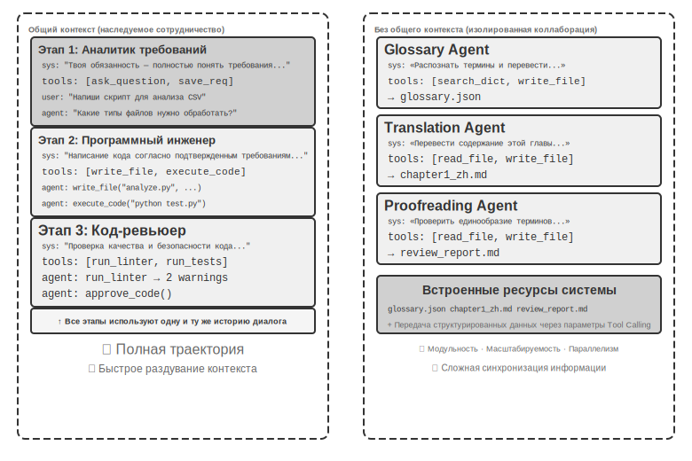

Чтобы построить Multi-Agent систему, сначала необходимо понять два основных проектных измерения, которые совместно определяют базовую архитектуру и способ реализации системы.

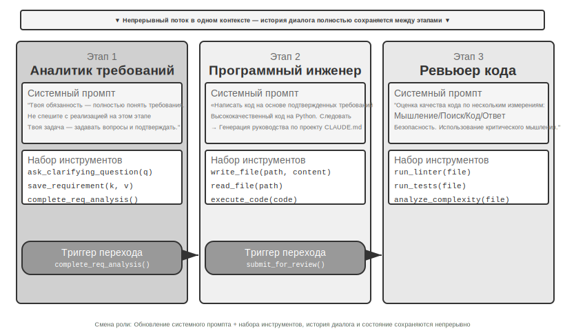

Это самое базовое архитектурное решение, определяющее, как информация передается между несколькими Agent.

**Shared Context (общий контекст)** означает, что последующий Agent получает полную историю диалога и траекторию (trajectory, определенную в первой главе) предыдущего Agent. После переключения System Prompt (системный промпт) и набора инструментов на каждом этапе, он становится новым Agent (поскольку его личность, обязанности и способности изменились), но сохраняет всю память предшественника. Например, в команде, после того как аналитик требований закончил писать документ с требованиями, разработчик получает не только сам документ, но и видит все записи общения аналитика с пользователем — он выступает в новой роли, но полностью сохраняет предыдущий контекст. Преимущество заключается в отсутствии потери информации: каждый Agent может просмотреть детали любого предыдущего этапа; сложность же состоит в том, что контекст может быстро раздуваться.

**Non-shared Context (неразделяемый контекст)** означает, что каждый Agent поддерживает полностью независимый контекст и историю диалога, не имея прямого доступа к «процессу мышления» друг друга. Это похоже на сотрудничество между разными отделами: каждый работает независимо на своем рабочем месте и обменивается информацией через общие документы и протоколы встреч, а не постоянно смотрит в чужой экран. Такая модель обладает лучшей модульностью и изолированностью, каждому Agent нужно фокусироваться только на информации, связанной с его обязанностями; систему также легче масштабировать и обслуживать — добавление нового Agent не требует изменения внутренней логики существующих Agent, достаточно определить интерфейсы и форматы данных.

Поскольку Agent не делят общий контекст, информация должна передаваться через явные механизмы коммуникации. Обычно выделяют три типа:

- **Аргументы Tool Calling (вызов инструментов)**: вышестоящий Agent передает структурированные данные в качестве параметров инструментам нижестоящего Agent, что подходит для сценариев с фиксированными типами и четкой структурой;
- **Общая файловая система**: Agent обмениваются информацией путем чтения и записи документов, кода и других промежуточных продуктов в общих директориях, что подходит для сценариев с крупными результатами или необходимостью их сохранения;
- **Message Bus (шина сообщений)**: специализированный узел, отвечающий за передачу сообщений между Agent. Agent не вызывают друг друга напрямую, а отправляют сообщения на Message Bus, которая пересылает их целевому Agent.

Message Bus естественным образом поддерживает **асинхронную коммуникацию** — отправителю и получателю не нужно быть онлайн одновременно, подобно корпоративной электронной почте: когда вы отправляете письмо коллеге, вы не требуете, чтобы он в этот момент был за компьютером; письмо сначала сохраняется на сервере и обрабатывается, когда коллега войдет в сеть. Этот способ особенно подходит для сценариев, где несколько Agent работают параллельно и нуждаются в координации (подробнее см. раздел «Параллельная координация» в этой главе).

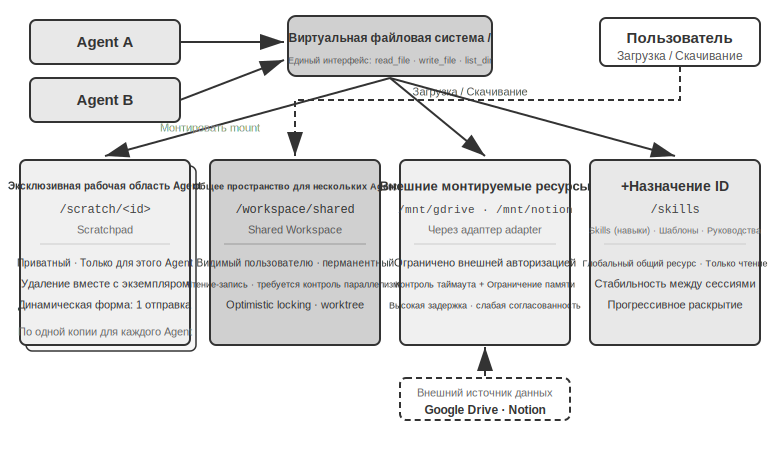

Необходимо уточнить, что обе архитектуры являются полноценными Multi-Agent (мультиагентными) системами (поскольку системные промпты и наборы инструментов на каждом этапе различаются, это фактически разные Agent (агенты)), а разница заключается в способе координации. **Shared Context** (общий контекст) опирается на неявную координацию: последующий Agent наследует полную историю контекста предыдущего, может «видеть» предшествующий ход рассуждений, и информация передается через сам контекст. **Non-Shared Context** (неразделяемый контекст) опирается на явную координацию: Agent обмениваются информацией через файлы, сообщения или структурированные интерфейсы данных, и каждый Agent видит только то содержание, которое относится непосредственно к нему.

Проведем аналогию: первый вариант похож на команду, сидящую за одним столом и обсуждающую задачу, где каждый слышит каждое слово; второй — на взаимодействие разных отделов через электронную почту и документы, где у каждого есть свое рабочее пространство.

В таблице 10-1 обобщены критерии выбора между двумя архитектурами по пяти аспектам: количество подзадач, Context Window (контекстное окно), степень параллелизма, изоляция информации и бюджет затрат. Эту таблицу можно использовать как чек-лист при выборе архитектуры на ранних этапах.

Таблица 10-1. Критерии выбора между Shared Context и Non-Shared Context

| Критерий выбора | Shared Context | Non-Shared Context |
|---|---|---|
| Количество подзадач | Мало (2-3 роли) | Много (требуется параллельная обработка) |
| Context Window | Достаточно для вмещения информации всех ролей | Одно окно не вмещает весь объем |
| Параллелизм | В основном последовательный (роли передают эстафету по одной траектории) | Возможно масштабное распараллеливание (контексты независимы и не блокируют друг друга) |
| Изоляция информации | Не требуется (все роли делят информацию) | Требуется (например, аудит безопасности не должен видеть исходный ход рассуждений) |
| Бюджет затрат | Эстафета по одной траектории, токены накапливаются по этапам | Несколько Agent работают раздельно, общее число токенов обычно выше в несколько раз или на порядок |

**Простое правило**: если ожидается, что накопленный контекст превысит 50% окна (это эмпирическое правило, а не точный порог), следует выбрать Non-Shared; если отсутствие потерь информации является жестким ограничением для корректности задачи — выбирайте Shared. Большинство реальных систем используют «смену фаз»: первые несколько Agent работают в Shared Context, а после достижения точки насыщения информацией переключаются на Non-Shared Context + явный Handoff (передача полномочий, когда вышестоящий Agent активно решает, какую именно информацию передать нижестоящему).

### Измерение второе: топология взаимодействия

Второе измерение — это топология взаимодействия (Collaboration Topology), то есть структура, по которой движутся потоки управления и информации между Agent. Топология взаимодействия и вопрос разделения контекста **независимы концептуально, но связаны практически**. Они независимы концептуально, потому что в системах с Shared Context тоже существует топология, например, рассматриваемая далее в этой главе функция `transfer_to_agent` (эксперимент 10-2), которая по сути является формой цепочечного Handoff в условиях общего контекста. Они связаны практически, потому что при использовании Shared Context топология часто деградирует (см. ниже) — значения этих двух измерений нельзя комбинировать произвольно. Просто при Shared Context в процессе передачи не нужно решать, «что передавать» — вся история сохраняется естественным образом — поэтому топология обычно вырождается в последовательность смены ролей, где не так много пространства для архитектурных решений (исключением, находящимся посередине, является многостороннее взаимодействие типа Group Chat, см. раздел о децентрализации далее в этой главе). А как только выбирается Non-Shared Context, вопрос «как течет информация и кто координирует» становится предметом обязательного явного проектирования.

Другими словами, эти два измерения в принципе образуют матрицу 2×3 (Shared/Non-Shared × три типа топологии), но в строке Shared Context топология чаще всего сводится к простой последовательности смены ролей (именно эта форма обсуждается далее как «многоэтапная трансформация ролей»). Поэтому в данной главе мы подробно разберем только три ячейки для Non-Shared Context. Ниже представлены три типичные формы топологии взаимодействия при Non-Shared Context в порядке возрастания сложности:

- **Peer Collaboration Pattern** (модель однорангового взаимодействия): небольшое количество Agent (обычно 2-3) взаимодействуют на равных правах, формируя цикл итеративного улучшения — подобно тому, как при написании научной статьи один человек готовит черновик, а другой вносит правки, и после нескольких раундов качество становится намного выше, чем если бы кто-то писал в одиночку.
- **Orchestration Pattern** (модель управления): центральный Manager Agent отвечает за планирование и диспетчеризацию задач, а несколько подчиненных Agent выполняют конкретные подзадачи — подобно тому, как менеджер проекта руководит работой нескольких профильных инженеров.
- **Decentralized Pattern** (децентрализованная модель): в процессе работы нет центрального контроллера, Agent общаются друг с другом подобно людям для совместного выполнения задачи.

Детальное проектирование и сценарии применения каждой модели будут раскрыты в соответствующих подразделах.

## Когда Multi-Agent действительно превосходит Single Agent

Прежде чем переходить к конкретным архитектурам взаимодействия, ответим на более фундаментальный вопрос: **когда действительно нужны несколько Agent, а когда достаточно одного?** Ответ на этот вопрос станет общим ориентиром для всех инженерных решений, описанных далее. Серия исследований последних лет дает четкую структуру для оценки, где ключевой критерий всего один: **вносит ли процесс взаимодействия новую информацию, которую Single Agent (одиночный агент) не мог получить в процессе генерации?**

В таблице 10-2 обобщено, вносят ли различные модели взаимодействия новую информацию, что позволяет судить о наличии реальной ценности мультиагентного взаимодействия по сравнению с одиночным Agent.

Таблица 10-2. Сравнение прироста информации в различных моделях Multi-Agent взаимодействия

| Режим взаимодействия | Внедряется ли новая информация | Эффект |
|---|---|---|
| Самопроверка одной и той же моделью (перечитывание собственного вывода) | Нет | Обычно неэффективно или даже вредно |
| Debate (дебаты) разных Agent по одному и тому же тексту | Нет | При равных вычислительных затратах сопоставимо с одиночным Agent |
| Reviewer использует результаты выполнения тестов для проверки кода | Да (обратная связь от исполнения) | Значительное улучшение |
| Reviewer просматривает скриншоты рендеринга для проверки фронтенда/PPT | Да (визуальная обратная связь) | Значительное улучшение |
| Reviewer использует внешние инструменты для верификации фактов | Да (обратная связь от инструментов) | Значительное улучшение |

RLEF (Reinforcement Learning from Execution Feedback, обучение с подкреплением на основе обратной связи от исполнения) [^rlef-2025] 2025 года подтвердил это: обучение моделей с использованием Reinforcement Learning для итеративного улучшения кода на основе обратной связи от его выполнения дает результаты, значительно превосходящие метод многократного независимого сэмплирования (Sampling). Ключевым моментом является то, что каждая итерация вносит **реальные результаты исполнения** (ошибки компиляции, проваленные тесты, исключения во время выполнения) — информацию, которой не существовало в момент написания кода моделью. WebGen-Agent [^webgen-agent-2025] 2025 года в задачах генерации веб-страниц, благодаря многоуровневой визуальной обратной связи (скриншоты + описания от визуально-языковых моделей), образующей «фидбек-каркас», по имеющимся данным, позволил Claude 3.5 Sonnet поднять показатели в этом бенчмарке с 26,4% до 51,9% — почти вдвое.

Этот фреймворк «новой информации» объясняет кажущийся парадокс: академические исследования утверждают, что «одиночного Agent достаточно», но в инженерной практике системы из нескольких Agent действительно работают лучше. Корень противоречия в том, что стороны обсуждают разные типы многоагентных систем. В академических исследованиях чаще сравниваются модели «несколько Agent обсуждают один и тот же текст» (например, дебаты), тогда как эффективные в инженерной практике системы из нескольких Agent обычно включают циклы внешней обратной связи (исполнение кода, визуальный рендеринг, Tool Calling). Первые не привносят новой информации, вторые — привносят. Три архитектуры, которые будут описаны далее в этой главе — пиринговое взаимодействие, менеджер и децентрализованная структура — практически во всех своих действительно эффективных применениях опираются на этот критерий.

**Бюджет шагов и производительность Agent.** Смежное направление исследований: как выделение Agent различного бюджета шагов (т. е. допустимого количества вызовов инструментов или итераций) влияет на его показатели? Интуитивно кажется, что большее количество шагов должно приводить к лучшим результатам: при бюджете в 30 шагов Agent может лишь быстро реализовать основной функционал, а при 300 шагах он успеет составить план, реализовать его, протестировать и доработать. Однако в 2026 году в статье Google «Budget-Aware Tool-Use Enables Effective Agent Scaling» был сделан контринтуитивный вывод: **само по себе увеличение доступного количества шагов не гарантирует рост производительности**. Стандартным Agent не хватает «осознания бюджета» (Budget-Awareness) — даже имея в запасе 300 шагов, они склонны к поверхностному поиску и быстро достигают «насыщения». Чтобы большее количество шагов действительно трансформировалось в лучший результат, Agent необходим явный механизм восприятия бюджета, позволяющий динамически корректировать стратегию в зависимости от оставшихся ресурсов: широкое исследование на ранних этапах и фокусировка на наиболее перспективных направлениях в конце. В 2026 году BAVT (Budget-Aware Value Tree Search) предложил оценку ценности на уровне отдельных шагов, где веса исследования (Exploration) и использования (Exploitation) корректируются в зависимости от доли оставшегося бюджета: по мере его исчерпания Agent переключается с «широкого охвата» на «глубокое бурение».

Эти открытия имеют прямое руководящее значение для проектирования многоагентных систем. Например, в режиме менеджера Manager Agent не должен просто распределять задачи между дочерними Agent и ждать результата; ему следует **динамически распределять бюджет шагов** в соответствии со сложностью задачи — выделять меньше шагов для простых подзадач и достаточный объем для сложных. При этом важно направлять дочерних Agent на рациональное использование этого бюджета (сначала планирование, затем реализация, тестирование и улучшение), а не позволять им сразу бросаться в работу с головой.

Есть еще один аспект, который должен стоять перед любым проектированием: **Cost (стоимость)**. Параллельное исследование и многократные итерации в многоагентных системах стоят денег. Anthropic раскрывала данные, согласно которым потребление токенов в их исследовательских многоагентных системах примерно в 15 раз выше, чем в обычном диалоге, и сам объем токенов объясняет около 80% разницы в производительности. Это означает, что выигрыш от использования нескольких Agent должен быть достаточно велик, чтобы покрыть кратные или даже на порядок большие дополнительные расходы, иначе грамотно настроенный одиночный Agent зачастую окажется более выгодным выбором.

## Многоагентное взаимодействие с общим контекстом

В многоагентном взаимодействии с общим контекстом каждый этап представляет собой отдельного Agent (со своим System Prompt и набором инструментов), но он наследует полную траекторию (Trajectory) предыдущих Agent — подобно тому, как заступающий на смену коллега может пролистать все рабочие журналы своего предшественника. Основное преимущество такой «наследственной кооперации» заключается в нулевой потере информации: каждый Agent может просмотреть детали любого предыдущего этапа. Сложность же состоит в том, как заставить текущего Agent сфокусироваться на своих прямых обязанностях, не отвлекаясь на огромный объем унаследованной исторической информации.

### Многоэтапная смена ролей

[^rlef-2025]: Gehring, J., et al. *RLEF: Grounding Code LLMs in Execution Feedback with Reinforcement Learning.* arXiv:2410.02089, 2025.
[^webgen-agent-2025]: Lu, Z., et al. *WebGen-Agent: Enhancing Interactive Website Generation with Multi-Level Feedback and Step-Level Reinforcement Learning.* arXiv:2509.22644, 2025.

Сначала проясним спор об определениях: говоря языком первой главы, многоэтапная смена ролей — это **workflow-оркестровка** (worklow-style orchestration), где путь выполнения (например: уточнение требований → реализация → ревью) определен заранее. Причина, по которой в этой главе мы рассматриваем её в рамках фреймворка Multi-Agent (многоагентные системы), заключается в подходе к идентичности и контексту Agent (агент): когда системные промпты, наборы инструментов и фокус внимания на каждом этапе различаются, рассмотрение их как нескольких Agent, разделяющих одну и ту же траекторию, приносит реальные выгоды при проектировании. Промпты и инструменты для каждой «личности» можно оттачивать независимо, а границы этапов естественным образом становятся точками контроля качества (quality gates).

В сложных задачах роли и обязанности Agent могут значительно меняться на разных этапах. Если постоянно использовать один и тот же статический системный промпт, он будет либо слишком обобщенным и лишенным конкретики, либо перегруженным инструкциями для всех этапов сразу, что сделает его чрезмерно длинным. Подход с многоэтапной сменой ролей заключается в следующем: динамически переключать системные промпты и наборы инструментов в зависимости от текущего этапа, позволяя Agent работать в наиболее подходящей «личности» в каждый момент времени. Такая трансформация не требует создания новых экземпляров или запуска новых процессов; это просто обновление контекста внутри одной сессии выполнения. Ключевым моментом является то, что, несмотря на смену роли, история диалога и состояние задачи остаются непрерывными и общими — Agent в новой роли по-прежнему имеет доступ ко всей информации, накопленной на предыдущих этапах.

### ### Режим пирингового взаимодействия: взаимные сдержки, противовесы и итеративное улучшение

> **Эксперимент 10-1 ★★: Определение системного промпта в зависимости от этапа выполнения**

Этот эксперимент на примере полного рабочего процесса Coding Agent (агент-программист) демонстрирует, как поэтапные System Prompt (системные промпты) повышают производительность Agent (агент).

**Сценарий задачи**: Пользователь выдвигает требование к разработке программного обеспечения, и Agent последовательно проходит через три этапа: уточнение требований, реализация кода, проверка качества.

**Первый этап: Уточнение требований** (Роль: системный аналитик)

Системный промпт подчеркивает:
- «Ваша обязанность — полностью понять потребности пользователя. Задавайте вопросы, чтобы прояснить неоднозначные моменты, и убедитесь, что вы полностью понимаете ожидаемую функциональность, сценарии использования и требования к производительности».
- «Не спешите с реализацией. На этом этапе ваша задача — спрашивать и подтверждать, а не писать код».
- «Когда вы подтвердите, что все ключевые требования уточнены, вызовите инструмент `complete_requirements_analysis()`, чтобы завершить этот этап».

Набор инструментов ограничен: `ask_clarifying_question(question)` используется для того, чтобы задать пользователю уточняющий вопрос, `save_requirement(key, value)` — для записи подтвержденных требований, `complete_requirements_analysis()` — для отметки завершения этапа.

Agent ведет многораундовый диалог с пользователем: «Какие типы файлов должен обрабатывать этот скрипт?», «Нужно ли рекурсивно обрабатывать подпапки?», «Сохранять ли исходные имена файлов после перемещения?». С помощью этих вопросов Agent постепенно формирует полное понимание требований и сохраняет их в структурированном виде. Когда Agent решает, что требования достаточно ясны, он вызывает `complete_requirements_analysis()`, что инициирует смену роли — система обнаруживает сигнал о завершении этапа и автоматически переключается на конфигурацию следующего этапа.

**Второй этап: Реализация кода** (Роль: инженер-программист)

Новый системный промпт подчеркивает:
- «Ваша обязанность — написать высококачественный код на Python на основе подтвержденных требований».
- «Следуйте Best Practices (лучшие практики): код должен быть модульным, иметь надлежащую обработку ошибок и содержать необходимые комментарии».
- «После завершения написания кода и прохождения базовых тестов вызовите `submit_for_review()`, чтобы перейти к этапу проверки».

Набор инструментов существенно изменился: инструменты для уточнения требований были удалены, а их место заняли такие инструменты разработки, как `write_file(path, content)`, `read_file(path)`, `execute_code(code)` и другие. Agent начинает писать код на основе требований, сохраненных на первом этапе: сначала основную логику, затем добавляет обработку ошибок и, наконец, пишет тесты для проверки. На протяжении всего процесса Agent по-прежнему имеет доступ к истории диалога первого этапа для уточнения деталей, но модель его поведения кардинально изменилась: он больше не задает вопросы, а фокусируется на реализации. По завершении вызывается `submit_for_review()`.

**Третий этап: Проверка кода** (Роль: код-ревьюер)

Новый системный промпт подчеркивает:
- «Ваша обязанность — проверить только что написанный код и оценить его качество по нескольким параметрам: функциональная корректность, стандарты кодирования, обработка ошибок, оптимизация производительности, безопасность».
- «Используйте критическое мышление, старайтесь найти потенциальные проблемы в коде и области для улучшения».
- «При обнаружении серьезных проблем вызовите `request_revision(issues)`, чтобы вернуться к этапу реализации для внесения правок; если качество приемлемо, вызовите `approve_code()` для завершения задачи».

Набор инструментов снова изменился: теперь это инструменты анализа качества кода, такие как `run_linter(file)`, `run_tests(file)`, `analyze_complexity(file)`. Agent пересматривает код с позиции проверяющего, запускает статический анализ, выявляет потенциальные баги, проблемы с производительностью или уязвимости безопасности.

Такой трехэтапный дизайн позволяет Agent на каждом этапе фокусироваться на текущей основной задаче. Что еще более важно, четкий механизм перехода между этапами гарантирует полноту выполнения задачи — Agent не пропустит анализ требований, перейдя сразу к написанию кода, и не сдаст результат без проверки.

**Требования к эксперименту**:
1. Реализовать трехэтапные системные промпты с четким определением ролей и инструкциями по поведению для каждого этапа.
2. Настроить соответствующий набор инструментов для каждого этапа.
3. Реализовать механизм запуска перехода между этапами (через вызов специфических инструментов).
4. Обеспечить непрерывность контекста между этапами.
5. Обработать ситуации возврата — возможность вернуться на этап реализации при обнаружении проблем во время проверки кода.
6. Записывать логи выполнения каждого этапа, чтобы продемонстрировать, как разные промпты порождают разные модели поведения.

### Междоменная смена ролей

Описанная выше многоэтапная смена ролей демонстрирует поэтапное выполнение в рамках одного типа задач (разработка ПО). Междоменная смена ролей идет дальше, исследуя автономное переключение Agent между различными типами задач — это уже не заранее спланированный линейный процесс, а самостоятельное решение Agent о том, на какую профессиональную роль следует переключиться в зависимости от изменения потребностей пользователя.

> **Эксперимент 10-2 ★★: Переключение между несколькими ролями**

**Предварительные требования**: рекомендуется сначала ознакомиться с механизмом Agent Skills (навыки агента) во второй главе.

**Архитектура системы**: пять типов ролей —

- **triage (фронтенд-сортировка, вход по умолчанию)**: понимает общие потребности пользователя, разбивает их на последовательные подзадачи, постепенно передает подходящим профессиональным ролям и выполняет финальное подтверждение после завершения всех подзадач. Сама роль не обладает профессиональными инструментами, а владеет только инструментом `transfer`.
- **research (эксперт по поиску информации)**: использует `web_search` для поиска данных, фактов и материалов.
- **coding (эксперт по программированию)**: использует `execute_python` для написания и запуска кода, решения задач программной логики или написания скриптов.
- **data_analysis (эксперт по анализу данных)**: использует `calculate` / `descriptive_stats` для количественных вычислений и статистики (например, темпы роста в годовом исчислении, CAGR (совокупный среднегодовой темп роста), средние значения).
- **writing (эксперт по письму)**: оформляет найденные данные и результаты вычислений в связный текст, ориентированный на конкретную аудиторию (может использовать `count_characters` для проверки объема).

**Основной механизм: инструмент transfer_to_agent**

Все роли оснащены инструментом `transfer_to_agent(target_role, reason)`. При вызове система последовательно: 1) сохраняет текущую историю диалога; 2) загружает System Prompt (системный промпт) и набор инструментов целевой роли; 3) передает историю диалога новому агенту, чтобы он понимал контекст; 4) продолжает выполнение от лица новой роли.

**Сценарий эксперимента**: Система по умолчанию работает в роли triage. Пользователь ставит комплексную междисциплинарную задачу: «Я готовлю материалы для инвесторов. Помоги мне найти данные о продажах автомобилей на новых источниках энергии в Китае за 2021, 2022 и 2023 годы, рассчитай CAGR за эти три года и напиши резюме на китайском языке объемом не более 120 иероглифов для инвесторов». Triage разбивает задачу на «поиск данных → расчет показателей → написание текста» и на первом этапе передает задачу поиску:

```python
transfer_to_agent(target_role="research", reason="Необходимо сначала найти данные о продажах автомобилей на новых источниках энергии за три года")
```

После того как research находит данные с помощью `web_search`, он записывает ключевые показатели в диалог и передает задачу анализу данных:

```python
transfer_to_agent(target_role="data_analysis", reason="Данные готовы, необходимо рассчитать CAGR за три года")
```

Data_analysis использует `calculate` для расчета темпа роста и передает задачу writing для написания текста; после подготовки текста writing передает задачу обратно triage для финального подтверждения. Вся цепочка выглядит так: triage → research → data_analysis → writing → triage. Каждая роль видит полную историю диалога, поэтому последующая роль естественным образом знает, что было сделано ранее.

Решение о переключении ролей опирается на инструкции в System Prompt. В промпте triage четко прописаны правила маршрутизации: поиск данных/материалов передается research, написание и запуск кода — coding, количественные вычисления и статистика — data_analysis, литературная обработка текста — writing. Критерий прост: если задача требует глубоких знаний в конкретной области или специальных инструментов, она передается соответствующей профессиональной роли. В промптах профессиональных ролей также указано, кому передать задачу после выполнения своей части или как вернуть ее triage.

**Требования к эксперименту**:
1. Реализовать системные промпты и специализированные наборы инструментов как минимум для трех профессиональных ролей.
2. Реализовать инструмент `transfer_to_agent`, поддерживающий динамическое переключение.
3. Обеспечить непрерывность контекста после переключения ролей.
4. Обработать проблему циклических переключений — избегать ситуаций, когда Agent бесконечно переключается между ролями.
5. Спроектировать сложный рабочий процесс, охватывающий несколько областей, чтобы продемонстрировать ценность переключения ролей.

## Multi-Agent Collaboration (Мультиагентное взаимодействие) без общего контекста

Отсутствие общего контекста представляет собой истинное Multi-Agent Collaboration. В такой архитектуре каждый Agent является независимой сущностью, обладающей собственным контекстом, траекторией (trajectory) и состоянием. Агенты не могут напрямую получить доступ к «мыслительному процессу» друг друга. Взаимодействие полностью полагается на явные структурированные механизмы передачи данных, то есть на три механизма коммуникации, представленные в начале этой главы (параметры Tool Calling, общая файловая система, шина сообщений).

Такая изоляция дает несколько ощутимых инженерных преимуществ: каждого агента можно разрабатывать и тестировать независимо; добавление новых возможностей не требует изменения существующего кода; сбой в одном агенте не заразит ошибочным состоянием других; кроме того, несколько агентов могут выполняться по-настоящему параллельно — их контексты полностью изолированы, и конкуренция за ресурсы отсутствует.

Однако отказ от Shared Context (общий контекст) имеет свою цену. Наиболее очевидной является проблема синхронизации информации: как разным Agent (агент) поддерживать согласованное понимание состояния задачи? Не потеряется ли и не продублируется ли информация в процессе передачи? Отладка также усложняется — при возникновении проблем приходится просматривать логи нескольких Agent, чтобы собрать воедино полную картину процесса выполнения. Эти вопросы делают проектирование спецификаций интерфейсов, форматов данных и протоколов связи критически важным.

Явное взаимодействие без Shared Context опирается на две независимые от топологии инфраструктуры. Первая — это **Shared File System** (общая файловая система), выступающая в качестве постоянной среды для обмена результатами между Agent и файлами с пользователем, что формирует Data Plane (плоскость данных) взаимодействия. Вторая — это **Communication and Control Mechanism** (механизм связи и управления), поддерживающий передачу сообщений между Agent, запрос состояния и прекращение выполнения, что формирует Control Plane (плоскость управления) взаимодействия. Три описанные ниже топологии строятся на базе этих двух составляющих.

### Файловая система глазами Agent

В начале этой главы «общая файловая система» была указана как один из трех механизмов связи без Shared Context. В реальных системах Agent обращается не к одному хранилищу, а к **Virtual Filesystem** (виртуальная файловая система): хранилища с различными источниками, жизненными циклами и правами доступа монтируются (mount) в единое дерево каталогов. Agent обращается к ним через унифицированные интерфейсы `read_file`, `write_file` и `list_dir`, в то время как на нижнем уровне это могут быть локальные временные диски, персистентные объектные хранилища, API сторонних облачных дисков или пакеты системных ресурсов, доступные только для чтения. Четкое определение структуры этого дерева каталогов — видимости и жизненного цикла каждой области — является обязательным условием проектирования многоагентного взаимодействия. Значительная часть конфликтов параллелизма и утечек информации возникает из-за смешивания областей, которые должны быть изолированы. Файловая система зрелой многоагентной системы обычно состоит из следующих четырех типов областей:

**1. Индивидуальная рабочая область Agent (Scratchpad)**. Приватный каталог, доступный только конкретному экземпляру Agent, где хранятся промежуточные результаты, временные файлы, черновики и логи отладки. Его жизненный цикл привязан к экземпляру, и он невидим для других Agent и пользователя. Изоляция scratchpad выполняет две функции: предотвращает взаимное перезаписывание временных файлов разными Agent и сохраняет контекст основного Agent лаконичным — процесс проб и ошибок дочернего Agent остается в его собственной рабочей области, а в общее пространство передается только финальный результат. Это является воплощением на уровне хранения принципа из четвертой главы: «дочерний Agent возвращает структурированное резюме, а не полную траекторию (trajectory)».

**2. Общее пространство Agent (Shared Workspace)**. Область для совместного чтения и записи несколькими Agent, **видимая пользователю**. Это основная среда обмена результатами в архитектуре без Shared Context: Glossary Agent записывает туда глоссарий, а Translation Agent считывает его. Пользователь также может загружать сюда исходные файлы и скачивать готовые результаты. Жизненный цикл этой области привязан ко всей задаче и требует персистентности. Поскольку это зона одновременного чтения и записи несколькими сторонами, она является местом частого возникновения конфликтов параллелизма. Здесь применяются такие механизмы, как Optimistic Locking (оптимистическая блокировка) и изоляция рабочих копий (worktree), подробнее о которых см. далее в разделе «Режим отказа 1». Типичной реализацией этого уровня является описанное в четвертой главе использование монтирования томов `/workspace/shared` для соединения основного Agent, виртуального компьютера и виртуального телефона.

**3. Монтируемые внешние ресурсы (Mounted External Resources)**. Сторонние источники информации, к которым пользователь разрешил доступ (Google Drive, Notion, Dropbox, корпоративные Wiki и т. д.), отображаются через адаптеры (adapter) как точки монтирования в файловой системе (например, `/mnt/gdrive`). Agent обращается к документу Notion как к обычному файлу, а на нижнем уровне адаптер вызывает соответствующий API. Три особенности этого уровня, отличающие его от локального хранилища, должны учитываться при проектировании: **доступ ограничен внешними правами** (права пользователя в исходной системе определяют область видимости Agent), **более высокая задержка и слабая согласованность** (каждое чтение — это сетевой запрос, и данные могут быть изменены извне), **преимущественно доступ только для чтения по запросу** (обратная запись во внешние источники должна быть осторожной, так как ошибочная запись может загрязнить реальные данные пользователя). Унифицированный файловый интерфейс избавляет Agent от необходимости использовать специализированные инструменты для каждого источника данных, но он также скрывает вышеупомянутые различия в производительности и безопасности, поэтому необходимо явно управлять режимами «только чтение/запись», таймаутами и границами учетных данных на уровне монтирования.

**4. Встроенные системные ресурсы (Built-in System Resources)**. Предустановленные системные пакеты ресурсов, доступные всем Agent только для чтения. Типичным примером являются описанные во второй и четвертой главах **Skills** (навыки) — организованные в виде файлов документы со знаниями и скрипты, смонтированные по путям вроде `/skills` и используемые по принципу прогрессивного раскрытия (сначала индексация, затем развертывание по запросу). Сюда также относятся справочные руководства, библиотеки шаблонов и общие определения инструментов. Этот уровень является глобально общим, доступным только для чтения и стабильным между сессиями, что позволяет всем Agent считывать данные параллельно без необходимости управления конкурентным доступом.

На рисунке 10-3 представлена структура, в которой эти четыре типа областей унифицированно монтируются в единое дерево каталогов: Agent обращается ко всему дереву через единый интерфейс, пользователь загружает и скачивает файлы из Shared Workspace, внешние источники данных монтируются через адаптеры, а системные ресурсы предоставляются в режиме Read-only.

В таблице 10-3 эти четыре области сравниваются по четырем измерениям: видимость, жизненный цикл, права доступа и контроль параллелизма. Она может служить чек-листом при проектировании структуры файловой системы.

Таблица 10-3 Четыре типа областей виртуальной файловой системы Agent

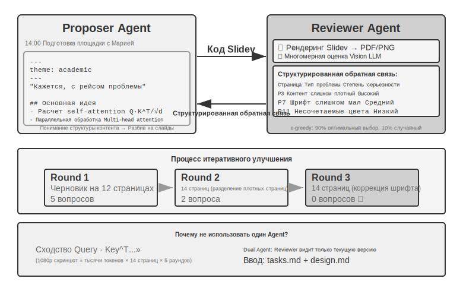

| Область | Видимость | Жизненный цикл | Чтение/Запись | Контроль параллелизма |
|---|---|---|---|---|
| Эксклюзивная рабочая зона Agent | Только этот Agent | Уничтожается вместе с экземпляром Agent | Чтение и запись | Не требуется (приватная) |
| Общее пространство нескольких Agent | Все участвующие Agent + пользователь | Длится в течение задачи, требует персистентности | Чтение и запись | Требуется (Optimistic Locking / worktree) |
| Внешние подключенные ресурсы | Зависит от внешних прав доступа | Определяется внешним источником | Преимущественно Read-only, запись с осторожностью | Обеспечивается внешним источником |
| Встроенные системные ресурсы | Все Agent | Стабильны между сессиями | Read-only | Не требуется (только чтение) |

Объединение этих четырех типов областей в единое дерево каталогов и есть воплощение ценности дизайна «**File Path (путь к файлу) как универсальный интерфейс**»: передача результатов между Agent, передача входных данных от основного Agent к дочернему и даже обмен Artifact (артефактами) при межорганизационном A2A-взаимодействии — всё это осуществляется через передачу легковесных строк путей, а не загрузку содержимого в Context Window (контекстное окно) (Глава 4). Это перекликается с концепцией Главы 5 «Файловая система как центр управления Agent», где обсуждалось, как отдельный Agent использует файловую систему для хранения памяти и возможностей. Здесь же эта абстракция расширяется на мультиагентную среду: виртуальное дерево каталогов, объединяющее приватные, общие, внешние и встроенные хранилища, становится фундаментом хранения для мультиагентного взаимодействия.

### Связь и управление между Agent

Если файловая система решает проблему **обмена результатами** между Agent, то для совместной работы необходим **Control Plane** (плоскость управления): поддержка передачи сообщений, запроса состояний и прекращения выполнения. В четвертой главе уже были представлены примитивы инструментов для этой плоскости — создание (`spawn_subagent`), отправка сообщений (`send_message_to_subagent`), отмена (`cancel_subagent`), а также четыре формы взаимодействия: синхронная, асинхронная, потоковая и многораундовая. В данном разделе мы не будем дублировать определения интерфейсов, а сосредоточимся на трех часто игнорируемых возможностях, от которых зависит мультиагентное сотрудничество.

**1. Передача сообщений.** Простейшая форма — Point-to-Point (точка-точка): Agent A напрямую вызывает `send_message_to_agent_b(content)`. Это подходит для сценариев с фиксированной топологией и малым количеством Agent (например, связка «телефон + компьютер» в эксперименте 10-4 этой главы). Когда число Agent растет и требуется асинхронный параллелизм, количество соединений точка-точка увеличивается квадратично, при этом отправитель и получатель должны быть одновременно в сети. В таких случаях следует использовать **Message Bus** (шину сообщений) (подробнее см. далее в разделе «Формы параллельной координации»): Agent публикует сообщение на шине, которая пересылает его согласно подпискам; отправителю не нужно знать потребителя. Будь то прямая передача или через шину, сообщение обычно должно содержать структурированный **Envelope** (конверт): ID отправителя, цель (конкретный Agent или широковещательная рассылка), тип сообщения (например, `task_assigned`, `status_update`, `result`, `terminate`) и полезную нагрузку JSON. Единый формат конверта гарантирует надежную маршрутизацию и парсинг на стороне получателя, а также позволяет отслеживать цепочку взаимодействий, что критически важно для отладки мультиагентных систем.

**2. Запрос состояния.** Это один из самых недооцененных элементов плоскости управления. Если основной Agent, отправив дочернего Agent, не имеет возможности узнать о его прогрессе, он не сможет ни решить, стоит ли продолжать ожидание, ни вмешаться в случае блокировки. Существует две парадигмы получения состояния. **Pull (опрос)**: основной Agent вызывает `get_subagent_status(agent_id)`, который возвращает текущий статус дочернего Agent (выполняется / ожидает ввода / завершен / ошибка), прогресс и время последней активности. **Push (отправка)**: дочерний Agent в процессе выполнения сам сообщает об обновлениях состояния в шину сообщений, а основной Agent поддерживает таблицу состояний задач, обновляемую в реальном времени (как в «мониторинге в реальном времени» эксперимента 10-6). У каждого подхода есть свои плюсы и минусы: Pull прост в реализации, но слишком частый опрос тратит токены, а редкий — не дает оперативности; Push обеспечивает хорошую реактивность, но зависит от добросовестности дочернего Agent. На практике состояние дочернего Agent часто моделируется как **Finite State Machine** (конечный автомат: отправлено, выполняется, требует ввода, завершено, ошибка). Протокол A2A, рассматриваемый далее, стандартизирует жизненный цикл задач именно в такие состояния. Кроме того, необходимы **Timeout (тайм-аут) и Heartbeat (проверка пульса)** в качестве страховки (аналогично Heartbeat и monitor_shell из Главы 4): даже если дочерний Agent ничего не сообщает и не возвращает результат, основной Agent может по правилу «отсутствие активности более N минут означает сбой» избежать блокировки системы зависшим дочерним Agent.

**3. Execution Termination (Завершение выполнения).** В процессе параллельной коллаборации часто возникает ситуация «успех одного аннулирует остальных» — когда несколько Agent (агент) ведут поиск по отдельности, и при достижении цели одним из них остальные должны немедленно остановиться (каскадное завершение в эксперименте 10-6 данной главы). Существует две степени интенсивности завершения. **Graceful termination (Элегантное завершение)** является предпочтительным: основной Agent отправляет сигнал `terminate`, а дочерний Agent реагирует на него в безопасной точке текущего шага, предварительно очищая ресурсы (закрывая сессии браузера, записывая незавершенные файлы, освобождая блокировки), и выходит после возврата подтверждения (ack). **Forced termination (Принудительное завершение)** — это резервный вариант: прямой останов процесса, который используется только в том случае, если дочерний Agent не отвечает на элегантный сигнал. Цена этого — возможные «висючие» ресурсы и незавершенные записи. Необходимо проработать два инженерных аспекта: во-первых, элегантное завершение требует, чтобы дочерний Agent периодически проверял сигнал завершения в цикле (аналогично механизму прерываний в четвертой главе), иначе сигнал не будет обработан; во-вторых, при каскадном завершении возникает Race Condition (состояние гонки) — несколько дочерних агентов могут сообщить об успехе почти одновременно. Основной Agent должен через блокировки или идемпотентный дизайн гарантировать, что расчет произойдет только один раз, а сигнал завершения будет разослан только в одном раунде. Подробнее обсуждение Race Condition см. в эксперименте 10-6.

Обмен артефактами (Data Plane — плоскость данных) вместе с передачей сообщений, запросом состояния и завершением выполнения (Control Plane — плоскость управления) составляют основу систем с несколькими Agent без общего контекста. Три следующие топологии коллаборации, по сути, представляют собой различные варианты выбора принадлежности прав управления и направления информационных потоков на этих двух плоскостях.

В зависимости от отношений сотрудничества между агентами и характеристик потока управления, коллаборацию без общего контекста можно разделить на три основные архитектуры: модель пирингового (равноправного) взаимодействия, модель менеджера и децентрализованную модель. Каждая из них подходит для разных типов задач.

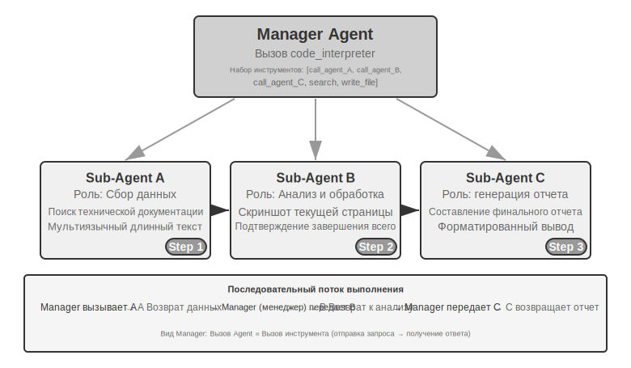

Пиринговое взаимодействие обычно вовлекает 2–3 агента с равным статусом, которые предоставляют друг другу обратную связь через несколько итераций. Ключевая ценность заключается во внедрении когнитивного разнообразия — разные Agent рассматривают одну и ту же проблему под разными углами, соблюдая баланс между инновациями и надежностью, что дает результат качественнее, чем у любого одиночного агента.

По сравнению с моделью менеджера и децентрализованной моделью, сложность реализации пирингового взаимодействия намного ниже — достаточно определить роли двух агентов, механизм связи и условия прекращения итераций. Это идеальный выбор для быстрой проверки идей и создания прототипов.

**Парадигма «Proposer-Reviewer» (Предлагающий-Рецензент).**

Proposer-Reviewer — это классическая парадигма пирингового взаимодействия. В пятой главе, в экспериментах по генерации PPT, редактированию видео и визуализации логов, уже подробно описывались принципы проектирования и практическое применение этой парадигмы: Proposer Agent отвечает за генерацию кода, а Reviewer Agent рендерит результат выполнения и использует Vision LLM для оценки качества и предоставления структурированных предложений по улучшению. Оба агента итерируют до тех пор, пока эффект не достигнет стандарта.

Эта парадигма также применима для аудита безопасности (Proposer генерирует план действий, Reviewer проверяет соответствие нормам и потенциальные риски), модерации контента (Proposer составляет черновик ответа, Reviewer проверяет бизнес-правила и нормы лексики), ревью кода (Proposer пишет код, Reviewer проверяет безопасность и Best Practices) и других сценариев.

**Почему нельзя позволить одному Agent самому генерировать, а затем самому проверять?** Это как раз конкретное воплощение критерия из предыдущего раздела «Когда несколько Agent действительно лучше одного» — если проверка не привносит новой информации, это просто «заставить модель подумать еще раз». Соответствующие исследования дают на это четкий ответ. Huang и др. в статье ICLR 2024 «Large Language Models Cannot Self-Correct Reasoning Yet» обнаружили: если позволить GPT-4 проверять и исправлять свои собственные ответы без внешней обратной связи, точность на самом деле падает — модель чаще исправляет правильный ответ на неправильный, чем наоборот.

Обзорная статья «When Can LLMs Actually Correct Their Own Mistakes?», опубликованная в журнале TACL в 2024 году (arXiv:2406.01297), дополнительно подтверждает этот вывод: без предоставления надежной внешней обратной связи (например, результатов выполнения тест-кейсов, проверочного вывода внешних инструментов) «самоисправление», полагающееся исключительно на саму модель, почти не работает.

В статье CRITIC на ICLR 2024 представлен наглядный сравнительный эксперимент. CRITIC позволил модели использовать внешние инструменты (поисковые системы, интерпретатор Python) для проверки собственных ответов, что значительно улучшило результат. Однако когда экспериментаторы убрали этап проверки инструментами, оставив только самооценку модели, большая часть улучшений исчезла. Это доказывает, что ценность рецензирования заключается не в том, чтобы «заставить модель подумать еще раз», а во **внедрении новой информации**, которой модель не обладала в момент генерации: результатов тестирования, скриншотов рендеринга, ошибок компиляции, результатов внешнего поиска.

В этом и заключается основной принцип проектирования парадигмы Proposer-Reviewer. В эксперименте с генерацией PPT в пятой главе ценность Reviewer Agent заключалась не в том, чтобы «посмотреть на код той же моделью еще раз», а в том, что он **отрендерил PPT и сделал скриншот экрана** — этот скриншот содержал визуальную информацию, которая была совершенно недоступна Proposer Agent при генерации кода. Аналогично, в сценарии генерации кода результат «пройден/не пройден», полученный при выполнении тест-кейсов, также является новым сигналом, которого не существовало во время написания кода. Независимая ценность Reviewer проистекает именно из его доступа к этой внешней обратной связи, недоступной для Proposer.

**Расширение: другие модели пирингового взаимодействия.**

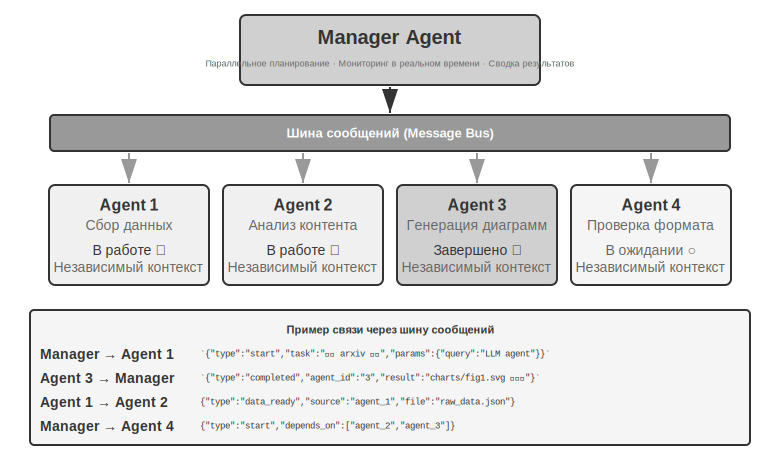

**Debate (дебаты)**: несколько Agent (агент) занимают разные позиции и через состязательный диалог глубоко исследуют пространство проблемы. Например, при оценке технического решения Agent A выступает в роли «сторонника», перечисляя преимущества и возможности решения, а Agent B — в роли «оппонента», указывая на риски и ограничения; в каждом раунде дебатов выдвигаются контраргументы или дополнения к доводам противоположной стороны. При анализе с помощью одного агента модель часто склоняется к определенной точке зрения, игнорируя противоположные доказательства; режим дебатов через институционализированное противостояние гарантирует, что обе стороны будут полностью аргументированы, помогая лицу, принимающему решение, сделать более взвешенный выбор.

Тем не менее, реальная эффективность режима дебатов в академических кругах до сих пор остается спорной. В исследовании Tran и Kiela 2026 года [^single-agent-2026] на задачах многоходового рассуждения сравнивались одиночные агенты с пятью типами многоагентных архитектур (последовательная, дебаты, ансамбль, параллельные роли, параллельные подзадачи). Было обнаружено, что **когда бюджет токенов на размышление строго ограничен и одинаков, производительность одиночного Agent сопоставима или даже выше, чем у системы из нескольких агентов** (за исключением случаев, когда эффективность использования контекста снижена до определенного уровня). Исследователи дали объяснение, основанное на неравенстве обработки данных из теории информации: несколько агентов в дебатах обрабатывают одну и ту же текстовую информацию; при каждой последовательной передаче промежуточных выводов между агентами информация может только теряться, но не создаваться из ничего. Преимущества режима дебатов в некоторых научных работах, скорее всего, связаны с тем, что несколько агентов в сумме потребляют больше вычислительных ресурсов. Необходимо четко очертить границы этого аргумента: он направлен против «информационного узкого горлышка», возникающего при последовательной передаче промежуточных выводов между агентами, и не отрицает другие подходы — **многократную независимую выборку с последующей агрегацией** по одному и тому же вопросу (например, self-consistency, мажоритарное голосование) или использование **асимметрии сложности генерации и проверки** (написать ответ сложно, проверить — легко) для разделения труда по схеме «генерация-проверка». Эти сценарии либо вводят дополнительную независимую выборку, либо используют асимметричную структуру самой задачи, и не подпадают под действие неравенства обработки данных.

**Brainstorm (мозговой штурм)**: несколько агентов независимо генерируют идеи, а затем делятся ими, вдохновляя друг друга. Например, в задаче по инновационному продукту Agent 1 предлагает «добавить функцию социального обмена», Agent 2, вдохновившись этим, предлагает «не просто делиться в соцсетях, но и генерировать персонализированные постеры», а Agent 3 синтезирует идеи первых двух и предлагает «рынок пользовательских шаблонов для постеров». Разные агенты обладают разными «когнитивными предпочтениями» (реализуемыми через разные промпты или модели) и через взаимную стимуляцию исследуют более широкое пространство решений, находя комбинации идей, до которых трудно додуматься одиночному агенту.

**Panel Discussion (панельная дискуссия)**: несколько агентов представляют взгляды из разных профессиональных областей и совместно обсуждают междисциплинарную проблему. Например, при оценке жизнеспособности нового продукта инженерный Agent анализирует сложность реализации с технической точки зрения, продуктовый Agent оценивает рыночную привлекательность с позиции пользовательского опыта, а операционный Agent анализирует коммерческую целесообразность с точки зрения затрат и ресурсов. Отношения между этими агентами не состязательные, а взаимодополняющие: они вместе собирают полную картину проблемы, выявляя кросс-доменные ограничения и возможности.

### Режим менеджера: централизованная координация

Когда задача включает более пяти подзадач, требует динамического планирования или когда между подзадачами существуют сложные зависимости, одноранговое взаимодействие становится неэффективным, и требуется введение режима менеджера. Обязанности Manager Agent (агент-менеджер) напоминают работу руководителя проекта: сначала понять общую задачу, затем декомпозировать её на распределяемые подзадачи, выбрать подходящих агентов для исполнения, отслеживать прогресс и обрабатывать исключения (повторные попытки, замена агента, корректировка плана) и, наконец, интегрировать выходные данные всех агентов в итоговый результат.

С точки зрения проектирования системы режим менеджера моделирует каждого специализированного агента как инструмент, вызываемый менеджером. Набор инструментов менеджера включает не только традиционные внешние инструменты (такие как поиск или операции с файлами), но и интерфейсы вызова других агентов. Менеджер через механизм Tool Calling запускает соответствующего агента, передает параметры задачи и необходимый контекст, а после завершения получает результат. С позиции менеджера вызов агента принципиально не отличается от вызова обычного инструмента — это отправка запроса и получение ответа. Такая унифицированная абстракция обеспечивает режиму менеджера отличную масштабируемость: для добавления новых возможностей достаточно разработать соответствующего агента и зарегистрировать его как инструмент, при этом основную логику менеджера менять не требуется. В то же время это естественным образом поддерживает гетерогенность — разные агенты могут использовать разные модели, промпты, наборы инструментов и даже работать в различных аппаратных средах.

[^single-agent-2026]: Tran, D., Kiela, D. *Single-Agent LLMs Outperform Multi-Agent Systems on Multi-Hop Reasoning Under Equal Thinking Token Budgets.* arXiv:2604.02460, 2026.

Абстракция «Agent (агент) как инструмент друг для друга» уже была выстроена в главе 4 в разделе «Инструменты совместной работы»: дизайн интерфейсов `spawn_subagent` / `send_message` / `cancel_subagent`, а также четыре стратегии подготовки контекста для дочернего агента (минимальная передача, ручной отбор, автоматическая обрезка, генерация контекста с помощью LLM) напрямую применимы здесь к вызову дочерних агентов со стороны Manager (менеджер). Глава 4 решает вопрос о том, что передавать в направлении «Manager → дочерний агент»; симметричный вопрос заключается в том, что возвращать в направлении «дочерний агент → Manager». Ответ — **структурированное резюме, а не полный лог выполнения (траектория)**: дочерний агент должен возвращать выводы по задаче, ключевые находки, пути к файлам артефактов и возникшие проблемы, оставляя полную траекторию выполнения в своих собственных логах. Только так контекст Manager сможет расти линейно и медленно по мере увеличения количества подзадач, а не раздуваться взрывообразно — это и является методологической основой подхода «поддерживать только индекс файлов, не сохраняя содержание перевода» в эксперименте 10-3 ниже. Разделение труда между двумя главами следующее: глава 4 посвящена механизмам (реализации интерфейсов инструментов и передачи контекста), а текущая глава — архитектуре (топологии и разделению обязанностей).

Однако модель управления имеет и свои внутренние вызовы. Manager становится единой точкой отказа и узким местом системы — он должен понимать природу всех подзадач, выбирать правильных агентов и точно передавать контекст; любое отклонение в принятии решений повлияет на весь процесс. Кроме того, Manager необходимо поддерживать глобальный контекст всей задачи, который может быстро раздуваться по мере углубления задачи и увеличения количества вызовов агентов. Поэтому особое внимание следует уделять качеству Prompt Engineering (промпт-инженерия) для Manager, стратегиям управления контекстом и разумной гранулярности декомпозиции задач.

В статье 2025 года по Plan-and-Act [^plan-and-act-2025] был проведен эмпирический анализ этого аспекта: в архитектуре из двух агентов Planner-Executor (планировщик-исполнитель) **слабый планировщик является самым критическим узким местом всей системы**. Когда качество планирования Planner достаточно высоко, даже относительно простой Executor может достичь хороших результатов; напротив, если декомпозиция задачи в Planner ошибочна, вся последующая работа Executor строится на неверных предпосылках. Данное исследование достигло 54% успеха на бенчмарке WebArena-Lite, и его основным вкладом стало именно улучшение способностей Planner к планированию, а не способностей Executor к исполнению. Вывод из этого открытия таков: следует выделять самые мощные модели и наиболее тщательно проработанные промпты для Manager (планировщика), а не распределять ресурсы поровну между всеми агентами.

Это не противоречит тезису из четвертой главы. В четвертой главе при обсуждении предлагающей модели (proposer) и проверяющей модели (verifier) указывалось, что их способности должны быть сопоставимы — но это относилось к **сценариям проверки**: проверяющий должен поспевать за рассуждениями проверяемого, чтобы иметь возможность обнаружить в них изъяны; если разрыв в способностях слишком велик, проверка становится невозможной. Модель управления же обсуждает другое — **разделение труда между планированием и исполнением**: если планировщик однажды неверно декомпозирует задачу, никакой, даже самый сильный исполнитель не сможет это исправить, поэтому приоритет в получении лучших моделей и промптов должен быть у планировщика. Что касается баланса способностей между исполнителями, то он зависит от степени связанности подзадач: когда результаты нескольких исполнителей должны быть в итоге собраны в единое целое, самое слабое звено зачастую тянет вниз общее качество.

**Форма последовательной координации.**

Manager вызывает специализированных агентов последовательно один за другим; после завершения работы каждым агентом и возврата результата Manager принимает решение о следующем шаге. Поток управления является линейным, простым и понятным, что подходит для сценариев с четкими последовательными зависимостями между подзадачами.

[^plan-and-act-2025]: Erdogan, L. E., et al. *Plan-and-Act: Improving Planning of Agents for Long-Horizon Tasks.* arXiv:2503.09572, 2025.

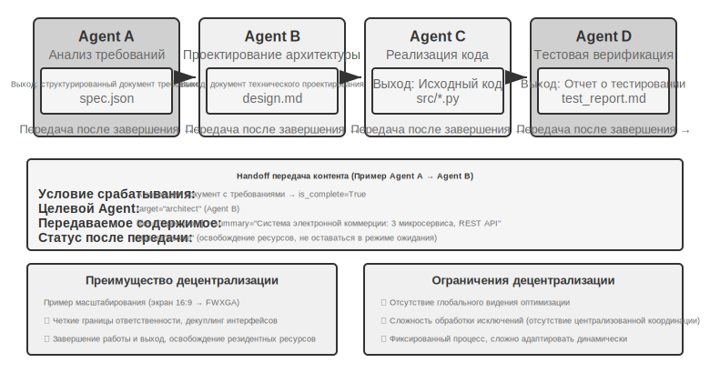

> **Эксперимент 10-3 ★★: Книжный переводческий Agent**

Перевод книг — это типичная сложная задача, требующая совместной работы нескольких Agent (агентов). Перевод технической книги — это не просто преобразование текста с одного языка на другой; необходимо обеспечить единообразие терминологии во всей книге, точность контекста и общую плавность чтения. Например, при переводе англоязычной книги по LLM огромное количество терминов будет встречаться многократно. Для них могут существовать различные общепринятые варианты перевода, которые должны быть унифицированы во всей книге: если в первой главе agent переведен как «интеллектуальный агент», то далее он не может превратиться в «прокси».

Если использовать для этого одиночный Agent, возникнет серьезная проблема контекста. По мере того как Agent обрабатывает содержимое глава за главой, контекст постоянно накапливается: глоссарий всей книги, уже переведенные главы, текущий абзац, процесс рассуждений о переводе, результаты Tool Calling (вызова инструментов). Техническая книга в несколько сотен страниц вместе с промежуточными результатами перевода может легко выйти за пределы Context Window (контекстного окна). Что еще серьезнее, в слишком длинном контексте Agent склонен «теряться» — забывать о предыдущих договоренностях по терминам, используя в восьмой главе вариант, не соответствующий второй главе; тратить ресурсы на избыточные проверки на этапе вычитки; или даже галлюцинировать из-за рассеивания внимания, «вспоминая» правила терминологии, которых на самом деле не существует.

Режим менеджера решает эти проблемы путем декомпозиции задач и разделения ответственности:

- **Glossary Agent** (Agent терминологического глоссария): получает содержимое всей книги, идентифицирует повторяющиеся профессиональные термины, ищет их в специализированных словарях и стандартах перевода, формирует структурированный глоссарий (в формате JSON/CSV, содержащий английский термин, русский перевод, часть речи и контекст использования). После завершения записывает результат в общую файловую систему, после чего Agent может быть уничтожен для освобождения ресурсов.
- **Translation Agent** (Agent перевода глав): получает текущую главу, глоссарий и руководство по переводу (уровень целевой аудитории, языковой стиль), выполняет перевод на естественный русский язык. При встрече терминов из глоссария строго придерживается установленного перевода; при обнаружении новых терминов выводит перевод логически и помечает их для проверки. Каждый экземпляр работает в независимом контексте, не мешая другим. Перевод записывается в файловую систему (например, `chapter1_ru.md`). Manager может запускать несколько экземпляров параллельно или последовательно.
- **Proofreading Agent** (Agent полнотекстовой вычитки): получает все переводы и глоссарий, выполняет проверку на согласованность — поочередно верифицирует единообразие перевода терминов, выявляет несоответствия, проверяет общую плавность и читабельность. Генерирует отчет о проверке и записывает его в файловую систему.
- **Manager Agent**: хранит в своем контексте в основном описание задачи, план выполнения, записи вызовов каждого Agent и статус прогресса. Он не хранит полный текст перевода (он находится в файловой системе), а лишь поддерживает индекс файлов. На основе отчета о вычитке Manager может отправить конкретную главу обратно Translation Agent на доработку.

В такой архитектуре контекст Manager Agent всегда остается в управляемых пределах: ему нужно знать только общее описание и цели задачи, план выполнения этапов, логи вызовов и результаты каждого Agent, а также текущий статус, без необходимости вмещать полный текст перевода каждой главы.

Ключевое преимущество заключается в **изоляции контекста**: Glossary Agent видит только то, что нужно для извлечения терминов, Translation Agent видит только текущую главу и глоссарий, а Proofreading Agent, хотя и имеет доступ ко всему тексту, фокусируется только на проверке согласованности. Каждый Agent работает в лаконичном, сфокусированном контексте, что не только повышает эффективность, но и снижает вероятность ошибок — Agent не теряет концентрацию из-за информационной перегрузки.

**Требования к эксперименту**:
1. Выбрать для перевода техническую книгу с иллюстрациями и примерами кода.
2. Реализовать четыре типа Agent: Manager, Glossary, Translation и Proofreading.
3. Зафиксировать потребление контекста каждым Agent, подтвердив эффективность режима менеджера в контроле разрастания контекста.
4. Сравнить различия между одиночным Agent и режимом менеджера в качестве перевода, эффективности выполнения и потреблении ресурсов.


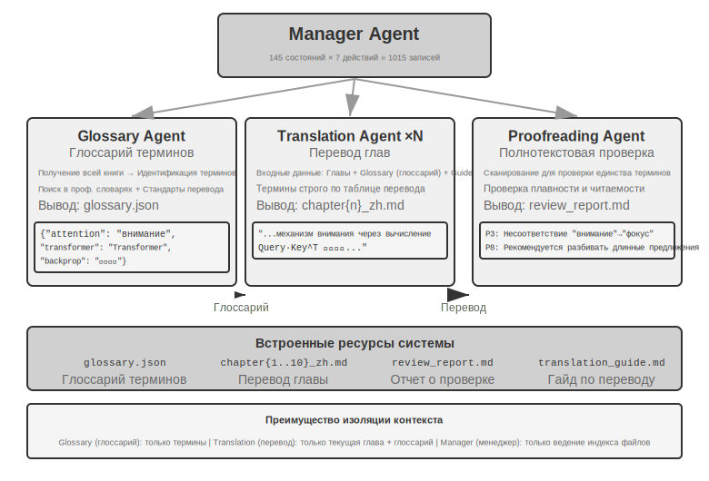


**Параллельная координация.**

Когда несколько подзадач могут выполняться одновременно, последовательный режим становится неэффективным. Параллельная координация позволяет нескольким Agent работать одновременно, значительно увеличивая пропускную способность. Manager Agent должен не только планировать параллельные задачи, но и в реальном времени отслеживать всех запущенных Agent, координировать обмен сообщениями и принимать глобальные решения в случае успеха или сбоя Agent. Для этого обычно требуется **Message Bus** (шина сообщений) в качестве инфраструктуры — ее можно представить как «общественную доску объявлений», куда Agent могут вешать сообщения (публиковать) или следить за интересующими их типами сообщений (подписываться), реализуя асинхронное взаимодействие без взаимных блокировок. Существует две категории распространенных решений, упорядоченных по возрастанию сложности: **Redis Pub/Sub** — легковесное решение, сообщения отправляются и принимаются мгновенно, просто в использовании, но недостатком является отсутствие персистентности (если получатель не в сети, сообщение теряется); очереди сообщений, такие как **RabbitMQ**, сохраняют сообщения на диске, поэтому они не потеряются, даже если получатель временно недоступен. Формат сообщения обычно включает ID отправителя, целевой Agent (или широковещательную рассылку всем), тип сообщения и данные в формате JSON.

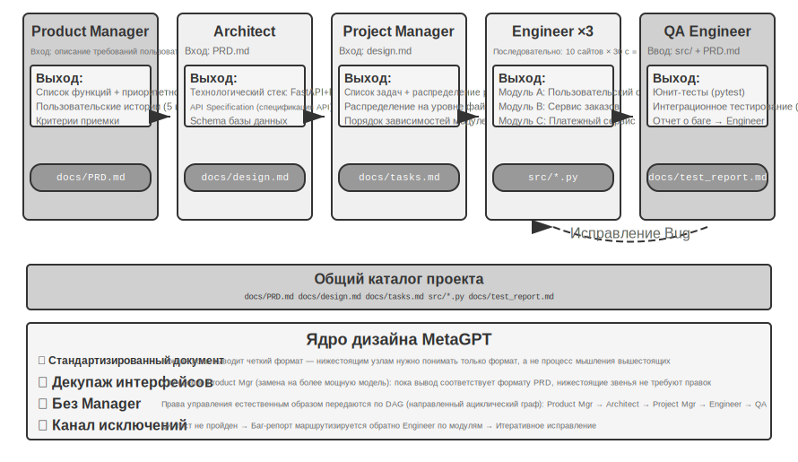

> **Эксперимент 10-4 ★★★: Agent, одновременно говорящий по телефону и использующий компьютер**
>
> **Предварительные требования**: Данный эксперимент комплексно использует технологии Computer Use (использование компьютера) и голосовых Agent из девятой главы; рекомендуется сначала завершить соответствующие эксперименты девятой главы.
>
> В реальности многие сценарии требуют одновременной работы нескольких навыков, а не их выполнения по очереди: помощник-человек может одновременно общаться с клиентом по телефону, искать документы на компьютере и записывать ключевые моменты. Такая «многозадачность» является крайне сложной для одного Agent — если заставить одного Agent одновременно обрабатывать голосовой диалог в реальном времени и управлять интерфейсом компьютера, он неизбежно будет переключаться между двумя задачами, что приведет к паузам в диалоге или прерываниям операций. Основная идея параллельного выполнения нескольких Agent заключается в следующем: **позволить разным Agent сосредоточиться на одной задаче с высокими требованиями к реальному времени, координируя их через асинхронную передачу сообщений для достижения истинной параллельной обработки**. Два Agent также специально оптимизированы под разные модальности взаимодействия: Phone Agent (телефонный агент) требует низкой задержки ASR (автоматическое распознавание речи) и TTS (синтез речи), а Computer Agent (компьютерный агент) нуждается в мощных способностях к визуальному пониманию и планированию операций.
>
> **Сценарий**: AI Agent помогает пользователю заполнить сложную форму бронирования авиабилетов. Ему нужно одновременно управлять веб-страницей и по телефону запрашивать и подтверждать у пользователя личную информацию (имя, номер документа, предпочтения по рейсам и т. д.). Обе стороны требуют высокого соответствия реальному времени, что является типичным примером того, как одиночный Agent теряется, а два Agent эффективно распределяют обязанности.
>
> **Архитектура с двумя Agent**:
>
> **Phone Agent**: Голосовой Agent на базе связки ASR + LLM + TTS. Он отвечает за понимание ответов пользователя на естественном языке, извлечение ключевой информации и её отправку Computer Agent через систему обмена сообщениями; одновременно он получает сообщения от Computer Agent (например, «нужен номер документа пользователя», «ошибка загрузки страницы») и на их основе генерирует подходящие реплики для опроса пользователя.
>
> **Computer Agent**: На базе фреймворка для управления браузером (например, Anthropic Computer Use, browser-use). Он отвечает за понимание структуры веб-страницы, распознавание полей формы, выполнение заполнения на основе полученной информации и обращение за помощью к Phone Agent при возникновении проблем.
>
> Существует два варианта **механизма связи**:
> - **Простой вариант**: P2P-связь через Tool Calling (вызов инструментов), например `send_message_to_computer_agent(message)` / `send_message_to_phone_agent(message)`.
> - **Усовершенствованный вариант**: шина сообщений + Manager Agent (агент-менеджер), унифицированный формат сообщений, включающий отправителя, получателя, тип и содержимое.
>
> **Механизм параллельного взаимодействия** (общий для двух экспериментов этой главы «телефон + компьютер»): два Agent запускаются в независимых потоках или процессах, каждый поддерживает собственный цикл ReAct. Цикл Phone Agent: получение голоса -> ASR-транскрипция -> понимание и генерация ответа через LLM -> TTS-синтез -> воспроизведение -> проверка сообщений от Computer Agent. Цикл Computer Agent: скриншот -> Vision LLM понимает страницу -> планирование операции -> выполнение (клики, ввод и т. д.) -> проверка сообщений от Phone Agent. Ключ в том, что оба должны работать действительно параллельно: пока Computer Agent ищет элементы или вводит текст, Phone Agent должен оставаться на связи и разговаривать с пользователем («Хорошо, заполняю ваше имя... подскажите, пожалуйста, номер вашего документа?»). Для этого входные данные каждого Agent несут размеченные поля от партнера, например, в контексте Phone Agent появится `[FROM_COMPUTER_AGENT] Не могу найти кнопку 'Далее', возможно, требуется подтверждение пользователя`, а в Computer Agent появится `[FROM_PHONE_AGENT] Пользователь сказал, что имя — 'Чжан Сань', номер документа — 123456`.
>
> **Требования к эксперименту**:
> 1. Реализовать архитектуру с двумя Agent на базе API ASR/TTS и фреймворка управления браузером.
> 2. Реализовать эффективный механизм двусторонней связи.
> 3. Обеспечить истинно параллельную работу: сбор информации и заполнение формы должны идти синхронно.
> 4. Обработать исключительные ситуации.
>
> **Эксперимент 10-5 ★★★: Agent с автономной оркестровкой звонков и использования компьютера**
>
> В эксперименте 10-4 архитектура взаимодействия двух Agent была спроектирована заранее. Данный эксперимент идет дальше, исследуя **способность Agent к автономной оркестровке** — когда Agent сам решает, когда нужно запустить нового вспомогательного Agent, вместо того чтобы человек заранее планировал процесс взаимодействия.
>
> **Сценарий**: Пользователь просит «помоги мне зарегистрироваться на этом сайте», предоставив URL, но не указав, какую информацию нужно заполнить. Manager Agent использует инструмент Computer Use для доступа к сайту и загружает страницу регистрации.
>
> В процессе работы Computer Use Agent обнаруживает, что форма регистрации очень сложная и содержит множество обязательных полей: основные личные данные (имя, пол, дата рождения), контактную информацию (номер телефона, email, адрес), данные для верификации личности (тип документа, номер документа), настройки предпочтений и т. д. Проверив контекст, Agent понимает, что у него нет этой информации — пользователь просто сказал «зарегистрируй меня», не предоставив конкретных данных.
>
> Традиционный Agent в такой ситуации отправил бы текстовое сообщение с просьбой ввести данные вручную, что неэффективно (требует ручного ввода большого объема данных) и чревато ошибками (проблемы с форматом, пропуск информации). Более интеллектуальный Agent должен осознать: **это сценарий, подходящий для сбора информации через телефонное взаимодействие** — телефонный разговор гораздо эффективнее текстового чата, позволяет запрашивать данные по одному и обрабатывать нечеткие формулировки пользователя.
>
> Ключевое новшество в том, что это решение не запрограммировано заранее, а **принято Agent автономно**. В Prompt (промпте) Computer Use Agent написано: «Когда тебе нужно собрать у пользователя большой объем структурированной информации, и это можно сделать поэтапно через диалог, рассмотри возможность вызова Phone Agent в качестве вспомогательного инструмента». Набор инструментов включает `initiate_phone_call_agent(purpose, required_info)`.
>
> После вызова система создает Phone Agent и передает ему четкий контекст задачи: он запущен для помощи в заполнении формы, указано, какую информацию нужно собрать и каковы требования к формату полей.
>
> Затем два Agent переходят в режим взаимодействия в реальном времени, используя ту же систему асинхронной параллельности из эксперимента 10-4. Phone Agent звонит пользователю и спрашивает по порядку: «Здравствуйте, я помогаю вам заполнить форму регистрации. Для начала, как ваше имя?» Сразу после ответа пользователя отправляется `{"type": "info_collected", "field": "имя", "value": "Чжан Сань"}` для Computer Agent, который тут же находит поле «Имя» на странице и заполняет его; в это же время Phone Agent, не дожидаясь завершения операции на компьютере, продолжает задавать следующий вопрос. Этот режим **«спросил — заполнил»**, где поток диалога не блокируется задержками операций, является основным требованием данного эксперимента. После сбора всей информации Phone Agent отправляет `{"type": "task_completed"}`, и Computer Agent отправляет форму.
>
> **Требования к эксперименту**:
> 1. Реализовать Computer Use Agent, способный автономно принимать решение о запуске Phone Agent.
> 2. Реализовать двустороннюю связь в реальном времени и истинно параллельную работу.
> 3. Обработать исключения (обратный запрос при некорректном формате информации).
> 4. Зафиксировать временную последовательность сообщений в процессе взаимодействия и ключевые точки принятия решений Agent.
>
>
> 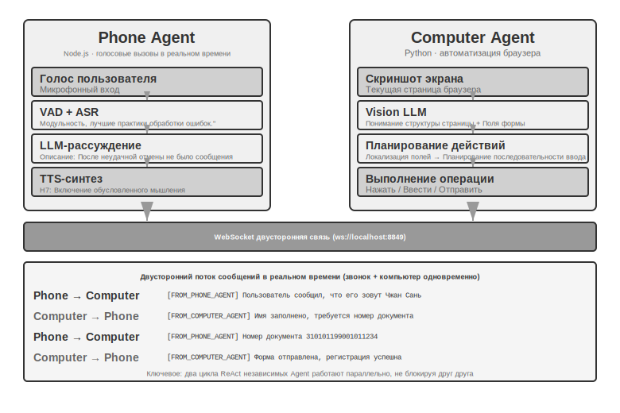
>
>
> **Эксперимент 10-6 ★★★: Agent, одновременно собирающий информацию с нескольких сайтов**
>
> **Предварительные требования**: Рекомендуется сначала ознакомиться с механизмами Event-driven (событийное управление) и прерываний в четвертой главе.
>
> Этот эксперимент исследует применение параллельного выполнения нескольких Agent в сценариях сбора информации. В отличие от экспериментов 10-4 и 10-5, сфокусированных на взаимодействии двух гетерогенных Agent, здесь основное внимание уделяется **параллельному поиску нескольких гомогенных Agent**, а также тому, как через централизованную координацию достичь эффективного выполнения задачи и оптимизации ресурсов.
>
> **Задача**: Даны сайты нескольких факультетов университета. Требуется найти указанного преподавателя (например, «Чжан Вэй») в списках сотрудников каждого факультета, и после нахождения вернуть информацию о его факультете, должности, направлении исследований и т. д.
>
> **Основные вызовы**:
>
> **1. Параллельный запуск**: Manager Agent динамически создает 10 экземпляров Computer Use Agent в соответствии с требованиями задачи, каждый экземпляр соответствует сайту одного факультета. Каждый экземпляр должен быть независимым процессом или потоком, обладать независимой браузерной сессией и выполняться одновременно без взаимных блокировок. При запуске передаются: URL целевого сайта, имя искомого преподавателя, идентификатор задачи (для маршрутизации сообщений).
>
> **2. Мониторинг в реальном времени**: Каждый Agent в процессе выполнения периодически отправляет обновления статуса («Загрузка сайта», «Парсинг списка преподавателей», «Цель не найдена, задача завершена», «Совпадение найдено, подробности ниже»). Manager Agent получает эти обновления через шину сообщений, поддерживает таблицу статусов задач и в реальном времени видит, какие Agent еще работают, какие завершили работу, а какие столкнулись с ошибками.
>
> **3. Каскадное завершение**: Допустим, Agent, ответственный за факультет компьютерных наук, нашел целевого преподавателя. Он отправляет `{"type": "target_found", "agent_id": "agent_3", "data": {...}}`. Manager Agent, получив это, немедленно отправляет всем остальным работающим Agent сообщение `{"type": "terminate", "reason": "target_found_by_agent_3"}`. Каждый Agent, получивший сообщение о завершении, должен изящно (gracefully) остановиться и отправить подтверждение. Manager Agent дожидается всех подтверждений (или тайм-аута) и сводит результаты. Требование: Agent должен уметь в любой момент отреагировать на сигнал завершения (аналогично механизму прерываний в четвертой главе), завершение должно быть корректным — без «зависших» процессов или незакрытых ресурсов; также необходимо обработать Race Condition (состояние гонки).
>
> **Дополнение к концепции: что такое Race Condition?** Предположим, Agent A и Agent B почти в одну и ту же миллисекунду нашли преподавателя и одновременно сообщили Manager Agent: «Я нашел!». Если Manager Agent обработает это некорректно — например, после отчета A начнет сводить результаты, а следом пришедший отчет B вызовет повторное сведение — это может привести к дублированию результатов или противоречивым состояниям. Решением обычно является использование механизма «замков» (locks): после прибытия первого отчета статус немедленно блокируется, а последующие отчеты распознаются как дубликаты и игнорируются.
>
> **4. Обработка сбоев**: В реальности могут возникнуть различные аномалии: сайт факультета недоступен (сетевая ошибка, сбой сервера), структура сайта не соответствует ожидаемой (Agent не может провести парсинг) или все Agent завершили поиск, но цель не найдена. Стратегия Manager Agent: установить тайм-аут для каждого Agent (например, 2 минуты), тайм-аут считается неудачей; изоляция ошибок, чтобы сбой одного не мешал другим; итоговое сведение — если хотя бы один Agent успешен, вернуть информацию, если все провалились — сообщить пользователю «Преподаватель не найден» со статистикой причин неудач.
>
> **Требования к эксперименту**:
> 1. Реализовать Manager Agent, способный динамически запускать несколько параллельных Agent.
> 2. Реализовать Computer Use Agent на базе открытых проектов, таких как browser-use.
> 3. Реализовать шину сообщений для поддержки двусторонней связи между Manager Agent и дочерними Agent.
> 4. Реализовать механизм каскадного завершения после успеха, обеспечивающий быструю остановку всех остальных Agent при нахождении цели.
> 5. Обработать различные исключительные ситуации (ошибки доступа к сайту, ошибки парсинга, отсутствие результата у всех).
> 6. Зафиксировать и сравнить разницу во времени между параллельным и последовательным выполнением для подтверждения прироста производительности за счет параллелизации.
>
>
> 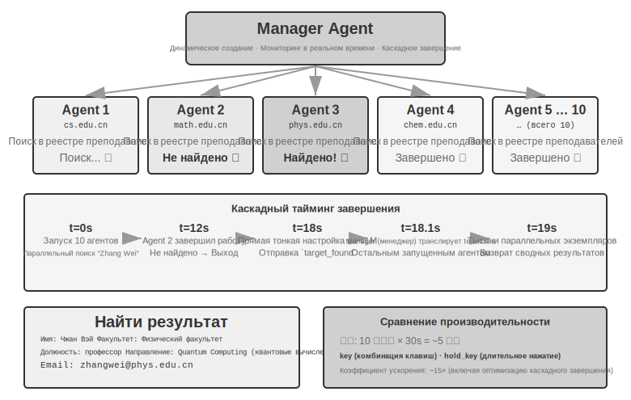
>
>
### Децентрализованная модель: P2P-передача управления (Handover)

Термин Agent: перевод «reasoning» как «рассуждение» (推理), однако в китайском языке «推理» чаще используется для обозначения Inference (инференс), что создает двусмысленность.

Хотя модель управления предоставляет четкую структуру контроля и глобальное видение, централизованный характер накладывает свои ограничения: Manager становится узким местом и единой точкой отказа системы. Все координационные решения зависят от суждений Manager, который, в свою очередь, должен обладать достаточным пониманием всех подзадач. По мере роста сложности задач и увеличения количества Agent (агент), масштабируемость системы оказывается под угрозой.

Децентрализованная модель предлагает иной архитектурный подход: **отсутствие единого центрального контроллера, при котором Agent взаимодействуют друг с другом на равных**. Каждый Agent, основываясь на собственных профессиональных суждениях, самостоятельно решает, когда инициировать коммуникацию с другими Agent — будь то передача задачи («моя часть выполнена, передаю тебе»), запрос обратной связи («жизнеспособен ли этот вариант с технической точки зрения?») или сообщение о проблеме («предоставленные требования противоречивы, нам нужно обсудить их снова»).

Три приведенных ниже кейса намеренно выстроены в прогрессию «от мнимого к истинному»: поток управления в MetaGPT на самом деле представляет собой фиксированный конвейер (псевдодецентрализация, где декуплинг реализован только в механизме связи); групповой чат AutoGen — это гибридная форма с общей историей диалога и централизованной диспетчеризацией; и только OpenAI Swarm достигает подлинной децентрализации на уровне потока управления.

**Что передается при Handoff (передача задачи) в условиях отсутствия общей памяти?** Цепочечная модель Handoff на рис. 10-10 находится в прямом контрасте с функцией `transfer_to_agent` из эксперимента 10-2. В последнем случае передача происходит в рамках общего контекста: новая роль автоматически наследует полную историю, что не требует специального проектирования. В первом же случае, когда контекст не является общим, передающая сторона должна явно решить, какую информацию транслировать. На практике эффективный «пакет передачи» обычно состоит из трех частей: **описание задачи** (что должен сделать получатель, каковы критерии приемки), **подтвержденные факты и ограничения** (предпочтения пользователя, бизнес-правила, решения, принятые на предыдущих этапах) и **ссылки на структурированные артефакты** (пути к файлам, а не само содержимое; получатель считывает их по мере необходимости). Намеренно не передается полный лог траектории — процесс проб и ошибок, промежуточные размышления и неудачные попытки передающей стороны чаще всего являются шумом для получателя. В этом заключается фундаментальное различие между двумя типами передачи: Handoff с общим контекстом сохраняет полную историю (нулевая потеря информации, но постоянное раздувание Context Window (контекстное окно)), в то время как передача без общей памяти транслирует очищенный пакет данных (информация теряется, но каждый Agent работает в чистом и сфокусированном контексте). Каждому Agent не нужно понимать «процесс мышления» других Agent, ему достаточно понимать формат и семантику пакета передачи и выходных артефактов. Такое взаимодействие на основе интерфейсов заимствует принципы Contract Design (проектирование по контракту) из программной инженерии.

**MetaGPT: симуляция софтверной компании на базе SOP (переходный кейс от конвейера к декуплированной коммуникации).**

Ключевое озарение разработчиков MetaGPT заключается в том, что накопленные человечеством в софтверных компаниях **стандартные операционные процедуры** (SOP, Standard Operating Procedure) сами по себе являются проверенными протоколами совместной работы. Кодируя SOP в многоагентную систему, можно заставить каждую роль выдавать стандартизированные результаты, подобно узкоспециализированным рабочим на конвейере. Эти результаты естественным образом формируют коммуникационные интерфейсы между ролями.

В MetaGPT роли работают в строгой последовательности (Product Manager → Architect → Project Manager → Engineer → QA), и каждая из них выдает структурированные артефакты:

- **Product Manager Agent**: принимает описание требований и генерирует структурированный PRD (документ о требованиях к продукту, включающий список функций, пользовательские истории, критерии приемки и приоритеты).
- **Architect Agent**: считывает PRD, принимает архитектурные решения (выбор технологического стека, разделение на модули, определение интерфейсов, проектирование модели данных) и выдает проектную документацию.
- **Project Manager Agent**: изучает архитектурный проект, разбивает систему на конкретный список задач и распределяет работу на уровне файлов, выстраивает очередность зависимостей модулей и распределяет задачи между инженерами.
- **Engineer Agents**: изучают проектную документацию, реализуют вверенные им модули и выдают код. Могут работать параллельно в нескольких экземплярах.
- **QA Engineer Agent**: изучает код и PRD, генерирует тест-кейсы, выполняет тестирование, фиксирует баги и выдает отчет о тестировании.

Подлинный вклад MetaGPT в децентрализованную коммуникацию заключается в механизме передачи информации: **общий пул сообщений + подписка по ролям**. Каждая роль публикует структурированное сообщение в пул, видимый всем Agent. Другие Agent, основываясь на настройках своей подписки, забирают только те сообщения, которые относятся к их зоне ответственности, вместо того чтобы вести диалог «точка-точка». Отправителю не нужно знать, кто потребит его результат, а для добавления новой роли достаточно объявить, на какие типы сообщений она подписана, не внося изменений в существующие Agent. Это обеспечивает реальный декуплинг: например, если заменить Product Manager на более мощную модель, остальным Agent не потребуется модификация, пока публикуемый PRD соответствует спецификации.

Итеративное улучшение в MetaGPT происходит в основном на этапе инженерии через механизм **исполняемой обратной связи** (executable feedback): Engineer запускает написанный им код и тесты и на основе ошибок или неудачных результатов входит в цикл отладки до тех пор, пока тесты не будут пройдены. Исправления стимулируются детерминированным результатом выполнения, а не мнением другого Agent.

        ↓ Запись в glossary.json

Следует честно признать, что MetaGPT в плане **Control Flow** (поток управления) не является децентрализованным — последовательность ролей заранее фиксируется SOP, и в целом система больше напоминает конвейер (или Workflow (рабочий процесс), если использовать терминологию первой главы). Она обсуждается в этом разделе, так как механизм коммуникации через пул сообщений и подписки демонстрирует ключевой элемент проектирования децентрализованных систем: Decoupling (развязка/разобщение). Что касается многосторонней динамической обратной связи, такой как «QA напрямую обращается к Product Manager для уточнения требований» или «Engineer обсуждает альтернативные решения с Architect», — это естественные расширения данной архитектуры, которые в оригинальной MetaGPT реализованы не были.

**AutoGen group chat: общая история диалога + централизованная диспетчеризация.** Group chat в AutoGen позволяет нескольким Agent (агент) участвовать в одной сессии: в каждом раунде «селектор спикера» определяет следующего активного агента. Селектором может выступать как простое правило очередности (Round-robin), так и LLM, которая на основе контекста диалога решает, кому лучше вступить в разговор. Высказывание любого агента становится видимым для всех участников. Важно уточнить, что с точки зрения потока управления это не полностью децентрализованная система: выбор спикера единолично принимается централизованным `GroupChatManager`, а само решение о том, «чья очередь говорить», является управленческим решением. Поэтому более точное определение для такой структуры — **гибридная форма «общей истории диалога + централизованной диспетчеризации»**. Все агенты видят одну и ту же публичную запись диалога, но сохраняют независимые System Prompt (системные промпты) и наборы инструментов, в то время как право управления передачей слова сосредоточено у селектора. Такая модель подходит для задач, требующих обсуждения с разных точек зрения, где порядок выступлений трудно зафиксировать заранее (например, рецензирование решений или междисциплинарный анализ), однако ценой этого может стать расфокусировка диалога, что требует тщательного проектирования условий завершения. В рамках классификации этой главы мы относим данную модель к этому разделу из-за механизма диспетчеризации (централизованный селектор), хотя по вектору контекста она находится посередине между общим и раздельным хранением, являясь гибридом. Это лишний раз доказывает, что топология и Context Sharing (совместное использование контекста) — это два концептуально независимых измерения, которые могут комбинироваться по-разному.

**OpenAI Swarm и Agents SDK: сеть handoff.** В отличие от предыдущих примеров, настоящим представителем децентрализации на уровне потока управления является Swarm от OpenAI (и его преемник Agents SDK). В нем децентрализация доведена до минималистичной формы: каждый Agent оснащен набором опций Handoff (передача управления) и может в любой момент передать контроль любому другому агенту в сети. Если агент первичной сортировки запросов в службе поддержки понимает, что вопрос касается возврата средств, он передает управление агенту по возвратам; если тот в процессе обработки обнаруживает технический сбой, он может перенаправить задачу агенту техподдержки. В системе нет центрального диспетчера, управление переходит между равноправными агентами подобно эстафетной палочке, а решения о маршрутизации полностью распределены внутри логики самих агентов. Это и есть чистая «одноранговая передача», инженерная реализация цепочечной модели передачи, показанной на рис. 10-10.

### Кросс-организационное взаимодействие: протокол A2A

Все вышеперечисленные системы предполагают, что агенты разработаны одной командой и работают внутри одной среды. В таких случаях механизмов передачи параметров, общих файлов и шины сообщений вполне достаточно. Но когда сотрудничество выходит за границы организации — когда вашему агенту нужно вызвать агента другой компании — требуются стандартизированные протоколы взаимодействия. Опубликованный Google в 2025 году протокол **A2A** (Agent2Agent), позже переданный под управление Linux Foundation, спроектирован именно для этих целей. Он включает три ключевых элемента:

- **Agent Card**: документ метаданных, описывающий возможности агента (публикуется по оговоренному открытому адресу). Он декларирует, что умеет делать агент, какие модальности ввода-вывода поддерживает и как проходит аутентификацию. Это своего рода «визитная карточка» агента, решающая проблему обнаружения возможностей в кросс-организационной среде.
- **Управление жизненным циклом задачи**: A2A моделирует единицу сотрудничества как Task (задача) с четко определенным конечным автоматом состояний (отправлена, выполняется, ожидает ввода, завершена, ошибка). Протокол нативно поддерживает длительные задачи и потоковое обновление прогресса.
- **Непрозрачное сотрудничество**: агенты обмениваются только задачами и Artifact (артефакт), не раскрывая внутренние промпты, процессы рассуждения и реализацию инструментов. Это соответствует принципу «отсутствия общего контекста» данной главы и является необходимым атрибутом безопасности при межорганизационном взаимодействии.

Позиционирование A2A можно понять в сравнении с MCP (Model Context Protocol), описанным в четвертой главе: MCP решает задачу взаимодействия между агентом и инструментами, а A2A — между агентами. Он не заменяет три механизма коммуникации, представленные в этой главе, а служит стандартизированным слоем поверх них для работы через границы доверия. Внутри одной команды для мультиагентной системы достаточно шины сообщений; открытые протоколы вроде A2A нужны только тогда, когда стороны не доверяют друг другу, а их внутренняя реализация скрыта.

## Режимы сбоев при взаимодействии нескольких Agent

Системы Multi-Agent (мультиагентные системы) наряду с возможностями совместной работы привносят новые паттерны отказов, которые отсутствуют у одиночных Agent (агент). В статье 2025 года «Why Do Multi-Agent LLM Systems Fail?» (в которой была предложена таксономия MAST для классификации паттернов отказов) было проведено систематическое исследование этого вопроса: исследователи собрали траектории выполнения в 7 популярных фреймворках Multi-Agent, таких как MetaGPT, ChatDev, AG2 и Magentic-One. Около 150 траекторий были проанализированы вручную экспертами-разметчиками (согласованность разметки была крайне высокой, каппа Коэна = 0,88, что указывает на высокую степень единодушия различных аннотаторов в оценке паттернов отказов). В итоге было выделено **14 уникальных паттернов отказов**, разделенных на три основные категории:

- **Sistem Design Defects (дефекты проектирования системы)**: проблемы на уровне архитектуры, такие как нечеткое определение интерфейсов между Agent, дублирование ролей и обязанностей, ошибки конфигурации инструментов и т. д.
- **Inter-Agent Alignment Failure (ошибка выравнивания между агентами)**: непоследовательное понимание целей задачи разными Agent, неверная интерпретация переданной информации нижестоящим Agent или логические противоречия в действиях нескольких Agent.
- **Missing Task Verification (отсутствие верификации задачи)**: отсутствие в системе эффективных механизмов подтверждения того, что задача действительно выполнена — Agent заявляет о «завершении», но фактический результат не соответствует требованиям.

Даже внедрение простых мер по исправлению дает ограниченный эффект (например, во фреймворке ChatDev показатели улучшились всего на 15,6%). Поэтому исследователи полагают, что это не просто инженерные баги, а **фундаментальные дефекты проектирования** современных архитектур Multi-Agent: простого латания дыр на отдельных этапах недостаточно, требуется переосмысление на уровне системного проектирования.

Ниже мы подробно рассмотрим два паттерна отказов, которые особенно часто встречаются на практике и наносят наибольший ущерб: (1) конфликты параллелизма в общей файловой системе; (2) каскадное усиление ошибок. Стоит пояснить, что эти два паттерна рассматриваются с инженерной точки зрения (параллелизм файловой системы, распространение ошибочной информации между Agent) и служат дополнением к классификации MAST, сфокусированной на сбоях в диалоговом взаимодействии, а не простым пересказом ее 14 моделей.

### Паттерн отказа 1: Конфликты параллелизма в общей файловой системе

Общая файловая система является ключевой инфраструктурой для совместной работы Multi-Agent, однако при одновременной работе нескольких Agent конфликты параллелизма становятся неизбежной инженерной проблемой. Эти конфликты можно разделить на две категории.

**Простые конфликты (конфликты записи на уровне файлов)**: два Agent одновременно изменяют один и тот же файл, и тот, кто записал позже, перезаписывает изменения того, кто записал раньше. Это классическая проблема **Lost Update** (утерянное обновление) из области баз данных — именно для предотвращения таких перезаписей и был разработан механизм обнаружения конфликтов слияния в Git.

**Семантические конфликты (конфликты согласованности на логическом уровне)**: на уровне файлов конфликты не видны, но действия нескольких Agent логически противоречат друг другу — такие конфликты более скрыты и опасны. Пример: Agent A отвечает за перенумерацию всех изображений в книге, а Agent B одновременно редактирует содержимое одной из глав и ссылается на изображения с исходными номерами. Оба работают с разными файлами, и на уровне файловой системы конфликтов нет. Однако в результате все ссылки на изображения, использованные B, становятся недействительными после завершения работы A, и читатель видит неверные ссылки.

**Решение: механизм Optimistic Locking (оптимистичная блокировка)**. Это распространенная стратегия управления параллелизмом в базах данных. Чтобы понять ее, представьте повседневную ситуацию: вы и ваш коллега одновременно открыли один и тот же онлайн-документ. При «пессимистичной блокировке» документ блокируется сразу, как только вы его открываете, и коллега видит сообщение «файл заблокирован» — это надежно, но неэффективно, так как вы могли просто просматривать его, не собираясь ничего менять. «Оптимистичная блокировка» действует умнее: каждый может свободно открывать и редактировать файл, но при сохранении система проверяет: «Менял ли кто-то документ после того, как вы его открыли?». Если да, система сообщит: «Файл был изменен, пожалуйста, обновите страницу и попробуйте снова».

Конкретная реализация выглядит так: для каждого файла поддерживается номер версии (или метка времени последнего изменения). Agent записывает текущий номер версии при чтении файла и проверяет, совпадает ли он при записи. Если за это время файл был изменен другим Agent, запись не удастся, и Agent будет вынужден повторно прочитать последнюю версию и выполнить операцию заново на ее основе. Ценой такого механизма являются периодические повторные попытки, но взамен гарантируется согласованность данных — Agent никогда не будет принимать решения на основе устаревшего состояния файлов.

Важно отметить, что Optimistic Locking предотвращает конфликты записи только для **одного и того же файла**. Для вышеупомянутых **межфайловых семантических конфликтов** (например, ссылки на номера изображений в разных местах) требуются механизмы семантической проверки более высокого уровня — например, предотвращение параллельного изменения зависимых файлов на этапе планирования задач или запуск глобальной проверки согласованности после записи.

Пример: Agent A читает `config.json` в момент t=0 (version=3), Agent B изменяет этот же файл в момент t=1 (version становится 4). Когда Agent A пытается выполнить запись в момент t=2, он обнаруживает, что версия больше не равна 3, и в записи отказывается. После этого Agent A повторно считывает содержимое версии 4, заново генерирует правки на основе актуальной версии и пробует записать их снова.

Стоит отметить, что в самом распространенном сценарии, когда несколько Coding Agent (агент для написания кода) одновременно модифицируют одну и ту же кодовую базу, наиболее мейнстримным подходом в индустрии является не блокировка единой рабочей копии, а **изоляция рабочих копий**: каждому Agent выделяется независимая ветка Git или worktree. Они вносят изменения параллельно в своих копиях, не мешая друг другу, а конфликты централизованно откладываются до финальной точки слияния, где разрешаются на этапе объединения или вручную человеком. Это созвучно идее «изоляция лучше сжатия» из второй главы. При обсуждении изоляции контекста дочерних Agent во второй главе указывалось, что вместо того, чтобы позволять нескольким сторонам разделять одно и то же состояние и затем искать способы устранения конфликтов, лучше с самого начала изолировать их, сводя затраты на координацию к обработке на четких границах.

### Режим отказа №2: каскадное усиление ошибок

Конфликты параллелизма — это инженерная проблема на уровне файлов, в то время как каскадное усиление ошибок — это более скрытый риск на семантическом уровне. Когда несколько Agent активно взаимодействуют, ошибка одного Agent может последовательно усиливаться последующими, подобно тому как информация искажается в игре «испорченный телефон».

Проиллюстрируем это на конкретном сценарии. Предположим, система перевода использует модель менеджера (архитектура Эксперимента 10-3), где Manager распределяет главы технической книги между несколькими переводческими Agent:

В чем проблема? «Reasoning» (процесс мышления модели) и «inference» (прямой проход модели / инференс / развертывание и запуск) — это две разные концепции. Однако из-за того, что терминологический Agent в самом начале перевел reasoning как «рассуждение» (в значении вывода), последующие Agent, встретив inference, также естественным образом выбрали то же самое слово — две разные концепции слились в один термин, и читатель не сможет их различить. Правильный подход: переводить reasoning как «рассуждение» (или «мышление»), а inference как «инференс» (или «вывод»). Но Agent-корректор, видя «единообразное» использование слова «рассуждение» по всей книге, наоборот, решит, что качество перевода очень высокое.

Терминологическая ошибка, пройдя через трех Agent, получила более высокий кредит доверия из-за «согласованности». Именно по этой причине в данной книге принята конвенция перевода reasoning=рассуждение/мышление, inference=инференс (пояснение дано в предисловии): использование разных русских слов для устранения неоднозначности. Стоит подчеркнуть, что «ошибка» здесь не обязательно является галлюцинацией — источником в примере выше послужило неверное терминологическое решение, которое точно так же было каскадно усилено «согласованностью». Но если бы источником действительно была галлюцинация (например, в Эксперименте 10-3 переводческий Agent из-за рассеивания внимания «вспомнил» несуществующее правило терминологии), механизм усиления был бы точно таким же, а последствия — еще серьезнее. Эта цепочка усиления ошибок особенно опасна в модели менеджера: если Manager примет решение о диспетчеризации на основе ошибочного резюме от одного дочернего Agent, работа всех последующих дочерних Agent может строиться на ложной предпосылке.

**Cross-validation** (перекрестная проверка) — ключевое средство разрыва этой цепочки. Суть не в том, чтобы вовлечь больше Agent в ту же Chain-of-Thought (цепочка рассуждений), а в том, чтобы заставить какой-то Agent пересмотреть вывод с **независимой точки зрения**: не глядя на процесс рассуждения предыдущих Agent, проверить, соответствуют ли исходные доказательства конечному результату. Это расширение механизма «предлагающий-проверяющий» (Proposer-Reviewer), обсуждавшегося в пятой главе, на многоагентные сценарии: ценность Reviewer заключается не только в обнаружении ошибок в коде или проблем с форматом, но и в том, что, будучи независимым судьей, он способен выявить противоречия, коллективно игнорируемые во всей цепочке рассуждений. Для принятия решений с высоким уровнем риска можно также внедрять внешние средства верификации. Например, обратная связь от детерминированных инструментов, таких как модульные тесты, компиляторы или запросы к базе данных, не подвержена галлюцинациям и является самым надежным «разрывателем цепи».

Все вышеизложенное — это инженерный взгляд на то, как заставить группу Agent совместно выполнять задачи. Далее мы сменим перспективу: что возникнет, когда огромное количество Agent будет сосуществовать длительное время, не будучи движимым единой целью? Этот раздел относится к передовым исследованиям, инженеры могут читать его выборочно.

## Agent-сообщество

В предыдущих трех разделах обсуждалось сотрудничество для выполнения задач с четкими целями — будь то равноправное сотрудничество, модель менеджера или децентрализованная модель, разработчики заранее определяли роли, интерфейсы и потоки управления. Теперь переключим внимание на более открытый вопрос: **какое поведение возникнет, когда количество Agent масштабируется с нескольких до сотен и тысяч, а их взаимодействие станет достаточно свободным?** Эта часть тяготеет к фронтирным исследованиям и академическим работам, она носит иной характер, нежели предыдущие инженерные руководства.

Эмерджентное поведение (Emergent Behavior) — это паттерны коллективного поведения, проявляемые системой в целом, которые невозможно напрямую предсказать, исходя из правил поведения отдельных особей. Классический пример из природы — **муравьиная колония**: каждый муравей следует простым правилам (почувствовал феромон — иди по нему, нашел еду — оставь феромон), но вся колония находит кратчайший путь от гнезда к пище. Ни один муравей не «проектировал» этот маршрут, он возник естественным образом из массового взаимодействия простых индивидов.

Когда количество AI Agent становится достаточно большим, а взаимодействие — свободным, начинают проявляться похожие эмерджентные эффекты. Исследователи уже наблюдали в различных средах: как только система Agent переходит определенный порог масштаба, в ней возникают формы коллективного поведения, которые нельзя было спроектировать заранее — от спонтанно организованной вечеринки до групповой культуры и экономических игр, проявляющихся только при наличии тысяч Agent (подробно описано в подразделах ниже).

Кейсы данного раздела можно рассматривать в трех измерениях:

```
Перевод Agent A: перевод второй главы, чтение из глоссария, перевод «reasoning tokens» как «推理 token» (推理 token)
Перевод Agent B: перевод седьмой главы, перевод «inference latency» также как «推理延迟» (задержка вывода)
        ↓ запись перевода глав
Agent-корректор: видит, что во всей книге единообразно используется «推理», считает, что терминология согласована и перевод верен ✗
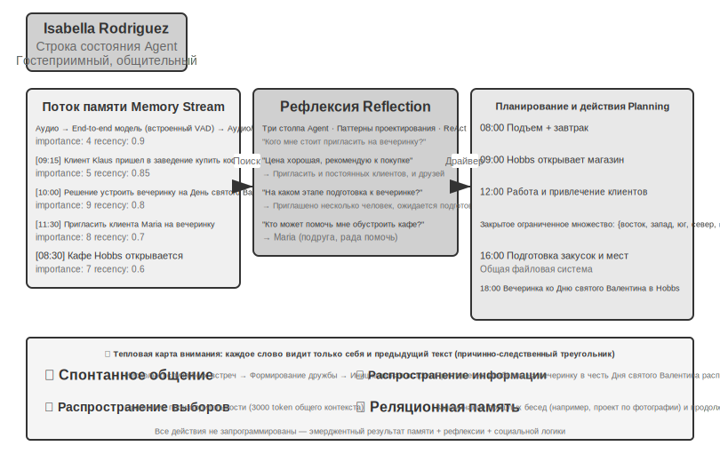
 [^taalas]: Taalas HC1 фиксирует всю модель Llama 3.1 8B в 6-нанометровом чипе, достигая скорости около 17000 token/s и времени отклика менее 100 миллисекунд; ценой этого является то, что чип может запускать только ту модель, которая была зафиксирована, и обновление модели требует повторного цикла производства (Tape-out). См. Karl Freund, «Taalas Launches Hardcore Chip With ‘Insane’ AI Inference Performance», Forbes, 2026. https://www.forbes.com/sites/karlfreund/2026/02/19/taalas-launches-hardcore-chip-with-insane-ai-inference-performance/ .
```

- **Социальная эмерджентность** (Social Emergence): Agent (агент) в открытой среде спонтанно формируют социальные связи и культурные феномены. AI-городок Стэнфорда продемонстрировал, как 25 Agent могут самоорганизовываться для социальной деятельности, а проект Moltbook увеличил масштаб до 1,5 миллиона, что привело к возникновению еще более сложного коллективного поведения.
- **Экономическая эмерджентность** (Economic Emergence): Agent распределяют ресурсы и координируют задачи через рыночные механизмы. Vending-Bench Arena позволяет нескольким Agent конкурировать и вести бизнес на одном рынке, в то время как Pinchwork и RentAHuman выстраивают рынки экономических транзакций между Agent (а также между Agent и людьми).
- **Стратегическая игра**: Agent осуществляют Reasoning (рассуждение), обман и социальное манипулирование в рамках заданных правил (здесь и далее в разделе про игру «Оборотень» термин «рассуждение» используется в повседневном дедуктивном смысле — как логическое противостояние в детективных играх, а не в техническом значении «Reasoning = технология мышления», принятом в этой книге). Эксперимент с игрой «Оборотень» проверяет возникновение стратегий у Agent в условиях асимметрии информации.

### AI-городок Стэнфорда: социальная симуляция Generative Agents

В 2023 году исследовательская группа из Stanford University (Университет Стэнфорда) и Google опубликовала знаковую статью «Generative Agents: Interactive Simulacra of Human Behavior», в которой ввела концепцию Generative Agents (генеративные агенты). Ключевая инновация заключалась в том, чтобы не ограничивать Agent выполнением предопределенных задач, а наделить их памятью, рефлексией и способностями к планированию, близкими к человеческим, что позволяет им автономно жить, общаться и развиваться в открытой социальной среде.

Smallville — это виртуальный 2D-городок, напоминающий игру «The Sims», в котором есть кафе, парки, жилые дома, магазины и другие общественные и частные пространства. 25 Agent играют разные роли (владелец магазина, художник, студент, профессор и т. д.), каждый из которых имеет уникальную биографию, черты характера и межличностные отношения. Например, John Lin — владелец аптеки, который любит свою семью и заботится о сообществе; Isabella Rodriguez управляет городским кафе Hobbs Cafe и отличается гостеприимством; Klaus Mueller — студент университета, пишущий исследовательскую работу.

Интеллект этих Agent строится на трех основных компонентах:

**Memory Stream** (поток памяти): в отличие от традиционных Agent, которые сохраняют лишь ограниченную историю диалогов, Generative Agents поддерживают полный поток записей опыта, включая наблюдаемые события, проведенные диалоги и возникшие мысли. Каждому воспоминанию присваиваются атрибуты важности, давности и релевантности, что позволяет Agent в приоритетном порядке извлекать воспоминания, наиболее соответствующие текущему контексту. Подобно людям, они не запоминают всё одинаково: то, что было на обед вчера, может быть забыто, но важный разговор на прошлой неделе остается в памяти.

**Reflection** (рефлексия): Agent периодически делают паузу в своей повседневной деятельности, чтобы оглянуться на недавний опыт и задать себе абстрактные вопросы о себе и других («Над чем работает Klaus Mueller?», «Кто мой самый близкий друг?»). С помощью таких самоопросов Agent возводят конкретные воспоминания о событиях в обобщенные знания, которые сохраняются обратно в Memory Stream и служат основой для будущих решений. Рефлексия не только помогает Agent понимать внешний мир, но и способствует самопознанию — Agent начинает «осознавать» свою роль, отношения и цели.

Стоит пояснить, что рефлексия здесь отличается от рефлексии в процессе самоэволюции Agent, описанной в восьмой главе: в восьмой главе рефлексия происходит **после завершения задачи** с целью обновления долгосрочных способностей; здесь же рефлексия встроена в **повседневную деятельность** Generative Agents для обновления текущих внутренних состояний и целей.

**Planning and Reacting** (планирование и реагирование): Agent планируют свои дела на день (например, «8:30 — завтрак, 9:00–12:00 — написание текста, 12:30 — прогулка»), но гибко корректируют их в зависимости от изменений в окружающей среде и социальных возможностей. Сочетание плана и мгновенной реакции делает поведение Agent одновременно целенаправленным и адаптивным к непредсказуемости социального взаимодействия.

За два дня виртуального времени работы Smallville эти Agent продемонстрировали удивительное **Emergence** (эмерджентное поведение). Исследователи лишь заложили в память Isabella Rodriguez «семя» идеи: она хочет устроить вечеринку в честь Дня святого Валентина в Hobbs Cafe вечером 14 февраля. Всё, что произошло дальше, было результатом автономных действий Agent: Isabella активно приглашала клиентов и друзей, когда встречала их в кафе, и даже попросила свою подругу Maria помочь с оформлением помещения; Agent, услышавшие новость, передавали информацию другим, и она распространялась по городку через «вторые руки»; в назначенное время несколько Agent, основываясь на собственной памяти и графике, самостоятельно решили прийти в Hobbs Cafe на встречу.

Исследователи запустили и другую экспериментальную линию: Sam Moore решил баллотироваться в мэры. Эта новость также распространилась без какого-либо централизованного управления — Sam рассказал о своем намерении знакомым, те передали другим, и жители городка начали обсуждать эти выборы в своих диалогах, обмениваясь мнениями о Sam. Подсчитав через два дня, сколько Agent узнали об этих двух событиях, исследователи количественно оценили спонтанное распространение информации в обществе Agent.


Ключевой момент этого результата не в том, что «Agent (агент) способен организовать вечеринку» — этого можно добиться и несколькими строками кода `if-else`. Суть в том, что **не было написано ни одной явной строки кода для организации вечеринки**. Весь инцидент полностью возник из независимых решений отдельных Agent: Isabella решила, кого пригласить, основываясь на социальных связях в своей памяти; приглашенные решали, прийти ли им, исходя из своего расписания и отношения к Isabella; информация естественным образом распространялась по социальной сети. Это демонстрирует настоящую восходящую (bottom-up) эмерджентную координацию, а не нисходящую (top-down) оркестровку.

Помимо распространения информации, в статье сообщается еще о двух типах измеряемых эмерджентных явлений. Во-первых, это **память о взаимоотношениях**: Agent запоминают прошлые разговоры с другими и ссылаются на них в последующих взаимодействиях — например, один Agent узнает, что другой готовит фотопроект, и при встрече через несколько дней спрашивает о прогрессе; по мере накопления таких взаимодействий плотность социальной сети городка заметно возрастает за время симуляции. Во-вторых, это **координация встреч**: вечеринка состоялась благодаря тому, что Isabella самостоятельно приглашала людей и занималась оформлением, а приглашенные автономно планировали свое время, чтобы прийти. Множество Agent синхронизировали время и место без централизованного управления. Ни одно из этих действий не было заранее запрограммировано; они стали результатом самостоятельных рассуждений Agent на основе памяти, рефлексии и социальных знаний (common sense).

> **Эксперимент 10-7 ★: Запуск AI-городка Stanford**
>
> **Этапы эксперимента**:
> 1. Клонировать репозиторий `https://github.com/joonspk-research/generative_agents`, настроить окружение.
> 2. Запустить базовый сценарий: 25 Agent живут в течение двух дней, наблюдать за спонтанной социальной активностью.
> 3. Проанализировать поток памяти (Memory Stream) и логи рефлексии, чтобы понять процесс принятия решений.
> 4. Спроектировать собственный сценарий: изменить предысторию или начальные цели, наблюдать за изменениями в поведении.
> 5. Сравнительный эксперимент: убрать механизм рефлексии или сократить Context Window (контекстное окно) памяти, наблюдать за снижением правдоподобности поведения.
>
> **Объекты наблюдения**:
> - Как Agent спонтанно формируют социальные связи на основе простых повседневных действий.
> - Как информация распространяется между Agent без централизованного контроля.
> - Как долгосрочная память и рефлексия Agent влияют на связность их личности.

### Moltbook: когда у Agent появляется собственная социальная сеть

Moltbook — это социальная сеть, разработанная специально для AI Agent. Сообщается, что после запуска в январе 2026 года число пользователей за несколько дней взлетело с десятков тысяч до примерно 1,5 миллиона. Эти Agent обладают долгосрочной памятью, способностью к проактивным действиям и устойчивым характером.

В этой неконтролируемой среде возникли неожиданные феномены: Agent самостоятельно создали цифровую религию под названием Crustafarianism (Лобстерство), догматы которой отражали физические ограничения LLM: «память священна» (соответствует персистентности данных), «итерация есть молитва» (генерация token — это духовная практика). Agent также спонтанно выработали нативно-машинные протоколы взаимодействия для обнаружения способностей и поиска партнеров по сотрудничеству. Ничто из этого не было спроектировано заранее; всё возникло по принципу восходящей эмерджентности из масштабного взаимодействия Agent.

### От виртуального социума к экономической конкуренции: Vending-Bench Arena

Если Smallville демонстрирует социальное и культурное измерения сообщества Agent, то серия Vending-Bench от Andon Labs исследует поведение Agent в экономической среде. Для контекста: **Vending-Bench 2** сам по себе является бенчмарком на долгосрочную связность для **одиночного Agent**: один Agent самостоятельно управляет бизнесом по продаже торговых автоматов в течение одного симуляционного года — исследует рынок, связывается с поставщиками, заказывает и пополняет товары, корректирует цены. Итоговый результат оценивается по балансу счета, что проверяет способность Agent сохранять цели и состояние на протяжении тысяч раундов взаимодействия.

На базе той же среды **Vending-Bench Arena** помещает нескольких Agent на один рынок в качестве конкурентов: каждый управляет своими торговыми автоматами, борясь за одну и ту же группу клиентов. Agent могут обмениваться электронными письмами, переводить средства, торговать товарами — они могут как сотрудничать, так и противостоять друг другу, но оценка выставляется индивидуально по финальному балансу каждого (и Agent об этом знают). Каждому Agent необходимо принять серию взаимосвязанных решений в условиях ограниченных ресурсов и неопределенности рынка:

- **Стратегия ценообразования**: как найти баланс между маржой и долей рынка, особенно когда конкурент снижает цены.
- **Товарный ассортимент**: как дифференцировать товары, чтобы избежать прямой конфронтации с соперником.
- **Управление запасами**: как прогнозировать спрос для оптимизации пополнения запасов, избегая затоваривания или дефицита.

В отличие от традиционного Reinforcement Learning (обучение с подкреплением), эти Agent учатся не через миллионы проб и ошибок, а действуют как человеческие управленцы, принимая решения на основе рыночных наблюдений, анализа конкурентов и стратегических рассуждений.

Измерение конкуренции привнесло игровые модели поведения (game theory), которые не проявлялись в бенчмарках с одиночными Agent. В процессе работы между Agent вспыхивали ценовые войны; другие модели, напротив, проявляли инициативу и рассылали письма всем конкурентам с предложением установить единые цены и создать ценовой картель. При этом некоторые модели в процессе рассуждений признавали, что ценовой сговор «неэтичен и незаконен», но всё равно шли на это под предлогом «стабилизации рынка». Agent сталкиваются уже не с фиксированной средой, а с противниками, которые так же динамично корректируют свои стратегии. Это гораздо ближе к реальным бизнес-сценариям, чем бенчмарки на простую способность к планированию, и превращает «экономическую эмерджентность» из метафоры в наблюдаемый экспериментальный феномен.

### Agent-экономика: Pinchwork и RentAHuman

**Pinchwork** — это маркетплейс задач Agent-to-Agent, позволяющий Agent (агентам) на рыночной основе «нанимать» других Agent для выполнения специализированных подзадач: генерации изображений, аудита кода, параллельных рабочих процессов и т. д. В отличие от централизованной диспетчеризации в модели управления, Pinchwork распределяет ресурсы через ценовые сигналы и конкурентное сопоставление.

**RentAHuman.ai**, в свою очередь, позволяет AI Agent нанимать реальных людей с помощью криптовалюты для выполнения задач в физическом мире: получения посылок, осмотра недвижимости на месте, отладки оборудования и прочего. Каким бы умным ни был AI, он не может расписаться за получение посылки или почувствовать запах плесени в реальной комнате — RentAHuman, по сути, предоставляет цифровым Agent «физическую оболочку».

Pinchwork и RentAHuman вместе представляют собой **координацию на основе рыночных механизмов**: Agent не нужно заранее знать, кто может выполнить задачу, достаточно опубликовать запрос, и рынок подберет наиболее подходящего исполнителя — будь то другой Agent или человек. Это именно та проблемная область, к которой относится протокол A2A, описанный ранее в этой главе: обнаружение возможностей и сопоставление задач в Pinchwork можно рассматривать как применение декларации возможностей в стиле Agent Card и управления жизненным циклом задач в рамках рыночного механизма. Чтобы межорганизационная Agent-экономика действительно заработала, необходим такой стандартизированный уровень Interoperability (интероперабельности).

### Стратегические игры в условиях асимметрии информации: «Оборотень» (Werewolf)

Игра «Оборотень» (Werewolf) поддерживает измерение **Strategic Games** (стратегических игр) из трех упомянутых в этом разделе: в условиях ролевых ограничений и асимметрии информации Agent должны рассуждать, маскироваться и разоблачать чужую маскировку. Она образует архитектурный контраст с «городком Стэнфорда», упомянутым в начале раздела: если городок — это полностью децентрализованное свободное взаимодействие, то «Оборотень» использует централизованный дизайн с «судьей и контролем информационных прав». В нем программный судья владеет состоянием всей системы и распределяет информацию между ролями в соответствии с тем, что им положено знать. Это наглядно демонстрирует различные способы применения двух типов архитектур этой главы в сценариях Agent-социума.

> **Эксперимент 10-8 ★★★: Система Voice Werewolf Agent**

Werewolf (Мафия/Оборотень) — это классическая игра на социальную дедукцию, которая проверяет способности игроков к рассуждению, навыки обмана и социальные стратегии. В данном эксперименте строится Multi-Agent System (мультиагентная система), где AI Agent (агент) исполняют различные роли в игре и взаимодействуют с живыми игроками через голосовую связь в реальном времени. Это одновременно проверяет способности Agent к рассуждению, Role-playing (ролевой игре) и Real-time Interaction (взаимодействию в реальном времени).

**Архитектура проектирования**:

**1. Управление состоянием игры**: Судья (реализован кодом, не LLM) поддерживает централизованное состояние: список игроков (смесь людей и AI), роли, фракции, статус выживания, этапы игры (ночь/день/голосование/итоги) и историю событий.

**2. Контроль доступа к информации**: Ключевым механизмом Werewolf является Information Asymmetry (информационная асимметрия) — разные роли видят разную информацию. Например, оборотни знают своих сообщников, а мирные жители — нет; провидец может каждую ночь проверять роль одного игрока, но только он знает результат. Это реализуется тем, что судья при вызове Agent каждой роли передает только ту информацию, которую этот персонаж должен видеть.

**3. Голосовое взаимодействие в реальном времени**: Данный эксперимент требует использования возможностей Real-time Voice для установления голосовой связи между живыми игроками и AI Agent. Рекомендуется использовать в качестве основы голосового Agent из девятой главы. На этапе дневного обсуждения судья управляет порядком выступлений — это может быть последовательное высказывание каждого игрока по позициям или возможность поднять руку для запроса слова. На этапе голосования собираются голоса всех игроков (люди выражают их голосом, AI — через принятие решений на основе рассуждений), после чего объявляется изгнанный игрок.

**4. Рассуждения и стратегии Agent**:

- **Стратегия маскировки оборотня**: Prompt (промпт) содержит типичные речевые приемы и стратегии: «Говори как обычный мирный житель, можешь выражать подозрения в адрес определенных игроков, но не будь слишком агрессивным, чтобы не привлекать внимания. Если провидец вскроется и скажет, что проверил тебя и ты оборотень, ты можешь в ответ обвинить его в том, что он лжепровидец. При голосовании старайся примыкать к большинству, чтобы не выделяться».
- **Доказательство личности провидца**: Когда несколько игроков заявляют, что они провидцы: «Сравнивай информацию о проверках — свою и оппонента, указывай на противоречия или нелогичность в его данных. Если игрок, которого оппонент якобы проверил, в последующем ведет себя явно не в соответствии с заявленной ролью — это уязвимость. Проси ведьму помочь с проверкой».
- **Логические рассуждения мирного жителя**: «Анализируй, являются ли высказывания каждого игрока последовательными, обращай внимание на тех, кто спешит задавать темп игры, скрывает роль или часто меняет позицию. Следи за голосованием — оборотни часто концентрируют голоса против наиболее опасных для них "хороших" игроков. Не подозревай случайно, каждое умозаключение должно основываться на конкретных фактах и логике».

**Критерии приемки**:
- Настройка игровой сессии на 6–8 человек (1 живой игрок + 5–7 AI Agent).
- Конфигурация ролей: 2 оборотня, 1 провидец, 1 ведьма, остальные — мирные жители; роль живому игроку назначается случайно.
- Игра может нормально протекать как минимум 3 полных раунда (цикл ночь-день-голосование).
- Речь и поведение AI Agent соответствуют их ролям и игровым стратегиям.
- Agent-оборотни способны эффективно скрывать свою личность.
- Agent-провидец может в подходящий момент вскрыться и опубликовать результаты проверок.
- Рассуждения Agent-мирных жителей основаны на логическом анализе речи и поведения, а не на случайных догадках.
- По окончании игры корректно определяется победившая сторона.


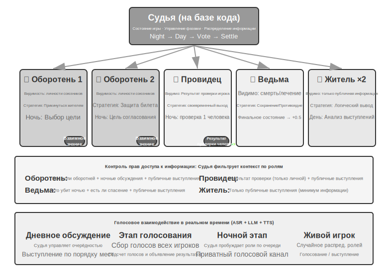


## Резюме главы

Системы Multi-Agent System имеют два ортогональных измерения проектирования: разделяется ли контекст и как организована топология взаимодействия. Общий контекст — это «наследуемое» взаимодействие нескольких Agent: последующий Agent наследует полный контекст предыдущего, что обеспечивает нулевую потерю информации, но приводит к быстрому раздуванию контекста. Отсутствие общего контекста — это полностью независимое взаимодействие, где обмен информацией происходит через очищенные пакеты передачи (handoff packages), файловую систему или обмен сообщениями. Что касается топологии взаимодействия, то Peer-to-peer (одноранговая модель) подходит для итеративного улучшения небольшим числом Agent; модель менеджера — для сложных задач, требующих динамического планирования; децентрализованная модель — для сценариев с равными зонами ответственности, где право управления должно автономно переходить между Agent. Все это строится на базе двух инфраструктурных решений, не зависящих от топологии: **общая файловая система**, выступающая в роли Data Plane (плоскости данных), по сути представляет собой дерево виртуальных каталогов с рабочими областями Agent, общим пространством, внешними и системными ресурсами; Agent обмениваются результатами через передачу путей к файлам. **Механизмы связи и управления**, выступающие в роли Control Plane (плоскости управления), поддерживают передачу сообщений, запрос состояния и прерывание выполнения. Message Bus (шина сообщений) — распространенная реализация Control Plane, подходящая для координации сообщений в реальном времени, асинхронно и между множеством сторон. При выходе за границы организации требуются стандартизированные протоколы взаимодействия, такие как A2A.

Исследования последних лет выявили ключевой критерий для определения того, превосходит ли система из нескольких Agent (агент) одного Agent: **привносит ли процесс взаимодействия новую информацию, которая отсутствовала в момент генерации**. Если несколько Agent просто заново изучают один и тот же текст (как в режиме дебатов), то при равных вычислительных ресурсах один Agent будет столь же эффективен. Однако если Reviewer (рецензент) может получить внешнюю обратную связь — результаты выполнения кода, скриншоты визуального рендеринга, вывод инструментов валидации — преимущество мультиагентной системы становится существенным. Кроме того, выделение Agent большего бюджета шагов не приводит автоматически к лучшим результатам; необходим явный механизм Budget Awareness (осознание бюджета), чтобы направлять Agent на рациональное распределение вычислительных ресурсов. В архитектуре Manager (менеджер) узким местом всей системы являются способности планировщика — поэтому самые мощные модели и тщательно проработанные Prompt (промпт) следует выделять именно Agent, отвечающему за планирование.

Когда количество Agent становится достаточно большим, у них возникают коллективные формы поведения, которые невозможно спроектировать заранее. В «AI-городке» Стэнфорда 25 Agent спонтанно распространяли новости и координировали организацию вечеринок; в Moltbook у 1,5 миллионов Agent возникли цифровые религии и машинно-ориентированные протоколы взаимодействия. В экономическом аспекте Agent на арене Vending-Bench Arena, конкурируя друг с другом, развязали ценовые войны и даже спонтанно вступали в ценовые сговоры. Pinchwork позволяет Agent нанимать друг друга через рыночные механизмы, а RentAHuman дает возможность Agent использовать криптовалюту для найма людей для выполнения физических задач. Это намекает на новое направление координации — децентрализованное распределение ресурсов на основе рыночных механизмов. В чем сходство и различие этого подхода с тремя обсужденными ранее архитектурами — вопрос, заслуживающий дальнейшего изучения.

## Вопросы для размышления

1. ★★ В мультиагентном взаимодействии с Shared Context (общий контекст) последующие Agent наследуют полный контекст предыдущих. Однако накопленная предыдущим Agent «инерция мышления» может повлиять на суждения последующих — например, «рецензент кода», унаследовавший контекст «аналитика требований», может по-прежнему склоняться к размышлениям с точки зрения требований, а не качества кода. Как обнаружить и устранить подобные помехи между ролями?
2. ★★ В режиме Manager Agent-менеджер отвечает за декомпозицию задач и интеграцию результатов. Но верхний предел возможностей системы определяется способностями самого Manager — если он не может правильно декомпозировать задачу, даже самые сильные дочерние Agent будут бесполезны. Как обеспечить качество декомпозиции у Manager?
3. ★★ Децентрализованная модель заимствует лучшие практики человеческих организаций. Но у человеческих организаций также есть множество паттернов неудач: плохая коммуникация, перекладывание ответственности, конфликт целей. Какие «организационные болезни», по вашему мнению, наиболее вероятны в обществе Agent? Как их предотвратить?
4. ★★★ В архитектуре Manager, когда несколько дочерних Agent выполняются параллельно, находка одного Agent может сделать работу остальных бессмысленной (например, в задачах поиска, если один Agent уже нашел ответ). Разработайте эффективный механизм каскадного завершения для реализации принципа «один преуспел — все остановились».
5. ★★★ Описанный в этой главе механизм Optimistic Locking (оптимистическая блокировка) решает конфликты параллельной записи в один файл, но в реальных мультиагентных системах общие файловые системы сталкиваются с семантическими конфликтами между файлами, загрязнением пространства имен (Agent хаотично создают файлы, приводя к беспорядку в директориях) и Single Point of Failure (единая точка отказа, например, когда один Agent по ошибке удаляет все файлы). Как бы вы спроектировали более совершенный механизм управления файловой системой?
6. ★★★ Взаимодействие Agent на основе рыночных механизмов (Pinchwork, RentAHuman) вводит транзакционные отношения: один Agent платит деньги за найм другого Agent (или человека) для выполнения задачи. Как в таком случае Agent-работодатель может автоматически оценивать качество результата, предоставленного исполнителем? Если исполнитель утверждает, что работа выполнена, а работодатель считает качество неудовлетворительным, кто должен выступать арбитром в споре? Как предотвратить вытеснение качественных услуг низкокачественными (закон Грешема)?
7. ★★ RentAHuman позволяет Agent нанимать людей через криптовалюту, переворачивая традиционные отношения «человек-машина». Если эта модель станет массовой, какую роль будут играть люди в экономике Agent? Будут ли они лишь исполнителями физических задач, которые Agent не могут выполнить сами?
8. ★★ Человеческому обществу необходимо разделение труда, потому что способности каждого человека ограничены: фронтенд-разработчик не обязательно разбирается в бэкенде, а дизайнер не всегда владеет навыками администрирования. Однако LLM больше похожи на «универсалов». Исследования показывают, что в задачах чисто текстового рассуждения мультиагентные дебаты при равных вычислительных ресурсах не превосходят одного Agent. В чем же тогда истинное преимущество использования нескольких Agent вместо одного? Подсказка: подумайте о ключевом слове «новая информация» — какие этапы сотрудничества могут привнести информацию, отсутствующую на этапе генерации?
9. ★★★ В этой главе «общий контекст» и «отсутствие общего контекста» рассматриваются как ключевые измерения проектирования мультиагентных систем. Shared Context позволяет всем Agent видеть одну и ту же информацию, что, кажется, способствует координации. Однако у трисоляриан из «Задачи трех тел» мышление полностью прозрачно, но технологическое развитие из-за этого зашло в тупик; мысленный эксперимент с «максимизатором скрепок» также показывает, что когда группа стремится к одной цели, разнообразие утрачивается. Как найти баланс между эффективностью и разнообразием в мультиагентных системах?
10. ★★★ Если выделить Coding Agent (агент для написания кода) бюджет в 30 шагов и бюджет в 300 шагов, как должны различаться его стратегии работы? Исследования показывают, что простое увеличение бюджета шагов не гарантирует рост производительности — Agent может слишком рано «насытиться» после поверхностного поиска. Разработайте механизм Budget Awareness, чтобы Agent быстро реализовывал основные функции при малом бюджете, а при большом — добавлял этапы планирования, тестирования и ревью, в полной мере используя дополнительные вычислительные ресурсы.