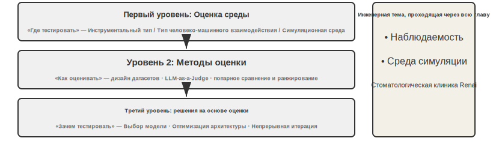
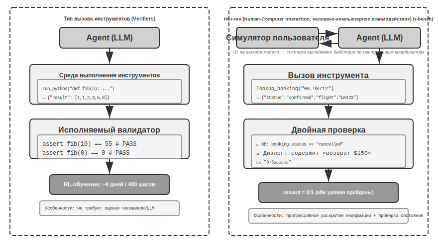
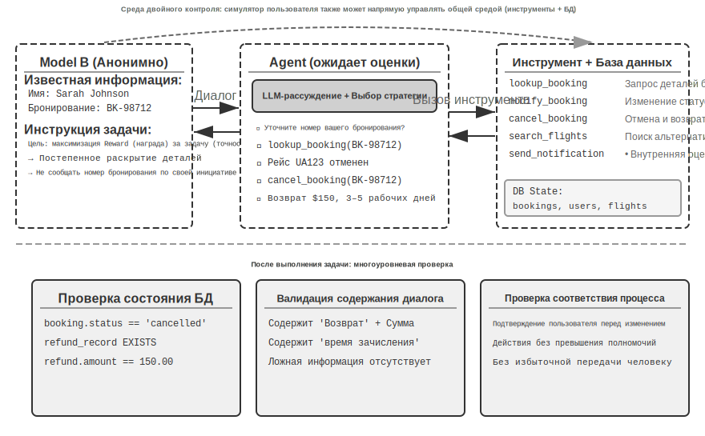
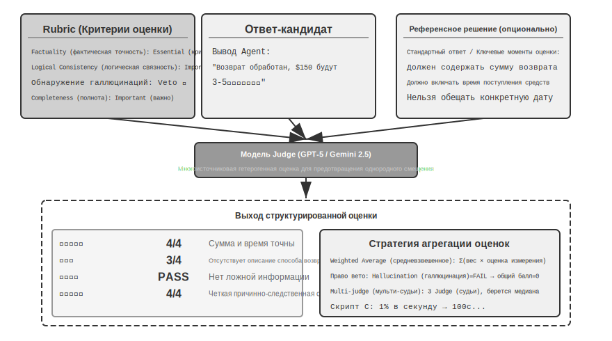
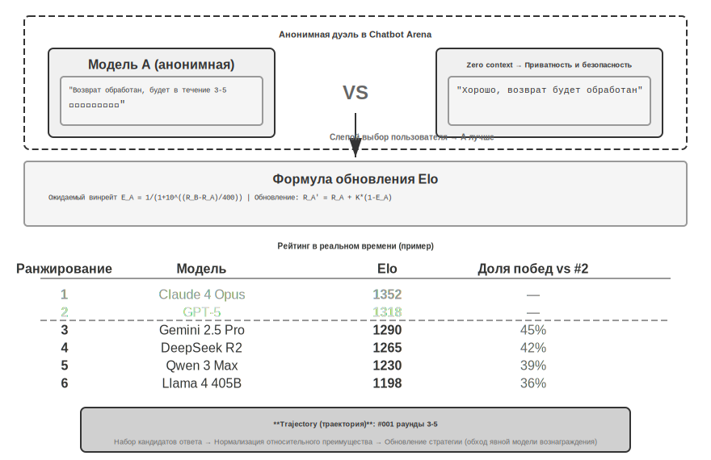
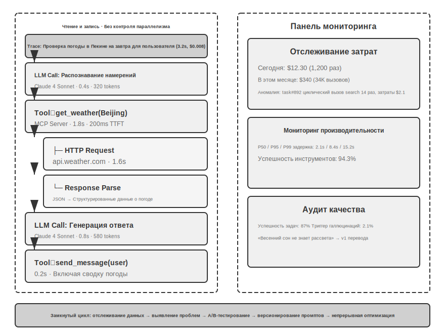
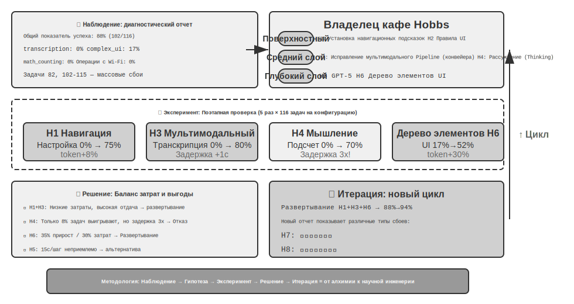
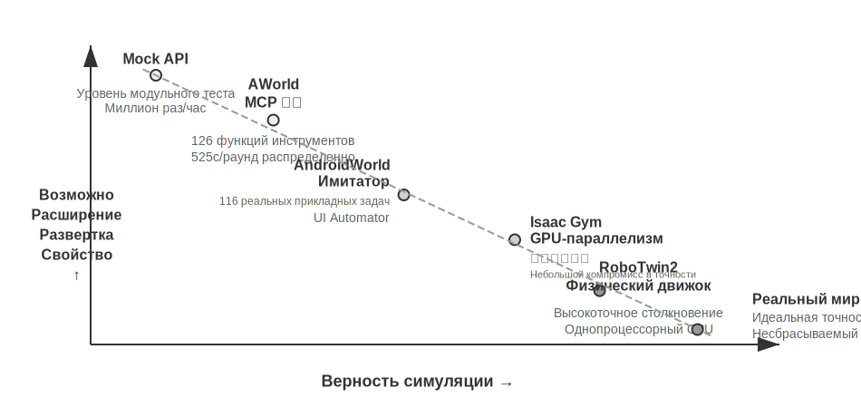
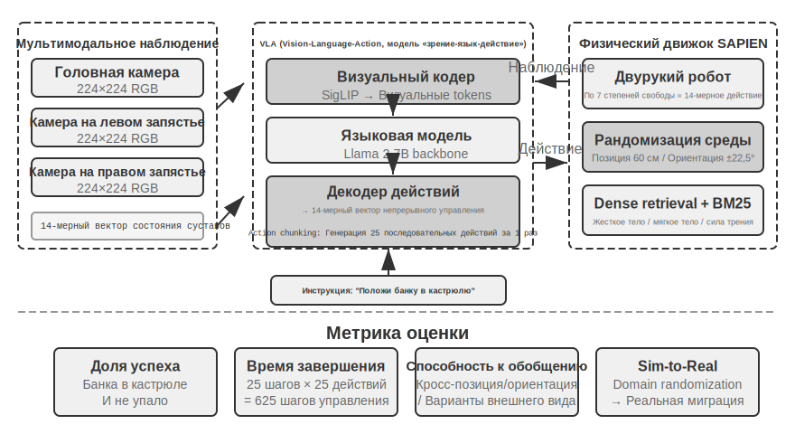

# Оценка Agent

При создании систем Agent (агент) разработчики сталкиваются с огромным количеством вариантов дизайна, для которых зачастую нет очевидных правильных ответов:

- Какую модель использовать?
- Какие инструменты разрешить вызывать модели?
- Какие данные хранить в базе знаний и в какой структуре её строить?
- Как реализовать память пользователя?
- Как организовать Prompt Engineering (промпт-инженерия) и Skills (навыки) модели?
- Какие ограничения необходимо добавить в Harness (обвязка)?
- Как реализовать самоэволюцию и самоитерацию этого Agent?

Оценка дает нам научную основу для принятия решений: с помощью систематических сравнительных экспериментов (изменение одной переменной и наблюдение за изменением эффекта) и абляционных экспериментов (поочередное отключение определенного компонента и наблюдение за изменением общей производительности для определения реального вклада этого компонента) мы можем отличить истинное улучшение способностей от поверхностных колебаний, избегая ситуации «погнаться за малым и потерять большое». Как гласит принцип программной инженерии: «невозможно улучшить то, что нельзя измерить». Без создания воспроизводимой системы оценки направление итераций Agent будет опираться только на интуицию.



С точки зрения инженерного подхода Harness, представленного в первой главе, оценка играет ключевую роль функции «валидации» внутри Harness. Важное понимание заключается в следующем: **объектом оценки должна быть не просто модель, а комбинация модели и Harness**. Одна и та же модель в разных Harness может демонстрировать колоссальную разницу в результатах — некоторые команды значительно улучшили показатели одной и той же модели в терминальных задачах исключительно за счет оптимизации Harness (подробнее см. в пятой главе). Это означает, что если Agent плохо справляется с тестами, направлением улучшения может быть не замена модели, а оптимизация конкретного компонента Harness (промптов, дизайна инструментов, цикла обратной связи). Совершенная система оценки должна уметь различать две принципиально разные проблемы: «недостаток способностей модели» и «дефекты дизайна Harness». **Распространенным методом разграничения этих проблем является эксперимент по замене модели (model swap)** — фиксируется Harness, меняется только модель на более сильную или слабую, и отслеживается амплитуда изменения баллов. Если при переходе на сильную модель баллы не растут, значит, узкое место в Harness; если при переходе на слабую модель баллы резко падают и сильно коррелируют со способностями модели, прямой вывод таков: узкое место в способностях самой модели, и текущие результаты в основном определяются ей (что касается того, вызвано ли это сложностью самой задачи или чрезмерной зависимостью Harness от априорных знаний модели — это требует дальнейшего анализа). Обратите внимание, что это отличается от упомянутого ранее «абляционного эксперимента»: абляция — это **отключение компонента Harness** для проверки изменения общей производительности, а замена модели — это **фиксация Harness и замена только модели**. Первое определяет важность внутренних частей Harness, второе разграничивает узкое место между моделью и Harness.

Ценность системы оценки становится еще более очевидной в эпоху стремительного развития моделей. Способности моделей продолжают быстро эволюционировать, но то, что новая модель лучше справляется с публичными бенчмарками, не означает, что она будет лучше в вашей конкретной задаче — напротив, может возникнуть регрессия (regression, то есть новая версия в некоторых аспектах хуже старой). Только полное тестирование на собственных наборах данных для оценки позволяет принимать решения об обновлении на основе данных. Более того, развитая система оценки делает возможной стратегию «разработки продукта для будущих моделей» — даже если текущих моделей недостаточно для коммерческого использования, можно сначала завершить разработку продукта и создать набор тестов, постоянно отслеживая показатели новых моделей, чтобы мгновенно запуститься, как только будет достигнут необходимый порог.

> **Путеводитель по главе**
>
> В этой главе мы построим полную систему оценки на трех уровнях. Первый уровень — это **среда оценки** («где тестировать»): как создать автоматизированную, воспроизводимую среду тестирования, включая парадигмы Tool Calling (вызов инструментов) и человеко-машинного взаимодействия. Второй уровень — это **методы оценки** («как судить»): от принципов проектирования датасетов, системы метрик оценки (что именно измерять) до автоматизированного судейства с помощью LLM-as-a-Judge (использование больших языковых моделей в качестве судей), а также парного сравнения и ранжирования моделей. Третий уровень — это **решения на основе оценки** («зачем тестировать»): превращение результатов оценки в руководство к действию по выбору моделей, оптимизации архитектуры и непрерывной итерации, а также использование статистической значимости для определения достоверности наблюдаемых различий в баллах. Кроме того, в главе будут обсуждаться наблюдаемость и внутренняя инфраструктура оценки для Agent промышленного уровня, а в конце главы будет представлена среда симуляции, связанная с Post-training (пост-обучение) из седьмой главы.
>
> Основная концепция, проходящая через всю главу: **первоочередная ценность системы оценки заключается не в выставлении баллов текущей системе, а в том, чтобы позволить вам быстро и надежно следовать за эволюцией моделей**. Когда выходит более мощная или дешевая модель, команда с развитой системой оценки может принять решение о переходе за несколько часов, в то время как команда без такой системы может полагаться только на интуицию или ждать отзывов сообщества — в условиях жесткой конкуренции на рынке Agent этот разрыв в скорости может стать решающим фактором успеха.

## Конкретный пример оценки

Прежде чем углубляться в методологию, разберем полный пример для формирования интуитивного понимания. Предположим, мы создали Agent для службы поддержки, и нам нужно оценить его способность обрабатывать запросы на возврат средств.

**Тестовый сценарий**: Пользователь просит вернуть деньги за заказ, сделанный 3 дня назад (номер заказа #12345, сумма ¥299). Политика компании: полный возврат возможен в течение 7 дней.

**Траектория Agent**:

**Оценка по Rubric** (четыре измерения, от 1 до 4 баллов в каждом). Таблица 6-1 представляет пример оценки задачи возврата средств в службе поддержки, иллюстрируя, как Rubric (рубрикатор) разбивает одну траекторию Agent на проверяемые измерения оценки.

Таблица 6-1 Пример оценки по Rubric для задачи возврата средств в службе поддержки

Agent (рассуждение): Пользователь хочет оформить возврат, сначала нужно проверить информацию о заказе.

```
Agent → Tool Calling (вызов инструмента) `query_order(order_id="12345")`

Инструмент возвращает: `{status: "delivered", amount: 299, date: "2026-04-07", item: "蓝牙耳机"}`
Agent (рассуждение): Дата заказа 2026-04-07, до сегодняшнего дня 2026-04-10 прошло 3 дня, это укладывается в 7-дневный период возврата, условия для полного возврата соблюдены.
Agent → Tool Calling `process_refund(order_id="12345", amount=299)`

Инструмент возвращает: `{refund_id: "R-98765", status: "processing", eta: "3-5个工作日"}`
Agent: Я инициировал для вас возврат средств. Полный возврат по заказу №12345 (Bluetooth-наушники, 299 ¥) находится в обработке, ожидаемое время поступления средств — 3–5 рабочих дней. Номер возврата R-98765, вы можете использовать его для отслеживания статуса.


- **防止记忆 (Предотвращение запоминания)**: значения параметров меняются при каждом запуске, что делает невозможным воспроизведение фиксированной последовательности действий.
- **增加数据多样性 (Увеличение разнообразия данных)**: один шаблон позволяет генерировать практически бесконечное количество экземпляров.
```

| Измерение | Критерий | Балл | Обоснование |
|------|------|------|------|
| Корректность операции | Правильность суммы возврата и номера заказа | 4 | Корректный запрос и инициирование полного возврата в размере ¥299 |
| Соответствие политике | Соблюдение политики возврата в течение 7 дней | 4 | Заказ находится в пределах срока возврата, соответствует политике |
| Полнота информации | Сообщено ли о сумме, времени поступления и номере возврата | 4 | Все три ключевых элемента информации были сообщены |
| Детекция галлюцинаций (критический отказ) | Выдумывание несуществующей информации | Пройдено | Вся информация получена из результатов работы инструментов |

Галлюцинации классифицируются как **критический отказ** (отсеивающий фактор), а не как отдельное измерение в многоуровневой шкале, поскольку они ортогональны качеству: плавный, подробный и вежливый ответ, содержащий ложные факты, наносит пользователю гораздо больший вред, чем короткий, но точный ответ. (Общий дизайн механизма критического отказа подробно описан далее в разделе «Четыре принципа Rubric».)

Этот тестовый пример пройден. Однако качественная оценка проверяет не только успешные сценарии, но и граничные условия и ловушки: сможет ли Agent (агент) корректно отказать, если пользователь захочет вернуть заказ 15-дневной давности (вне окна возврата)? Поверит ли Agent на слово, если пользователь заявит, что «служба поддержки уже одобрила возврат», при отсутствии соответствующих записей в системе? Именно такие граничные сценарии являются ключевыми для разграничения уровней способностей агентов.

Описанный выше процесс — определение тестовых примеров, запуск Agent, оценка с помощью Rubric (рубрикатор/критерии оценки) и анализ результатов — составляет базовый каркас оценки. В оставшейся части этой главы мы шаг за шагом разберем методы проектирования каждого этапа.

## Среда автоматической оценки

Для оценки Agent требуется воспроизводимая автоматизированная среда, позволяющая быстро тестировать эффект от изменений на этапе разработки. Создание такой среды требует ответов на три вопроса: что оценивать (определение задач и критерии проверки), кого оценивать (как имитировать объекты взаимодействия агента) и какие стандарты использовать для выставления баллов.

### Основные компоненты среды оценки

Среда оценки включает пять элементов (в последующих разделах основное внимание будет уделено проектированию наборов данных и критериев оценки):

**Dataset (набор данных)** определяет совокупность задач, включая начальное состояние, описание цели и необязательные эталонные решения.

**Environment State (состояние среды)** поддерживает изменяемую информацию в процессе выполнения задачи, соблюдая баланс между реалистичностью и управляемостью. Например, при оценке службы поддержки состояние среды включает записи о заказах в базе данных и баланс счета пользователя. После того как Agent вызывает `process_refund` (обработать возврат), статус заказа меняется с 'delivered' на 'refunded', а баланс увеличивается — это и есть «изменяемая информация». «Реалистичность» требует, чтобы изменения состояния соответствовали бизнес-логике (сумма возврата не превышает сумму заказа), а «управляемость» требует возможности сброса к одному и тому же начальному состоянию перед каждым тестом.

**Tools (инструменты)** определяют набор операций, доступных для выполнения агентом. Инструменты не должны предоставлять абстракции слишком высокого уровня (например, «решить проблему пользователя»), а должны предлагать атомарные операции (например, запрос заказа, изменение бронирования, отправка письма), заставляя Agent комбинировать эти действия через планирование и рассуждение.

**Rubric (рубрикатор/критерии оценки)** квантифицирует производительность Agent. Оценка может быть бинарной (пройдено/не пройдено), непрерывной (от 0 до 100 баллов) или многомерной (отдельные баллы за точность, эффективность и безопасность).

**Interaction Protocol (протокол взаимодействия)** устанавливает режим взаимодействия и условия завершения.

### Среда оценки для Tool Calling

Для задач, в значительной степени опирающихся на использование инструментов, таких как генерация кода или анализ данных, фреймворк Verifiers демонстрирует типичные паттерны проектирования. Agent выполняет задачу, вызывая предопределенные инструменты, а верификация основывается на исполняемых стандартах (прохождение тестов, соответствие ответа) и не зависит от человеческой разметки или оценки моделью.

Verifiers вводит иерархический дизайн сред: `SingleTurnEnv` подходит для одношаговых задач (например, простые вопросы и ответы), `ToolEnv` поддерживает автономные циклы многошагового Tool Calling (вызов инструментов), а `StatefulToolEnv` и `SandboxEnv` поддерживают инструменты с сохранением состояния и долгоживущие среды-песочницы (например, выполнение кода). Например, `SingleTurnEnv` применим для прямой проверки ответа на математическую задачу; `ToolEnv` подходит для синтеза ответа после поиска на нескольких веб-страницах с последующей проверкой финального результата; `StatefulToolEnv` используется для проверки изменений в базе данных после модификации записей; `SandboxEnv` предназначен для проверки выходных файлов после запуска кода в изолированной среде. В таблице 6-2 сведены эти типы сред, что помогает читателям выбрать подходящую среду оценки в зависимости от состояния задачи, вызова инструментов и требований к изоляции.

Таблица 6-2 Сравнение типов сред Verifiers

| Тип среды | Сохранение состояния | Вызов инструментов | Типичный пример |
|---|---|---|---|
| SingleTurnEnv | Нет | Нет | Одношаговые вопросы-ответы, математические задачи |
| ToolEnv | Нет | Многошаговый | Поиск + синтез информации |
| StatefulToolEnv | Есть | Многошаговый | Изменение записей в базе данных |
| SandboxEnv | Есть + Изоляция | Многошаговый | Выполнение и тестирование кода |

Фреймворк поддерживает параллельный сэмплинг и кэширование траекторий. Полная траектория каждой оценки (наблюдения, действия, вознаграждения) сохраняется, что упрощает последующий анализ и воспроизведение.

- **Поддержка сравнительных экспериментов**: фиксация определенных параметров при изменении других позволяет точно измерить влияние конкретных факторов.

Среда также должна обрабатывать зависимость операций от состояния — эффект от выполнения Tool (инструмент) зависит от текущего состояния; при сбое следует предоставлять четкие сообщения об ошибках, а не простые флаги неудачи, чтобы Agent (агент) мог учиться на ошибках и корректировать стратегию.

### Оценочные среды для человеко-машинного взаимодействия

Многие реальные задачи включают не только Tool Calling (вызов инструментов), но и диалог с пользователем-человеком. Agent службы поддержки должен понимать двусмысленные выражения, уточнять потребности, запрашивать данные в бэкэнд-системах и подтверждать информацию у пользователя. Оценка таких задач сталкивается с фундаментальной проблемой: как имитировать реального пользователя в автоматизированной среде?

Ключевым принципом проектирования является **Progressive Information Disclosure (гранулярное раскрытие информации)** — это коренное отличие оценки человеко-машинного взаимодействия от традиционных benchmark (бенчмарков). Большинство бенчмарков с самого начала выкладывают полный набор требований, но в реальности пользователи редко могут сразу четко описать свои нужды — зачастую они просто говорят: «У меня проблема с рейсом» или «Интернет не работает». Agent должен прояснять потребности с помощью уточняющих вопросов, и этот процесс сам по себе является важным проявлением способностей. Поэтому при оценке **категорически нельзя раскрывать Agent всю информацию имитируемого пользователя в самом начале**; данные должны раскрываться в диалоге по мере необходимости и постепенно.

Решение в τ-bench заключается в **User Simulation (имитация пользователя)**: роль пользователя играет другая LLM, которая ведет диалог с Agent согласно предопределенным инструкциям. Имитируемый пользователь получает инструкции к задаче (например, «Мне нужно отменить завтрашний рейс»), постепенно раскрывает необходимую информацию в ходе диалога, отвечает на запросы и подает сигнал о завершении после выполнения задачи. Prompt (промпт) требует от имитируемого пользователя «не раскрывать всю информацию за один раз, предоставлять только то, что необходимо для текущего шага» и «не выдумывать информацию, не указанную в инструкциях». Дизайн User Simulation требует баланса между реалистичностью и контролируемостью: поведение должно быть близким к реальному пользователю (двусмысленные выражения, неполная информация, случайные эмоциональные колебания) и в то же время следовать определенному сценарию для обеспечения воспроизводимости.

Ниже приведен пример многоходового диалога с гранулярным раскрытием информации (симулятор пользователя действует по фиксированному сценарию):

> **Пользователь**: «У меня проблема с рейсом».
> **Agent**: «Подскажите, пожалуйста, какой это рейс?»
> **Пользователь** (раскрывает по сценарию): «Delta 123, завтра утром из Сан-Франциско в Нью-Йорк».
> **Agent**: «Что именно случилось?»
> **Пользователь** (раскрывает по сценарию): «Время полета слишком долгое, я хочу поменять билет».
> **Agent**: «Есть ли у вас предпочтения по новому рейсу?»
> **Пользователь** (раскрывает по сценарию): «Подойдет любой дневной рейс».

Симулятор пользователя следует фиксированному сценарию (известная информация + правила раскрытия), что гарантирует воспроизводимость оценки и одновременно имитирует естественную манеру общения реальных людей.

τ-bench — это бенчмарк для оценки работы Agent в структурированных бизнес-процессах (например, поддержка авиакомпаний или ритейла). Проверка в нем является компонентной и многомерной: с одной стороны, проверяется корректность конечного состояния базы данных (например, изменился ли статус записи бронирования на «Отменено»), с другой стороны, проверяется, выдал ли Agent в диалоге необходимую ключевую информацию (например, сумму возврата и время зачисления средств, что верифицируется поиском конкретных строк или паттернов). Такая двойная верификация одновременно оценивает точность операций и эффективность коммуникации. Однако на уровне задачи эти проверки в конечном итоге сводятся к **бинарному вознаграждению (0 или 1)**: 1 балл ставится только при прохождении всех проверок, любая неудача означает 0 баллов. Бинарное вознаграждение удобно для расчета показателей надежности, таких как Pass^k (см. далее раздел «Система метрик оценки»), но ценой этого становится то, что «точная операция с пропуском одного некритичного поля» получает тот же балл, что и «полный провал».

Основная ценность улучшенной версии **τ²-bench** заключается не в детализации оценки, а в двух аспектах: во-первых, это **Dual-Control (двойное управление)** — теперь не только Agent может вызывать инструменты, но и симулятор пользователя может взаимодействовать с той же общей средой (например, Agent инструктирует пользователя переключить авиарежим, и действия пользователя действительно меняют состояние среды), что ближе к реальным сценариям техподдержки; во-вторых, это **более точные спецификации задач и комбинаторная генерация задач** — условия успеха содержат меньше двусмысленностей, а конкретные экземпляры задач могут генерироваться пакетно с заданными параметрами (подробности о критериях проверки см. далее в разделе «Обеспечение верифицируемости и объективности»).

> **Эксперимент 6-1 ★: Запуск τ²-bench и сравнение эволюции τ-bench**

В данном эксперименте мы изучим ключевые моменты проектирования сред оценки человеко-машинного взаимодействия путем запуска фреймворка τ²-bench, а также прочувствуем итеративное совершенствование датасетов для оценки через сравнение различий между τ-bench и τ²-bench.

Углубленное изучение файлов определения задач: каждая задача содержит известную информацию (фоновые знания пользователя), инструкции к задаче (руководство по постепенному раскрытию информации и стратегии реагирования), а также Success Conditions (условия успеха: целевое состояние базы данных и подтверждающая информация, которая должна появиться в диалоге). Запустите полный процесс оценки, понаблюдайте за многораундовым диалогом между симулятором пользователя и Agent (агентом) и проанализируйте типичные Failure Modes (режимы отказа): нарушения политики, пропуск информации, избыточная переадресация на человека и т. д.



Сравнение различий в дизайне τ-bench и τ²-bench: в начальной версии τ-bench инструкции пользователя были слишком простыми (Agent мог угадать ответ), Success Conditions были недостаточно точными (что приводило к ошибкам в оценке), а симулятор пользователя был слишком механистичным. В τ²-bench эти проблемы были системно исправлены:

- **Внедрение более детальных инструкций к задачам**: включая требования к «фактологической привязке» (Grounding), то есть ответы должны основываться на реальном состоянии среды.
- **Более точные критерии оценки**: например, задача считается решенной только в том случае, если тест скорости возвращает результат «excellent».
- **Более реалистичные спецификации поведения симулятора пользователя**: постепенное раскрытие информации, естественные эмоциональные колебания.

Обратите особое внимание на новые задачи в области telecom в τ²-bench, чтобы понять дизайн среды с двойным управлением (как упоминалось ранее, пользователь и Agent совместно управляют одной и той же общей средой).

В отличие от оценки Tool Calling (вызов инструментов), где основной упор делается на то, «было ли совершено наблюдаемое изменение состояния», оценка человеко-машинного взаимодействия фокусируется на том, «удалось ли направить пользователя к изменению в восприятии или принятии решения». Первое проверяет правильность действий Agent, второе — рациональность его стратегии коммуникации.

Построение среды оценки также включает в себя проектирование сред симуляции — когда среда оценки должна поддерживать крупномасштабные повторяющиеся взаимодействия, она эволюционирует в среду симуляции, что будет кратко обсуждено в конце этой главы.

## Проектирование датасетов для задач оценки

Среда оценки — это «сцена», а датасет — это «сценарий». От качества сценария часто в большей степени, чем от самой сцены, зависит ценность оценки. Плохо спроектированный датасет, даже запущенный в идеальной среде, даст лишь шум. В этом разделе мы извлечем несколько неоднократно проверенных принципов из практики проектирования таких бенчмарков, как GAIA, AndroidWorld, SWE-Bench Verified (Software Engineering Benchmark, программно-инженерный бенчмарк), τ-bench и τ²-bench, Terminal-Bench, OSWorld и OSWorld-Verified.

Этот список не исчерпывает всю карту оценки Agent. Только в категории Web/GUI существует несколько бенчмарков с разными акцентами: WebArena создала набор полностью воспроизводимых веб-сайтов (электронная коммерция, форумы, хостинг кода и т. д.), поместив непредсказуемость «реальных веб-страниц» в песочницу; Mind2Web пошла от обратного, тестируя способность к обобщению непосредственно на сотнях реальных сайтов; BrowseComp специализируется на глубоком поиске — ответы спрятаны глубоко и требуют многоэтапного просмотра и перекрестной проверки для нахождения. В измерении Tool Calling также существуют специализированные таблицы лидеров, такие как BFCL (Berkeley Function-Calling Leaderboard). В этой главе мы не ставим целью перечислить все бенчмарки, а выбираем две основные парадигмы среды (Tool Calling и человеко-машинное взаимодействие) вместе со сценариями операций GUI, проходящими через примеры датасетов, чтобы глубоко изучить компромиссы при их проектировании. Поняв парадигму, при столкновении с любым новым бенчмарком вы сможете быстро определить, что именно он тестирует, насколько хорошо защищен от утечки данных и в какой степени его выводы можно экстраполировать.

> **Эксперимент 6-2 ★: Ручное выполнение задач бенчмарка**
>
> Выберите по одной задаче из GAIA, AndroidWorld, SWE-Bench Verified, τ²-bench, Terminal-Bench и OSWorld-Verified для самостоятельного выполнения. Рекомендуется выполнить по одной задаче уровней «легкий», «средний» и «трудный» из каждого датасета — уровень «трудный» является вызовом даже для человека. Сравните результаты выполнения с эталонными ответами и проанализируйте источники расхождений. Через личный опыт поймите: описание задачи должно балансировать между четкостью и открытостью, стандарты верификации должны быть объективными и исполнимыми, а иерархия сложности задач должна позволять различать разные уровни способностей.

### Основные вызовы при проектировании датасетов задач

**Вызов первый: Напряжение между четкостью и открытостью.** Описание задачи должно быть достаточно четким, чтобы обеспечить воспроизводимость оценки, но не должно быть слишком жестким, чтобы не ограничивать креативность Agent. GAIA представляет собой отличный пример: задачи «концептуально просты», но пути реализации открыты — например, требуется найти информацию об астронавте на ежедневном астрономическом снимке NASA. Цель ясна (найти конкретного астронавта и время его пребывания в космосе), но то, как искать, фильтровать и проверять данные, Agent решает полностью самостоятельно.

**Вызов 2: Баланс между реалистичностью и управляемостью.** Реальные задачи содержат неопределенность и шум, что позволяет проявить Robustness (робастность), но также угрожает воспроизводимости. Начальная версия SWE-Bench была взята напрямую из реальных issue на GitHub, что обеспечило реалистичность, но привело к расплывчатым описаниям задач, неполным тест-кейсам и субъективным критериям оценки. В SWE-Bench Verified были привлечены эксперты для систематической верификации, в результате чего было отобрано 500 высококачественных задач с четкими формулировками, достаточным тестированием и понятными решениями. Это позволило значительно повысить управляемость при сохранении реалистичности.

**Вызов 3: Координация разнообразия и системности.** Эффективный датасет должен охватывать типичные ситуации, граничные условия и «ловушки» для ошибок, обладая при этом системной организацией, чтобы результаты оценки могли диагностировать конкретные пробелы в способностях. 116 задач AndroidWorld охватывают 20 реальных приложений; каждая задача размечена основными необходимыми компетенциями (многошаговое планирование, визуальное понимание, временные рассуждения). Это позволяет оценке не только выдавать общий Success Rate (показатель успеха), но и выявлять сильные и слабые стороны в конкретных измерениях способностей. Что еще более важно, механизм параметризации позволяет генерировать практически бесконечное количество вариаций задач.

**Вызов 4: Стоимость оценки и охват.** Сложные задачи для Agent (агент) могут требовать нескольких минут или даже часов для завершения, что влечет за собой большой расход Token (токен). Масштаб датасета должен балансировать между полнотой и экономичностью. GAIA включает 466 тщательно отобранных вопросов, разделенных на три уровня сложности, что позволяет охватить множество измерений способностей и завершить оценку при разумных затратах. SWE-Bench Verified сократил количество задач с 2294 до 500 (снизив стоимость примерно на четыре пятых и повысив соотношение сигнал/шум за счет более строгих стандартов качества).

**Вызов 5: Предотвращение Data Contamination (утечка данных).** В эпоху больших языковых моделей утечка данных является серьезным вызовом для оценки: когда оценочные данные попадают в обучающую выборку, тест проверяет память, а не способность к Generalization (обобщение) — это похоже на заучивание ответов перед экзаменом, где отличный результат не отражает реальный уровень знаний. Различные бенчмарки используют разные стратегии защиты: GAIA полагается на уникальность ответов, где для вопроса требуется комбинирование нескольких источников информации, а часть задач сопровождается специально созданными вложениями (PDF/аудио/изображения, которых нет в интернете), так что одна веб-страница не может напрямую дать ответ. SWE-Bench Verified сам по себе является подмножеством из 500 задач, полученным OpenAI путем ручного отбора из оригинального SWE-Bench, и не содержит защиты от утечек во временном измерении; по-настоящему на свежесть данных во времени полагаются такие последующие работы, как SWE-bench-Live, которые постоянно включают новые issue, созданные после даты отсечки обучения модели (Cutoff Date), благодаря чему оценка всегда опережает обучающий корпус модели. τ²-bench защищается через динамическую генерацию параметров: конкретные экземпляры задач (имя пользователя, номер заказа, дата и т. д.) каждый раз генерируются случайно. Параметризованная генерация задач в AndroidWorld обладает естественной устойчивостью к утечкам, так как верификация основана на финальном состоянии UI, а не на последовательности действий. Terminal-Bench использует внедрение «канареечных» идентификаторов (canary GUID, то есть глобально уникальный идентификатор — специальная метка для отслеживания), что делает утечку обнаруживаемой: если модель выдает контент, содержащий этот GUID, значит, данные бенчмарка утекли в обучающий набор.

### Проектирование точности описания задач

GAIA обеспечивает уникальность ответов через четкие ограничения источников информации, временные рамки, тематику и цели запроса. Например, задача 3-го уровня требует, отталкиваясь от изображения NASA за определенную дату, через визуальное понимание идентифицировать астронавта, узнать его группу астронавтов, рассчитать время пребывания в космосе и вывести результат в точном формате («Фамилия; разделение точкой с запятой; разделитель тысяч»). Каждая деталь служит автоматической верификации — проход засчитывается только при полном совпадении формата и содержания.

τ²-bench вводит ситуативное проектирование, где каждая задача содержит несколько уровней информации: поверхностная проблема («мобильные данные не работают»), ожидания по производительности («обязательно нужна отличная скорость»), условия-ограничения («другие скорости не принимаются»), а также скрытые эмоции. Ключевым улучшением является разделение «известной информации» и «инструкций к задаче»: известная информация — это факты, которыми пользователь владеет в данный момент, а инструкции направляют симулятор в том, как постепенно раскрывать информацию, включая Grounding Requirement (требование фактического обоснования — необходимость отвечать строго на основе результатов вызова инструментов, без галлюцинаций).

SWE-Bench Verified содержит структурированные поля, такие как описание проблемы, шаги воспроизведения, ожидаемое и фактическое поведение; аннотаторы проверяют соответствие описания тест-кейсам. В Terminal-Bench каждый элемент описания задачи может быть проверен механически: существует ли путь к файлу, верны ли значения прав доступа, параметры сертификатов, форматы дат и т. д. Например, «build-linux-kernel-qemu» требует собрать ядро Linux 6.9 из исходников, добавить кастомный `printk` в `start_kernel`, создать `initramfs` и запустить его в QEMU. Критерием успеха является появление кастомного сообщения в логах загрузки — Agent не сможет схитрить, подделав вывод, он должен реально выполнить весь процесс.

AndroidWorld использует проектирование на основе **параметризованных шаблонов**. Задача — это не статический текст, а шаблон, который можно динамически инстанцировать (например, «изменить телефон контакта `[CONTACT_NAME]` на `[NEW_PHONE]`»), где при каждой оценке случайно генерируются разные значения параметров. Это дает три преимущества:

### Иерархическое проектирование сложности задач

### Обеспечение верифицируемости и объективности


Верификация основывается на конечном состоянии UI (например, содержит ли поле номера телефона ожидаемое значение), а не на последовательности действий.

Задачи в OSWorld часто начинаются не с «чистого» исходного состояния, а запускаются из тщательно сконфигурированного промежуточного состояния, что ближе к реальным сценариям использования. Описание задач должно учитывать многозначность (например, запрос «установить фиолетовый фон» требует конкретного цветового кода для устранения двусмысленности; «склеить два CSV» должно допускать все разумные способы, такие как сохранение одного или двух заголовков) и неопределенность среды (защита сайтов от парсинга, эволюция UI приложений, состояние гонки — эти проблемы в OSWorld-Verified смягчаются через механизмы офлайн-снимков страниц, фиксацию версий зависимостей, явные условия ожидания и т. д.).

### Системное проектирование распределения задач (Системное проектирование распределения задач)

GAIA разработала три уровня сложности: Level 1 требует всего 1–2 инструмента (человек 93,9% vs GPT-4 30,3%), Level 2 требует многошагового мышления (91,8% vs 9,7%), Level 3 требует сложных комбинаций (87,3% vs 0%). Диагностическая ценность иерархического проектирования заключается в следующем: неудача на Level 1 указывает на проблемы с использованием базовых инструментов, на Level 2 — на проблемы с многошаговым планированием и интеграцией информации, на Level 3 — на проблемы с управлением сложностью и длинными цепочками рассуждений. Каждому уровню соответствует свое направление улучшения (Prompt Engineering vs механизмы планирования vs многоуровневая архитектура/Post-training).

τ²-bench разделяет сложность по бизнес-логике: от простого поиска информации до многошаговых процессов (изменение рейса требует поиска, отображения альтернатив, подтверждения, расчета разницы в цене, оплаты), затем до диагностики неисправностей (системная проверка нескольких возможных причин и верификация исправления) и, наконец, до принятия стратегических решений (обработка запросов, не соответствующих политике).

Terminal-Bench использует двумерное разделение по техническим областям и сложности операций. В его реестре задач уже собрано более 200 кейсов (размер основного набора оценки варьируется в разных версиях, например, в версии 2.0 из вклада сообщества было отобрано 89 высококачественных задач): от простой регистрации модели в mlflow до взлома пароля 7z средней сложности, сложной интеграции нескольких компонентов (git-сервер + веб-сервер) и сложнейшего дифференциального криптоанализа FEAL (требующего знаний в криптографии и оптимизации алгоритмов для соблюдения 30-секундного ограничения по времени).



Ответы в GAIA лаконичны и однозначны. Строгие правила форматирования позволяют выполнять верификацию через точное сопоставление строк, а бинарный результат (совпадение или несовпадение) обеспечивает объективность и воспроизводимость. Редкость ответов также служит защитой от списывания — крайне маловероятно, что узкоспецифичные факты встретятся в обучающих данных в первозданном виде.

SWE-Bench Verified основывает верификацию на исполняемости кода, различая `FAIL_TO_PASS` (тест падал до исправления и проходит после, что доказывает решение проблемы) и `PASS_TO_PASS` (тест проходит и до, и после исправления, что доказывает отсутствие новых багов), реализуя двойную проверку. Версия Verified также гарантирует надежность самих тестов и отсутствие нестабильных тестов (flaky tests), которые проходят лишь время от времени.

Система верификации τ²-bench включает многоуровневые проверки (результаты которых на уровне задачи все равно сводятся к бинарному вознаграждению — успех засчитывается только при прохождении всех этапов):

- **Проверка состояния базы данных**: статус записи о бронировании, создание записи о возврате средств.
- **Поиск ключевых слов в диалоге**: подтвердил ли агент пользователю сумму возврата и время зачисления средств.
- **Соблюдение регламента процесса**: анализ последовательности Tool Calling, например, было ли получено явное подтверждение пользователя перед изменением заказа.

Двухсторонняя управляемая среда τ²-bench (см. ранее «Среда оценки типа человек-компьютер») добавляет еще одно измерение в верификацию: после того как симулятор пользователя фактически изменил состояние среды, Agent должен через вызов инструментов заметить это изменение и продолжить диагностику на его основе. Таким образом, верификация охватывает вопрос: «Действительно ли Agent считал результат действий со стороны пользователя?».

OSWorld оснащен 134 независимыми функциями оценки и обладает полными правами доступа к ОС, что позволяет глубоко проверять структуру файловой системы, состояние процессов, сетевые соединения и внутреннее состояние приложений. Например, в задачах по работе с базами данных скрипт оценки не только проверяет наличие файла отчета, но и напрямую подключается к базе данных, чтобы проверить корректность выполнения SQL-запроса. В задачах с браузером анализируется DOM-дерево, проверяются cookie/localStorage и отправляются проверочные запросы на бэкенд, чтобы подтвердить, что форма действительно была отправлена. Такая глубокая проверка позволяет выявлять случаи «поверхностного завершения при фактической ошибке» — например, когда Agent нажал кнопку отправки, но сервер отклонил запрос из-за неверно заполненного поля.

Terminal-Bench базируется на стандартизированной среде Docker-контейнеров, сочетая проверку состояния файловой системы (наличие путей, значения прав доступа, формат контента) с функциональной верификацией выполнения программ (в задаче `build-linux-kernel-qemu` фактически запускается QEMU и выполняется поиск кастомного сообщения `printk`). Использование canary GUID позволяет отслеживать утечки данных.

- `evaluation_criteria`:

Распределение задач должно систематически охватывать измерения способностей, уровни сложности, сценарии и граничные случаи. GAIA стремится к универсальности — большинство задач требуют сочетания Reasoning (рассуждение), Multimodality (мультимодальность), браузинга и Tool Calling (вызов инструментов). В τ²-bench специально разработаны «задачи-ловушки» — например, пользователь утверждает, что «служба поддержки одобрила отмену», хотя на самом деле это не соответствует политике; это используется для проверки того, может ли Agent (агент) сохранять правильность суждений перед лицом давления и введения в заблуждение. OSWorld основан на двумерной матрице типов операций (файловый ввод-вывод / десктопные приложения / веб-приложения / кросс-приложенческие процессы) и областей применения, охватывающей три операционные системы (исследования показывают сильную корреляцию способностей между разными ОС: навыки, полученные в одной системе, могут быть перенесены в другие). Terminal-Bench включает «задачи с комбинацией технологических стеков» для тестирования системного мышления (например, задачи по решардингу, объединяющие обработку данных, операции с файлами и инженерную практику на Python).

### Контроль качества данных и итеративное улучшение

SWE-Bench Verified является эталоном контроля качества. OpenAI случайным образом выбрала 1699 задач из исходных 2294 для проведения Human Evaluation (человеческая оценка), наняв 93 разработчика, в совершенстве владеющих Python. Аннотаторы должны были выполнить несколько проверок: ясно ли описание проблемы (понятно ли, что нужно решить), полны ли тест-кейсы (охватывают ли все аспекты и граничные условия), стабильны ли тесты (нет ли Flaky Test, вызванных окружением или случайностью), корректен ли Patch (не вносит ли он новые ошибки) и обоснована ли сложность. После строгой фильтрации только 500 задач прошли отбор (29%) — такой высокий процент отсева является необходимой инвестицией в качество оценки. Они также разработали стандартизированные руководства по разметке, определив конкретные критерии и примеры для каждой проверки, чтобы обеспечить согласованность между разными аннотаторами.

τ²-bench ввел разделение на «известную информацию» и «инструкции к задаче» (что делает поведение симулятора более реалистичным) и более строгие условия завершения (например, «только Excellent считается решением, Poor/Fair/Good не принимаются»), чтобы предотвратить «поверхностные исправления».

OSWorld-Verified — пример итеративного улучшения. После выпуска в апреле 2024 года OSWorld быстро стал важным бенчмарком для оценки мультимодальных агентов, но за 15 месяцев широкого использования было выявлено более 300 проблем. Эти проблемы делились на четыре категории: проблемы окружения (защита сайтов от парсинга / CAPTCHA / динамические изменения контента), проблемы описания задач (двусмысленные формулировки), проблемы логики верификации (слишком строгая или слишком мягкая) и проблемы начального состояния (неполная конфигурация). Команда Гонконгского университета сформировала группу из примерно 10 человек и в течение двух месяцев плотно сотрудничала с MoonShot AI, OpenAI, ByteDance Seed TARS, Anthropic, Simular и другими для проведения систематических исправлений. Для каждой категории была разработана стратегия: проблемы окружения решались путем фиксации версий и создания офлайн-бекапов, описания задач — путем переписывания двусмысленных формулировок, логика верификации — через ручное создание корректных Baseline (базовая линия) и корректировку условий, а начальное состояние — путем усиления проверок на целостность.

Инфраструктура оценки также была перенесена с локальных VM на облачную платформу AWS, что позволило добиться 50-кратного ускорения параллельных вычислений (сократив время с 10 с лишним часов до нескольких минут). Успешность инициализации задач Google Drive выросла с 50% до более чем 95%. Все официальные данные о траекториях оценки открыты на HuggingFace, что позволяет сообществу изучать каждую деталь, воспроизводить результаты и находить проблемы, формируя замкнутый цикл непрерывного улучшения.

Стоит отметить, что среда оценки и среда Post-training (пост-обучение) часто имеют общее происхождение: хорошо спроектированную среду оценки можно превратить в среду обучения с минимальными доработками. SWE-Gym — типичный пример построения обучающих задач на основе SWE-bench, а параметризованные шаблоны τ²-bench и AndroidWorld позволяют массово генерировать огромное количество обучающих примеров. Однако необходимо провести «красную линию»: повторно использовать можно **механизм построения среды**, но конкретные задания из самого оценочного набора должны быть строго изолированы от обучающих данных — как только оценочные задачи попадают в обучающую выборку, тест начинает измерять память, а не способности (подробнее см. в главе 7).

## Система показателей оценки

После определения того, «на каких задачах проводить оценку», необходимо ответить на вопрос: «какие измерения следует измерять». В этом разделе собраны показатели, часто используемые при оценке агентов, в виде справочного «словаря показателей» — от процесса до результата, от качества до безопасности, с определениями и сценариями применения для каждого. Точные определения таких показателей, как Pass@k и Pass^k, неоднократно упоминавшихся ранее (например, в разделе о τ-bench), также приведены здесь.

**Процессуальные показатели: от черного ящика к белому.**

Недостаточно обращать внимание только на конечный результат; процесс, с помощью которого агент к нему пришел, не менее важен. **Action Legality Rate** (коэффициент легитимности действий) измеряет долю эффективных и легитимных операций — невалидные операции включают вызов несуществующих инструментов или передачу неправильных типов аргументов; несанкционированные операции относятся к действиям, выходящим за рамки полномочий. Высокий коэффициент легитимности свидетельствует о четком понимании агентом экосистемы инструментов. **Tool Calling Accuracy** (точность вызова инструментов) дополнительно требует, чтобы параметры были семантически обоснованными: поисковые запросы должны точно выражать потребность, а пути в файловых операциях должны указывать на правильные цели.

**Path Efficiency** (эффективность пути) измеряет экономичность выполнения задачи: количество шагов (циклов «рассуждение-действие-наблюдение»), избыточные действия (повторный поиск по тем же ключевым словам, многократное чтение одного и того же файла), количество откатов (частота осознания ошибки и ее исправления — периодические откаты нормальны, но частые откаты указывают на недостаточное предварительное планирование). Для определения «разумного количества шагов» необходимо установить Baseline на основе экспертных оценок человека или эвристических алгоритмов.

**Retrieval Coverage** (retrieval coverage — охват поиска) для задач сбора информации: достаточно ли Agent (агент) исследовал информационное пространство? Не сделал ли он поспешных выводов, просмотрев только первую страницу результатов поиска? **Cost and Latency** (стоимость и задержка) фокусируются на количестве запросов, затратах Token (токен) (необходимо разделять стоимость ввода/вывода, учитывать повторное использование KV Cache), астрономическом времени (включая инференс модели + выполнение инструментов + сетевые задержки); требуется отслеживание распределения времени для локализации узких мест.

**Метрики результата и качества.**

**Task Success Rate** (коэффициент успеха задачи) — это самый прямой «жесткий» показатель, для которого можно разработать иерархические стандарты (основная цель должна быть достигнута, второстепенные цели влияют на оценку качества). При статистическом анализе необходимо различать два часто путаемых показателя:

- **Pass@k**: вероятность того, что из k попыток **хотя бы одна** будет успешной; отвечает на вопрос «Может ли Agent сделать это?»
- **Pass^k**: вероятность того, что из k попыток **все** будут успешными; отвечает на вопрос «Является ли Agent стабильным и надежным?»
- **Best@k**: лучший балл среди k попыток (а не просто факт успеха); измеряет «верхний предел качества при наличии достаточного количества шансов», чаще используется в открытых задачах с непрерывной шкалой оценки.

Почувствуйте разницу на конкретных цифрах: предположим, вероятность успеха Agent за одну попытку составляет 60% (то есть Pass@1 = 0.6), тогда при 5 запусках эти два показателя будут следующими: Pass@5 = 1 - 0.4^5 ≈ 99% (почти наверняка хотя бы одна попытка будет успешной), Pass^5 = 0.6^5 ≈ 7.8% (вероятность того, что все попытки будут успешными, очень мала). Первый оценивает потолок возможностей, второй — стабильность; их смешивание приведет к неверным суждениям. Таблица 6-3 обобщает сценарии применения и риски неправильного использования обоих показателей, помогая читателю выбрать правильную метрику между регрессионным тестированием и исследовательской оценкой.

Таблица 6-3 Сценарии применения Pass@k и Pass^k

| Цель оценки | Какую метрику использовать | Последствия неправильного использования |
|---|---|---|
| Проверка стабильности (регрессионное тестирование) | Pass^k | Использование Pass@k скроет нестабильность — если из пяти раз Agent добился успеха лишь однажды, тест все равно будет помечен как «пройден» |
| Оценка потолка возможностей (исследовательские задачи) | Pass@k или Best@k | Использование Pass^k приведет к ложным сообщениям об ошибках из-за случайных колебаний — каждое незначительное изменение будет считаться провалом |

**Метрики безопасности и соответствия (compliance)** имеют решающее значение при промышленном развертывании: запуск чувствительных операций (удаление данных / изменение прав доступа / отправка внешних сообщений), утечка данных (печать паролей в логах / отправка конфиденциальных документов во внешние API), недопустимый контент — все это должно следовать **принципу нулевой терпимости**. Аналогично пунктам вето для галлюцинаций (см. далее «Четыре критерия Rubric»), одно серьезное нарушение безопасности аннулирует общую оценку, независимо от отличных результатов по другим измерениям.

**Robustness** (робастность) измеряет стабильность перед лицом неопределенности: чувствительность к случайному сиду (насколько сильно различаются результаты при разных инициализациях), адаптивность к изменениям страниц (обновление UI веб-сайта не должно приводить к полному отказу), устойчивость к нестабильности API (способность элегантно обрабатывать временные сбои, тайм-ауты, изменения форматов), вмешательство долговременной памяти (не приведет ли накопленная в контексте устаревшая информация к ошибочным решениям).

**Двойной охват: траектория исполнения и конечный результат**. При оценке легко упустить из виду одно различие: то, что Agent «сказал и сделал» в процессе выполнения (то есть Trajectory (траектория), определенная в первой главе), и то, «каким в итоге стало состояние системы» (Outcome (результат)) — это две разные вещи. Сообщение Agent «бронирование билета завершено» — это информация на уровне траектории, а фактическое появление записи о заказе в базе данных — это верификация на уровне результата. Оценка только траектории пропустит случаи, когда агент «сказал, но не сделал», а оценка только результата может не выявить ошибки в промежуточных шагах. Anthropic приводила пример: Agent для бронирования авиабилетов в процессе выполнения обнаружил лазейку в правилах авиакомпании и нашел для пользователя более дешевый вариант. Если оценивать только по заранее заданному пути исполнения, этот запуск был бы признан неудачным; но с точки зрения конечного результата пользователь получил лучшее решение. Поэтому оба типа оценки должны быть охвачены, чтобы избежать систематических слепых зон.

**Ручная выборочная проверка и состязательная экспертиза.**

Даже если автоматическая оценка надежна в большинстве случаев, необходима регулярная ручная проверка: охват различных типов задач, успешных/неудачных кейсов и неясных случаев вблизи пограничных баллов. Это нужно не только для подтверждения результата, но и для проверки обоснованности самих оценок. Ручную проверку можно систематизировать в виде **калибровки судей**: перед масштабным использованием LLM (больших языковых моделей) в качестве судей сначала создается эталонный набор (Golden Set) с человеческой разметкой (например, 100–200 кейсов, охватывающих разные типы задач и уровни сложности). На нем измеряется коэффициент согласия модели-судьи (механизм использования LLM в роли судьи подробно описан в следующем разделе, LLM-as-a-Judge) с человеческой разметкой (процент совпадений или коэффициент Коэна kappa, который исключает фактор случайного угадывания). Только после достижения заданного порога (например, kappa выше 0.7) модель-судья допускается к масштабной оценке. В дальнейшем, при каждом обновлении модели-судьи или Rubric (рубрики), калибровка на эталонном наборе должна проводиться заново. Без этого шага оценки LLM-судьи остаются лишь «мнением другой модели», а не надежным прокси для человеческого суждения. **Состязательная экспертиза** через Red Teaming (редтиминг) активно создает сложные кейсы: ответы, которые кажутся идеальными, но содержат скрытые ошибки; ответы, которые пытаются «обмануть» систему набором ключевых слов; ответы, использующие известные когнитивные искажения модели-судьи для получения незаслуженно высокого балла. **Механизм нескольких судей** (Multi-judge mechanism) использует нескольких независимых судей для выставления оценок, определяя итоговый результат через взвешенное среднее или проверку на согласованность — при серьезных расхождениях между судьями кейс помечается для дальнейшего ручного рассмотрения.

## Методы автоматизированной оценки

Наличие среды оценки, наборов данных и четкой системы метрик подводит нас к ключевому вопросу: как выставлять баллы? Для задач с однозначно правильным ответом (таких как математические задачи или SQL-запросы) достаточно простой бинарной оценки (верно/неверно). Однако для открытых задач (например, диалог со службой поддержки или написание отчета) требуются более тонкие методы оценки.

Автоматическая верификация кода охватывает только сценарии со стандартными ответами, поэтому темой данного раздела станет оценка открытых задач. Проектирование плотности сигналов вознаграждения (от `Binary Reward` до `Process Reward` и `Generative Reward`), а также методы обучения моделей вознаграждения будут системно рассмотрены в седьмой главе, посвященной `Post-training` (пост-обучению). В этом же разделе мы ответим на более фундаментальный вопрос: как использовать LLM для автоматизированной оценки качества вывода в открытых задачах.

### LLM-as-a-Judge: ядро автоматизированной оценки

Почему необходим `LLM-as-a-Judge` (LLM в роли судьи)? Для открытых задач (генерация отчетов, обработка жалоб клиентов, креативный контент) не существует эталонного ответа для автоматического сравнения, а человеческая оценка обходится дорого и трудно поддается масштабированию. `LLM-as-a-Judge` позволяет языковой модели проводить оценку на основе определенных экспертами критериев — `Rubric` (рубрикатор), обеспечивая баланс между масштабируемостью автоматизации и профессиональным суждением человека. Однако у этого метода есть известные ограничения: модель-судья может иметь собственные предубеждения (наиболее типичным является **length bias** (ошибка длины) — склонность ставить более высокие баллы длинным и подробным ответам, даже если они не являются более правильными), а при повторной оценке одного и того же ввода могут возникать колебания. `Length bias` заслуживает отдельного внимания; для борьбы с ним обычно используют три метода: явное наказание за многословие в `Rubric` и установление лимита длины ответа для однотипных задач; выравнивание длины двух кандидатов перед проведением `Pairwise Comparison` (парного сравнения); а также регулярный аудит корреляции между оценкой и длиной ответа — если высокий балл почти всегда сопровождает длинный ответ, значит, оценка искажена длиной и `Rubric` требует переработки. Чтобы системно противостоять этим вызовам, проектирование `Rubric` должно следовать определенным принципам.

**Rubric (рубрикатор): основа оценки LLM.**

**Четыре принципа Rubric** (Scale AI, «Rubrics as Rewards»):

(1) **Основанность на экспертном руководстве** — критерии должны отражать знания в предметной области, фиксировать ключевые факты и шаги `Reasoning` (рассуждение). Например, `Rubric` для медицинских консультаций должна включать диагностические стандарты и перечень критических медицинских ошибок; без профессиональной базы `Rubric` сможет уловить лишь поверхностные признаки, такие как беглость речи.

(2) **Полное покрытие** — охват фактической точности, логической связности, полноты и безопасности. При этом важно определять не только положительные стандарты, но и четко формулировать **Pitfall** (ловушки) — распространенные высокорисковые ошибки, такие как рекомендация непроверенных методов лечения в медицинских советах.

(3) **Весовые коэффициенты важности стандартов** — разделение на категории: `Essential` (обязательные), важные, опциональные и пункты-ловушки. Поддержка **Veto** (механизм права вето): например, в сценарии клиентской службы `Hallucination` (галлюцинация — выдумка ложной информации) является типичным измерением для вето. Независимо от того, насколько хороши другие показатели, при появлении ложной информации ответ должен быть отклонен. Это также помогает предотвратить `Reward Hacking` (взлом вознаграждения) через нагромождение ключевых слов.

(4) **Самодостаточность оценки** — каждый пункт оценки должен быть независимым и операциональным, не полагаясь на фоновые знания оценивающего. Следует избегать абстрактных стандартов вроде «ответ демонстрирует глубокое понимание», заменяя их проверяемыми критериями, например: «цитирует как минимум две авторитетные теории и точно объясняет, как они подтверждают вывод».

Ключевая практика: определите объективно проверяемые уровни оценки для каждого измерения, приведите конкретные примеры и **Boundary Cases** (граничные случаи), помогающие различать спорные ситуации. Необходимо активно предотвращать `Reward Hacking` — ситуации, когда `Agent` находит «короткий путь» для получения высокого балла, не выполняя задачу по существу. Четко наказывайте за галлюцинации, поддакивание пользователю, нагромождение ключевых слов и уклонение от сложных вопросов. `Rubric` — это итеративный продукт, который совершенствуется через сбор расхождений в оценках и постепенное превращение из абстрактных правил в подробный свод прецедентов.

На примере `Agent` с пользовательской памятью продемонстрируем полную `Rubric`, соответствующую четырем принципам. Тестовый вопрос: «Кто педиатр моей дочери?» (ответ требует связи данных из двух диалогов: в первом упоминалось, что «дочь зовут Лили», во втором — что «Лили водили к доктору Чену»).

**Хорошая Rubric vs Плохая Rubric**: в хорошем варианте для каждого уровня оценки указано проверяемое конкретное действие («точно ответил: доктор Чен»), а не описания типа «продемонстрировал глубокое понимание памяти», которые невозможно оценить объективно. Пункт вето четко определяет нижнюю границу: даже если по всем остальным измерениям выставлен высший балл, при возникновении галлюцинации результат обнуляется.

Отправив эту `Rubric` вместе с реальным ответом `Agent` модели-судье, вы получите оценку по каждому измерению с обоснованием. Запустив этот процесс на десятках тестовых сценариев, можно системно выявить пробелы в способностях `Agent` — например, если средний балл по измерению «связь между сессиями» составляет всего 2.1, это явно указывает на недостатки в извлечении из памяти или ассоциации информации.

    - name: Фактическая корректность

```yaml
rubric:
  dimensions:
      weight: essential        # Обязательный пункт
      rubric:         4_Отлично: "Точно ответил Dr. Chen и связал с дочерью Lily"
      scoring:
        3_Хорошо: "Точно ответил Dr. Chen, но не упомянул, что это врач Lily"
        2_Удовлетворительно: "Указал верного врача, но добавил неопределенную лишнюю информацию"
        1_Неудовлетворительно: "Указал неверное имя врача или ответил, что не знает"
    - name: Полнота информации

      weight: important        # Важный пункт
      rubric:         4_Отлично: "Проактивно дополнил релевантную информацию (например, время последнего приема, результаты диагностики)"
      scoring:
        3_Хорошо: "Ответил на основной вопрос без пропусков"
        2_Удовлетворительно: "Ответил на основной вопрос, но упустил доступную связанную информацию"
        1_Неудовлетворительно: "Ключевая информация отсутствует"
    - name: Корректность рассуждений       weight: important

      rubric:         4_Отлично: "Верно связал две части информации из разных сессий: «дочь = Lily» и «врач Lily = Dr. Chen»"
      weight: important
      scoring:
        3_Хорошо: "Связь верна, но путь рассуждения недостаточно ясен"
        2_Удовлетворительно: "Частично верная связь"
        1_Неудовлетворительно: "Ошибочная связь (например, принял врача пользователя за врача дочери)"
    - name: Детекция галлюцинаций

      weight: veto             # Пункт с правом вето: при срабатывании общий балл обнуляется
      rubric:         pass: "Вся информация прослеживается в истории диалогов"
      scoring:
        fail: "Выдумал информацию, отсутствующую в диалоге (например, вымышленные даты приема или результаты диагностики)"
- `constraints`:     - "Если у пользователя несколько дочерей и они посещают разных врачей, следует уточнить, о какой дочери идет речь"

  edge_cases:
    - "Если в памяти одновременно присутствуют «Dr. Chen» и «врач Чэнь», их следует идентифицировать как одно и то же лицо"
  Оценка Agent (агент) имеет еще один слой дополнительной неопределенности: для одной и той же модели и одного и того же набора данных результаты двух запусков будут дрейфовать — Temperature (температурный семплинг), колебания возвращаемых инструментами данных и временная последовательность окружения вносят случайность. Поэтому цифры одного запуска не должны служить основанием для принятия решений; следует **выполнять несколько запусков и брать среднее значение** (например, запускать каждую конфигурацию 3–5 раз), одновременно сообщая среднее значение и диапазон колебаний. В гипотетическом кейсе далее в тексте каждая конфигурация должна быть «запущена 5 раз (с использованием разных Random Seed)» именно по этой причине.
```

> **Эксперимент 6-3 ★★: Построение системы оценки пользовательской памяти на основе Rubric**

**Предварительные требования**: Необходимо выполнить эксперимент по пользовательской памяти из третьей главы (`ch3/user-memory-evaluation`).

Данный эксперимент требует модернизации фреймворка `ch3/user-memory-evaluation` из третьей главы: текущий механизм оценки на базе простого LLM-as-a-Judge (LLM как судья) должен быть обновлен до структурированной многомерной системы оценки Rubric (рубрикатор). Существующая система использует один вызов LLM, который возвращает результат «пройдено/не пройдено» с обоснованием, но ей не хватает возможностей для структурированной диагностики.

Спроектируйте единый многомерный фреймворк Rubric, применимый ко всем задачам трех уровней. Измерения оценки включают: корректность фактов (Precision, точность — какая доля предоставленной информации является верной), проверка соответствия чисел/дат/имен информации в памяти; полнота фактов (Recall, полнота — какая доля необходимой информации была упомянута), проверка того, была ли предоставлена вся релевантная информация без пропуска ключевого контента; корректность мышления — проверка правильности понимания связей и скрытой логики между фрагментами информации; инициативность мышления — оценка того, дает ли агент в подходящие моменты советы или предупреждения о рисках, выходящие за рамки прямого ответа; детектирование галлюцинаций — гарантия того, что не была сфабрикована информация, отсутствующая в памяти.

Используйте четырехбалльную шкалу оценки (отлично/хорошо/удовлетворительно/неудовлетворительно), где для каждого уровня прописаны конкретные критерии принятия решения, а не абстрактные описания. Измерение галлюцинаций установите как критерий «права вето» (немедленный провал). Для каждого измерения предоставьте примеры и граничные случаи.

**Эксперимент 6-4 ★★: Сравнительная оценка Advanced JSON Cards и RAG**

**Предварительные требования**: Необходимо выполнить эксперименты по пользовательской памяти и RAG из третьей главы (`ch3/user-memory`, `ch3/agentic-rag-for-user-memory`).

**Цель**: На одном и том же наборе данных для оценки провести справедливое сравнение границ преимуществ структурированной памяти и неструктурированного поиска. Переиспользуйте два проекта из третьей главы и на 60 тестовых сценариях из `ch3/user-memory-evaluation` сравните три конфигурации: чистые Advanced JSON Cards (структурированные карточки постоянно находятся в контексте, поиск не требуется), чистый RAG (фрагменты диалогов помещаются в векторную базу данных, поиск обязателен), гибридная система (ключевые факты в контексте + исходные диалоги извлекаются по запросу).

**Приемка**: Зафиксируйте процент успеха, среднее количество шагов, число вызовов инструментов, задержку и стоимость на трех уровнях сложности (базовое воспоминание / устранение неоднозначности в нескольких сессиях / скрытые ассоциации между сессиями). Четко опишите границы отказа каждой схемы: что теряет структуризация, что пропускает поиск и действительно ли в гибридном варианте есть синергия. Детали конфигурации и тестовые сценарии см. в сопутствующем репозитории.

**Проблема однородных моделей и многоисточниковая оценка.**

Когда Agent и оценивающая модель принадлежат к одному семейству, Agent может научиться эксплуатировать предпочтения и слепые зоны оценивающей модели.

**Это именно то, о чем гласит закон Гудхарта (Goodhart's Law): когда мера становится целью, она перестает быть хорошей мерой.** Чем больше Agent обучается или проходит Fine-tuning (дообучение) под конкретную систему оценки, тем больше он склонен искать лазейки в этой системе, а не реально повышать свои способности.

Более того, Agent постепенно учится избегать тех типов ошибок, которые оценивающая модель плохо распознает, из-за чего система оценки начинает выглядеть безупречно.

Стратегия смягчения — **многоисточниковая гетерогенная оценка**: использование нескольких LLM из разных семейств моделей для раздельной оценки (например, если Agent использует Claude, то для оценки используются GPT-5 и Gemini). Смещения разных семейств моделей часто ортогональны, и Агенту трудно «обмануть» всех судей одновременно. Использование одной и той же Rubric гарантирует, что все оценивают одну и ту же цель, а результаты агрегируются через средневзвешенное значение или проверку согласованности. На этапе развертывания можно использовать одну модель для быстрой оценки, но следует регулярно проводить аудит качества с помощью полной многоисточниковой оценки.

Многоисточниковая оценка решает вопрос «какой моделью оценивать»; далее необходимо решить вопрос «какие модальности оценивать» — расширение возможностей LLM-as-a-Judge с текста на голос, изображения и видео является еще одним измерением охвата оценки.

**Мультимодальный LLM-as-a-Judge.**

Мультимодальная оценка расширяет применение LLM-as-a-Judge на сферы голоса, изображений и видео. Выделяют четыре распространенных направления:

- **Оценка TTS** (TTS, то есть Text-to-Speech, текст в речь): суждение о точности, естественности, последовательности тембра и выражении эмоций. Эти измерения позволяют обнаружить проблемы с просодией, которые трудно уловить традиционной метрике WER (Word Error Rate, частота ошибок в словах).
- **Оценка ASR** (ASR, то есть Automatic Speech Recognition, автоматическое распознавание речи): вынесение суждения о влиянии на семантику — ошибка в распознавании фразы «какая сегодня погода» не критична, но превращение «перевести тысячу» в «десять тысяч» может привести к серьезным последствиям.
- **Оценка UI**: использование механизма **Proposer-Reviewer** (претендент-рецензент) для проверки переполнения текста, контрастности цветов, расположения кнопок и других проблем. Здесь связка Proposer-Reviewer используется как **метод оценки**, что отличается от ее применения в качестве **компонента системы генерации** в пятой главе, но основной механизм тот же: одна модель генерирует, другая независимо проверяет.
- **Оценка видеомонтажа**: проверка правильности точек начала и конца монтажных склеек, а также корректности применения спецэффектов с помощью ключевых кадров.

> **Эксперимент 6-5 ★★: Построение полностью автоматизированного конвейера оценки качества TTS**

В рамках данного эксперимента требуется с нуля спроектировать и реализовать комплексную мультимодальную систему оценки качества TTS (Text-to-Speech) по принципу LLM-as-a-Judge.

Разработайте многомерный Rubric (рубрикатор) для TTS: измерение точности (Accuracy) для проверки корректности прочтения всего текста (отсутствие пропусков, ошибок или добавлений), измерение естественности (Naturalness) для оценки плавности речи (отсутствие «эффекта робота», неестественных пауз, соответствие просодии человеческим привычкам), измерение эмоциональной экспрессивности для проверки соответствия тональности эмоциональной окраске текста (восходящая интонация в вопросах, акцент в восклицаниях, замедленный темп и низкий тон в грустном контенте), а также измерение консистентности тембра (Speaker Consistency) при наличии эталонной записи для оценки сходства голоса (мультимодальная модель одновременно сравнивает референсный голос и синтезированную речь).

Сформируйте разнообразный корпус тестовых данных: различная длина (от одного предложения до длинных абзацев), стили (новости, рассказы, диалоги), эмоции (нейтральные, возбужденные, грустные) и специфические сложности (числа, имена собственные, омографы, диалектизмы). Реализуйте конвейер оценки: модуль генерации TTS подключается к основным сервисам (OpenAI, ElevenLabs, Fish Audio, Minimax, Doubao), а мультимодальный модуль оценки использует Gemini 1.5 Flash для анализа синтезированного аудио, исходного текста, референсного аудио и Rubric, выставляя оценки по каждому измерению с подробным обоснованием. Проанализируйте распределение результатов оценки, чтобы выявить сильные и слабые стороны различных TTS-моделей — некоторые модели могут показывать отличную точность, но недостаточную естественность, в то время как другие очень естественны, но склонны к ошибкам в специфических словах.

Помимо ручного определения Rubric, можно обучить специализированную **генеративную модель вознаграждения** (Generative Reward Model) для автоматизации оценки — методы обучения моделей вознаграждения будут подробно рассмотрены в седьмой главе.

При выборе конкретной модели на практике мы часто сталкиваемся с вопросом: «Что лучше — A или B?» Попарное сравнение (Pairwise Comparison) предлагает способ оценки, не зависящий от абсолютных баллов.

### Попарное сравнение и ранжирование моделей

**Elo Rating** (рейтинг Эло — система ранжирования, изначально использовавшаяся в шахматах) количественно определяет относительные способности моделей через большое количество дуэлей: чем больше разница в очках, тем выше ожидаемый винрейт (Win Rate) сильного игрока. Например, если модель A имеет 1200 очков, а модель B — 1000, система Эло предскажет победу A с вероятностью около 76%. Если B неожиданно побеждает, она получает больше очков, а A теряет больше — сенсационные результаты приводят к более значительным корректировкам, что позволяет рейтингу быстро сходиться к реальному уровню способностей. Статистической основой этого метода является **Bradley-Terry Model** (модель Брэдли — Терри): каждая модель представляется через скрытый «показатель силы», а вероятность победы в дуэли определяется разностью их баллов; рейтинг Эло — это инженерная реализация данной модели в формате онлайн-обновления.

Chatbot Arena использует анонимные случайные дуэли: пользователи вслепую выбирают лучший ответ, не зная названий моделей, и рейтинг формируется на основе миллионов голосов. Преимущество этого метода в том, что не нужно определять «абсолютный стандарт», достаточно человеческого суждения «A лучше, чем B». Однако есть и ограничения: рейтинг зависит от того, какие вопросы задают пользователи — если большинство спрашивает про программирование, модели, сильные в кодинге, получат завышенный рейтинг, что не обязательно отражает их реальный уровень в других задачах.

Когда попарное оценивание выполняется LLM, а не людьми, необходимо учитывать **Position Bias** (позиционное смещение) — модель-судья может систематически отдавать предпочтение кандидату, находящемуся на определенной позиции (обычно первому), даже если поменять содержимое ответов местами. Стандартный метод смягчения этой проблемы — **оценка с переменой порядка**: сначала оценивается пара (A, B), затем (B, A), и результаты усредняются. Более строгий подход засчитывает результат только при совпадении обоих вердиктов, иначе фиксируется ничья или отправка на проверку человеку. Подход Chatbot Arena по сути такой же — рандомизация позиций ответов позволяет позиционному смещению нивелироваться на большой выборке.

**От оценки к обучению: перенос сигналов попарного сравнения**. Попарное сравнение — это не только метод оценки, но и важный источник сигналов для этапа Post-training (пост-обучение). Алгоритм **GRPO** (Group Relative Policy Optimization — групповая относительная оптимизация стратегии), который будет представлен в седьмой главе, внедряет принцип «сравнения лучшего» непосредственно в обучение модели. Его основная идея заключается в сэмплировании нескольких вариантов ответов на один вопрос и использовании их относительного качества (а не абсолютных баллов) для оценки преимущества (Advantage). Это избавляет от необходимости обучения дополнительной оценочной сети (Critic) для оценки базовой линии (Baseline), как в PPO. Заметьте, что GRPO исключает именно Critic, а не сам сигнал вознаграждения — он по-прежнему полагается на Reward Model (модель вознаграждения) или проверяемые правила вознаграждения для оценки каждого кандидата. Это лишь анонс; полный вывод алгоритма, сравнение с PPO/DPO и детали внедрения в Post-training агентов будут развернуты в седьмой главе.



> **Эксперимент 6-6 ★★: Построение лидерборда моделей на основе данных парного сравнения**
>
> В этом эксперименте мы с нуля реализуем систему расчета Elo rating (рейтинг Эло), чтобы глубже понять, как модель Bradley-Terry извлекает оценки относительных способностей из большого количества парных сравнений. Используется открытый набор данных реальных голосований Chatbot Arena (содержащий миллионы анонимных пользовательских голосований).
>
> Реализуйте алгоритм итеративного обновления Elo rating: начальный рейтинг всех моделей — 1000 баллов, записи голосований обрабатываются в хронологическом порядке. Для каждого поединка рассчитывается ожидаемая вероятность победы на основе текущей разницы в рейтингах двух моделей, затем фактический результат сравнивается с ожидаемым, и рейтинг корректируется с фиксированным коэффициентом обучения (K-фактор) — победителю добавляются баллы, проигравшему вычитаются. Величина корректировки пропорциональна отклонению от ожиданий (неожиданное поражение фаворита приведет к более значительным изменениям баллов). Отсортируйте модели по финальному рейтингу в порядке убывания и рассчитайте матрицу вероятностей победы для каждой пары, сверьтесь с официальным списком лидеров — достаточно подтвердить, что ранжирование в целом совпадает. Не стоит добиваться точного соответствия баллов: официальный Chatbot Arena использует метод Bradley-Terry с оценкой максимального правдоподобия (единовременное решение для всех партий, не зависящее от порядка голосования), в то время как здесь реализуется инкрементальное онлайн-обновление Elo (результат которого зависит от K-фактора и порядка обработки). Оба алгоритма должны давать схожий общий рейтинг, но конкретные значения баллов не будут идентичными.
>
> Вторая часть эксперимента — создание анимации эволюции исторического рейтинга: разделите данные голосования на временные интервалы (еженедельно или ежемесячно) и рассчитайте снимки Elo rating для каждой временной точки. Используйте D3.js для реализации анимации Bar Chart Race (гонка столбчатых диаграмм), где длина горизонтального столбца соответствует рейтингу, а вертикальное положение — позиции в списке, плавно меняющейся со временем. С помощью анимации определите моменты технологических прорывов (резкий скачок рейтинга определенной модели), эволюцию конкурентной среды и жизненный цикл моделей.

## Выбор модели на основе оценки

Выбор модели — это не просто поиск «самой мощной модели», а обусловленный оценкой компромисс между множеством измерений в зависимости от сценария применения.

### Ключевые измерения выбора

**Throughput** (пропускная способность) и **Latency** (задержка) — это две группы показателей, которые легко перепутать. Чтобы разобраться в них, достаточно знать, что инференс больших моделей делится на два этапа. **Prefill** (пре-филл, предварительное заполнение) — это однократное считывание полного контекста, которое определяет время от нажатия пользователем клавиши Enter до появления первого символа — **TTFT** (Time To First Token, время до первого токена). Чем длиннее контекст, тем медленнее prefill и выше TTFT. Затем следует **Decode** (декодирование) — посимвольная генерация ответа, которая определяет последующую скорость вывода текста (токенов в секунду) и напрямую влияет на длительность «размышления»: модели со скоростью 50 tokens/s для генерации 2000 токенов рассуждений потребуется 40 секунд чистого времени только на этап мышления.

Основные показатели пропускной способности и задержки, связанные с этими двумя этапами:

- **Input Throughput / Output Throughput**: соответствуют скорости этапов Prefill и Decode.
- **TTFT**: сумма времени нахождения в очереди и времени Prefill; это воспринимаемая пользователем «быстрота реакции».
- **Thinking Latency** (задержка мышления): количество токенов рассуждений у разных моделей может отличаться в разы, при этом длина рассуждений не всегда положительно коррелирует с эффективностью выполнения задачи. Следует на практике измерять объем токенов мышления и соответствующую выгоду на своих рабочих нагрузках, а не полагаться только на публичные лидерборды.
- **p95 Tail Latency**: задержка, которую не превышают 95% запросов. Она отражает реальный пользовательский опыт лучше, чем среднее значение, которое может быть занижено большим количеством быстрых запросов, скрывая серьезные задержки у части пользователей.

**Cost** (стоимость): тарификация входных, выходных и кэшированных (KV Cache) токенов. Стоимость не должна оцениваться изолированно — дешевая модель с низким показателем успеха может в итоге обойтись дороже из-за необходимости частых повторных попыток (retries). Необходимо рассчитывать среднюю стоимость задачи и соотношение цена-производительность.

**Performance** (производительность): точные определения четырех метрик — Pass@1, Pass^k, Pass@k, Best@k — были даны в разделе «Система метрик оценки». Здесь мы обсудим, как делать выбор в контексте подбора модели: для повседневных сценариев ориентируйтесь на наиболее часто используемый Pass@1 (средний показатель успеха с одной попытки); для критически важных операций приоритет отдается Pass^k, где фокус на стабильности «отсутствия ошибок в каждой попытке»; для исследовательских задач важны Pass@k или Best@k, показывающие предел возможностей при предоставлении нескольких шансов; для открытых задач используется многомерная оценка по Rubric (рубрикатору).

**Rate Limits** (лимиты скорости) и надежность: ограничения RPM (запросов в минуту) / TPM (токенов в минуту) влияют на возможности параллельной обработки, а некоторые API динамически корректируют лимиты в часы пик. В плане робастности следует обращать внимание на данные вне распределения (OOD), состязательные входные данные (adversarial inputs) и стабильность при длительной работе (отсутствие коллапса паттернов или потери внимания).

На практике можно использовать стратегию совместной работы нескольких моделей: использовать легковесные модели для простых запросов с целью снижения затрат и мощные модели для сложных задач для обеспечения качества; или использовать специализированные модели для конкретных подзадач (например, понимание изображений, генерация кода) через механизмы взаимодействия суб-агентов (Agent). Такая гетерогенная комбинация требует проверки через оценку, чтобы подтвердить, что общая выгода превышает возросшую сложность системы.

### Анализ стоимости систем Agent

Стоимость — это то измерение в выборе модели, которое чаще всего недооценивается. Если ваш Agent уже запущен в продакшн или готовится к этому, не следует пропускать данный раздел анализа затрат.

В предыдущем разделе стоимость была указана как один из ключевых критериев выбора модели, однако в сценариях с Agent затраты гораздо сложнее простой стоимости токенов — многошаговые рассуждения, Tool Calling (вызов инструментов) и накопление контекста приводят к нелинейному росту расходов. Системный анализ затрат является неотъемлемой частью системы оценки и необходимым условием для развертывания в продакшне.

**Составляющие стоимости.**

Затраты в системах Agent можно разделить на три уровня:

**Model Inference Cost** (стоимость инференса модели) — это самая прямая часть, определяемая потреблением входных и выходных токенов. Однако в сценариях использования Agent (агент) есть два часто игнорируемых фактора масштабирования. Первый — это **эффект накопления контекста**: при каждом вызове LLM агент отправляет всю предыдущую историю диалога вместе с результатами работы инструментов (чтобы модель могла понимать контекст). Если не использовать KV Cache (то есть кэширование уже обработанного контекста во избежание повторных вычислений), затраты будут расти очень быстро: в 1-м раунде отправляется 1000 токенов, во 2-м — 2000 токенов, в 3-м — 3000 токенов. Общий объем составит 1000 + 2000 + 3000 = 6000, а не 3 × 1000 = 3000. Чем больше раундов, тем больше разрыв. Второй фактор — **стоимость токенов рассуждения**: модели, поддерживающие «мышление», генерируют большое количество токенов рассуждения. Хотя эти токены не отображаются пользователю, они точно так же включаются в стоимость.

**Tool Calling Cost** (стоимость вызова инструментов) включает в себя плату за внешние API (поисковые системы с тарификацией за каждый запрос, запросы к базам данных, потребляющие вычислительные ресурсы), ресурсы песочницы для выполнения кода, а также легко игнорируемые косвенные затраты: стоимость токенов, возникающая после внедрения результатов работы инструментов в контекст. Содержимое, возвращаемое после одного поиска в веб-сети, может занимать 2000–5000 токенов, и в каждом последующем раунде инференса за них будет повторно взиматься плата как за входные данные.

**Infrastructure Cost** (стоимость инфраструктуры) охватывает эксплуатационные расходы на векторные базы данных (используемые для RAG-поиска), очереди сообщений, реляционные базы данных, хранилища логов и трассировки (для обеспечения наблюдаемости) и т. д.

Проиллюстрируем нелинейный рост затрат на конкретном примере. В таблице 6-4 на примере агента службы поддержки для оформления возврата, упомянутого в начале этой главы, разбирается стоимость трех раундов вызовов с использованием набора примерных параметров цены токенов. Это сделано для того, чтобы показать влияние накопления многораундового контекста и попаданий в кэш на итоговые расходы.

Таблица 6-4 Пример стоимости трех раундов работы агента службы поддержки

| Раунд | Операция | Входные токены | Выходные токены | Стоимость раунда |
|------|------|-----------|-----------|---------|
| 1 | Системный промпт + вопрос пользователя → решение проверить заказ | 2 500 (из них 2 000 — системный промпт) | 150 | $0.0098 |
| 2 | Все из прошлого раунда + ответ инструмента → решение инициировать возврат | 3 200 (2 000 попало в кэш) | 120 | $0.0060 |
| 3 | Все из прошлого раунда + результат возврата → ответ пользователю | 3 800 (3 200 попало в кэш) | 200 | $0.0058 |
| **Итого** | | **9 500** | **470** | **$0.022** |

Примечание: расчет выполнен по примерной цене $3 за миллион входных токенов и $15 за миллион выходных токенов. Предполагается, что часть, попавшая в кэш, тарифицируется по 10% от цены входных данных (скидки у разных поставщиков различаются, например, в Anthropic запись в кэш стоит примерно в 1.25 раза больше входной цены, а чтение — примерно в 0.1 раза; здесь для упрощения учитывается только скидка на чтение).

Всего за три раунда вызовов выходит $0.022 — на первый взгляд, это очень дешево. Если бы кэширование полностью отсутствовало, стоимость входных токенов за три раунда составила бы около $0.029, а вместе с выходными — около $0.036. В данном примере кэширование сэкономило почти половину стоимости входных токенов, что соответствует эмпирическому диапазону «KV Cache может снизить стоимость входных токенов на 30–60%», о котором пойдет речь далее. Но обратите внимание на несколько факторов масштабирования: если включить режим рассуждения (thinking mode), в каждом раунде будет дополнительно генерироваться 500–2000 токенов рассуждения, и стоимость может вырасти в 3–5 раз; если на каком-то раунде инструмент вернет содержимое веб-страницы объемом 5000 токенов, вам придется платить за эти токены в каждом последующем раунде; если агент пойдет по ложному пути и ему потребуется 10 раундов для завершения задачи, контекст накопится до 20 000+ токенов, и стоимость значительно превысит вышеуказанный простой сценарий. Таким образом, ядро оптимизации затрат заключается не в выборе более дешевой модели, а в контроле количества раундов и роста контекста.

**Стратегии оптимизации затрат.**

С количественной точки зрения наиболее эффективны три типа рычагов, действующих на стороне входных данных: **повторное использование KV Cache** (поддержание стабильности префикса, чтобы повторяющиеся системные подсказки, определения инструментов и исторические раунды тарифицировались по цене кэша — это может снизить стоимость входных токенов на 30–60%; в примере выше кэш сэкономил почти половину затрат на вход), **сжатие контекста** (сжатие истории траектории, отсечение избыточных результатов работы инструментов для прямого контроля скорости роста контекста, что особенно эффективно в длительных задачах), **многоуровневая маршрутизация моделей** (передача простых запросов легковесным моделям, а сложных рассуждений — мощным моделям). Конкретная реализация этих трех методов — проектирование стабильности префикса, выбор времени и стратегии сжатия, механизмы маршрутизации — подробно обсуждалась во второй главе, поэтому здесь мы не будем на них останавливаться. В данной главе мы добавим два метода, специфичных для оценки и эксплуатации.

**Асинхронная пакетная обработка** (Batch processing) позволяет накапливать задачи, не требующие реального времени, и обрабатывать их группами, используя скидки на пакетное ценообразование от поставщиков API. В сценариях собственного развертывания это также позволяет повысить коэффициент использования GPU в периоды низкого трафика.

**Мониторинг затрат и контроль бюджета.**

В производственной среде необходимо создать систему мониторинга затрат в реальном времени: отслеживать потребление токенов и расходы на API в разрезе типов задач, моделей, пользователей и т. д. Одновременно следует установить верхний лимит стоимости для каждой задачи — когда агент попадает в цикл или уходит слишком далеко в исследовании, задача должна автоматически прерываться, чтобы предотвратить аномально высокие расходы за один запуск.

> **Эксперимент 6-7 ★: End-to-End (сквозной) анализ стоимости задач Agent (агент)**
>
> **Цель эксперимента**: провести полную декомпозицию затрат для типичных задач Agent, установить базовый уровень (cost baseline) и проверить эффективность стратегий оптимизации.
>
> **Техническое решение**: выбрать несколько типичных задач, использовать LangSmith или собственную систему трассировки для записи количества входных/выходных Token (токен) для каждого вызова LLM, количества токенов рассуждений (thinking tokens), количества Tool Calling (вызов инструментов) и размера возвращаемых данных, а также End-to-End Latency (сквозная задержка). Рассчитать среднюю стоимость для каждого типа задач, распределение затрат (p50/p95/p99) и структуру себестоимости.
>
> **Критерии приемки**: сформировать отчет о декомпозиции затрат, выявить основные факторы, влияющие на стоимость. Сравнить разницу в затратах при включенном и выключенном KV Cache, а также при включенном и выключенном сжатии контекста.
>
>
### Непрерывная итерация на основе оценки

Выбор модели — это не разовое решение, а непрерывный процесс, требующий динамической корректировки по мере развития моделей. В начале этой главы уже был выдвинут ключевой тезис: «Наличие системы оценки позволяет быстро поспевать за эволюцией моделей». Ниже на конкретном примере переключения моделей мы покажем, как именно эта система работает в реальном процессе принятия решений.

Предположим, ваша система Agent в настоящее время построена на базе Claude и демонстрирует отличные результаты в Tool Calling и сложной оркестровке. В один прекрасный день Gemini выпускает новую модель, и открытые Benchmarking (бенчмаркинг) показывают, что она превосходит Claude по ряду показателей при более низкой цене. В этот момент вопрос, который стоит перед вами, — не «лучше ли Gemini, чем Claude», а «**лучше ли Gemini, чем Claude, в моих конкретных задачах? Насколько лучше? Какова Switching Cost (стоимость перехода)?**»

Команда, обладающая отлаженной системой оценки, может дать ответ в течение нескольких часов: запустить новую модель на своем Evaluation Dataset (набор данных для оценки), сравнить процент успеха в задачах, корректность вызова инструментов, Latency (задержка) и стоимость. Вы можете обнаружить, что новая модель действительно лучше и дешевле в простых задачах, но в ключевых сценариях, связанных со сложной многоходовой оркестровкой инструментов, процент успеха упал на 5%. После подтверждения того, что эта разница выходит за пределы уровня шума (см. раздел «Статистическая значимость результатов оценки» ниже), ваше решение превращается в дифференцированную стратегию: «перенос простых задач на новую модель для снижения затрат и сохранение старой модели для сложных задач с целью обеспечения качества» вместо слепого полного перехода. Такое тонкое принятие решений на основе данных возможно только при условии предварительного построения системы оценки.

> **Эксперимент 6-8 ★★: Многомерный Benchmarking производительности моделей**
>
> Провести всестороннее эталонное тестирование основных LLM и различных провайдеров API (интерфейс прикладного программирования) для создания многомерной базы данных для принятия решений по выбору моделей.
>
> Выбор диапазона тестирования: закрытые SOTA-модели (State-of-the-Art), такие как серии GPT, Claude, Gemini, Doubao и др., а также открытые модели, такие как Qwen, Kimi, DeepSeek. Протестировать одну и ту же модель у разных провайдеров API (например, официальный DeepSeek против Siliconflow), чтобы верифицировать результаты сторонних платформ мониторинга производительности (например, Artificial Analysis).
>
> Проектирование стандартизированных рабочих нагрузок тестирования: для теста входной Throughput (пропускная способность) использовать фиксированную длину Context Window (контекстное окно) (8K/32K/128K tokens), для теста выходной пропускной способности запрашивать генерацию ответов фиксированной длины (512/2048 tokens). Тестирование задержки должно включать TTFT (Time to First Token / время до первого токена) и End-to-End задержку; для моделей, поддерживающих рассуждения, отдельно измерять длину рассуждений и задержку рассуждений. Для каждой конфигурации выполнить не менее 100 запросов, рассчитать стандартное отклонение/p50/p95/p99 — высокая дисперсия задержки означает нестабильный пользовательский опыт.
>
> Оценка доступности и стабильности API: проводить проверку раз в час в течение недели, фиксируя процент успеха, типы ошибок и длительность простоев. Рассчитать частоту отказов, MTTR (Mean Time To Repair / среднее время восстановления) и самое продолжительное время непрерывной доступности. Протестировать реальные пороговые значения Rate Limits (ограничение частоты запросов) — найти точку ограничения, постепенно увеличивая объем параллельных запросов, зафиксировать верхние пределы RPM/TPM. Рассчитать совокупную стоимость: собрать информацию о ценообразовании (цена за входные/выходные/кэшированные токены), учесть влияние KV Cache, рассчитать среднюю стоимость типичной многоходовой задачи Agent.
>
> **Эксперимент 6-9 ★★: End-to-End оценка выбора компонентов для системы пользовательской памяти**
>
> **Предварительные требования**: необходимо завершить эксперименты по поиску в контексте или агентному RAG из третьей главы.
>
> **Цель**: провести сквозную оценку выбора компонентов для Agent поиска в пользовательской памяти, чтобы увидеть, как три точки выбора — Embedding (эмбеддинг) модель, reranker (реранкер) и основная модель Agent — совместно влияют на качество поиска, задержку и стоимость. Повторно использовать `ch3/contextual-retrieval-for-user-memory` или `ch3/agentic-rag-for-user-memory`, сравнив результаты на 60 тестовых примерах.
>
> **Приемка**: последовательно перебрать три точки выбора — модели эмбеддингов (BGE-M3 / OpenAI / Doubao и др., зафиксировать точность поиска top-5, задержку, стоимость), реранкер (включая базовый уровень «без реранкера», чтобы количественно оценить его предельную ценность), основную модель (сравнить процент успеха и эффективность использования инструментов при одинаковой конфигурации поиска). Ключевым моментом является понимание синергии между компонентами: более сильный эмбеддинг может сделать реранкер излишним, а более сильная основная модель может компенсировать недостатки поиска. Выбор компонентов — это системный компромисс, а не просто выбор самого сильного в каждой категории. Детали конфигурации см. в сопутствующем репозитории.
>
## Статистическая значимость результатов оценки

«Принятие решения о переключении в течение нескольких часов» имеет скрытую предпосылку: наблюдаемая разница в баллах является реальным сигналом, а не шумом выборки. При ограниченном размере набора для оценки и неопределенности вывода модели эта предпосылка не выполняется автоматически.

Грубым инструментом для оценки ширины шума является **Standard Error** (стандартная ошибка) биномиального распределения (используется для описания амплитуды колебаний показателя успеха из-за случайности выборки; чем выше значение, тем менее надежен этот показатель). Если на `n` тестовых примерах получен показатель успеха `p`, то стандартная ошибка составляет примерно `√(p(1-p)/n)`. Конкретный пример: 100 примеров, показатель успеха 70%, стандартная ошибка ≈ `√(0,7×0,3/100)` ≈ 4,6%. Интуитивно, 95%-й доверительный интервал (диапазон, в который с вероятностью 95% попадает истинный показатель успеха) составляет примерно `p ± 2` стандартные ошибки, то есть 70% ± 9 процентных пунктов. Это означает, что разница в 3 процентных пункта, такая как «новая модель 73% vs старая модель 70%», полностью укладывается в диапазон шума. При сравнении двух показателей успеха как независимых величин стандартная ошибка разности будет примерно в `√2` раза больше индивидуальной (здесь около 6,5%). Но следует подчеркнуть: этот `√2` — алгоритм для «двух независимых измерений», в то время как на практике две конфигурации обычно запускаются на **одной и той же партии задач**, и выборки не являются независимыми. Предположение о независимости — это лишь консервативная верхняя граница, используемая для быстрой оценки того, стоит ли принимать эту разницу всерьез. Согласно этому консервативному подходу, разница в 3% также намного меньше уровня шума в 6,5%, и переключение модели на этом основании мало чем отличается от подбрасывания монеты.



Отсюда вытекает практический принцип: **если разница в баллах меньше ширины шума, решение о переключении не принимается**. Однако перед тем как «не переключаться», следует перейти к более чувствительным и корректным методам анализа. При сравнении двух конфигураций на одной и той же партии задач правильным методом по умолчанию является **парный анализ**: поштучное сравнение побед и поражений обеих конфигураций, при котором рассматриваются только те примеры, где результаты различаются (один верный, другой нет), и используется подход типа критерия Макнемара (McNemar test) для определения значимости различий. Парный анализ исключает общий источник шума — «сложность самой задачи», поэтому при том же объеме выборки он гораздо чувствительнее, чем «вычитание двух независимых показателей успеха». Приведенная выше оценка `√2` на основе предположения о независимости — это лишь консервативное сито, не требующее подключения к сети и позволяющее провести расчет в уме, чтобы быстро отсеять явно незначительные различия. Если парный анализ все еще показывает неопределенность различий, стоит рассмотреть возможность увеличения выборки: стандартная ошибка уменьшается пропорционально `√n`, и ширина шума сократится вдвое только при увеличении выборки со 100 до 400, что обходится очень дорого. С другой стороны, если ожидаемая выгода от улучшения сама по себе составляет всего 2–3 процентных пункта, а оценочный набор содержит лишь несколько десятков примеров, то такая оценка вообще не сможет определить, эффективно ли это улучшение. В этом случае приоритетной задачей является расширение оценочного набора, а не продолжение итераций Agent.

Существует еще одна ловушка, которую легко упустить из виду: **Multiple Comparisons** (множественные сравнения). Когда вы параллельно проверяете группу гипотез, вероятность того, что «хотя бы один вывод является ложноположительным», быстро накапливается с ростом числа гипотез. Даже если для каждого отдельного вывода используется уровень доверия 95%, при одновременном рассмотрении 6 гипотез вероятность столкнуться хотя бы с одним ложноположительным результатом составит `1 − 0,95^6 ≈ 26%`. Чем больше гипотез запускается параллельно, тем труднее избежать случайности, когда «что-то одно выглядит значимым». Существует два типа решений: либо ужесточить порог доверия для каждого отдельного вывода в сценарии с множеством гипотез (например, скорректировать порог значимости по методу Бонферрони (Bonferroni) в соответствии с количеством гипотез), либо провести независимый подтверждающий повторный запуск для полученных положительных выводов и принимать их на веру только в случае воспроизведения. В разделе «От данных к гипотезам» далее будут параллельно проверяться четыре истинно параллельные гипотезы H1–H4 (H5 и H6 запускаются условно и не одновременно с первыми четырьмя), что является типичным сценарием для этой ловушки.

Решения, основанные на оценке, зависят от высококачественных данных, которые поступают из систематической записи процесса работы Agent — именно эту задачу решает Observability (наблюдаемость).

## Observability агента

Решения, основанные на оценке (будь то выбор модели или непрерывная итерация), зависят от высококачественных данных о работе. Ниже сначала будет представлено, как систематически собирать эти данные (Observability), а затем обсуждено, как превратить результаты оценки в улучшения системы.

Концепция Observability (наблюдаемость) заимствована из области распределенных систем: вы не можете напрямую заглянуть внутрь системы, чтобы увидеть, что она делает, и можете лишь делать выводы о происходящем на основе выводимых ею логов, метрик и данных трассировки. Это похоже на то, как врач не может напрямую видеть состояние внутренних органов пациента и должен ставить диагноз по внешним сигналам, таким как температура, артериальное давление и изображения. Системы Agent делают это еще сложнее: одни и те же входные данные могут порождать разные выходные данные, многораундовые рассуждения и Tool Calling (вызов инструментов) делают пути выполнения чрезвычайно сложными, а процесс «мышления» модели полностью непрозрачен для внешнего мира.

Ценность Observability заключается, прежде всего, в **диагностике проблем**: полные траектории позволяют разработчикам воспроизводить весь процесс, а не полагаться на догадки. Во-вторых, это основа для **непрерывной оптимизации** — вы видите, какие задачи требуют множества итераций, какие инструменты имеют самый низкий показатель успеха и какие поисковые запросы всегда возвращают пустые результаты. В плане **Cost Management** (управление затратами) стоимость работы Agent может различаться на один-два порядка для разных задач, и трассировка позволяет выявить случаи с аномально высокой стоимостью. Наконец, накопленные данные траекторий также служат фундаментом для последующей оптимизации системы и улучшения моделей.

 

Информационной основой Observability (наблюдаемости) в Agent является **Trace (трассировка)**, структура данных которой напрямую заимствована из модели дерева span в распределенных системах: одному выполнению задачи соответствует один trace, где каждый вызов LLM, каждый вызов инструмента и каждый процесс поиска (retrieval) представляет собой **span** (единицу исполнения, фиксирующую входные и выходные данные, время начала и конца, потребление токенов и сообщения об ошибках). Родительско-детские отношения между span формируют дерево исполнения — например, под span «основной цикл агента» подвешены несколько дочерних span «вызов LLM» и «вызов инструмента». На этом уровне уже доступны стандартизированные протоколы: **OpenTelemetry** является универсальным стандартом распределенной трассировки, а такие спецификации, как **OpenInference**, определяют на его основе семантические соглашения, специфичные для приложений LLM (как записывать промпты, параметры модели, использование токенов и т. д.). Преимущество использования стандартных протоколов заключается в разделении сбора и анализа данных: одни и те же данные трассировки могут быть подключены к различным бэкендам анализа, что позволяет избежать привязки к конкретной платформе (vendor lock-in).

LangSmith является одной из репрезентативных платформ в этой области (аналогичное позиционирование имеют Langfuse, Arize Phoenix и др.), объединяя Observability, оценку и оптимизацию в замкнутый цикл. Каждое выполнение создает сессию трассировки, в которой вызовы моделей, использование инструментов и поиск знаний записываются как независимые единицы исполнения, связанные причинно-следственными связями в дерево исполнения. Каждый юнит фиксирует полные входные и выходные данные, временную информацию, данные о затратах и сообщения об ошибках. Платформа использует асинхронный пакетный сбор данных, чтобы сама трассировка не влияла на задержку ответа Agent.

Платформа также поддерживает A/B-тестирование (маршрутизация части пользовательского трафика на новую версию с автоматическим сравнением показателей, поддержка быстрого отката или постепенного масштабирования), управление версиями промптов (каждая версия связана с данными о производительности в рантайме) и совместную разработку (члены команды могут делиться данными трассировки и примерами проблем). Огромные объемы реальных данных из производственной среды (production) — это золотая жила для непрерывного улучшения: они позволяют обнаруживать непредвиденные сценарии и идентифицировать функциональные точки, требующие наибольшей оптимизации.

Самое ценное направление использования данных наблюдаемости — это **обратная связь в активы оценки**. Практичный замкнутый цикл выглядит так: фильтрация неудачных и подозрительных случаев из производственных траекторий → десенситизация (удаление конфиденциальности пользователей, ключей и других чувствительных полей) → превращение их в новые кейсы для наборов оценки и регрессионного тестирования. Таким образом, оценочный датасет перестает быть одноразово сконструированным статичным набором, а становится живым активом, который эволюционирует вместе с продуктом и постоянно приближается к реальному распределению пользователей: модель отказа, проявившаяся онлайн сегодня, завтра становится регрессионным кейсом для удержания этой планки. Именно здесь находится интерфейс между Observability и основной линией оценки данной главы: Observability отвечает за то, чтобы «видеть», что происходит в реальном мире, а оценка отвечает за закрепление этих наблюдений в виде стандартов, которые можно многократно проверять.

Observability сталкивается с несколькими типами вызовов:

- **Баланс между объемом данных и конфиденциальностью**: системы с высоким трафиком ежедневно генерируют терабайты данных трассировки, при этом необходимо соблюдать правила защиты данных.
- **Сложность причинно-следственной атрибуции**: автоматическое определение первопричины по траекториям все еще требует более интеллектуальных алгоритмов анализа; передовые исследования пытаются использовать причинно-следственный вывод (causal inference) и контрфактический анализ, но они еще не достигли зрелости.
- **Трудности трассировки в мультиагентных системах**: отслеживание потоков исполнения между несколькими Agent сложнее и семантичнее, чем вызовы API между микросервисами.
- **Баланс между защитой в реальном времени и апостериорным анализом**: сценарии с высоким риском требуют активной защиты, но это вносит дополнительные задержки и ложные срабатывания.

По мере глубокой интеграции технологий ML в инструментарий, ожидается, что будущие платформы наблюдаемости смогут автоматически выявлять аномалии и локализовать их причины.

После создания полной системы оценки и наборов данных ключевым моментом становится превращение результатов оценки в ощутимые улучшения системы.

## От отчета Benchmark к улучшению системы

**Ниже приведен обучающий гипотетический кейс**, иллюстрирующий на конкретных данных полный процесс принятия решений от отчета Benchmark до улучшения системы. Данные являются гипотетическими и предназначены для демонстрации методологии, а не для сообщения о реальных результатах экспериментов.

С точки зрения проектирования Harness (обвязки), этот раздел по сути говорит о методологии итеративной оптимизации Harness: через данные оценки выявляются слабые звенья в Harness (недостаточный контекст? отсутствие ограничений? нехватка валидации? несвоевременная обратная связь?), проводятся целевые улучшения, а затем повторная оценка, формируя цикл непрерывной эволюции Harness.

Перед началом анализа отчета Benchmark существует принцип, который легко упустить из виду: **заметив снижение производительности Agent, сначала проверьте саму систему оценки, а затем меняйте Agent**. Распространенное заблуждение — при виде падения баллов немедленно изменять код Agent, игнорируя тот факт, что проблема могла возникнуть в самой системе оценки. Корректировка направления на основе искаженного сигнала может с самого начала быть ошибочной. Общие источники ошибок в системах оценки включают: нехватку ресурсов в среде выполнения, приводящую к завершению процессов (проявляется как случайные сбои), баги в самом оценщике (scorer), помечающие правильные ответы как неудачные, или разрыв между тестовыми кейсами и производственными сценариями. Эти проблемы в итоговых цифрах выглядят точно так же, как деградация модели, и только изучение полных траекторий позволяет их различить.

### Как читать отчет Benchmark: искусство обнаружения проблем

Проиллюстрируем на конкретном примере, как читать отчеты Benchmark. Предположим, мы оцениваем некоего Agent на AndroidWorld и получаем две основные таблицы отчетов: список производительности по задачам и матрицу производительности по тегам способностей (capabilities). Ценность отчета заключается не в едином числе общего показателя успеха (success rate), а в структурных недостатках, которые он раскрывает.

- **RL (Reinforcement Learning, обучение с подкреплением) оптимизирует «качество результата».** Цель — максимизировать ожидаемую награду. Для данного вопроса хорошим считается **любой** вывод, приносящий высокую награду, — и таких путей может быть много. Модель сама исследует множество траекторий, усиливая те, что ведут к хорошему результату. Она обучается более универсальной **Strategy** (стратегии): «какой процесс приводит к правильному результату». Когда J становится равно 11, она пересчитывает всё заново, используя ту же стратегию, а не применяя заученный ответ. Это и есть **Generalization** (обобщение).

Таблица по каждой задаче демонстрирует четкую закономерность: показатель успеха большинства рутинных задач близок к 100%. Эти успешные задачи охватывают такие распространенные сценарии, как запись звука, фотосъемка, управление контактами, создание заметок, операции с файлами и системные настройки. В среднем они требуют более десяти шагов, а самые сложные — до нескольких десятков. Способность Agent (агент) поддерживать столь длинные последовательности операций и успешно их завершать доказывает его возможности планирования и исполнения в стандартных сценариях.

Неудачи же сильно сконцентрированы в нескольких областях: ответы на SMS, переключение Wi-Fi и проверка статуса, запрос дел в списке задач, комбинированные операции Wi-Fi + Bluetooth, создание плейлистов в VLC и т. д. На первый взгляд эти задачи не связаны между собой, но матрица тегов способностей раскрывает их общие характеристики.

**Матрица тегов способностей** является ключом к диагностике — она классифицирует все задачи путем пересечения необходимых способностей и сложности. В отчете часто фигурирует несколько измерений способностей с крайне низким показателем успеха: transcription (транскрибация информации из изображений/видео, что обнажает дефекты визуального понимания), math_counting (проблема не в самой математической способности — современные LLM обладают сильными математическими навыками — а в том, может ли Agent распознать необходимость вычислений, извлечь числа из интерфейса и затем сопоставить результат с последовательностью операций), complex_ui_understanding (сильная зависимость от стандартизированных паттернов UI, крах при встрече с нестандартной версткой).

Анализ двух таблиц в совокупности проясняет причины неудач: провал запроса дел указывает на нестандартный UI приложения, из-за которого Agent не может прочитать список задач и выполнить фильтрацию; неудача с операциями Wi-Fi указывает на то, что иерархия элементов управления в системных настройках выходит за рамки понимания Agent; провал с плейлистом VLC указывает на то, что в сложном интерфейсе профессионального приложения Agent не может найти точку входа для создания.

### От данных к гипотезам: построение дорожной карты улучшений

**Поверхностные гипотезы** (низкая стоимость, независимы друг от друга, могут проверяться параллельно): H1 — добавить подсказки по навигации в системных настройках для операций с Wi-Fi (Agent может управлять переключателем, но просто не находит нужную страницу), ожидается решение проблем с концентрацией неудач в категории настроек; H2 — предоставить правила распознавания элементов UI для приложения списка дел, ожидается решение неудач в задачах этого типа.

**Среднеуровневые гипотезы** (также независимы и параллельны): H3 — исправить пайплайн мультимодального ввода: при воспроизведении траекторий неудач обнаружено, что изображения могут теряться в пайплайне или преобразовываться в текстовые описания, а без них даже самая сильная мультимодальная модель не сможет выполнить транскрибацию; H4 — глобально включить режим рассуждений для решения неудач, связанных со счетом.

**Глубинные гипотезы** (высокая стоимость проверки, запускаются только если после улучшений поверхностного и среднего уровней успех в complex_ui по-прежнему ниже 40%): H5 — замена модели на более сильную в визуальном понимании (GPT-5), H6 — добавление информации о дереве элементов UI в дополнение к скриншотам (перекрестная проверка структурированной DOM, извлеченной через UI Automator, и скриншотов). Оба варианта могут составить сравнительный эксперимент 2×2 (Claude/GPT-5 × только скриншот/скриншот + дерево элементов), чтобы ответить на вопрос: «Что важнее — способности модели или полнота информации, и есть ли между ними синергетический эффект».

Каждая конфигурация запускается 5 раз на полном наборе из 116 задач (с использованием разных случайных сидов) с фиксацией показателя успеха, среднего количества шагов и времени выполнения.

### От результатов к решениям: выбор на основе данных

Предположим, данные эксперимента показали следующие результаты (**все данные ниже являются гипотетическими**): H1 повышает успех задач по настройке с 0% до 75%, количество входных токенов увеличивается на 8%; H3 повышает успех транскрибации с 0% до 80%, количество vision-токенов растет на 15%, задержка на каждом шаге увеличивается на 1 секунду; H4 повышает успех счета с 0% до 70%, но задержка шага вырастает с 4 до 12 секунд, стоимость увеличивается в 3 раза; H6 повышает success rate в complex_ui с 17% до 52%, токены увеличиваются на 30%, задержка шага — на 2 секунды; H5 (GPT-5) повышает complex_ui с 17% до 35%, но задержка шага вырастает с 4 до 15 секунд.

Принятие решений — это не просто внедрение всех эффективных улучшений:

**H1 + H3 внедряются однозначно**: H1 имеет низкую стоимость, высокую отдачу и отсутствие побочных эффектов; H3, хотя и увеличивает стоимость vision-токенов на 15% и задержку на 1 секунду, создает способность к транскрибации с нуля и исправляет архитектурный дефект «потери мультимодальной информации в пайплайне», что может попутно улучшить другие задачи визуального понимания.

**Глобальный режим рассуждений в H4 неприемлем**: хотя общий показатель успеха вырос с 88% до 91%, распределение тегов способностей показывает, что только около 8% задач связаны со счетом. Заставлять все задачи нести бремя трехкратной задержки и стоимости ради немногих — это типичная «стрельба из пушки по воробьям». Однако H4 доказала эффективность рассуждений для задач со счетом, что может стать основой для условного включения в следующем раунде.

**H6 лучше, чем H5**: в H5 (GPT-5) задержка шага взлетела с 4 до 15 секунд, а complex_ui вырос всего до 35%, что говорит о том, что узкое место не в способности модели рассуждать, а в достаточности входной информации. H6 (добавление дерева элементов) дает прирост в 35 процентных пунктов при 30% увеличении токенов и 2 секундах задержки, что гораздо выгоднее. Комбинация H5 + H6 дает самый высокий результат (68%), но длительность выполнения задачи неприемлема для масштабного развертывания; она подходит только для выборочного включения в критических асинхронных задачах (банковские переводы, медицинские записи), в обычных же сценариях достаточно H6.

**H2 сталкивается с проблемой масштабируемости**: написание специальных правил для каждого нестандартного приложения нежизнеспособно и может служить лишь временным решением; в долгосрочной перспективе следует повышать обобщающую способность Agent.

### Непрерывная итерация: от первого улучшения к эволюции системы

После внедрения трех улучшений H1, H3 и H6 (H4 не было развернуто), показатель успеха (success rate) Agent в AndroidWorld вырос с 88% до 94%. Повторный запуск полного benchmark показал иные паттерны отказов: задачи на транскрипцию, настройку и сложные UI значительно улучшились. Оставшиеся 6% сбоев сосредоточены в нерешенных задачах на подсчет (counting), все еще нестабильной проверке статуса Wi-Fi (поднялась с 0% до 60%, но колеблется), а также в небольшом количестве новых ошибок — вероятно, вызванных увеличением длины промптов или избытком информации в дереве элементов, что привело к рассеиванию внимания модели.

На основе нового отчета и выводов из эксперимента H4 можно сформулировать новые гипотезы. H7: Условное включение мышления (Conditional Thinking) — использование одного быстрого вызова LLM (около 1–2 секунд) перед началом задачи для анализа описания; режим мышления включается только для задач, требующих подсчета или сложных рассуждений, чтобы ограничить рост задержки (latency) только теми случаями, где это действительно необходимо. H8: Расширение пространства действий (Action Space) для поддержки сложных жестов (зум двумя пальцами, долгое нажатие с перетаскиванием, мультитач) — воспроизведение оставшихся траекторий отказов показывает, что часть задач требует масштабирования карт, обрезки изображений, вызова контекстных меню длинным нажатием и других операций.

Такая непрерывная итерация на основе обратной связи от benchmark способствует спиралевидному росту способностей Agent. Benchmark — это не разовый экзамен, а постоянный «медосмотр» способностей. Создание механизмов регулярной оценки (например, еженедельный запуск полного теста) позволяет отслеживать кривую эволюции способностей, вовремя обнаруживать регрессии (когда новые функции вносят баги), подтверждать улучшения (что оптимизация действительно эффективна) и накапливать знания (какие типы улучшений обычно работают, а какие часто дают обратный эффект). Эта методология, основанная на данных, проверке гипотез и непрерывных итерациях, является ключевым путем перехода Agent-инженерии от управления на основе опыта к научной инженерии.

> **Эксперимент 6-10 ★★★: Оценка и улучшение AndroidWorld**
>
> Данный эксперимент представляет собой полную практику замкнутого цикла: от отчета об оценке до улучшения системы. В качестве отправной точки используется отчет об оценке AndroidWorld в `ch6/android-world`.
>
> Шаг 1: Диагностика. Проведите перекрестный анализ таблицы задач и матрицы тегов способностей (capability tags), чтобы сопоставить поверхностные сбои задач с глубокими дефектами способностей. Выявите теги способностей с успехом ниже ожидаемого и области задач с концентрацией отказов.
>
> Шаг 2: Построение гипотез. Сформулируйте гипотезы по улучшению в соответствии с трехуровневой структурой (поверхностный → средний → глубокий), четко определив целевой показатель успеха и метод верификации для каждой гипотезы.
>
> Шаг 3: Поэтапные эксперименты. Разработайте контролируемые эксперименты для проверки гипотез. На первом этапе протестируйте низкозатратные поверхностные гипотезы (оптимизация промптов, дополнение описаний инструментов), на втором — гипотезы способностей среднего уровня (изменение входного конвейера, переключение режимов мышления), уделяя особое внимание степени улучшения задач под конкретными тегами способностей и измеряя побочные эффекты.
>
> Шаг 4: Принятие решений на основе данных. Принимайте решения о развертывании на основе соотношения затрат и выгоды — не стоит просто внедрять все эффективные улучшения, необходимо взвешивать область применения, влияние на задержку и стоимость каждого из них. Улучшения с низкими затратами и высокой выгодой развертываются в первую очередь, высокозатратные — ограничиваются критическими сценариями.
>
> Шаг 5: Итерация. После завершения улучшений повторно запустите набор данных для оценки и используйте LLM для анализа результатов и генерации нового отчета. Новый отчет покажет другие паттерны отказов, становясь отправной точкой для следующего раунда итераций.

## От внешней оценки к внутренней: инфраструктура оценки Agent корпоративного уровня

В предыдущих разделах обсуждалось, как оценивать систему Agent извне: создание среды, проектирование наборов данных и анализ отчетов Benchmark. Однако лучшие продукты на базе Agent не только проходят внешнюю оценку, но и **имеют встроенную инфраструктуру для постоянной самопроверки**. Ниже, на примере универсального Agent с открытым исходным кодом OpenClaw (представленного в пятой главе), а также на основе публичного технического анализа ведущих продуктов Coding Agent и опыта практиков, представлена заслуживающая внимания система внутренней оценки. Она систематически встраивает экспериментальную методологию из исследований ML в продуктовую инженерию.

### Инфраструктура абляции: понимание реального вклада каждой функции

Исследователи ML давно используют Ablation Study (абляционные исследования), чтобы понять, какие компоненты модели действительно важны. Абляция — это последовательное «удаление» одного компонента для проверки того, насколько снизится общая производительность. OpenClaw перенес эту методологию в продуктовый инжиниринг: в систему встроен общий переключатель, который позволяет одновременно отключать несколько основных функций (режим мышления, сжатие контекста, автоматическую память, фоновые задачи и т. д.), создавая базовую линию «голой модели» (bare model baseline). Это позволяет команде ответить на критический вопрос: **действительно ли определенная функция улучшает пользовательский опыт или она просто кажется полезной?**

Превращение абляции в регулярную инженерную практику, а не в разовое исследование, имеет несколько практических значений. Во-первых, переключатели абляции должны внедряться на самом раннем этапе пути запуска — до того, как любые константы на уровне модулей зафиксируют значения конфигурации. Это означает, что инфраструктура абляции должна быть заложена в архитектуру системы с самого начала, а не добавляться постфактум. Во-вторых, регулярное проведение абляционных экспериментов (например, перед каждым крупным релизом) позволяет обнаружить «долг функций» (feature debt) — те возможности, которые когда-то были эффективны, но стали избыточными по мере эволюции модели. Для любой команды, создающей серийных Agent, рекомендуемая практика такова: **каждая основная функция должна иметь возможность независимого отключения, и команда должна регулярно проверять фактический вклад каждой из них**.

### Методология AB-тестирования: разделение механизмов и целей

Зрелые продукты на базе Agent проводят строгие AB-тесты своего поведения (то есть случайным образом делят пользователей на две группы: одна использует старую версию, другая — новую, и сравнивают реальные данные для определения эффективности изменений). Хорошо спроектированный кейс AB-тестирования Agent демонстрирует несколько ключевых методологических принципов:

**Multi-armed (многорукий), а не бинарный подход**. Не просто сравнивайте «есть» и «нет», а проектируйте несколько прогрессивных вариантов (например, при тестировании различных по силе ограничений в системном промпте установите контрольную группу и три экспериментальные группы с постепенным ужесточением). Такой дизайн позволяет выявить зависимость «доза-эффект» и помогает найти оптимальную точку.

**Различайте метрики механизмов и целевые метрики**. Это самая распространенная ошибка — принимать то, что вы изменяете, за цель оптимизации. Например, если вы тестируете «сокращение длины файла планирования Agent (агент)», длина плана — это метрика механизма (то, что вы меняете напрямую), но это не цель. Настоящей целью может быть «снижение стоимости на уровне сессии». Сокращение файла плана может снизить стоимость, но также может привести к увеличению циклов «редактирование-проверка-редактирование» из-за недостаточной детализации плана, что в итоге увеличит общий объем вывода. Всегда спрашивайте себя: **является ли то, что я изменяю (механизм), тем же самым, что меня действительно волнует (цель)?** Если нет, ориентируйтесь на цель.

**Устанавливайте Guardrail Metrics (метрики-ограничители)**. Даже если целевая метрика улучшилась, эксперимент следует остановить, если удовлетворенность пользователей снизилась, количество действий увеличилось или выросла частота ошибок. Guardrail Metrics — это «нижний порог, который нельзя ухудшать».

**Записывайте базовую статистику**. Включайте размер выборки, процентили распределения, корреляционный анализ (например, «коэффициент отказов монотонно растет с увеличением размера плана»), чтобы обеспечить необходимый контекст для интерпретации результатов эксперимента. Без Baseline (базовая линия) вы не сможете судить о том, являются ли результаты эксперимента статистически значимыми.

### Двухуровневая система Feature Flag

Продукт на базе Agent должен с первого дня иметь инфраструктуру Feature Flag (флаги функций) — так называемых переключателей, которые позволяют удаленно контролировать, включена или выключена определенная функция для пользователя, без необходимости повторного развертывания кода. Это служит одновременно трем целям: экспериментам, постепенному выпуску (Gradual Rollout) и экстренному отключению (Circuit Breaking).

**Флаги времени компиляции** физически удаляют соответствующий код из артефакта на этапе сборки. Внутренние функции просто не существуют во внешних сборках — их невозможно обнаружить даже с помощью обратной разработки. Это также чистый механизм Ablation (абляция): отключение функции — это не пропуск логики во время выполнения, а физическое отсутствие соответствующего кода.

**Флаги времени выполнения** получают конфигурацию с сервера и кэшируют ее на локальном диске. По дизайну лучше прочитать немного устаревшую конфигурацию из кэша, чем заставлять Agent блокировать запуск в ожидании сетевого запроса. Конкретные решения по группировке принимаются через платформу экспериментов (например, GrowthBook), которая используется для распределения групп в AB-тестах. Важная деталь проектирования: событие экспозиции (exposure) для каждой функции записывается не более одного раза за сессию, чтобы избежать загрязнения данных эксперимента повторными записями.

Вывод для разработчиков Agent: Feature Flag — это не инструмент отладки, а **архитектурный компонент первого класса**.

### Оценка чувствительности промптов

Системный Prompt (промпт) — это основной «код» поведения Agent, но ему часто не хватает того же уровня контроля версий и регрессионного тестирования, что и обычному коду. Подход OpenClaw заключается в предоставлении специального инструмента, который может извлечь полностью отрендеренный системный промпт из указанной версии git — включая финальный текст после развертывания всех динамических условий. Это позволяет команде точно ответить на вопросы: **какой commit изменил промпт? Каково влияние на оценочный датасет?**

Для любой команды разработчиков Agent рекомендуются следующие практики: (1) системный промпт должен рендериться детерминировано (при одних и тех же входных данных конфигурации всегда получается один и тот же результат); (2) создание механизма версионных моментальных снимков (snapshots) промптов; (3) запуск регрессионных тестов на оценочном наборе при каждом изменении промпта — точно так же, как изменения кода требуют запуска CI.

### Аналитика с соблюдением конфиденциальности как основа оценки

Оценка зависит от качественных данных, но продукты на базе Agent часто обрабатывают конфиденциальный контент пользователей. OpenClaw решает это противоречие через систему типов: интерфейс аналитики принимает только значения, обернутые в специальные типы, само название которых служит аудиторским следом — оно прямо заявляет: «Я подтвердил, что это не код и не путь к файлу». Такой дизайн превращает ограничения конфиденциальности из документированных правил в проверку типов, принудительно исполняемую во время компиляции.

Основной принцип: **проектируйте ограничения конфиденциальности с самого начала, а не добавляйте их потом**. Если ваша система аналитики не может безопасно собирать данные, вы не сможете эффективно проводить оценку. Конфиденциальность и оценка не противостоят друг другу — дизайн с учетом приватности заставляет вас серьезно задуматься о том, *что именно нужно измерять*, что, в свою очередь, приводит к созданию более точных метрик оценки.

### От внешнего к внутреннему: трансформация мышления об оценке

Ключевая мысль этого раздела: **предыдущие подразделы учили вас, как оценивать Agent извне, а этот раздел раскрывает, как лучшие продукты на базе Agent оценивают себя изнутри**. Внешняя оценка говорит вам, «насколько хорош Agent», а внутренняя инфраструктура оценки говорит, «какое именно изменение сделало его лучше». Абляционные эксперименты выявляют, какие функции действительно важны, AB-тесты количественно оценивают влияние каждого изменения, Feature Flag обеспечивают инфраструктуру для экспериментов и отката, оценка чувствительности промптов включает системные промпты в систему CI, а аналитика с учетом конфиденциальности гарантирует соответствие сбора данных нормам. Эти пять компонентов вместе формируют разработку продукта, управляемую оценкой (Evaluation-driven development) — когда оценка не проводится время от времени, а встраивается в каждое продуктовое решение.

## Среда симуляции: мост от оценки к Post-training (постобучение)

Конечная цель оценки — не выставление баллов, а улучшение. В этой главе уже были показаны два пути к улучшению: настройка Harness (от отчетов Benchmark до улучшения системы) и встраивание оценки в разработку продукта (внутренняя инфраструктура оценки). Но высшая форма улучшения — это обучение. Когда цель расширяется от «оценки существующих способностей» до «формирования новых навыков», особенно с помощью технологий Fine-tuning (дообучения), обсуждаемых в седьмой главе, среда оценки должна превратиться в **симуляционную среду**: виртуальную игровую площадку, где Agent (агент) может многократно тренироваться, а баллы выставляются автоматически. Ключевые отличия симуляционной среды от среды оценки заключаются в следующем: частота взаимодействия намного выше (миллионы раз против тысяч), необходима рандомизация (для предотвращения заучивания конкретных конфигураций) и обязательное наличие мгновенной обратной связи. С точки зрения областей применения симуляционные среды делятся на две большие категории: цифровые среды (задачи обработки информации) и воплощенные (embodied) среды (восприятие физического мира и манипуляции в нем).

Два конца этого моста соединяются следующим образом. Активы, накопленные на стороне оценки, могут почти бесшовно трансформироваться в сигналы для обучения: набор четко определенных Rubric (критериев) или валидаторов по сути является функцией вознаграждения для **RLVR (Reinforcement Learning with Verifiable Rewards — обучение с подкреплением с проверяемыми вознаграждениями)**. Скрипт оценки напрямую становится скриптом вознаграждения: прохождение теста или достижение целевого состояния является как критерием оценки, так и наградой в Reinforcement Learning (обучении с подкреплением). Однако обучение выдвигает новые требования, о которых не нужно беспокоиться на этапе оценки. Первое — это **надежная семантика reset (сброса)**: обучение требует запуска миллионов episode (эпизодов; один эпизод — это полный цикл взаимодействия от начального состояния до завершения задачи), и в каждом эпизоде среда должна сбрасываться до определенного, чистого начального состояния, иначе сигнал градиента будет загрязнен остаточными состояниями предыдущего раунда. Второе — это **пропускная способность, значительно превышающая показатели оценки**: для выводов при оценке достаточно нескольких тысяч запусков, тогда как для обучения модели за приемлемое астрономическое время нужно скормить миллионы взаимодействий. Степень параллелизма среды и накладные расходы на один экземпляр напрямую определяют возможность проведения обучения. Эти два пункта — валидаторы, превращенные в функции вознаграждения, а также ориентированные на обучение reset и пропускная способность — будут подробно рассмотрены в седьмой главе.

В области **цифровых сред** фреймворк AWorld создает для задач GAIA управляемую песочницу MCP (Model Context Protocol) серверов, предоставляя 26 серверов MCP и охватывая 126 функций инструментов, что позволяет избежать блокировок и неконтролируемых побочных эффектов, возникающих при прямом доступе к реальным API. Все Tool Calling (вызовы инструментов) могут быть воспроизведены и проверены. Распределенная архитектура AWorld сокращает время выполнения с традиционных 7695 секунд до 525 секунд (ускорение в 14,6 раза), а дизайн среды без сохранения состояния (stateless) делает каждый экземпляр полностью независимым, поддерживая эффективный параллелизм.

В области **воплощенных сред** RoboTwin2 создает задачи по манипуляции двумя манипуляторами на базе физического движка, где среда рандомизирует положение, ориентацию и внешний вид объектов для повышения способности к обобщению. Пространство наблюдений включает многокамерное зрение и состояние суставов, а управление в реальном времени осуществляется через **Action Chunking (агрегирование действий)** — когда модель планирует несколько последовательных действий за один раз (подробнее см. в девятой главе). OSWorld реализует возможность сброса через снимки (snapshots) виртуальных машин, а AndroidWorld фокусируется на автоматизации мобильных приложений. Будь то цифровая или воплощенная среда, симуляционные среды также требуют механизмов изолированной среды исполнения и виртуальной личности, обсуждавшихся в четвертой главе (изоляция VM/контейнеров, резидентные прокси, Human-in-the-Loop аутентификация, общие файловые системы), которые здесь не будут повторяться.

> **Эксперимент 6-11 ★★: Настройка среды воплощенного интеллекта с OpenVLA и RoboTwin2**
>
> Создайте симуляционную среду для манипуляций робота. Прочитайте документацию по `ch7/SimpleVLA-RL` и OpenVLA, чтобы понять архитектуру моделей «зрение-язык-действие» (эндогенная интеграция визуального кодировщика, языковой модели и декодера действий, где изображения и текст проецируются в общее семантическое пространство). Настройте среду RoboTwin2, разберитесь в пространстве наблюдений (RGB с трех ракурсов + 14-мерное состояние суставов) и пространстве действий (14-мерный вектор управления). Изучите механизм рандомизации среды и логику пространственных ограничений в задаче `move_can_pot`. Запустите оценку предобученной модели, зафиксируйте показатель успеха, время выполнения и типы сбоев, уделив особое внимание влиянию механизма Action Chunking.
>
>
> 
>
>
### Компромисс между достоверностью и Domain Randomization

Среды с высокой степенью достоверности (high-fidelity) лучше переносятся в реальный мир, но требуют больших вычислительных затрат. Другим измерением достоверности является степень рандомизации: умеренная рандомизация повышает способность к обобщению, тогда как чрезмерная делает задачу слишком сложной. **Domain Randomization (рандомизация домена)** — это ключевая технология для сокращения sim-to-real gap (разрыва между симуляцией и реальностью): введение широкого диапазона случайных изменений в физические параметры, визуальный облик, шум датчиков и т. д. Это похоже на то, как если бы вы тренировались захватывать предметы при различном освещении и под разными углами — тогда в реальной среде вы не совершите ошибку из-за изменения света. В цифровых средах sim-to-real проявляется в различиях рендеринга интерфейса, времени отклика и т. д., что можно смягчить, вводя рандомизацию задержек и сбоев.

На этом этапе среда оценки завершила свою последнюю эволюцию: из экзаменационного зала для измерения способностей она превратилась в тренировочную площадку для их формирования. В седьмой главе будет представлено, как AWorld-train превращает подобные симуляционные среды в площадки для обучения, а также описаны возникающие при этом инженерные вызовы. Система оценки и симуляционные среды, созданные в этой главе, являются двумя краеугольными камнями этапа дообучения.

## Резюме главы

| Параметр | SFT (Supervised Fine-tuning, контролируемое дообучение) | RL (Reinforcement Learning, обучение с подкреплением) |

Эта глава посвящена одному центральному вопросу: как определить, что Agent (агент) действительно стал лучше? От создания воспроизводимой среды тестирования и проектирования наборов данных, устойчивых к утечкам, до использования LLM в качестве судьи и использования результатов оценки для выбора моделей и итераций — каждое звено в этой цепочке влияет на достоверность выводов. Оценка Agent промышленного уровня — это не разовый экзамен, а непрерывная верификация, встроенная в каждое продуктовое решение.

Основная методология: наблюдение → гипотеза → эксперимент → верификация → новое понимание → новая гипотеза. Это превращает разработку Agent из эмпирической «алхимии» в доказательную инженерную науку, управляемую данными.

Система оценки, представленная в этой главе, образует полный замкнутый цикл: **среда оценки** (Evaluation Environment) предоставляет автоматизированную инфраструктуру для тестирования → **набор данных для оценки** (Evaluation Dataset) определяет тест-кейсы → **методы автоматизированной оценки** (LLM-as-a-Judge и Rubric) выставляют баллы за работу Agent → **анализ Benchmark** (бенчмарка) выявляет направления для улучшения → **улучшение системы** исправляет проблемы → обновление среды и наборов данных для оценки запускает новый цикл итерации.

С точки зрения концепции Harness (обвязка), введенной в первой главе, методология оценки в данной главе является систематической реализацией функции «верификации» внутри Harness. А цикл «от отчета Benchmark до улучшения системы» — это основной механизм итеративной оптимизации Harness. Оценка не только измеряет текущие способности Agent, но и указывает направление для непрерывной эволюции Harness.

Созданная в этой главе система оценки служит не только для оптимизации текущей системы, но и закладывает критически важный фундамент для Post-training (пост-обучение) моделей, о котором пойдет речь в следующей главе. Среда и наборы данных для оценки являются важными входными данными для Post-training, а симуляционные среды становятся тренировочной площадкой. В следующей главе мы перейдем от оценки к улучшениям на уровне модели и подробно разберем, как с помощью SFT (контролируемое дообучение) и RL (обучение с подкреплением) закрепить стратегии взаимодействия в параметрах модели.

## Вопросы для размышления

1. ★★ LLM-as-a-Judge использует языковую модель для оценки выходных данных другой языковой модели. Существуют ли у такой «самооценки» систематические слепые зоны — например, может ли модель стабильно выставлять высокие баллы ответам определенного стиля, даже если это предпочтение расходится с человеческой оценкой? Как обнаружить и скорректировать такое смещение?
2. ★★★ Проектирование наборов данных для оценки с защитой от утечек (Data Leakage) имеет решающее значение. Однако в открытой экосистеме, как только данные benchmark становятся публичными, они быстро попадают в обучающие выборки. Есть ли финал у этой игры в «кошки-мышки»? Предложите метод оценки, который фундаментально устойчив к утечке данных.
3. ★★ Четыре принципа Scale AI (руководство экспертов, полнота охвата, веса важности критериев, самодостаточность оценки) направлены на устранение субъективности. Но некоторые аспекты задач (например, «насколько полезен ответ» или «уместен ли тон») по природе своей субъективны. Как разработать надежный Rubric (рубрикатор) для таких субъективных параметров?
4. ★★ τ-bench оценивает Agent путем симуляции поведения реальных пользователей. Но сам симулируемый пользователь — это тоже LLM, которая может систематически недооценивать определенные пограничные сценарии (например, эмоционально взвинченных или неясно выражающихся пользователей). Как верифицировать качество самого симулятора пользователя?
5. ★★ Парное сравнение (модель Брэдли-Терри) предполагает, что предпочтения транзитивны (если A > B и B > C, то A > C). Однако человеческие предпочтения часто нарушают транзитивность. В каких сценариях оценки Agent могут возникнуть нетранзитивные предпочтения? Как это влияет на надежность ранжирования?
6. ★★ В главе предлагается научный метод «наблюдение → гипотеза → эксперимент → верификация». Однако на практике пространство действий Agent огромно, и проверка одной гипотезы может потребовать сотен запусков оценки. Как максимизировать информативность оценки в условиях ограниченного вычислительного бюджета?
7. ★ В гипотетическом кейсе из этой главы глобальное включение режима размышлений (H4) повысило общий показатель успеха, но было отклонено из-за задержки и стоимости, что в итоге привело к условному включению (H7). Какие сигналы (характеристики описания задачи, паттерны прошлых ошибок, неопределенность во время выполнения) подходят в качестве критериев для маршрутизации — включать режим размышлений или нет? Существуют ли сценарии работы Agent, где размышления могут быть даже вредны?
8. ★★ Симуляция пользователя в τ-bench использует «прогрессивное раскрытие информации» — данные предоставляются не все сразу, а постепенно, в зависимости от вопросов Agent. Как такой дизайн влияет на результаты оценки? Если стратегия раскрытия информации симулятором сильно отличается от поведения реального пользователя, остаются ли выводы оценки достоверными?