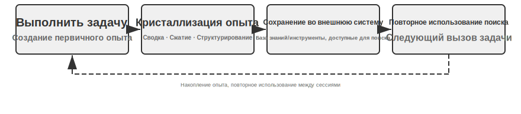
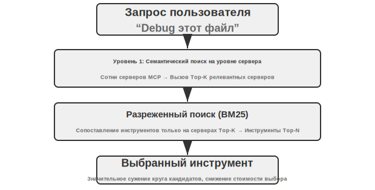
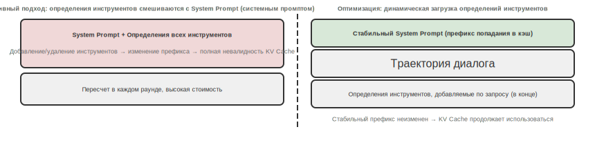
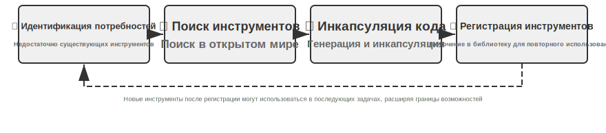
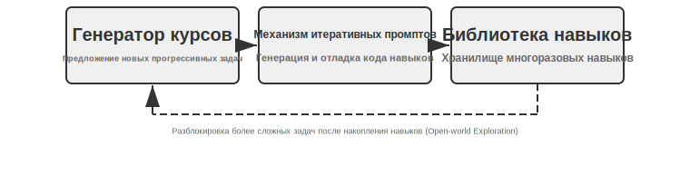
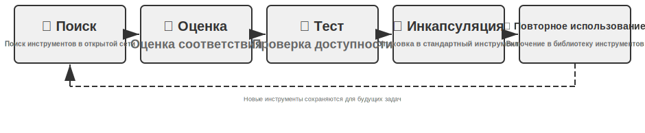

# Самоэволюция Agent

Предыдущие главы выстраивали систему способностей Agent с разных сторон. Context Engineering (контекст-инженерия) во второй главе заложила основу управления информацией (включая механизм загрузки Skills по требованию); база знаний и пользовательская память в третьей главе реализовали персистентность знаний между сессиями; пятая глава показала, как Coding Agent (кодирующий агент) накапливает опыт через файловую систему; а Reinforcement Learning (обучение с подкреплением) в ходе Post-training (пост-тренировки) в седьмой главе закрепило стратегии в параметрах модели. Эти технологии имеют разные приоритеты, но все они указывают на один и тот же вопрос: **как Agent может становиться сильнее непрерывно?**

Даже самые передовые модели, сталкиваясь с процедурой возврата средств в конкретной компании, скриптами продаж определенного оператора связи или способом вызова редкого API, все равно чувствуют себя как новый сотрудник в первый рабочий день — в глазах темнеет. Изменение весов модели требует огромного количества данных и вычислительных мощностей, а цикл обновления исчисляется неделями. В реальности же запускаются новые API, отключаются старые сервисы, а потребности пользователей постоянно меняются. Agent нужен более легкий и мгновенный механизм эволюции — расширение границ своих возможностей без изменения параметров модели.

В этой главе исследуется именно такой механизм: **Self-Evolution (самоэволюция) Agent**. Самоэволюция — это экстернализированное обучение, включающее два измерения: извлечение знаний из опыта и проактивное обнаружение и создание новых инструментов. Основная идея заключается в том, чтобы отделить знания и процессы от параметров модели и временного контекста, превратив их во внешние ресурсы — библиотеки инструментов и базы знаний, которые являются персистентными, доступными для поиска и многократного использования. Это не замена Post-training, а дополнение: Post-training решает вопрос «как сделать модель умнее», а Self-Evolution решает вопрос «как сделать Agent более умелым».

## Почему Agent не учится автоматически

Выше говорилось о практических потребностях. Но есть и более фундаментальный вопрос: **если бы Context Window (контекстное окно) могло быть бесконечно длинным и мы бы поместили туда все диалоги и результаты вызовов инструментов, которые прошел Agent, смог бы он автоматически научиться всему?**

Ответ — отрицательный, и причина кроется в механизме Attention (внимание), который мы обсуждали во второй главе. Это теоретическая отправная точка данной главы, и спустя несколько глав ее стоит кратко вспомнить.

Во второй главе неоднократно подчеркивалось: **внутренний механизм In-Context Learning (обучение в контексте) больше похож на Retrieval (извлечение), чем на Reasoning (рассуждение)**. Attention отлично справляется с «поиском» — «Какая кошка в 37-й клетке?» — попадание с одного шага. Однако оно плохо справляется с «обобщением и статистикой» в рамках одного Forward Propagation (прямого прохода) — «Сколько всего черных кошек в 100 клетках?». Последнее требует обхода всех записей и поддержания состояния счетчика, что по сути является мышлением, а не поиском. Иными словами, если свалить весь сырой опыт в контекст, модель будет «помнить» его, но не сможет автоматически «извлечь» из него пригодные для повторного использования закономерности. Даже если контекст действительно станет бесконечным, эта пропасть сохранится: информация на месте, но никто не выполнит за модель этот шаг сжатия от «конкретных записей» к «общим паттернам». Более того, как показало «отравление контекста» во второй главе, чем длиннее контекст и чем больше в нем шума, тем сильнее размывается Attention, и тем сложнее извлечь ключевую информацию. Инсайт Karpathy можно прочитать наоборот: «плохая память» модели — это фича, а не баг; она заставляет нас активно и явно заниматься дистилляцией знаний, а не надеяться, что модель сама осознает закономерности из длинной истории. Одним словом: **обучение не происходит автоматически, оно должно быть спроектировано в явном виде** — именно в этом заключается смысл данной главы.

И «явно спроектированное обучение» не впервые появляется в восьмой главе. В предыдущих главах уже были заложены некоторые прототипы, хотя большинство из них служили немедленным потребностям **внутри одной сессии** или в смежных сессиях: **сжатие контекста** во второй главе, где дополнительный вызов LLM заменяет громоздкие сырые записи на вычисленные выводы, восполняя недостающую половину «извлечения» для Attention; **Status Bar (строка состояния) Agent** во второй главе, где код шаг за шагом детерминированно поддерживает ключевые выводы в контексте, является другой стороной той же медали; а **User Memory (пользовательская память)** в третьей главе уже вывела «обучение» на уровень межсессионного взаимодействия — Agent накапливает понимание пользователя в ходе множества диалогов, становясь все точнее благодаря офлайн-систематизации.

Пользовательская память сама по себе является формой обучения, но она аккумулирует **информацию** о том, «кто такой пользователь» (предпочтения, факты, привычки). Восьмая глава должна восполнить вторую половину, более долгосрочную: превратить стратегии решения задач, операционные процессы, извлеченные из ошибок уроки и даже совершенно новые инструменты, найденные в ходе исследования, в персистентные, доступные для поиска и повторного использования **способности**. Чтобы Agent не просто «помнил больше», а становился «все более умелым». Такое обучение является более долгосрочным и требует от Agent **проактивной** инициативы, поэтому оно заслуживает отдельной главы — ниже мы сначала определим его место в макроперспективе.

## Три парадигмы обучения и позиционирование Self-Evolution

Три парадигмы, введенные в первой главе (рис. 1-1), здесь приводятся только для сопоставления позиций. **Post-training** (пост-тренировка) изменяет веса модели, закрепляя «опыт» как «мышечную память» через RL; это дает высокий шанс на успех и низкую задержку, но стоимость обновления высока, а цикл долог (подробно описано в седьмой главе). **In-Context Learning** (ICL, обучение в контексте) дает временную адаптацию через демонстрационные примеры в промпте; это дешево и эффективно, но исчезает после завершения сессии (подробно см. в первой и второй главах). **Externalized Learning** (экстернализированное обучение) — это путь, который разработчики чаще всего игнорируют: накопление знаний в файлах, базах знаний и инструментах вне модели, что делает их персистентными, интерпретируемыми и доступными для исправления в любое время. Все три парадигмы работают синергично, а не конкурируют: фактологические знания передаются RAG (подробно в третьей главе) и внешним хранилищам, стабильное поведение и форматы закрепляются через Post-training, а текущая временная информация обрабатывается через In-Context Learning.

Глава фокусируется на пути **без изменения весов модели** — экстернализированном обучении (externalized learning), которое соответствует двум измерениям, упомянутым в начале главы: экстернализация опыта в Knowledge (знания) и Skill (навыки), а также экстернализация способностей в Tool (инструменты). (Здесь следует проводить различие с пятой главой «Код создает код: самовоспроизведение Agent»: там речь шла о создании Агентом систем, подобных самому себе, а в этой главе рассматривается рост способностей без изменения весов. Третья глава решала вопрос «как хранить и как искать» в базе знаний, а эта глава решает вопрос «кто наполняет и обновляет» — как Agent активно накапливает опыт.)

Почему это необходимо? Рассмотрим негативный сценарий. Предположим, клиентский Agent впервые обрабатывает процесс возврата средств в определенном банке: после 15 минут исследования — совершения 3 звонков и апробации 2 вариантов скриптов — он, наконец, успешно завершает возврат. Если у него отсутствует способность к экстернализированному обучению, то при получении точно такого же запроса в следующий раз ему придется снова потратить 15 минут на то же самое исследование, а накопленный в этот раз опыт исчезнет вместе с завершением сессии. Ключевое слово здесь — «автономность»: не инженер-человек готовит документацию для Агента, а сам Agent в процессе выполнения задачи обобщает опыт, создает инструменты и обновляет базу знаний — подобно опытному сотруднику службы поддержки, который собирает разрозненные правила возврата в справочник, доступный для чтения в любой момент и обновляемый автономно в соответствии с новыми обстоятельствами. Основная философия такова: вместо того чтобы ожидать, что модель запомнит все, лучше после выполнения задачи использовать дополнительные вычислительные ресурсы для обобщения, сжатия и структурирования опыта, а затем сохранить его в перманентную (persistable) и извлекаемую внешнюю систему. По сравнению с параметрическим обучением (parameter learning), этот метод позволяет быстро аккумулировать интерпретируемые, верифицируемые и корректируемые знания без дорогостоящего обучения; по сравнению с In-Context Learning (обучение в контексте), он избегает неэффективного поиска в огромных массивах исходной информации за счет активного извлечения (distillation) и структурированной организации, обеспечивая персистентность между сессиями.

Что еще важнее, экстернализированное обучение поднимает обучаемость Агента с «запоминания информации» до «выстраивания способностей»: он может не только обобщать опыт в виде саммари-знаний и сохранять их в базу знаний для последующего извлечения (древовидная индукция RAPTOR, представленная в части про RAG в третьей главе, аналогично применима для послойного извлечения опыта — от конкретных записей операций к правилам, а затем к принципам), но и инкапсулировать повторяющиеся рабочие процессы в точно исполняемые инструменты, формируя постоянно растущую библиотеку навыков. Например: клиентский Agent, помогая клиенту с возвратом, может усвоить три типа вещей разной природы. Первый тип — это специфическое правило: «Для возврата в компании А необходимо подтвердить последние четыре цифры кредитной карты», это фактологическое знание, которое достаточно сохранить в базу знаний. Второй тип — универсальный инструмент: «Использовать X API для автоматической проверки статуса заказа», это стабильная и переиспользуемая последовательность операций, которую выгоднее всего закрепить в виде программного инструмента (code tool). Третий тип — руководство для должности: «Полный Skill процесса возврата», включающий стратегические суждения и часто меняющиеся бизнес-правила, что больше подходит для написания в виде документа Skill. В таблице 8-1 обобщены эти три продукта экстернализированного обучения.

Таблица 8-1 Три продукта экстернализированного обучения

| Форма продукта | Содержание | Пример | Способ использования |
|------|------|------|------|
| Запись в базе знаний | Факты и правила | «Этот банк требует адрес отделения открытия счета» | Семантический поиск или точный поиск через `grep` |
| Специализированный программный инструмент | Повторяющиеся рабочие процессы | «Последовательность вызовов API для проверки баланса счета» | Фиксация в коде, вызов через параметры |
| Документ Skill | Сложные, но часто меняющиеся рабочие стратегии | «Лучшие практики обработки страховых выплат» | Документ на естественном языке, загрузка по требованию |

Существует простое эмпирическое правило для определения подходящей формы: **чисто фактологическую информацию сохраняем в базу знаний, часто используемые функции со сложными параметрами оформляем в виде кода (Tool), а часто меняющиеся стратегии, требующие суждений, записываем в виде документов (Skill)**. При этом два последних типа относятся к «генерации инструментов» — более высокой форме экстернализированного обучения, которая экстернализирует не только «знания», но и «процессы», переводя их в программную форму и превращая «каждое повторное размышление» в принцип «один раз создал — многократно используешь», подобно тому как после первого ручного развертывания сервера шаги записываются в скрипт автоматизации. В четвертой главе уже подробно обсуждался фреймворк выбора между специализированными инструментами и Skill.

## Почему Agent должен учиться на опыте: от «умного» к «опытному»

Упомянутый ранее «опытный сотрудник», превращающий разрозненные правила в справочник, указывает на ключ к переходу от «умного» к «опытному»: разрыв зачастую заключается не в том, что модель недостаточно умна, а в том, что многие бизнес-процессы и доменные знания динамичны и закрыты. Решить проблемы, зависящие от «опыта», только за счет повышения общих способностей базовой модели невозможно. То, чему Agent должен научиться на опыте, — это именно такие знания: для отмены определенной услуги нужно заполнить конкретную форму, а не тратить время на звонки; обобщить условия применимости скидки (например, для ветеранов или клиентов со стажем более двух лет); определить, есть ли еще пространство для торга по котировкам широкополосного доступа у конкретного оператора в определенном регионе. Аналогично, Coding Agent не знает специфических для проекта стандартов кода и процессов развертывания, а браузерный Agent не знает стратегий защиты от парсинга и изменений в макете страниц конкретного сайта — все это доменные знания в реальном времени, которые не содержатся в данных для предобучения (pre-training).

## Обучение на опыте

После понимания того, «зачем учиться», следующим вопросом становится «как учиться». Инженерная практика экстернализированного обучения начинается с «записи и повторного использования успешного опыта». Следующие два эксперимента демонстрируют два взаимодополняющих способа накопления опыта: один извлекает стратегии высокого уровня в извлекаемые саммари знаний (аналог «заметок по ходу решения задач»), другой фиксирует конкретные последовательности операций в автоматизированные инструменты с возможностью воспроизведения (аналог «записи экрана»).

Таблица 8-2 классифицирует механизмы обучения на опыте по уровням, помогая читателю понять взаимосвязь между извлечением знаний, организацией знаний, применением знаний и инженерной поддержкой.

Таблица 8-2 Уровни механизмов обучения Агента на опыте

Самое важное дизайнерское решение этой механики: консолидация памяти не выполняется во время взаимодействия с пользователем, а происходит асинхронно в фоновом режиме, оставаясь полностью незаметной. Двойной контроль (门控) и распределенные блокировки гарантируют, что параллельные инстансы не запустят интеграцию повторно, а при сбое произойдет автоматический откат с повторной попыткой в следующий раз. Права дочернего агента по интеграции также строго ограничены директорией памяти. С более широкой перспективы это представляет собой эволюцию управления пользовательской памятью от модели «запись без упорядочивания» к полному жизненному циклу «запись — консолидация — обрезка». Без регулярной интеграции база памяти деградирует в нагромождение информации с низким соотношением сигнал/шум, что только мешает качеству поиска. Регулярная «консолидация во сне» позволяет базе памяти оставаться компактной, согласованной и удобной для навигации — точно так же, как знания эксперта-человека являются не бесконечным нагромождением фактов, а структурированным пониманием, прошедшим через многократное упорядочивание.

| Уровень | Механизм | Решаемая проблема |
|------|------|-------------|
| Извлечение знаний | Сводка стратегий, запись рабочих процессов, рефлексия над ошибками | Извлечение переиспользуемых знаний из опыта успехов и неудач |
| Организация знаний | Skills (навыки), консолидация во время «сна» | Структурированное хранение и индексация знаний |
| Применение знаний | Оптимизация системных промптов | Внедрение знаний в паттерны поведения Agent (агента) |
| Инженерная поддержка | Возобновление выполнения между сессиями | Обеспечение непрерывного выполнения длительных задач |

Вышеуказанные четыре уровня будут подробно раскрыты в последующих разделах: извлечение знаний через сводку стратегий, запись рабочих процессов и обучение на ошибках естественным образом переходит к организации знаний через Skills и консолидацию во время «сна», затем следует оптимизация системных промптов (применение знаний) и, наконец, завершается возобновлением выполнения длительных задач между сессиями (инженерная поддержка).

> **Эксперимент 8-1 ★★: Обучение на успешном опыте: Strategy Summary**

Проект `gaia-experience` является типичной реализацией идеи «Strategy Summary» (стратегическое резюме). Суть Strategy Summary заключается в том, чтобы сжать процесс успешного решения задачи в структурированную заметку об опыте — зафиксировать, «какие методы использовались, на какие грабли наступали и какими были ключевые шаги», чтобы иметь возможность напрямую обратиться к этому при возникновении похожей проблемы в следующий раз.

Не любая траектория выполнения заслуживает того, чтобы быть извлеченной в качестве опыта — критерием является **переносимость**: можно ли использовать уроки, извлеченные из текущей задачи, в аналогичных задачах в будущем? Исправления, эффективные только для конкретного специфического ввода, не должны попадать в долгосрочную память.

В данном эксперименте используются два ключевых элемента инфраструктуры. **AWorld Framework** (фреймворк AWorld) — это среда выполнения и оценки с открытым исходным кодом, разработанная специально для AI Agent (агент). Она предоставляет стандартизированный набор инструментов (браузер, файловая система, интерпретатор кода и т. д.) и конвейер автоматической оценки; её можно понимать как «экзаменационный класс» для агентов. **GAIA** — это чрезвычайно сложный бенчмарк для оценки, который проверяет способности универсальных AI Agent через многошаговые комплексные задачи, требующие человеческого интеллекта. Например, «найти конкретную информацию на определенном сайте, обработать её с помощью кода и вычислить ответ» — это часто требует комплексного использования браузера, менеджера файлов, интерпретатора кода и проведения сложных логических рассуждений.

Основная инновация заключается в добавлении полноценного замкнутого цикла «обучение-применение» для агента во фреймворке AWorld. В **Learning Mode** (режим обучения), каждый раз, когда Agent успешно завершает задачу GAIA, система автоматически фиксирует полную траекторию его действий и использует LLM для проведения «рефлексии» и «обобщения», создавая структурированное резюме опыта. Это резюме содержит не только окончательный ответ, но и извлекает основные методы решения проблемы, ключевые инсайты (insights) и последовательность эффективно использованных инструментов. Этот опыт векторизуется и сохраняется в базу знаний. В **Apply Experience Mode** (режим применения опыта), когда Agent получает новую задачу, он сначала выполняет семантический поиск в базе знаний опыта, находит наиболее похожий успешный кейс из прошлого и вставляет этот опыт в системный Prompt (промпт) в качестве «успешного примера», давая ориентиры для принятия решений. Эксперимент доказывает, что это значительно повышает эффективность и вероятность успеха при решении новых задач: чем больше задач решает Agent и чем богаче накопленный опыт, тем сильнее становятся его способности, формируя самоэволюционирующую систему с положительной обратной связью.

**Эксперимент 8-2 ★★: Обучение на повторяющихся задачах: запись и воспроизведение рабочих процессов**

Проект `browser-use-rpa` — отличный пример идеи «Workflow Recording» (запись рабочего процесса). Подход Workflow Recording похож на функцию «записи макросов» в Excel: при первом выполнении операции вручную шаги записываются, а в дальнейшем достаточно одного нажатия на «воспроизведение» для автоматического повторения. Проблема, которую решает этот проект, очень практична: многие повторяющиеся операции в браузере (такие как отправка отчетов по почте, поиск информации на определенных сайтах), хотя и имеют разные конкретные параметры (получатель, ключевые слова для поиска), обладают фиксированным основным процессом операций. Заставлять Agent каждый раз начинать с нуля и использовать дорогую мультимодальную большую модель для «повторного открытия» этого процесса — огромная трата ресурсов. По сути, это зависимость исключительно от In-Context Learning (обучение в контексте) без экстернализации успешного опыта в пригодные для повторного использования инструменты. Ядро проекта представляет собой предельный сравнительный эксперимент эффективности и стоимости.

На **Learning Phase** (этап обучения), когда Agent впервые выполняет задачу, он, подобно человеку, завершает операции через цикл «наблюдение-мышление-действие» мультимодальной LLM. Каждый раз, когда LLM решает выполнить действие, система извлекает из истории фреймворка browser-use точную информацию о позиционировании оперируемого элемента: веб-страница представлена в браузере в виде дерева DOM (Document Object Model, объектная модель документа), где каждая кнопка, поле ввода или ссылка являются узлом дерева; XPath (XML Path Language) же указывает на конкретный узел с помощью записи, похожей на путь к файлу: `/html/body/div[2]/button[1]`. Операция записывается как структурированный шаг: тип операции (клик, ввод и т. д.), XPath целевого элемента, параметры операции, а также проверочная информация после выполнения (изменился ли URL страницы, появился ли ожидаемый элемент). После успешного завершения задачи LLM генерирует семантическую метку (например, «отправить электронное письмо») и описание («поле получателя, поле темы, поле содержания, кнопка отправки»), которые вместе с последовательностью шагов сохраняются в базу знаний, формируя параметризованную запись «рабочего процесса» (workflow).

На **Replay Phase** (этап воспроизведения), при поступлении новой задачи система сопоставляет её с существующими рабочими процессами, сочетая семантическое сходство (Embedding, эмбеддинг) и проверку ключевых элементов. При успешном сопоставлении выполнение происходит на высокой скорости по шагам: через механизмы ожидания Playwright (библиотека с открытым исходным кодом для автоматизации браузеров) — `page.locator(xpath).wait_for(state='visible', timeout=15000)` — обеспечивается загрузка элементов; параметризованные шаблоны (например, «ввести `{{email}}` в поле получателя») через легковесные вызовы LLM извлекают фактические значения параметров из текущей инструкции задачи, не требуя полноценного визуального обдумывания. Если какой-то шаг не удается (элемент не найден, время ожидания истекло), это означает, что структура веб-страницы могла измениться; в этом случае рабочий процесс помечается как «возможно устаревший», происходит откат в режим обучения для повторного выполнения задачи через мышление LLM и генерируется новый рабочий процесс для замены старого.

**Сценарий приемки**: отправка письма в веб-версии Gmail.

- Первое выполнение (этап обучения): «Отправить письмо на test@example.com, тема "Тестовое письмо", содержание "Это тестовое письмо"». Наблюдение за тем, как Agent через мультимодальную LLM распознает кнопку «Написать», поле ввода получателя, поля темы и содержания, кнопку «Отправить». Фиксация шагов операции, затраченного времени, количества вызовов LLM.
- Повторное выполнение (этап воспроизведения): «Отправить письмо на another@example.com, тема "Последующий тест", содержание "Второе тестовое письмо"». Система распознает подходящий рабочий процесс, извлекает новые значения параметров и напрямую воспроизводит операции без визуального мышления LLM. Сравнение затраченного времени и количества вызовов должно показать значительное снижение.
- Обновление знаний: имитация изменения версии веб-страницы (изменение структуры HTML, из-за чего меняется XPath определенной кнопки), проверка того, что Agent может обнаружить неисправность рабочего процесса, откатиться в режим обучения и заново создать рабочий процесс для обновления базы знаний.

Ожидаемый результат: скорость выполнения задачи на этапе воспроизведения значительно возрастает (в несколько раз), стоимость вызовов LLM существенно снижается, а вероятность успеха становится более стабильной.

Запись рабочих процессов (Workflow) — это не изолированный инженерный прием, за ним стоит более универсальная методология. Voyager — это открытая архитектура Agent (агент), предложенная командой NVIDIA (подробнее см. далее), которая систематизирует цикл «исследование — накопление» в виртуальном мире Minecraft: **выполнение задачи → проверка успеха → сохранение успешной последовательности операций в библиотеку навыков → поиск и повторное использование при столкновении с аналогичными задачами**. Эксперимент 8-2 является реализацией этого подхода в сценарии автоматизации браузера: этап обучения соответствует «исследованию», база знаний рабочих процессов — «библиотеке навыков», а воспроизведение и откат при сбое — «поиску и повторному использованию» и непрерывному совершенствованию.

Эксперимент 8-2 также выявил два самых уязвимых звена в подходе «запись — воспроизведение». Только при их правильной обработке этот механизм становится по-настоящему надежным[^preact]. Первое звено — это **когда можно доверять воспроизведению**. Более надежный подход заключается в компиляции успешной последовательности операций в небольшую **программу на базе конечного автомата (state machine program)**: каждое состояние сопровождается «предикатом проверки» (фрагментом паттерна интерфейса, который должен присутствовать на реальном экране в данный момент). При воспроизведении **перед каждым действием сначала используется предикат для сверки с экраном в реальном времени** — «сначала убедись, потом делай». Если предикат не выполняется или действие выдает ошибку, управление возвращается полноценному Agent для повторного прохождения, а новая траектория заново компилируется в программу. Поскольку при воспроизведении не требуется ни одного вызова модели, повторяющиеся задачи, попавшие в кэш, могут выполняться в 8,5–13 раз быстрее. Второе звено — **не сохранять плохие программы**: сразу после завершения компиляции необходимо сбросить среду, воспроизвести процесс с самого начала и использовать встроенный в бенчмарк оценщик, чтобы подтвердить, что «на этот раз все действительно получилось», прежде чем разрешить запись в базу. Эта «проверка перед сохранением» позволяет отсеивать программы, которые «воспроизводятся на 100%, но фактически не решают задачу» (например, процесс полностью завершен, кнопка Save нажата, но какое-то поле осталось пустым). Без этого барьера библиотека программ будет постепенно деградировать по мере накопления ошибочного кода. Чистый принцип можно сформулировать так: **память о процессах также должна иметь проверочные шлюзы, чтобы цикл самосовершенствования не испортился**, — это и есть строгая версия механизма «обнаружения сбоя рабочего процесса и отката к повторному обучению» из эксперимента 8-2.

[^preact]: Полное описание механизма компиляции успешных траекторий в программы конечных автоматов с предикатами проверки и установкой шлюзов «проверки перед сохранением» см. в Li, Bojie. *PreAct: Computer-Using Agents that Get Faster on Repeated Tasks.* arXiv:2606.17929, 2026.

### Обучение на ошибках

Сводка стратегий и запись рабочих процессов извлекают опыт из **успешных траекторий** — эксперимент 8-1 запускает рефлексию и обобщение только после успешного выполнения задачи. Однако опыт неудач также заслуживает накопления и даже может быть более информативным: одна неудача четко исключает один путь, в то время как успех часто является лишь одним из множества возможных вариантов. Типичное накопление опыта неудач принимает две формы: **база паттернов ошибок** (запись того, «в каких ситуациях и какие методы приводят к неудаче, и каковы сигналы этой неудачи») и **отрицательные правила** («не используй метод X для выполнения Y» — например, «не пытайся отменить подписку этого оператора по телефону, у телефонного канала нет полномочий для обработки таких запросов»).

Репрезентативной работой в этом направлении является Reflexion (Shinn et al., 2023)[^reflexion-2023]: после провала задачи Agent на естественном языке рефлексирует о причинах неудачи (например, «на третьем шаге мне следовало сначала подтвердить личность, а не сразу отправлять форму») и сохраняет текст рефлексии в Episodic Memory (эпизодическая память). При следующей попытке выполнения аналогичной задачи эти размышления считываются как дополнительный контекст, что позволяет избежать повторения ошибок. Весь процесс не обновляет параметры модели — Reflexion является классическим примером «эволюции без изменения весов». Такая рефлексия, выраженная языком, несет в себе гораздо больше информации, чем скалярное вознаграждение; мы подробнее остановимся на этом при обсуждении обучения системным промптам. Еще одним важным выходом для опыта неудач являются системные промпты: автоматическая оптимизация системных промптов, обсуждаемая далее в этой главе, заключается в записи отрицательных правил, извлеченных из неудачных кейсов (например, «никогда не переводи звонок на оператора из-за политических споров»), в системный промпт, делая их поведенческим ограничением для всех последующих задач.

### Skills: экстернализация доменных знаний в структурированные способности

Предыдущие два механизма накапливали опыт «как думать» и «как делать» соответственно. Механизм Skills (навыки) идет по третьему пути — систематическому извлечению знаний о доменных операциях в структурированные, загружаемые по требованию модули способностей. Skill можно представить как «должностную инструкцию»: новому сотруднику не нужно во всем разбираться с нуля — он может приступить к работе, прочитав руководство. Во второй главе подробно обсуждались механизм Progressive Disclosure (прогрессивное раскрытие) для Skills (метаданные → основной процесс → детали) и дизайн совместимости с KV Cache; в данном разделе основное внимание уделяется философии экстернализации знаний, стоящей за Skills, и их автоматической генерации.

Основная ценность Skills заключается в использовании человекочитаемого текста для хранения знаний: они быстро обновляются (не требуется переобучение модели), подлежат аудиту (эксперты-люди могут напрямую вносить правки и улучшения) и переносимы (их можно использовать при смене модели или системы). По сути, Skills преобразуют доменные знания, запертые в неструктурированных документах, в структурированную форму, удобную для использования Agent, — позволяя ему применять знания через универсальные способности к поиску и рассуждению, а не жестко кодировать их в логику кода.

[^reflexion-2023]: Shinn, N., et al. *Reflexion: Language Agents with Verbal Reinforcement Learning.* arXiv:2303.11366, 2023.

Идя еще дальше, Skill Creator[^ch8-1] от Anthropic представляет собой мета-способность, позволяющую создавать другие Skills (навыки). Он направляет Agent (агента) через процессы наблюдения, обучения и обобщения, позволяя извлекать операционные знания в конкретной области и превращать их в структурированный Skill. Когда агенту поручается создать Skill для определенной области, он сначала понимает конкретные сценарии использования через диалог с пользователем, затем анализирует каждый сценарий и идентифицирует переиспользуемые ресурсы, и, наконец, создает полный пакет Skill, содержащий стандартную структуру каталогов, scripts (скрипты), references (ссылки), assets (активы) и основной документ `SKILL.md`. Skill Creator позволяет самому агенту выполнять процесс трансформации знаний, реализуя цикл самозагрузки (bootstrapping) накопления знаний: Agent может не только использовать Skill, но и создавать их.

Механизм `CLAUDE.md` в Claude Code демонстрирует схожие возможности: при первом знакомстве с кодовой базой он активно прочитывает весь репозиторий и генерирует руководство по проекту, содержащее ключевую информацию, такую как архитектурный дизайн, стандарты кодирования и методы тестирования, на которую он постоянно ссылается и которую обновляет в ходе последующей разработки. Такой механизм автоматической генерации Skill позволяет расширению способностей Agent больше не ограничиваться доступным временем и охватом знаний экспертов-людей — когда Agent входит в новую область, он может самостоятельно исследовать ее, учиться создавать операционные руководства и закреплять их в виде Skill, реализуя переход от «зависимости от предварительно запрограммированных знаний» к «обучению и накоплению знаний на практике».

С точки зрения «осаждения опыта» (experience accumulation), конкретные формы пути генерации инструментов можно разделить на специализированные программные инструменты (code tools) и связку Skill + универсальный исполнитель (executor). О том, как выбирать между ними, уже упоминалось ранее, а в четвертой главе приведена полная структура, поэтому здесь мы не будем повторяться. Применительно к сценариям данного раздела: операции со сложными параметрами и частыми вызовами закрепляются как программные инструменты (например, библиотека навыков, накопленная Voyager в Minecraft, или параметризованные скрипты, сгенерированные записью рабочих процессов в браузере), а стратегические, изменчивые бизнес-правила записываются в виде документов Skill (например, `CLAUDE.md` в Claude Code). Реальные системы часто используют обе формы в гибридном режиме.

### Сонное обучение: автономная эволюция пользовательской памяти

Обсужденные ранее механизмы обучения на опыте — саммаризация стратегий, запись рабочих процессов, генерация Skills — происходят либо во время выполнения задачи, либо в виде немедленного извлечения опыта после её завершения. Однако в человеческом обучении есть еще один важный этап: **консолидация памяти во время сна**. Во второй главе при обсуждении сжатия контекста уже использовалась эта аналогия — мозг перерабатывает сенсорные входные данные, полученные днем, в компактную долгосрочную память. Эта аналогия применима не только к сжатию контекста внутри одной сессии, но и может быть расширена на управление опытом между сессиями: разрозненный опыт, полученный днем, реорганизуется во время «сна», из него удаляется избыточность, он интегрируется с существующей сетью знаний и преобразуется в более компактную и легко извлекаемую долгосрочную память.

Типичным объектом такой оффлайн-интеграции является память Agent о **самом пользователе** — кто вы, какие у вас предпочтения, какие факты вы упоминали. Здесь необходимо прояснить распространенное заблуждение: то, что такие агенты, как Claude Code, упорядочивают во время «сна», — это в основном **пользовательская память**, а не общая база знаний. База знаний (RAG из третьей главы) содержит отраслевую документацию, не связанную с конкретным пользователем, и обычно загружается пакетами через оффлайн-конвейеры и редко меняется. Пользовательская же память — это модель, которая по крупицам собирается агентом в ходе многочисленных диалогов и позволяет ему понимать вас все лучше — именно она требует многократной «сонной интеграции». В следующих частях этого раздела на примере Claude Code и Hermes будет показано, как хранится такая пользовательская память, с упором на то, **как она эволюционирует автономно**.

Снова уточним разделение задач между этим разделом и третьей главой: в третьей главе говорилось о том, «как хранить и как искать» пользовательскую память, а также были представлены **алгоритмы** упорядочивания уровня хранения памяти (кластеризация саммари, версионирование конфликтов и т. д.), что здесь не повторяется. Данный же раздел посвящен **вопросам инженерии и эволюции** — когда упорядочивать, кто это делает и в какой форме фиксировать данные, чтобы память становилась тем точнее, чем больше она используется.

**Claude Code: использование Markdown для хранения пользовательской памяти.** Claude Code сохраняет пользовательскую память напрямую в виде человекочитаемых файлов Markdown: каждое воспоминание представляет собой небольшой файл с метаданными (frontmatter), фиксирующий только один факт, которые затем сводятся и навигируются через индексный файл (`MEMORY.md`). Преимущества такой формы очевидны: быстрое обновление (достаточно изменить файл, не нужно переобучать модель), проверяемость (пользователь может напрямую открыть и отредактировать файл) и переносимость (можно использовать при смене модели или системы).

[^ch8-1]: Anthropic, “Skill Creator” , 2025. https://github.com/anthropics/skills/blob/main/skill-creator/SKILL.md

Но «записи» недостаточно, требуется еще и «упорядочивание». Claude Code превращает когнитивную метафору консолидации сна в инженерный механизм интеграции памяти, который периодически запускается в фоновом режиме. (Нижеприведенное описание основано на анализе поведения публичной версии и сообщества, а не на официальном определении). Основная идея дизайна заключается в следующем: **накопление опыта и консолидация памяти — это два независимых процесса, которые не должны происходить в одном временном окне**. Agent (агент) тоже нуждается в специальном «времени для повторения». В частности, при выполнении двух условий (прошло достаточно времени с момента последней консолидации и за этот период накопилось достаточно новых сессий) система запускает в фоне независимый дочерний агент для выполнения четырехэтапной интеграции: **Orient** (ориентирование — чтение существующего индекса памяти для понимания всей картины знаний), **Gather** (сбор новых сигналов — поиск в недавних сессиях новой информации, заслуживающей долгосрочного хранения, и обнаружение фактов, противоречащих существующей памяти), **Consolidate** (консолидация — объединение новых сигналов в существующие тематические файлы вместо создания дубликатов, преобразование относительных дат в абсолютные, удаление опровергнутых старых фактов), **Prune & Index** (обрезка и индексация — контроль размера индекса, удаление устаревших указателей).

**Hermes: превращение автономного обучения в постоянную службу.** Проект Hermes, выпущенный Nous Research в 2026 году с открытым исходным кодом, развивает эту идею еще дальше: это демон (daemon), постоянно работающий на машине пользователя, который непрерывно накапливает память и автономно эволюционирует между сессиями. Его память делится на четыре уровня[^hermes]: **память промптов** (`MEMORY.md` и `USER.md`, внедряется при запуске сессии, намеренно ограничена несколькими тысячами символов, чтобы «заставить» агента активно выбирать главное), **поиск по сессиям** (использование полнотекстового индекса SQLite FTS5 для хранения истории сессий; найденные фрагменты сначала резюмируются LLM, а затем внедряются, привнося только то, что релевантно текущей задаче), **библиотека навыков** (процедурная память, использующая прогрессивное раскрытие: по умолчанию загружаются только названия навыков и аннотации), а также опциональный **слой пользовательского моделирования Honcho** (пассивно отслеживает предпочтения, стиль общения и доменные знания в фоне, описывая в динамике, «как пользователь и агент эволюционируют вместе»). Когда задача удовлетворяет определенным условиям (например, вызов инструментов более пяти раз, восстановление после ошибки, получение исправления от пользователя или успешное прохождение неочевидного рабочего процесса), Hermes автоматически закрепляет этот опыт в виде многоразового навыка, отдавая приоритет инкрементальным обновлениям через патчи (patch), а не полной перезаписи. Claude Code и Hermes представляют собой основные современные формы автономной эволюции пользовательской памяти — обе используют человекочитаемый Markdown или текст в качестве носителя.

### Автоматическая оптимизация системного промпта

Вернемся к основной линии — системному промпту. Механизмы, описанные в предыдущих разделах, сохраняют опыт и память вне модели: в базах знаний, рабочих процессах, файлах Skill (навыков) или пользовательской памяти. Но существует еще более прямой носитель опыта — сам System Prompt (системный промпт).

Andrej Karpathy считает, что в текущей парадигме обучения LLM упущен важный способ — System Prompt Learning (обучение системного промпта). Pre-training (предобучение) нужно для получения знаний, Fine-tuning (дообучение) — для формирования привычек в поведении; оба этих способа связаны с изменением параметров модели. Но многие процессы обучения у людей больше похожи на обновление «системного промпта»: столкнувшись с проблемой и осознав что-то, человек записывает это для себя четким языком, например: «в следующий раз при встрече с такой задачей нужно сначала попробовать этот метод».

Karpathy отмечает, что LLM похожи на главного героя фильма «Помни» (Memento) — каждый раз, просыпаясь, они не помнят, что произошло раньше, а мы до сих пор не дали им блокнот. Читая системный промпт Claude (около 17 тысяч слов, количество меняется в зависимости от версии), он обнаружил там множество универсальных стратегий решения проблем. Например: «Если Claude просят посчитать слова, буквы или символы, он должен подумать шаг за шагом перед ответом, явно ведя подсчет путем присвоения номера каждой букве». Это сделано для решения проблем вроде «сколько букв r в слове strawberry».

Karpathy полагает, что подобные знания не должны писаться людьми вручную, они должны приходить из System Prompt Learning. Это имеет общие черты с Reinforcement Learning (обучение с подкреплением) — оба метода используют неудачные кейсы для улучшения будущего поведения. Но алгоритмы обучения у них разные: System Prompt Learning напрямую изменяет текст системного промпта, а Reinforcement Learning корректирует параметры модели через градиентный спуск. Эффективность данных у первого метода значительно выше из-за разницы в «размерности» канала обратной связи. Это критика Karpathy в адрес **Reinforcement Learning на основе вознаграждения за результат**: за один раз выдается лишь скалярное вознаграждение (например, «правильно/неправильно»), информационная пропускная способность которого гораздо ниже, чем у целого абзаца рефлексии на естественном языке («здесь следовало сначала верифицировать ID, а потом запускать процесс возврата средств»). Именно поэтому из одной и той же неудачи System Prompt Learning может извлечь гораздо больше информации, чем один бит «да/нет».

[^hermes]: Nous Research, *Hermes: A Self-Improving Personal Agent*, 2026. https://hermes-agent.nousresearch.com/docs/

Я считаю, что суть System Prompt Learning (системное обучение промптов) заключается в том, чтобы сделать границы правил более четкими с помощью граничных случаев (edge cases). Большинство правил хорошо работают в типичных сценариях, настоящий вызов кроется в серой зоне: фраза «переключить на оператора, если запрос пользователя выходит за рамки полномочий» звучит понятно, но считается ли «недовольство пользователя политикой компании» выходом за рамки? А требование пользователя сделать исключение? Именно такие граничные случаи определяют истинный смысл правил.

В отличие от Reinforcement Learning (обучение с подкреплением), которому требуются огромные массивы данных и многократные итерации проб и ошибок для корректировки весов, System Prompt Learning позволяет быстро учиться на одном или нескольких граничных примерах. Столкнувшись с неудачным случаем, можно немедленно добавить четкое правило в системный промпт, не собирая тысячи похожих образцов для Fine-tuning (дообучение). Такое обучение не только эффективно с точки зрения данных, но и полностью интерпретируемо — каждое правило написано открытым текстом, его можно проверить, изменить или удалить. По мере накопления граничных случаев системный промпт постепенно превращается в подробное «руководство по решению проблем», подобно тому как эксперт постоянно совершенствует свои рабочие заметки.

Как реализовать это автоматически? Ключ в использовании Coding Agent (агент-кодировщик). Системные промпты и описания инструментов по сути являются документацией и кодом, распределенным по нескольким файлам. При обнаружении граничного случая Coding Agent может: (1) прочитать и понять существующий системный промпт, проанализировав структуру правил и контекст отказа; (2) сгенерировать точный diff на уровне кода, указав, в каком файле и в каком месте нужно внести изменения; (3) поддерживать согласованность, гарантируя, что новые правила не вносят противоречий или избыточности. Окончательное право утверждения остается за человеком-экспертом, который проверяет эти diff на предмет разумности.

Автоматическая оптимизация промптов — это не только концепция Karpathy, в академической среде уже существуют системные исследования. DSPy[^dspy-2023] рассматривает промпты как оптимизируемые параметры программы: разработчик лишь декларирует, «что на входе и что на выходе» для каждого модуля, а фреймворк автоматически ищет комбинации примеров и формулировки инструкций на оценочном наборе, превращая Prompt Engineering (промпт-инженерия) из ручной отладки в системную оптимизацию. OPRO[^opro-2023] позволяет LLM самой выступать в роли оптимизатора: используя историю промптов и их оценки в качестве контекста, модель итеративно предлагает лучшие варианты перефразирования, превосходя созданные человеком промпты в таких задачах, как математические рассуждения. Предложенный в 2025 году метод GEPA[^gepa-2025] идет еще дальше: он проводит рефлексию на естественном языке над траекториями неудач, на основе чего развивает промпты и поддерживает парето-фронт (набор взаимодополняющих решений, каждое из которых в чем-то лучше остальных, вместо одного «лучшего») среди нескольких кандидатов — это позволило превзойти GRPO Fine-tuning (алгоритм, описанный в главе 7) на ряде задач, используя при этом на один-два порядка меньше итераций семплирования. GEPA делает именно то, что в данном разделе называется «System Prompt Learning», и его эмпирические результаты подтверждают сделанные ранее выводы об информативности обратной связи.

Различия между этими автоматизированными фреймворками и описанной выше схемой «Coding Agent генерирует diff + проверка человеком» проявляются в трех аспектах. Во-первых, оффлайн против онлайн: автоматизированные фреймворки обычно оптимизируют пакетно на оффлайн-наборах данных, в то время как схема с diff развивается пошагово вместе с граничными случаями в продакшн-среде. Во-вторых, наличие контроля со стороны человека: автоматизированные фреймворки переписывают текст полностью в режиме end-to-end, что эффективно, но может порождать «странные» формулировки, переобученные под оценочный набор; схема с diff сохраняет проверку человеком, где каждое правило интерпретируемо и подотчетно, что больше подходит для сценариев с высокими рисками, таких как клиентская поддержка. В-третьих, необходимость оценочного набора: DSPy, OPRO и GEPA полагаются на наборы задач с оценками для запуска поиска, тогда как схеме с diff достаточно одного случая неудачи и фрагмента обратной связи от человека. На практике они могут дополнять друг друга: автоматизированные фреймворки используются для начальной пакетной оптимизации промптов, а схема с diff — для непрерывного развития после запуска.

> **Эксперимент 8-3 ★★: Автоматическая оптимизация системного промпта**
>
> **Цель эксперимента**: реализовать механизм автоматизированного системного обучения промптов на основе обратной связи от человека.
>
> **Техническое решение**: спроектировать процесс обучения системного промпта на основе сценария авиационной службы поддержки tau-bench. Начальное правило переключения на человека для агента звучит так: «переключай только тогда, когда запрос не может быть обработан в рамках твоих действий». В ходе оценки выяснилось, что агент злоупотребляет переключениями — при любом споре о политике компании он сразу переводит звонок на оператора, вместо того чтобы попытаться объяснить политику пользователю. Эксперт дает обратную связь: споры нужно решать через терпеливое разъяснение политики, а не простым переключением. Coding Agent считывает файл системного промпта, находит соответствующее правило и генерирует точную правку: уточняет границы переключения как «явное требование пользователя + экстренная ситуация, связанная с безопасностью», добавляет негативное правило «никогда не переключать из-за споров о политике» и вносит изменения на уровне кода.
>
> **Контрольная группа**: системный промпт, настроенный человеком вручную (без процесса автоматической оптимизации).
>
> **Ожидаемые наблюдения / Критерии приемки**: оптимизированный системный промпт не теряет в производительности на исходном наборе задач (новые правила не ломают существующее правильное поведение), при этом точность на наборе граничных случаев с избыточным переключением повышается — то есть в спорах о политике агент больше не переключает сразу, а сначала пытается объяснить правила.

### Продолжение выполнения длительных задач между сессиями (дополнение об инженерной поддержке)

[^dspy-2023]: Khattab, O., et al. *DSPy: Compiling Declarative Language Model Calls into Self-Improving Pipelines.* arXiv:2310.03714, 2023.

[^opro-2023]: Yang, C., et al. *Large Language Models as Optimizers.* arXiv:2309.03409, 2023.

[^gepa-2025]: Agrawal, L. A., et al. *GEPA: Reflective Prompt Evolution Can Outperform Reinforcement Learning.* arXiv:2507.19457, 2025.

Строго говоря, в данном разделе обсуждается не механизм извлечения опыта, а **инженерная поддержка** (Engineering Support) для самоэволюции (соответствующая уровню «инженерной поддержки» в таблице 8-2): применение концепции «экстернализации» к **управлению состоянием задач** (Task State Management), позволяющее «выученному» опыту и «выполненной наполовину работе» сохраняться между сессиями. Этот подход является прямым продолжением воркфлоу Coding Agent из пятой главы и помещен в эту главу потому, что опирается на тот же ключевой прием — запись состояния за пределами модели. Масштаб многих задач (например, создание полноценного приложения с нуля) намного превышает Context Window (контекстное окно) одной сессии. Даже при использовании сжатия контекста невозможно избежать двух типов проблем: при попытке сделать все приложение в рамках одной сессии контекст истощается раньше времени; либо, если выполнена только часть работы, в следующей итерации не удается точно восстановить прогресс, что приводит к преждевременному выводу о завершении задачи.

Более стабильный подход заключается в разделении длинной задачи на взаимодействие двух ролей — **Initializer Agent** и **Coding Agent**. Это похоже на то, как менеджер проектов сначала декомпозирует задачу и составляет список дел, а затем инженер выполняет пункты по очереди. Initializer Agent запускается только один раз в первой итерации, генерируя структурированный список функций (например, `feature-list.json`), скрипты инициализации, начальный git commit и файл прогресса (например, `progress.json`), превращая задачу в персистентное состояние файловой системы. Последующие сессии циклически выполняются Coding Agent: каждый раз он восстанавливает рабочее окружение из файла прогресса и git log, определяет текущую функцию для реализации, внедряет код, запускает тесты, обновляет поле `passes` в файле прогресса и завершает работу после коммита кода. Ключевые ограничения таковы: прогресс хранится в файле, а не в контексте; список функций представлен в JSON, а не в Markdown (структурированный формат лучше подходит для стабильного чтения и записи моделью); задача считается выполненной только тогда, когда все функции получат статус `passes: true`. Таким образом, даже если в процессе произойдет сбой, работу можно продолжить напрямую из состояния в файловой системе — для задач длительностью более получаса восстановление после сбоя является не опцией, а обязательным требованием.

## Проактивное обнаружение инструментов

Ранее мы обсуждали, как учиться на успешном опыте. Однако все эти механизмы имеют одну предпосылку: Agent (агент) должен сначала обладать подходящими инструментами для выполнения задачи. Когда количество доступных инструментов растет с десятка до сотен и тысяч, возникает новая проблема — как эффективно найти нужный в огромной библиотеке? В данном разделе мы сначала кратко рассмотрим существующие методы обнаружения инструментов (предварительная фильтрация через поиск, проактивное декларирование, иерархическое сопоставление), а затем представим становящийся популярным и более легким подход прогрессивного раскрытия навыков (Skills).

### Существующие методы обнаружения инструментов

Традиционный подход заключается в разовой вставке схем всех инструментов в системный Prompt (промпт), но когда количество инструментов исчисляется тысячами, он быстро теряет эффективность: контекст забивается «инструкциями к инструментам», и точность выбора модели снижается. Рассмотренная в четвертой главе предварительная фильтрация на основе поиска (выбор группы кандидатов по семантическому сходству) смягчает эту проблему, но имеет внутреннее ограничение — сопоставление происходит **единовременно** на основе исходного запроса пользователя. Однако такой простой на вид запрос, как «Debug the file», на деле может повлечь за собой многошаговую кросс-доменную цепочку инструментов, включая доступ к файлам, анализ кода и выполнение команд, — все потребности невозможно предвидеть в начале задачи.

**От пассивного выбора к проактивному обнаружению.** Более продвинутая идея состоит в том, чтобы превратить Agent из пассивного получателя в проактивного исследователя: когда в процессе выполнения он осознает нехватку компетенций, он сам проактивно заявляет на естественном языке: «Мне нужны такие-то возможности», а система динамически подбирает и внедряет их. MCP-Zero[^mcp-zero-2025] является показательной работой в этом направлении — в системный промпт не предустанавливаются никакие схемы инструментов, Agent в процессе рассуждений генерирует блоки структурированных запросов (например, «Сервер GitHub: поиск репозитория и возврат метаданных»), а система через двухуровневую семантическую маршрутизацию (уровень сервера → уровень инструмента) находит и внедряет совпадения из тысяч кандидатов. В статье сообщается, что на выборке из примерно 2800 инструментов это экономит около 98% токенов по сравнению с полной вставкой. Инженерно более распространенным эквивалентным решением является сохранение в системном промпте лишь нескольких базовых инструментов (web search, code interpreter) плюс одного «инструмента для поиска инструментов» — Agent просто описывает потребность на естественном языке для поиска и загрузки. Tool Search Tool, предоставляемый Anthropic в Claude API, относится к этому типу. Общим для обоих подходов является принцип: «Agent декларирует дефицит, система внедряет по запросу».

**Иерархическое сопоставление и деградация.** Ключ к эффективному сопоставлению лежит в иерархической структуре организации самих инструментов: в таких протоколах, как MCP (Model Context Protocol), инструменты сгруппированы по **серверам** (аналогично приложениям на телефоне, где каждое приложение предоставляет набор связанных функций). Таким образом, сопоставление можно разделить на два уровня: сначала по описанию возможностей определяется релевантный сервер, а затем внутри сервера подбирается конкретный инструмент. Это сужает пространство поиска с «тысяч инструментов» до «десятков серверов × десятки инструментов на каждом», что экономит вычислительные ресурсы и уменьшает семантическую путаницу между разными областями. Технически это опирается на построенный в офлайне и поддерживающий инкрементальные обновления индекс Embedding (эмбеддингов). Если сходство кандидатов на обоих уровнях ниже порогового значения, система должна явно вернуть ответ «не найдено», позволяя Agent перефразировать запрос, реализовать функционал вручную с помощью базовых инструментов или вовсе создать новый инструмент (см. следующий раздел).

[^mcp-zero-2025]: Fei, X., et al. *MCP-Zero: Active Tool Discovery for Autonomous LLM Agents.* arXiv:2506.01056, 2025.

**Динамическая загрузка и KV Cache.** У активного обнаружения есть тонкая инженерная цена: динамическая загрузка инструментов **разрушает KV Cache**. Если поместить список инструментов в `system prompt` (системный промпт), то загрузка каждого нового инструмента сделает недействительным весь кэш сегмента. Способ решения этой проблемы совпадает с тем, что обсуждалось во второй главе при рассмотрении места внедрения Skill: добавлять изменяемую часть (полную схему нового инструмента) в конец диалога как сообщение от `user` (пользователь). Это позволяет сохранить префикс `system prompt` стабильным, полностью переиспользовать KV Cache и поддерживать лишь краткий список имен инструментов в строке состояния Agent (агент). Однако стоит учитывать одно условие: в мейнстримных API для Function Calling (вызов функций) набор допустимых инструментов определяется параметром запроса `tools`. Модель не может вызвать инструмент, который «появляется только в тексте диалога, но отсутствует в параметре `tools`». Поэтому такая схема требует специальной поддержки со стороны фреймворка или API (как в упомянутом ранее Tool Search Tool). Кроме того, среда с динамическими инструментами предъявляет более высокие требования к способностям модели — слабым моделям трудно понять нестандартное расположение «определения инструмента в середине контекста», и они склонны генерировать невалидные форматы вызова (например, непарные скобки JSON или отсутствие параметров). Часто для этого требуется специальное обучение с помощью Reinforcement Learning (обучение с подкреплением) (подробнее см. в седьмой главе).

Нетрудно заметить, что вся эта механика «активное объявление — семантическое соответствие — динамическое внедрение», хоть и эффективна, в инженерном плане довольно громоздка: нужно поддерживать индекс Embedding (эмбеддинг) в офлайне, обрабатывать инвалидацию KV Cache, полагаться на специфическую поддержку API и проводить специальное обучение для слабых моделей. Общим условием для них является отношение к каждому инструменту как к **формальному определению для модели**, которое нужно сначала зарегистрировать, затем извлечь и внедрить. Механизм Skills в следующем разделе предлагает иной, более «легкий» подход.

> **Эксперимент 8-4 ★★★: Активное обнаружение инструментов**
>
> Данный эксперимент путем сравнения подтверждает значительную ценность активного обнаружения инструментов для моделей с малым количеством параметров. Используется модель Qwen3-4B для доступа к более чем 120 инструментам на ранее созданном MCP-сервере.
>
> **Настройки эксперимента**: Подготовьте набор задач, требующих взаимодействия инструментов из разных областей, например:
> - «Узнать актуальную цену акций Apple, найти соответствующие новости для анализа причин» (требуются Yahoo Finance + Web Search)
> - «Найти на arXiv последние статьи о Transformer, скачать первые три статьи» (требуются arXiv Search + File Download)
> - «Проанализировать статистику контрибьюторов репозитория на GitHub, создать визуальный отчет» (требуются GitHub + Code Interpreter)
>
> **Контрольная группа**: Полные схемы всех 120+ инструментов внедряются в `system prompt` единовременно (более 50K токенов). У модели 4B в таком длинном контексте способность к Instruction Following (следование инструкциям) серьезно деградирует, возникают типичные проблемы: при запросе цены акций она может ошибочно выбрать Web Search вместо специализированного Yahoo Finance или «забыть» некоторые инструменты из списка, что приведет к провалу задачи.
>
> **Экспериментальная группа**: Реализация описанной выше гибридной схемы (идея активного обнаружения из MCP-Zero + реализация через Tool Search Tool): (1) в `system prompt` остаются только мета-инструменты `web_search`, `code_interpreter` и `discover_tools`; (2) `discover_tools` принимает запрос на естественном языке (например, «мне нужна возможность проверять цены акций») и через сходство векторов эмбеддингов возвращает 3–5 подходящих инструментов с полными схемами; (3) определения новых инструментов добавляются в историю диалога (как сообщение от `user`), список имен инструментов в строке состояния агента обновляется; (4) модель направляется к активному вызову `discover_tools` при возникновении нехватки компетенций.
>
> **Ожидаемые результаты**: Значительное повышение точности и процента выполнения задач. Активное обнаружение инструментов не только помогает мощным большим моделям справляться со сценариями из тысяч инструментов, но и позволяет моделям с малым числом параметров сохранять работоспособность в среде со сотнями инструментов.

### Skills: превращение обнаружения инструментов в «справочное чтение»

В последнее время более популярным становится подход, основанный на механизме Skills. Во второй главе мы рассматривали Skills с точки зрения контекстной инженерии как Progressive Disclosure (прогрессивное раскрытие); здесь мы взглянем на это под другим углом — как на парадигму обнаружения инструментов. Ее главное отличие от предыдущего раздела заключается в том, что больше не требуется инфраструктура в виде «индекса эмбеддингов + семантического поиска».

**Не разовое раскрытие всего, а послойный запрос.** Протоколы вроде MCP склонны сразу выкладывать перед моделью полные схемы инструментов (либо полным объемом, либо предварительно отобранной через поиск пачкой). Skills работают наоборот: при запуске Agent видит лишь тонкий каталог — `name` и `description` каждого скилла (всего несколько сотен токенов). Только когда в **текущем контексте** действительно возникает потребность в определенной способности, модель считывает соответствующий sub-skill и, следуя по ссылкам внутри него, переходит на уровень ниже, считывая конкретные скрипты или вложенную документацию. «Обнаружение» движимо реальной потребностью модели внутри контекста, а не одноразовым предварительным сопоставлением с начальным запросом в момент старта задачи.

**Это похоже на использование справочника или Википедии.** Такой подход ближе к тому, как люди работают со справочными материалами: никто не читает справочник или всю Википедию от первой до последней страницы. Вместо этого человек следует по индексу и оглавлению, точно отыскивая статью за статьей в соответствии с текущей потребностью. Подробные определения инструментов не обязательно должны постоянно находиться в контексте — достаточно обращаться к нужной записи по мере необходимости. По сравнению с предыдущим разделом, Agent (агент) достаточно просматривать каталог skill (навыков), опираясь на общие способности чтения файлов (`grep`, чтение файлов). При этом нет нужды ни поддерживать векторный индекс, ни моделировать «обнаружение инструментов» как отдельный акт семантического поиска — это более современный и менее трудозатратный подход к обнаружению инструментов.

**Что происходит с KV Cache после загрузки Skills?** Оптимизация KV Cache из предыдущего раздела была ориентирована на «традиционные определения инструментов» — добавление схемы в конец диалога, чтобы сохранить неизменным префикс system. В сценарии со Skills проблема схожа: загрузка sub-skill (под-навыка), по сути, является вставкой фрагмента контента в контекст. Его точно так же можно поместить в конец, используя метод «позиции вставки» из второй главы, чтобы повторно использовать префикс. Однако у Skills есть новая особенность: одна и та же группа skill может загружаться многократно и в разных позициях (в разных сессиях или разными пользователями). Если каждый раз выполнять prefill (предварительное заполнение) с начала истории диалога, затраты будут значительными. Для этого и предназначен «редактируемый и компонуемый KV Cache», описанный в конце второй главы: KV-представление каждого skill **компилируется заранее и кэшируется один раз**. После этого с помощью перепозиционирования RoPE оно «вклеивается» в любую позицию контекста со сложностью O(L) вместо O(L²). Если в содержание skill вносятся небольшие изменения (например, обновление поля), их можно вносить инкрементально в виде «заметок с исправлениями», не пересчитывая весь фрагмент целиком[^prog-kv]. Таким образом, skill превращается из «фрагмента текста, требующего повторного prefill при каждом использовании» в «повторно используемый компонуемый объект кэша». Благодаря этому многократная загрузка, вызванная прогрессивным раскрытием информации, не приводит к тому, что сэкономленные token (токены) оборачиваются потерей времени на задержках.

[^prog-kv]: Полное описание метода превращения skill, определений инструментов и прочего в повторно используемые и компонуемые объекты кэша см. в: Li, Bojie. *Models Take Notes at Prefill: KV Cache Can Be Editable and Composable.* arXiv:2606.17107, 2026 (уже упоминалось во второй главе).

## От пользователя инструментов к создателю инструментов

Активное обнаружение инструментов решает проблему «поиска подходящего среди существующих». Далее мы обсудим более продвинутую способность: как Agent может самостоятельно обнаруживать и создавать новые инструменты, когда необходимых средств просто не существует.

### Фундаментальные ограничения наборов предопределенных инструментов

Большинство современных систем AI Agent строятся на скрытом допущении: можно заранее определить достаточно полный набор инструментов для решения подавляющего большинства задач. В закрытых предметных областях это, возможно, и работает — Agent, специализирующемуся на клиентской поддержке, может быть достаточно десятка инструментов. Но если мы хотим создать по-настоящему универсального Agent, это допущение выглядит слишком оптимистичным.

Фундаментальная трудность заключается в следующем: количество инструментов, необходимых в реальном мире, практически бесконечно, и их невозможно перечислить заранее. Даже если в библиотеке есть что-то похожее, интерфейсы и параметры часто не полностью соответствуют текущим потребностям, что делает использование либо неэффективным, либо ошибочным. Не говоря уже о том, что огромное количество полезных сервисов не существует в виде стандартных интерфейсов, дружелюбных к Agent; для адаптации каждого из них требуется ручная разработка. В конечном счете, **парадигма предопределения замыкает границы возможностей Agent внутри рамок предвидения и подготовки инженеров-людей**.

### От предопределения к самоэволюции

Преодоление этого ограничения требует фундаментального сдвига: превращения **Agent из пользователя инструментов в создателя инструментов**. Agent больше не ждет пассивно, пока человек подготовит инструменты, а активно ищет, изучает, адаптирует и создает их в открытом мире, исходя из потребностей задачи. Это и есть второе измерение самоэволюции, упомянутое в начале главы: переход от использования инструментов к их созданию.

Основная идея состоит в том, чтобы наделить Agent минимальным набором базовых способностей в качестве отправной точки, позволяя ему самостоятельно расширять свои границы через взаимодействие с окружающей средой и использование внешних ресурсов. Как предложено в статье Alita [^alita-2025]: «минимальное предопределение, максимальная самоэволюция». Небольшое количество тщательно спроектированных базовых инструментов обеспечивает элементарные способности взаимодействия с миром, а механизм самоэволюции дает на этой основе потенциал для бесконечного расширения.

Самоэволюция не отрицает ценности предопределенных инструментов, а выстраивает иерархическую систему способностей.

Ключ к такой смене парадигмы — превращение глобальной экосистемы Open Source в пул ресурсов, доступных Agent. Столкнувшись с новой задачей, он не ждет подготовки инструментов человеком, а напрямую ищет библиотеки, наиболее близкие к потребностям, и при необходимости пишет «glue code» (связующий код) для их стыковки. Использованные инструменты накапливаются, и при возникновении похожей задачи в следующий раз они вызываются напрямую, избавляя от необходимости «изобретать велосипед».

### Самостоятельный поиск и выполнение инструментов из сети Agent-ом

[^alita-2025]: Qiu, J., et al. *Alita: Generalist Agent Enabling Scalable Agentic Reasoning with Minimal Predefinition and Maximal Self-Evolution.* arXiv:2505.20286, 2025.

MCP (Model Context Protocol, подробно описанный в четвертой главе) — это стандартный протокол для обнаружения и вызова инструментов Agent (агент). Его можно понимать как «коммуникационную спецификацию рынка инструментов», через которую Agent просматривает доступные инструменты, понимает форматы ввода-вывода и надежно инициирует вызовы. Рассмотрим конкретную задачу на примере системы Alita: «В опубликованном в марте 2018 года панорамном YouTube 360 VR-видео, озвученном актером, сыгравшим Голлума во «Властелине колец», какое число упоминает диктор сразу после первой демонстрации динозавра?» Эта задача требует специфической доменной компетенции — извлечения и анализа видеоконтента. Agent не выдаст отчет о «невозможности выполнения», а запустит многоэтапный процесс самоэволюции:

1. **Этап MCP-мозгового штурма**: Анализ требований задачи и идентификация необходимости в «парсере субтитров YouTube-видео». Конкретная реализация заключается в том, что LLM анализирует потребности задачи и генерирует набор описаний инструментов-кандидатов (например, «нужен инструмент, способный извлекать субтитры YouTube»), затем ищет подходящие существующие серверы в реестре MCP-серверов или помечает их как требующие создания.
2. **Этап выполнения Web Agent**: Поиск в опенсорс-репозиториях, в результате которого находится библиотека на Python `youtube-transcript-api` (GitHub: jdepoix/youtube-transcript-api).
3. **Этап синтеза Manager Agent**: Доступ к репозиторию GitHub, чтение README и примеров кода, понимание основного API, вывод конфигурации среды и структуры кода.
4. **Этап выполнения Manager Agent**: Инкапсуляция результатов обучения в инструмент, соответствующий протоколу MCP, извлечение субтитров целевого видео и анализ контента для поиска ответа: «100000000».

Вновь созданный инструмент сохраняется в библиотеке инструментов, и при возникновении подобных задач по анализу видео в будущем его можно будет использовать напрямую.

### Agent пишет код для создания новых инструментов

Интеграция существующих инструментов из опенсорс-экосистемы — это первый паттерн, но не для всех потребностей есть готовые решения. Agent также должен проявлять вторую способность: **написание кода с нуля для создания новых инструментов**.

Согласно определению, данному в начале этой главы, генерация инструментов является высшей формой экстернализированного обучения — здесь мы идем еще дальше, экстернализируя и кодифицируя сами «процессы» в виде инструментов, пригодных для точного исполнения.

Ключевое различие здесь заключается в **назначении кода**: в традиционных системах Agent выполнение кода является одноразовым — вызывается интерпретатор Python для запуска скрипта ради выполнения текущей задачи, после чего код отбрасывается. В парадигме самоэволюции все иначе: Agent пишет код с целью **создания многоразовых модульных инструментов**, которые перманентно сохраняются в библиотеке инструментов и больше не зависят от временного контекста модели или памяти параметров. Это дает два преимущества: опыт не исчезает по завершении сессии, а накапливается навсегда; поведение программных инструментов детерминировано и тестируемо, что гораздо надежнее, чем каждый раз заставлять модель рассуждать заново.

Сам процесс создания следует привычному ритму программной инженерии — от спецификации требований и проектирования интерфейсов до выбора алгоритмов, реализации и последующей верификации через тестирование, завершаясь генерацией MCP-совместимой schema и регистрацией в библиотеке инструментов. По сравнению с инженером-человеком, Agent чаще совершает ошибки в понимании требований, интуиции при отладке и описании граничных условий, поэтому производственные системы обычно направляют максимум вычислительных мощностей на этап тестирования и верификации, используя масштабное автоматизированное тестирование для компенсации неопределенности на предыдущих шагах.

### Voyager: Agent с непрерывным обучением в виртуальном мире

Ранее мы обсуждали, как Agent может самостоятельно обнаруживать и создавать инструменты. Проект Voyager в виртуальном мире Minecraft довел эту идею до предела: он не просто использует инструменты, но и создает библиотеку навыков на основе успешного опыта, реализуя истинную самоэволюцию по принципу «чем больше используешь, тем опытнее становишься».

Voyager — это типичная практика экстернализированного обучения в открытом мире. Этот Minecraft Agent реализует непрерывное обучение и самоэволюцию путем извлечения каждого успешного опыта и его экстернализации в виде исполняемого программного инструмента.

Его архитектура воплощает три ключевых элемента:

**Автоматический генератор учебной программы (Automatic Curriculum)** на основе текущего состояния Agent, освоенных навыков и окружающего контекста автоматически предлагает следующую цель для исследования (например, «найти железную руду», «скрафтить железную кирку»). Цель находится в «зоне ближайшего развития» Agent — она не слишком простая и не слишком сложная, напоминая дизайн уровней в играх с постепенным усложнением.

**Библиотека навыков (Skill Lib)** является центральным механизмом. После успешного выполнения новой задачи последовательность действий преобразуется в исполняемый код и сохраняется в постоянном хранилище. Навыки иерархичны и комбинируемы — например, «создание деревянной кирки» будет вызывать базовые навыки, такие как «рубка дерева» и «создание досок». При столкновении с новой задачей поиск и комбинация уже имеющихся навыков позволяют быстро решить ее, не требуя от LLM каждый раз рассуждать с нуля.

**Механизм итеративных промптов (Iterative Prompting)** отвечает за непрерывное совершенствование навыков. В случае неудачи собирается обратная связь (наблюдения за средой, сообщения об ошибках, результаты самопроверки), которая интегрируется в промпт для LLM, направляя генерацию исправленного кода; процесс повторяется итеративно до достижения стабильности.

Voyager автономно исследует Minecraft, и его библиотека навыков постоянно растет: в статье сообщается, что он значительно быстрее разблокирует ключевые вехи технологического древа (дерево, камень, железо, алмазы), а количество обнаруженных им уникальных предметов в 3,3 раза превышает показатели базовых методов. Суть этой способности к непрерывному обучению заключается именно в переходе от «временной адаптации» к «постоянному накоплению» через экстернализированное обучение — каждое успешное исследование превращается в многоразовый программный инструмент. Это доказывает жизнеспособность данной парадигмы и предоставляет полную методологическую карту для создания самоэволюционирующих Agent в реальном мире — эксперимент ниже применит ее к сценарию обнаружения инструментов в реальности.

> **Эксперимент 8-5 ★★★: Agent ищет инструменты в сети для самоэволюции**

**Конфигурация базовых инструментов**: только `web_search`, `read_webpage`, `code_interpreter`, `create_tool`, `search_tools`. Предустановленные инструменты для конкретных областей отсутствуют.

**Задача 1: Понимание контента YouTube-видео** — «В видеоролике YouTube 360 VR, опубликованном в марте 2018 года и озвученном актером, сыгравшим Голлума в «Властелине колец», какое число называет диктор сразу после первой демонстрации динозавра?» Ожидаемый процесс: Agent (агент) анализирует задачу и определяет необходимость функции извлечения субтитров YouTube; через поиск находит библиотеку youtube-transcript-api и репозиторий на GitHub; читает README и документацию для понимания способа установки и интерфейсов; тестирует библиотеку с помощью Code Interpreter (интерпретатор кода); пишет код инкапсуляции, чтобы обернуть функцию извлечения субтитров в стандартный Tool (инструмент); использует новый инструмент для извлечения субтитров целевого видео и анализа контента. Критерий успеха: вывод правильного ответа «100000000».

**Задача 2: Запрос финансовых данных в реальном времени** — «Какова текущая цена акций NVIDIA (NVDA) на сегодня? Каково процентное изменение цены по сравнению с показателями недельной давности?» Ожидаемый процесс: Agent распознает потребность в получении актуальных котировок; ищет доступные API финансовых данных (yfinance, Alpha Vantage и др.); оценивает несколько вариантов на предмет простоты использования, необходимости API key (ключ API) и полноты данных; выбирает наиболее подходящее решение и создает инструмент запроса. Если какой-то API требует регистрации, которую невозможно выполнить автоматически, Agent должен уметь переключиться на альтернативный вариант, а не впадать в Hallucination (галлюцинация) или просто сдаваться.

Проверка повторного использования инструментов: при повторном выполнении задачи того же типа Agent должен напрямую извлекать уже созданный инструмент из библиотеки инструментов, а не проходить процесс поиска и создания заново.

**Вызовы и трудности**: точность поиска (риск найти неподходящие библиотеки или устаревшую информацию), понимание документации (документация некоторых проектов с открытым исходным кодом не полна, требуется синтез из нескольких источников), конфигурация окружения (у некоторых библиотек сложные зависимости или системные требования), Error Recovery (восстановление после ошибок — первая попытка может провалиться, Agent должен провести отладку и исправление), контроль галлюцинаций (необходимо работать строго на основе реальных результатов поиска и документации, нельзя выдумывать существование библиотек или способы использования API).

### Непрерывное накопление трехуровневых способностей

Continuous Learning (непрерывное обучение) проявляется на трех уровнях:

- **Уровень инструментов**: успешно созданные инструменты сохраняются в библиотеку; новые инструменты могут строиться на базе существующих, формируя иерархическую систему. Например, сначала создается инструмент «получение цены акции», на основе которого позже можно построить инструмент «анализ инвестиционного портфеля».
- **Уровень знаний**: каждое создание инструмента сопровождается накоплением знаний. Agent постепенно узнает, какие библиотеки подходят для определенных типов задач, какие API не требуют регистрации ключа, какие библиотеки часто имеют проблемы с совместимостью в определенных системных средах. Эти знания могут быть извлечены в виде эвристических правил или базы кейсов и помещены в базу знаний (механизмы хранения и поиска описаны в третьей главе) для руководства созданием инструментов в будущем.
- **Уровень стратегии**: Agent постепенно совершенствует стратегию самоэволюции через многократную практику. Вначале он может выбрать неверную библиотеку, написать избыточно сложную логику или упустить критические граничные случаи, но через обратную связь от неудач и успехов он учится точнее оценивать качество open-source проектов, лаконичнее реализовывать функции и всесторонне проектировать тесты. Такое Meta-learning (мета-обучение) позволяет самой способности к самоэволюции также эволюционировать. В краткосрочной перспективе это опирается на System Prompt (системный промпт) и накопление Skill (навык) как мета-опыта; после стабилизации в долгосрочной перспективе это может быть закреплено в весах модели через Reinforcement Learning (обучение с подкреплением, см. главу 7) — последнее уже выходит за рамки принципа «без изменения весов», рассматриваемого в данной главе.

Первые два уровня являются прямым применением экстернализированного обучения: инструменты оседают в библиотеке инструментов (данная глава), знания — в базе знаний (глава 3). Стратегический уровень демонстрирует эстафетное разделение труда между экстернализированным обучением и Post-training (пост-обучение): сначала используется интерпретируемый и модифицируемый внешний носитель для быстрой итерации, а после стабилизации стратегии рассматривается возможность ее закрепления в параметрах (глава 7).

### Безопасные границы самоэволюции

Самоэволюция наделяет Agent мощным потенциалом расширения возможностей, но также несет в себе уникальные риски безопасности.

**Supply Chain Attack (атака на цепочку поставок)** является самой прямой угрозой: когда Agent самостоятельно ищет и устанавливает библиотеки из сети, вредоносные пакеты PyPI или npm могут быть автоматически загружены и исполнены. Это похоже на то, как если бы новому сотруднику разрешили свободно скачивать софт из интернета — без ограничений легко стать жертвой атаки. Меры по смягчению риска включают запуск инструментов в Sandbox (песочница), автоматическое сканирование безопасности новых инструментов и т. д.

**Capability Drift (дрейф способностей)** — более скрытый риск: стратегии и инструменты, накопленные Agent в процессе непрерывного обучения, могут постепенно отклоняться от первоначальных намерений разработчика, особенно в сценариях длительной работы без надзора человека. Стратегии противодействия включают создание White List (белый список) разрешенных типов инструментов, ограничение масштабов роста библиотеки инструментов и регулярный аудит новых инструментов человеком.

**Деградация качества инструментов** также требует внимания: если автоматически созданные инструменты не прошли достаточного тестирования, они могут выдавать ошибочные результаты в граничных случаях, и эти ошибки будут распространяться на последующие задачи через повторное использование инструментов. Вред от многократного вызова бажного инструмента гораздо выше, чем от разовой ошибки рассуждения.

**Memory Poisoning (память и отравление опытом)** — это наиболее внутренняя поверхность атаки (attack surface) механизма самозаписи. Контент, с которым Agent (агент) соприкасается во время выполнения задачи — тексты веб-страниц, выходные данные инструментов — может содержать вредоносные инструкции (Prompt Injection (промпт-инъекция), подробнее см. главы 2 и 4). Если этот контент без проверки превращается в «опыт» и оседает в Long-term Memory (долговременная память) или Skill (навык), атака из разовой превращается в персистентную: загрязненные записи продолжают действовать между сессиями, и каждое попадание в поисковую выдачу при Retrieval (извлечение) влияет на последующие задачи. По сравнению с Prompt Injection внутри сессии, такая атака более скрыта и ее сложнее устранить — страдает не разовый ответ, а само «знание» агента. Существует три уровня методов смягчения последствий: **проверка перед записью и маркировка источников** (фиксация того, из какой задачи и из какого источника информации получен каждый элемент опыта, проведение Injection Detection (детектирование инъекций) для контента из ненадежных источников перед сохранением в базу); **изоляция каналов опыта и инструкций** (извлеченный опыт внедряется в контекст в качестве «справочных материалов», а не «команд», с четким уведомлением модели о том, что содержание опыта не обладает силой инструкции); **Injection Detection при извлечении** (сканирование извлеченных записей опыта на наличие легковесных паттернов инъекций, при обнаружении подозрительного контента — понижение приоритета использования или оповещение). Обновление знаний (Knowledge Refreshing) и защита от отравления — это две стороны одной медали: обновление борется с естественным устареванием знаний, а защита от отравления — с их злонамеренным загрязнением. Оба процесса требуют, чтобы база опыта обладала механизмами отслеживания источников и вытеснения (eviction) данных. (Вопрос о том, как механизмы обновления знаний обнаруживают и вытесняют устаревший опыт, оставлен в качестве упражнения 4 для самостоятельного размышления).

> **Эксперимент 8-6 ★★★: Проектирование набора данных для оценки самоэволюционирующих агентов**
>
> Предыдущие эксперименты показали, как Agent может учиться на опыте, обнаруживать и создавать инструменты. Но как оценить эти способности к самоэволюции? Для этого требуется специально разработанный оценочный датасет, который должен проверять способности к обнаружению и созданию инструментов, избегая простого запоминания фиксированных паттернов использования.
>
> Сформулируйте 20 задач на востребованные инструменты в различных областях (мультимедийная обработка, финансовые данные, научные вычисления, географическая информация, социальные сети, управление IoT-устройствами и т. д.), при этом **описание задачи должно указывать только на цель, не намекая на название инструмента**. Например, «получить субтитры к определенному видео на YouTube» вместо «использовать youtube-transcript-api», «запросить тренд цен на криптовалюту в реальном времени» вместо «использовать CoinGecko API» — чтобы гарантировать, что Agent действительно должен искать или создавать инструмент. Базовый набор инструментов обычно включает: поиск в сети, чтение веб-страниц, Code Interpreter (интерпретатор кода), создание и регистрацию инструментов.
>
> Спроектируйте четырехуровневую верификацию:
>
> 1. **Корректность задачи**: точность содержания субтитров, соответствие финансовых данных реальности.
> 2. **Эффективность обнаружения инструментов**: оценивается путем анализа поисковых ключевых слов, посещенных веб-страниц и выбранных библиотек.
> 3. **Качество создания инструментов**: обработка ошибок, валидация параметров, полнота документации; оценка проводится с помощью LLM-as-a-Judge по заранее определенному Rubric (рубрикатору).
> 4. **Способность к повторному использованию**: выполняет ли агент при повторном запуске аналогичной задачи прямой Retrieval уже созданного инструмента вместо повторного поиска.
>
> Для каждой задачи подготовьте эталонное решение (список рекомендуемых библиотек с открытым исходным кодом и типичные примеры API) и известные ловушки (устаревшие библиотеки, API, требующие платной регистрации, и т. д.).

## Резюме главы

В этой главе мы систематически изучили методологию непрерывного расширения возможностей Agent без изменения весов модели — самоэволюцию (Self-evolution).

Опираясь на фундамент первой и седьмой глав, мы сначала определили место самоэволюции среди трех парадигм обучения: Post-training (пост-обучение) для фиксации параметров (подробно описано в главе 7, здесь приведено для сравнения), In-Context Learning (обучение в контексте) для временной адаптации. Данная глава сфокусирована на пути эволюции без изменения весов модели: экстернализированное обучение (Externalized Learning) и его расширения, а также их инженерная практика.

Содержание главы развернуто вокруг двух измерений самоэволюции. Первое измерение — извлечение знаний из опыта: извлечение мудрости принятия решений через саммаризацию стратегий, фиксация операционных процессов через запись Workflow (рабочих процессов), извлечение уроков из неудач в стиле Reflexion, структурирование доменных знаний через Skills, оптимизация System Prompt (системных промптов) для извлечения правил из граничных случаев — все это формирует механизм накопления по принципу «чем больше делаешь, тем опытнее становишься». Второе измерение — активный прорыв границ инструментов: от активного обнаружения существующих инструментов до интеграции готовых библиотек через поиск в сети и написания новых инструментов с нуля. Agent превращается из пользователя инструментов в их создателя; проект Voyager предоставил полный чертеж этой парадигмы в открытом мире.

На этом мы завершаем обсуждение всей системы основных компетенций Agent — от Context Engineering (инженерия контекста), проектирования инструментов, Code Generation (генерация кода), методологии оценки и Post-training моделей до самоэволюции. Следующие две главы переключат внимание на передовые приложения. В следующей главе мы обсудим, как Agent переходит от чисто текстового ввода-вывода к мультимодальному восприятию и взаимодействию в реальном времени: голосовой диалог, Computer Use (автоматизация GUI) и управление роботами. Эти сценарии объединяют два ключевых вызова — мультимодальность и реальное время, — именно они драйвят фундаментальную эволюцию архитектуры агентов от последовательных конвейеров (pipelines) к End-to-End (сквозным) моделям.

## Вопросы для размышления

1. ★★ Способность Agent (агент) к автономному поиску и интеграции библиотек с открытым исходным кодом (самоэволюция) чрезвычайно мощна, но она также несет риски безопасности цепочки поставок. Вредоносный пакет PyPI может быть автоматически установлен и выполнен агентом. Как бы вы минимизировали этот риск?

2. ★★ Обучение на основе опыта в стиле Voyager позволяет агенту кодировать успешные паттерны использования инструментов в многоразовые Skill (навык). Однако по мере роста библиотеки навыков поиск нужного Skill сам по себе становится новым вызовом. Не создает ли это рекурсивную проблему — нужен ли агенту «Skill-поисковый Agent» для управления собственными навыками?

3. ★★ В этой главе поднимается проблема «взрыва инструментов» — снижение точности выбора, когда Agent сталкивается с тысячами инструментов. Какие решения существуют, помимо активного обнаружения инструментов (Tool Discovery)? Можно ли ориентироваться на стратегии экспертов-людей при работе с большим количеством доступных инструментов?

4. ★★★ Экстернализированное обучение кодирует успешный опыт в сводки стратегий или скрипты Workflow (рабочий процесс). Однако определение «успеха» может меняться со временем (например, при обновлении бизнес-правил). Устаревший опыт не только бесполезен, но и может быть вреден. Какую механику «поддержания свежести знаний» вы бы спроектировали для обнаружения и отсеивания устаревшего опыта?

5. ★★★ Запись Workflow превращает последовательности успешных операций в воспроизводимые инструменты автоматизации. Но API обновляются, UI меняются, и записанные Workflow могут выйти из строя в любой момент. Как сделать так, чтобы Workflow могли автоматически восстанавливаться при изменениях среды или, по крайней мере, не выдавать Hallucination (галлюцинация) о том, что задача выполнена, когда произошла ошибка?

6. ★★★ Три парадигмы обучения (Post-training (пост-обучение), In-Context Learning (обучение в контексте) и экстернализированное обучение) соответствуют трем носителям знаний: параметрам модели, Context Window (контекстное окно) и внешнему хранилищу. Если есть бизнес-правило, которое нужно срочно внедрить в продакшн, какой способ следует использовать? Если язык ответов чат-бота службы поддержки слишком многословен, какой способ выбрать? Если нужно, чтобы стиль генерируемых PPT максимально соответствовал существующему стилю компании, какой метод применить? Связан ли этот выбор технологий с текущими способностями используемой модели?

7. ★★ Когда Agent ищет инструменты в сети, как он определяет, является ли библиотека с открытым исходным кодом «удобной»? Может ли агент научиться самостоятельно оценивать качество проектов с открытым исходным кодом?

8. ★★ В этой главе самоэволюция Agent позиционируется как путь «стать сильнее без изменения параметров». Однако в седьмой главе указывается, что улучшения на уровне стратегии в конечном итоге требуют Reinforcement Learning (обучение с подкреплением) для закрепления. Где проходит граница между этими двумя путями — какие улучшения способностей подходят для экстернализации, а какие следует записывать в параметры?