# Мультимодальность и взаимодействие в реальном времени

Предыдущие главы были посвящены проектированию Agent (агент) в текстовом мире — взаимодействию с цифровыми системами через контекст, инструменты и код. Однако объектами взаимодействия для агента являются не только текст и API. Когда агенту нужно понимать голосовые команды пользователя, находить и нажимать нужные кнопки на экране или управлять механической рукой для точного захвата предметов, он вступает в совершенно новую область: **мультимодальное взаимодействие в реальном времени**. Это переход от чисто текстового ввода-вывода к **мультимодальному восприятию и мгновенному отклику** — критический шаг для выхода агента за пределы «диалогового окна». Под «мультимодальностью» понимается одновременная обработка различных форм информации — текста, речи, изображений, видео, действий — а не только текста.

Сначала определим границы этой главы. Статическое понимание изображений и документов — просмотр скриншота, чтение диаграммы, парсинг PDF — уже естественным образом интегрировано в практику создания агентов в предыдущих главах как инструмент восприятия. Для современных мультимодальных больших моделей задачи типа «один ввод — одно понимание» уже относительно зрелы и не требуют специального архитектурного проектирования. Данная глава фокусируется на другой категории проблем: **сценариях, где фактор реального времени усложняет мультимодальные задачи**. Это голосовой диалог, GUI (графический интерфейс пользователя) операции и управление роботами. В этих сценариях входной поток непрерывен, а выход должен быть предоставлен в рамках строгого временного бюджета, что приводит к качественному изменению архитектуры. Что касается обработки непрерывного визуального потока (видео) в реальном времени, то на момент написания книги для агентов это остается открытым вопросом — мы вернемся к этой теме при обсуждении ограничений пофреймовых скриншотов в разделе Computer Use и в итоговых вопросах главы. Также проведем еще одну границу: мультимодальное **Generation** (генерация изображений и видео) в рамках данной книги рассматривается как обычный Tool Calling (вызов инструментов), что уже затрагивалось в пятой главе. Агент использует это как внешний инструмент, и это не касается проблем взаимодействия в реальном времени, решаемых в этой главе, поэтому данная тема не является основной линией изложения.

Голосовое взаимодействие, Computer Use и управление роботами кажутся тремя совершенно разными областями, но на практике «узкие места» в них крайне схожи: везде требуется одновременная обработка нескольких модальностей и везде наблюдается экстремальная чувствительность к Latency (задержка). Пауза в речи более двух секунд вызывает раздражение, а миллисекундные колебания в управлении роботом могут привести к столкновению. Эти два ограничения подталкивают все три сценария к одному архитектурному направлению: переходу от **каскадных конвейеров** (подобно заводской линии, где один этап должен завершиться перед передачей следующему) к **End-to-End** (сквозным) моделям (единая модель работает напрямую от входа до выхода, исключая промежуточные звенья).

Глава построена следующим образом:

1. Сначала с помощью «трех парадигм голосовой архитектуры» мы выстроим систему координат: каскадная (конвейер VAD-ASR-LLM-TTS), сквозная всемодальная (Omni — единая модель, но все еще говорящая по очереди) и полнодуплексная (Moshi, GPT-Live — возможность слушать и говорить одновременно). Мы последовательно разберем задержки и компромиссы в каждом звене вдоль оси «как избавиться от допущения о раундах в VAD». В разделе о каскадной архитектуре также будет рассмотрено, как заменить связку VAD + ASR потоковым голосовым восприятием.
2. Затем мы изучим, как архитектура мышления примиряет противоречие между «быстрым откликом» и «глубоким размышлением»: от простого параллелизма быстрых и медленных процессов до пути декомпозиции, где фоновая модель рассуждений выступает в роли «советника» (делегирование в GPT-Live, Pine AI и др.), и до «внутреннего» мышления в рамках единой модели Step-Audio R1 («думать во время речи»).
3. Далее обсудим оптимизацию исполнительного уровня через синтез речи, более похожий на человеческий.
4. Наконец, расширим перспективу на Computer Use (позволяющий AI управлять экраном компьютера подобно человеку) и управление роботами, чтобы увидеть, как те же проблемы задержки и мультимодальности проявляются в этих сценариях.

Особо отметим два теоретических аспекта, применимых в различных сценариях: **архитектура мышления** (взаимодействие быстрой и медленной систем мышления) и производные от нее **интерфейсы «быстрый-медленный»** (Latent Bridge — что еще, кроме текста, можно передавать между быстрой и медленной моделями). Хотя они рассматриваются на примере голосовых сценариев, они служат не только для речи — в Computer Use и робототехнике также возникнет вопрос «когда стоит обратиться к медленному советнику», что заслуживает особого внимания читателя.

## Речь: самый естественный интерфейс взаимодействия человека и машины

Прежде чем разбирать архитектуру голосового агента, сделаем шаг назад и оценим ценность самой речи. Среди различных способов взаимодействия человека с компьютером речь обладает самой высокой пропускной способностью и является наиболее естественной: скорость обычной речи примерно в четыре раза выше скорости набора текста, при этом руки и зрение остаются свободными. Именно поэтому речь постепенно превращается из второстепенного способа ввода в основной интерфейс повседневной работы для многих людей — когда общение с агентом происходит напрямую голосом с утра до вечера, вместо побуквенного набора на клавиатуре.

На уровне инструментов на этом пути выделяются две категории продуктов. Первая — это **голосовые методы ввода** (например, Typeless): перевод устной речи в текст в реальном времени с последующей передачей в любое приложение, что по сути является заменой клавиатурного ввода. Вторая — это **голосовые Agent** (например, Pine, ChatGPT Voice): пользователь напрямую ведет диалог и сотрудничает с ними, где речь является и вводом, и самим процессом взаимодействия. Типичным продвинутым примером использования обоих подходов является упомянутый во введении **whisper coding** — управление программированием или исследовательским агентом через устную речь: разработчик озвучивает намерение, ведет итеративное обсуждение с агентом, который затем выполняет кодинг и эксперименты. Именно таким способом были подготовлены более десяти научных статей команды авторов этой книги.

Стоит пояснить, что обсуждаемая далее голосовая архитектура обслуживает два направления: когда пользователь говорит с агентом (как интерфейс человек-машина) и когда агент говорит с внешним миром вместо пользователя (например, телефонные переговоры). За обоими случаями стоит один и тот же набор технологий голосового взаимодействия в реальном времени. Начнем с трех парадигм голосовой архитектуры.

## Три парадигмы голосовой архитектуры

Чтобы разобраться в технической эволюции голосовых Agent (агент), необходимо использовать четкую систему координат, предложенную OpenAI в 2026 году при выпуске GPT-Live — классификацию на три типа[^ch9-12], которая в точности соответствует трем поколениям архитектуры самого ChatGPT Voice:

1. **Cascaded (каскадная)**: объединение моделей ASR (автоматическое распознавание речи), LLM (большая языковая модель) и TTS (синтез речи) в единый конвейер, где задачи передаются по цепочке. Таким был самый первый ChatGPT Voice; он впервые позволил человеку «разговаривать» с передовой моделью, но информация при передаче между моделями терялась, а ответы были медленными и неестественными.
2. **Omni (сквозная мультимодальная)**: использование единой модели, которая напрямую «слушает аудио, обдумывает ответ и произносит его». Объединение трех этапов в один позволило снизить задержку и сохранить невербальную информацию, такую как просодия и эмоции. Однако здесь все еще предполагается «очередность разговора» — модель ждет, пока пользователь замолчит, а смена реплик определяется по тишине. Малейшая пауза или фоновый шум могут быть ошибочно приняты за «конец фразы», из-за чего модель перебивает пользователя. К этому поколению относится Advanced Voice Mode в ChatGPT; OpenAI называет такие модели «turn-based (пошаговыми)», в индустрии же их чаще называют «Omni» (например, Qwen3-Omni) по их функциональным возможностям — оба названия относятся к одному классу систем.
3. **Full-Duplex / Interactive (полнодуплексная / интерактивная)**: модель слушает и говорит одновременно, параллельно обрабатывая ввод и вывод. Она ежесекундно принимает множество решений: «нужно ли говорить, слушать, остановиться, перебить или вызвать инструмент», полностью отказываясь от концепции «очередности». Исследовательским предвестником стала модель Moshi от Kyutai в 2024 году, а в 2026 году OpenAI с выходом GPT-Live масштабировала эту технологию на 150 миллионов пользователей.

Через все три поколения проходит одна магистральная линия: **как избавиться от предположения об «очередности разговора» и зависимости от VAD (детектор активности речи) при определении смены реплик**. Каскадные и Omni-модели все еще полагаются на VAD для разделения ходов, и только полнодуплексная архитектура полностью устраняет само понятие «очередности». В следующих трех разделах мы подробно разберем каждую парадигму. Эти три подхода не просто заменяют друг друга: они представляют собой проектные компромиссы между задержкой и стоимостью и в 2026 году продолжают сосуществовать в промышленных системах.

Кроме того, GPT-Live привнесла второе структурное изменение — разделение «интерактивности в реальном времени» и «глубокого мышления». При столкновении с вопросами, требующими поиска в сети или сложного рассуждения, интерактивная модель делегирует задачу фоновой передовой модели (на момент релиза это была GPT-5.5), продолжая при этом поддерживать диалог. Эта линия «разделения труда на быстрое и медленное» будет подробно рассмотрена позже в разделе «Компромиссы в архитектуре мышления».

[^ch9-12]: OpenAI. *Introducing GPT-Live.* 2026-07-08. https://openai.com/index/introducing-gpt-live/. Классификация «Cascaded / turn-based / Full-Duplex» в данном разделе взята из резюме эволюции трех поколений ChatGPT Voice в указанной статье; термин «Omni» соответствует категории «turn-based voice models».

## Парадигма I · Каскадный конвейер (Cascading)

 Подавляющее большинство коммерческих голосовых помощников — от умных колонок до роботов клиентской службы — построены на последовательном конвейере (рис. 9-1): VAD определяет, когда пользователь закончил говорить → ASR преобразует аудио в текст → LLM понимает намерение и генерирует ответ → TTS озвучивает этот ответ. Это похоже на эстафету: каждый этап должен дождаться завершения предыдущего, прежде чем начать работу.

Ранние голосовые помощники использовали этот четырехэтапный последовательный конвейер по простой причине: не существовало единой модели, способной одновременно справляться с распознаванием речи, пониманием языка, мышлением и синтезом звука. Модульная архитектура позволяла разрабатывать и оптимизировать каждый компонент независимо. Однако платой за модульность стала кумулятивная задержка — каждый этап ждет финиша предыдущего.

**VAD** является отправной точкой конвейера и непрерывно прослушивает аудиопоток. Критически важным аспектом здесь является End-of-Speech Detection (определение конца речи): обычно устанавливается порог непрерывной тишины в 500–800 мс. Если пользователь молчит более полусекунды, VAD считает, что реплика окончена. Это вносит первый уровень задержки, причем здесь трудно найти баланс: если порог слишком короткий, пауза пользователя для размышления будет ошибочно принята за конец фразы, и предложение будет прервано; если слишком длинный — пользователю придется ждать почти секунду после окончания своей речи, прежде чем он получит реакцию.

**ASR** переводит звуковую волну в текст. Модели вроде Whisper или SenseVoice транскрибируют 5 секунд аудио примерно за 50–200 мс при использовании моделей малого и среднего размера на GPU. Для более крупных моделей или в условиях ограниченных ресурсов это время может достигать 200–500 мс (как в контрольной группе эксперимента 9-3). Но главная проблема заключается в другом: пока VAD ждет, а ASR транскрибирует, находящаяся далее по цепочке LLM полностью простаивает — она не получает никакой информации и не может начать «думать» заранее.

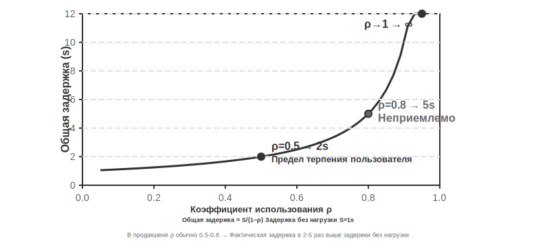

На этапе **LLM** Inference (инференс), даже при надлежащей оптимизации, в зависимости от длины контекста, задержка первого токена (TTFT, то есть время ожидания до того, как модель выдаст первое слово) часто составляет 100–500 мс, а вывод первого предложения требует еще около 100 мс. Если включен режим Reasoning (рассуждение), время может увеличиться до 5–10 секунд. В традиционных архитектурах TTS должна ждать, пока LLM полностью выведет текст ответа, прежде чем начать работу.

**TTS** преобразует текст ответа в речь, и синтез обычно занимает 200–500 мс. Если сложить задержки каждого звена (рис. 9-2): VAD (500–800 мс) + ASR (50–200 мс) + LLM (100–500 мс) + TTS (200–500 мс), общее время составит около 0,9–2 секунд — и это в идеальном случае, когда все сервисы свободны и нет очереди.

При запуске в эксплуатацию задержки из-за очередей только ухудшают ситуацию. Это работает так же, как очередь в ресторане: чем больше занята кухня, тем дольше время ожидания заказа, причем оно растет не линейно, а резко взлетает (рис. 9-3). Когда на сервере нет очереди ожидания (то есть «нулевая нагрузка»), время обработки одного запроса называется задержкой холостого хода. Но когда несколько запросов приходят одновременно, последующие запросы должны ждать в очереди.

Интуитивно понятно, что чем выше коэффициент использования, тем сильнее (нелинейно) возрастает время ожидания. Конкретная математическая зависимость описывается теорией очередей (здесь приводится только для интуитивного понимания, без строгого вывода): Общая задержка ≈ Задержка холостого хода × 1 / (1 - Коэффициент использования). Коэффициент использования — это доля времени, в течение которого сервер занят, например, использование 50% означает, что сервер половину времени обрабатывает запросы, а половину времени простаивает. При использовании 50% задержка становится в 2 раза больше холостой, а при 80% — в 5 раз. Вот почему серверы не могут долго работать под высокой нагрузкой.

 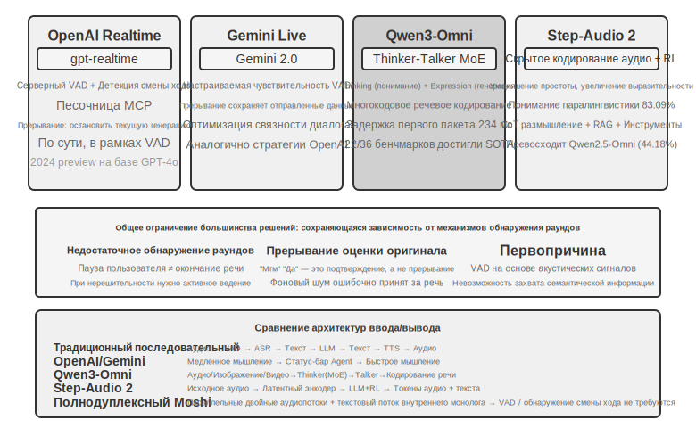

Стоит отметить, что к 2026 году путь «декоплеринга быстрого и медленного» (快慢解耦) стал мейнстримом для передовых голосовых продуктов и получил специальное название. Thinking Machines Lab называет это Interaction Models (интерактивные модели) — когда модель взаимодействия в реальном времени сопряжена с асинхронной фоновой моделью Reasoning (рассуждение). Проекты «Think Fast» в Grok Voice от xAI, голосовой Agent (агент) от Pine AI, а также упомянутое в предыдущем разделе «делегирование» в GPT-Live — все они следуют по одному и тому же пути: «быстрое на переднем плане поддерживает диалог, медленное в фоне ведет глубокое рассуждение».

> **Эксперимент 9-1 ★: Построение традиционного голосового Agent**

В данном эксперименте строится полноценная система голосового диалога в реальном времени, позволяющая пользователю взаимодействовать с AI голосом через микрофон. Система использует архитектуру с разделением фронтенда и бэкенда, взаимодействующих через WebSocket для связи в реальном времени.

 Основной процесс следует строгому последовательному режиму: фронтенд захватывает ввод с микрофона и отправляет его на бэкенд через WebSocket. На бэкенде работает модель Silero VAD (Voice Activity Detection — обнаружение голосовой активности), которая обеспечивает более высокую точность и помехоустойчивость по сравнению с традиционными методами детектирования громкости. После обнаружения непрерывной тишины в течение примерно 500 мс аудиофрагмент извлекается для последующей обработки.

 Этапы ASR (автоматическое распознавание речи), LLM (большая языковая модель) и TTS (синтез речи) поддерживают гибкое переключение между различными провайдерами, что позволяет разработчикам выбирать оптимальную комбинацию в зависимости от задержки, точности и сетевых условий региона.

 **Эксперимент 9-2 ★: Использование PineClaw Voice API для построения телефонного Agent**

 Эксперимент 9-1 был посвящен созданию системы голосового диалога в браузере, однако в реальном мире многие задачи Agent (агент) требуют совершения настоящих телефонных звонков — связи со службой поддержки для обсуждения счетов, бронирования столиков в ресторанах или подтверждения заказов. В четвертой главе через механизм Channel в PineClaw было показано, как событийная архитектура позволяет снизить задержку отклика на телефонные уведомления с минут до секунд; данный же эксперимент фокусируется на построении самого голосового вызова. На примере [PineClaw Voice API](https://pineclaw.com/) (разработанного командой авторов) показано, что подобные телефонные голосовые API промышленного уровня обычно инкапсулируют весь процесс: набор номера, навигацию по IVR (интерактивное голосовое меню, например, «нажмите 1 для справки, 0 для связи с оператором»), диалог и транскрипцию. После того как Agent получает номер телефона, цель и контекстную информацию, голосовой агент выполняет весь звонок целиком и возвращает структурированную запись разговора.

 **Цель эксперимента**: Построить Agent, способный выполнять задачи через реальные телефонные звонки, интегрировав PineClaw Voice в качестве инструмента в цикл ReAct.

 **Техническое решение**: Использовать PineClaw Voice Python SDK (`pine-voice`), оснастив Agent инструментом `make_phone_call`. Agent получает описание задачи от пользователя (например, «помоги мне записаться на осмотр к стоматологу на завтра на 15:00») и через рассуждения ReAct принимает решения: (1) какой номер телефона нужно набрать; (2) цель звонка и ключевая информация; (3) как отчитаться перед пользователем о результатах после завершения звонка.

 Рабочий процесс Agent: Пользователь говорит: «Помоги мне позвонить в клинику и записаться на завтрашний осмотр» → Agent обдумывает, какая информация необходима (телефон клиники, время записи, имя пациента) → Если информации недостаточно, запрашивает уточнение у пользователя → Вызывает инструмент `make_phone_call` → PineClaw совершает звонок, ведет диалог с собеседником, завершает бронирование → Agent получает резюме звонка и транскрипцию → Сообщает результат пользователю.

 **Критерии приемки**: Успешное совершение тестового звонка (можно сначала позвонить на свой мобильный для проверки связи). Agent должен уметь самостоятельно определять параметры звонка на основе описания задачи, а после завершения вызова — корректно извлекать ключевую информацию (время записи, номер подтверждения и т. д.) и докладывать пользователю. Сравнение разницы между прямым использованием API и вызовом через цикл ReAct — последний позволяет обрабатывать ситуации с неполной информацией (например, сначала выполнить поиск, если пользователь не предоставил номер телефона).

 Этот эксперимент демонстрирует важное направление применения голосовых агентов: **Agent может не только вести голосовой диалог с пользователем, но и взаимодействовать с внешним миром по телефону от имени пользователя**. Голосовые агенты PineClaw специально обучены справляться с многочасовым ожиданием на линии, навигацией по телефонным меню и сложными переговорами. Представьте, что AI вместо вас звонит в службу поддержки оператора связи и ждет соединения с «живым» оператором — это именно те сценарии, с которыми традиционные последовательные голосовые конвейеры справляются с трудом.

 ### Полносвязная потоковая передача каскадного конвейера

 Необходимо прояснить распространенное заблуждение: приведенный выше расчет задержки в 0,9–2 секунды относится к **полностью последовательному** сценарию, когда «каждое звено завершает работу перед передачей эстафеты». Однако производственные системы 2025 года уже давно так не работают. Основной подход заключается не в отказе от модульности, а в сохранении разделения ролей VAD-ASR-LLM-TTS при одновременном превращении каждого этапа в **Streaming** (потоковый), чтобы соседние звенья перекрывались во времени:

 - **ASR распознает на лету**: используется поточное распознавание; пользователь еще говорит, а текст уже непрерывно генерируется, не дожидаясь, пока VAD определит конец всей фразы для начала транскрипции;
 - **LLM выдает результат по предложениям**: модель генерирует текст и одновременно разбивает ответ на небольшие фразы по знакам препинания или семантике; как только первая фраза сформирована, она тут же отправляется дальше по цепочке, не дожидаясь завершения всего ответа;
 - **TTS синтезирует поток на уровне предложений**: получив первую короткую фразу, система начинает синтез и воспроизведение, а последующие предложения генерируются и добавляются в процессе. Таким образом, время до момента, когда пользователь услышит первый слог, значительно сокращается.

 В результате три этапа — ASR, LLM и TTS — перестают быть последовательной эстафетой и становятся похожи на три одновременно работающих поста на сборочном конвейере. По этому пути идут такие Open Source фреймворки, как LiveKit Agents и Pipecat, а также основные коммерческие системы исходящих звонков. При использовании полносвязной потоковой передачи сквозная задержка (end-to-end latency) обычно может быть сжата до 600–800 мс, что значительно лучше 0,9–2 секунд при полностью последовательной схеме.

Однако Streaming (потоковая передача) позволяет сжать только те вычисления, которые могут перекрываться: «транскрипция, размышление, синтез». Существует задержка, которую она не может устранить: **само ожидание тишины VAD и определение окончания реплики**. Система по-прежнему полагается на порог тишины в 500–800 мс, чтобы угадать, «закончил ли пользователь говорить». Это ожидание является обязательным условием для запуска конвейера, и его невозможно устранить за счет перекрытия этапов. Чтобы сократить и эту задержку, нужно перестать фокусироваться на «наложении уровней» и переключиться на само звено восприятия на переднем крае.

### Streaming Audio Perception (потоковое аудиовосприятие): замена VAD + ASR

Этот фронтенд восприятия состоит из двух уровней: VAD (детектор активности голоса) определяет, закончил ли пользователь говорить, а ASR (автоматическое распознавание речи) преобразует аудио в текст. Вместе они решают, когда запустится весь конвейер и какие входные данные он получит. Традиционный каскад VAD + ASR имеет три фундаментальные проблемы:

1.  **Накопление задержки**: VAD должен ждать 500–800 мс тишины, чтобы подтвердить завершение речи, так как он не может предсказать будущее и вынужден «подождать», чтобы отличить «действительный конец фразы» от «паузы для размышления».
2.  **Потеря информации**: VAD выдает только бинарный сигнал «голос/тишина»; при этом теряются все акустические детали: изменения эмоций, колебания интонации, нерешительные паузы, фоновая обстановка и т. д. Проблема ложных срабатываний особенно остро проявляется в сложных условиях: слишком долгая пауза пользователя ошибочно принимается за конец речи, что приводит к обрыву предложения; фоновый шум вызывает ложное срабатывание, когда никто не говорит; а короткое «угу» пользователя невозможно интерпретировать — хочет ли он перебить собеседника или просто подтверждает, что слушает.
3.  **Снижение точности**: VAD разрезает непрерывное аудио на независимые фрагменты, каждый из которых отправляется в ASR отдельно, что нарушает непрерывность контекста. Частота ошибок в контенте, требующем контекста (адреса электронной почты, названия брендов, имена, специальные термины), заметно возрастает. Например, если пользователь диктует почту «john dot smith at gmail dot com», и «john» со «smith» попадают в разные фрагменты, «smith» из-за отсутствия контекста может быть ошибочно распознано как «miss».

**Streaming Audio Perception Models** (потоковые модели аудиовосприятия) предлагают фундаментальное решение. Сначала уточним технический смысл термина «Streaming»: может ли аудиомодель работать в потоковом режиме, зависит от того, является ли **Encoder (кодировщик) каузальным или блочным** (зависит только от уже поступившего аудио, а не от всей записи целиком) и является ли **Decoding (декодирование) инкрементальным** (выдает часть результата на каждый полученный короткий фрагмент аудио). Whisper не может работать в потоковом режиме не из-за метода декодирования — его декодирование само по себе является авторегрессионным — а из-за того, что его кодировщику требуется полный сегмент аудио (фиксированные 30 секунд, дополненные тишиной при необходимости), чтобы начать работу. Также стоит пояснить, что само по себе потоковое распознавание не является новой технологией: традиционные Streaming ASR, представленные моделями RNN-T и потоковыми Conformer, уже давно масштабно внедрены в индустрии — субтитры в реальном времени на смартфонах и голосовой ввод в клавиатурах используют именно такие модели, и они никак не связаны с LLM.

В данном разделе рассматривается новый путь: **Streaming Audio Perception на базе LLM** — использование открытых LLM в качестве Backbone (базовой модели) с последующим Post-training (постобучением), чтобы модель напрямую выдавала семантический ответ из непрерывного аудиопотока, объединяя «распознавание» и «понимание» в одной модели. Это апгрейд традиционных Streaming ASR, а не изобретение потоковой технологии: задержка инкрементального распознавания остается на уровне времени одного шага Inference (вывода) (от нескольких десятков до 100–200 миллисекунд), но модель видит уже не изолированные фрагменты, нарезанные VAD, а непрерывный аудиопоток от начала диалога до текущего момента. Это позволяет использовать In-Context Learning (обучение в контексте) на основе полного контекста, что значительно повышает точность распознавания личных данных пользователя, профессиональных терминов и особенностей произношения.

Другим ключевым преимуществом этого направления является наследование знаний о мире и способности к логическому выводу на основе здравого смысла от LLM — ведь базовая модель видела огромные массивы текста. Например, модель знает, что после слова «Apple» слово «презентация», скорее всего, относится к компании, а не к фрукту. Такое усиление знаниями позволяет достичь точности распознавания высокозначимой информации (сумм, географических названий, брендов), далеко превосходящую традиционные ASR. В этом направлении уже существуют готовые к применению модели, такие как Ultravox от Anthropic — она направляет аудио напрямую в Backbone LLM и выводит текст вместе с семантическими токенами; Qwen2-Audio и Qwen2.5-Omni от Alibaba (ByteDance), использованные в экспериментах этого раздела, также относятся к этому типу Audio-native (нативных аудиомоделей).

Однако замена VAD (Voice Activity Detection — обнаружение активности голоса) не обязательно требует задействования полноценной мультимодальной аудиомодели. Если нужно решить только первый вопрос — **определить, закончил ли пользователь говорить**, — существует более «легкий» путь: встроить это «суждение о раунде» (turn detection) непосредственно в сам распознаватель [^ch9-11]. Подход заключается в добавлении LoRA к небольшой open-source модели потокового распознавания, чтобы она в процессе транскрибации **комплексно оценивала семантику и тишину**, определяя, «выражает ли эта фраза законченную мысль». Поскольку паузы внутри раунда (например, заминка при диктовке номера телефона) часто бывают длиннее межраундовых интервалов, полагаться только на порог тишины — значит неизбежно проигрывать в обоих случаях. Еще более интересный вывод: колебания модели в вопросе «стоит ли завершать прием речи» часто коренятся не в архитектуре, а в том, что **обучающие метки были размечены с «позиции бога»** — при разметке использовалось аудио, идущее после точки принятия решения, тогда как онлайн-модель не видит будущего. Если изменить каждую метку так, чтобы она ставилась «только на основе информации, доступной в момент принятия решения», это ложное колебание исчезает. Это перекликается с выводом из седьмой главы о Post-training: зачастую данные важнее архитектуры. Этот облегченный путь уже имеет реализации промышленного уровня: Flux от Deepgram и Universal-Streaming от AssemblyAI встраивают определение конечных точек и смену раундов прямо в модели потокового распознавания, специально разработанные для голосовых Agent (агент); в open-source сегменте модели семантического детектирования раундов предоставляют LiveKit и Pipecat.

[^ch9-11]: О встраивании суждения о раунде в распознаватель и диагностике «разметки с позиции бога» см. Li, Bojie and Noah Shi. *The Trade-off Was in the Labels: Causal Supervision for Turn-Aware Streaming ASR.* 2026 (готовится к публикации).

Модель выводит не только текст, но и серию **специальных маркеров акустических событий** — это выделенные token (токен), введенные при обучении, которые модель учится выдавать автоматически при обнаружении соответствующих акустических событий. Основные категории включают:

- `<speak_start/end>`: определение начала и конца речи на основе комплексного семантического и акустического анализа, а не простого детектирования тишины.
- `<interrupt>`: разграничение ситуаций, когда пользователь действительно хочет перебить, и когда он просто поддакивает или мешают фоновые шумы.
- `<emotion:happy/frustrated>`: маркеры эмоций.
- `<laugh>` / `<sigh>`: смех, вздох и другие паралингвистические сигналы.
- `<music>` / `<noise>`: звуки окружающей среды.

Эти маркеры и текстовые токены формируют единый поток событий, который вместе поступает на уровень «мышления».

Обратите внимание, что выход модели — это не просто текстовая транскрипция, но и маркеры речевых событий (начало/конец речи, изменение эмоций, интервалы тишины). Фреймворк Agent может использовать эти маркеры для реализации более естественного взаимодействия — например, проактивно предлагать варианты, когда обнаружено замешательство пользователя.

> **Эксперимент 9-3 ★: Использование Qwen2-Audio для симуляции потокового восприятия речи**
>
> Сначала поясним дизайн эксперимента: Qwen2-Audio сама по себе является не-потоковой моделью с вводом целого сегмента. В данном эксперименте используется **блочный ввод для симуляции потоковой обработки** — непрерывный аудиопоток нарезается на блоки фиксированной длины, каждый блок отправляется в модель вместе с накопленным ранее аудиоконтекстом, модель постепенно генерирует текст и токены акустических событий (такие как смех, паузы и другие неречевые сигналы), при этом измеряется задержка (latency) для каждого блока от момента подачи до выдачи текста. Здесь есть критическая цена: энкодер Qwen2-Audio не является инкрементальным, и при обработке каждого нового блока приходится заново кодировать весь накопленный ранее аудиоконтекст. Поэтому чем длиннее диалог и чем больше накопленного аудио, тем выше задержка кодирования одного блока — в этом и заключается принципиальное различие между «симуляцией потока» и «честным потоком» (где используются инкрементальные или каузальные энкодеры, кодирующие только вновь прибывший короткий фрагмент аудио). Такой дизайн позволяет продемонстрировать выигрыш в точности за счет «непрерывного восприятия с сохранением полного контекста», но цифры задержки отражают лишь зернистость блоков и скорость инференса, а не Time to First Token (время до первого токена) моделей, изначально спроектированных как потоковые (например, Qwen3-Omni с блочным кодированием); заинтересованные читатели могут повторить эксперимент с последней. В качестве эталона для сравнения используется традиционный конвейер VAD + Whisper ASR (автоматическое распознавание речи). Тестируются три сценария: обычный диалог, длинные предложения с паузами, диалог с фоновым шумом.
>
> Результат: задержку инкрементального распознавания в схеме с блочной симуляцией можно удерживать в пределах 100–200 мс (в зависимости от длины блока и аппаратного обеспечения), в то время как традиционной схеме нужно дождаться подтверждения VAD о завершении речи (600 мс) плюс инференс Whisper (около 200–500 мс в конфигурации эксперимента), что в сумме дает 800–1100 мс. В сценарии с паузами VAD ошибочно принимал первую же долгую паузу за конец речи, разбивая предложение на два сегмента для раздельного распознавания; фраза «примерно в два часа» из-за отсутствия контекста была ошибочно распознана как «примерно в ноль часов». Блочная же схема сохраняла полный контекст и корректно распознала всё предложение. В сценарии с фоновым шумом Qwen2-Audio выводила токен `<|noise|>`, помечая наличие шума, но не прерывая распознавание, в то время как традиционный VAD ложно срабатывал на шум, что приводило к преждевременному запуску процесса распознавания.

## Парадигма II · Сквозные мультимодальные модели (Omni)

```
Input audio: "Um, actually I think... no wait, let me reconsider."
Model output stream:
  <speak_start> Um, <emotion:hesitant> actually I think...
  <silence:500ms> no wait, <emotion:confident> let me reconsider <speak_end>
```

Оглядываясь на всю каскадную цепочку (pipeline): даже если сенсорный фронтенд заменен на потоковое речевое восприятие, в конечном итоге задачи «слушать, думать, говорить» по-прежнему распределяются между тремя независимыми моделями, соединенными друг с другом дискретными интерфейсами. Каким бы широким ни был этот интерфейс, он представляет собой лишь набор семантических token (токенов) и разрозненных акустических маркеров — текущие эмоции говорящего, его тон, интонация, а также фоновые звуки и музыка в значительной степени теряются при передаче. Более того, три сегмента обучаются и оптимизируются по отдельности, что затрудняет их совместную работу. Энд-ту-энд (End-to-End) мультимодальные модели (Omni) выбирают другой путь — одна модель напрямую «слушает» аудио, «обдумывает» ответ и «произносит» его, объединяя три этапа в один (рис. 9-4). При наличии достаточного количества обучающих данных Latent Space (скрытое пространство) модели способно передавать эту паралингвистическую информацию непосредственно на сторону генерации, минуя текст: задержка становится ниже, а ритмика и эмоции сохраняются. Компромисс заключается в следующем: **каскадная цепочка** обладает четкой модульностью, каждый сегмент может настраиваться независимо, и она обладает хорошей интерпретируемостью; **End-to-End модель** обеспечивает меньшую задержку и позволяет сохранять невербальную информацию ценой более высоких требований к обучающим данным и худшей интерпретируемости.

Необходимо добавить еще одно часто игнорируемое измерение: преимущество End-to-End в основном проявляется в **Latency** (задержке), но не обязательно в **Accuracy** (точности). Решением, заслуживающим сравнения, является **Self-cascade** (самокаскадирование) — когда одна и та же модель сначала транскрибирует аудио в структурированный текст, а затем выполняет рассуждение на основе этого текста. Что из этого обеспечит более высокую точность по сравнению с однократным End-to-End ответом, зависит от конкретной задачи. Закономерность можно обобщить так: когда ответ в основном определяется семантическим содержанием (то есть тем, «что было сказано») и промежуточного текста достаточно для полной передачи релевантной информации, точность Self-cascade сопоставима с End-to-End или даже превосходит ее. Это преимущество особенно заметно на моделях со слабыми сенсорными способностями. И наоборот, когда ответ сильно зависит от невербальных сигналов, которые трудно представить текстом (интонация, эмоции, фоновый шум), End-to-End проявляет явное превосходство. Что еще важнее, преимущество того или иного подхода **можно определить заранее на основе характера задачи**, а не просто списывать на то, что «End-to-End более продвинут». Из этого можно вывести принцип проектирования: ключом к производительности часто является не само наличие промежуточного представления как **Bottleneck** (узкого места), а информация, которую это узкое место несет. Если поднять промежуточный текст от простой транскрипции до структурированного представления с паралингвистическими маркерами (эмоции, темп речи, фоновый шум), изначальное преимущество End-to-End в точности часто сокращается. Это перекликается с тезисом из раздела «Потоковое речевое восприятие» о том, что уровень восприятия не должен выводить только чистый текст[^ch9-13].

Однако какой бы мощной ни была Omni, по сути она лишь объединяет три модели в одну и **не отменяет допущение о «разговоре по очереди»**: она по-прежнему полагается на VAD для распределения права на реплику — как только обнаруживается голос пользователя, модель замолкает, а как только пользователь замолкает, модель тут же начинает говорить. В результате снова возникает знакомая проблема: пользователь диктует ряд цифр, делает небольшую паузу в середине, и Omni решает, что собеседник закончил, и грубо вклинивается в разговор. Упомянутое ранее потоковое речевое восприятие может перевести суждение о смене очереди с длительности тишины на семантический уровень, что значительно смягчает подобные ошибки, но в конечном итоге это лишь локальное исправление в рамках структуры «очередности», которое не отменяет саму поочередность. Чтобы **фундаментально** выйти из этого тупика, нужно не латать дыры в рамках «очередей», а позволить модели одновременно слушать и говорить, самостоятельно решая, когда открывать рот, чтобы больше не существовало жесткого переключения «чья сейчас очередь говорить».

[^ch9-13]: О том, когда преимущество в точности между каскадом и End-to-End меняется на противоположное и как предсказать это направление на основе характера задачи (способно ли промежуточное представление полностью нести информацию о задаче), см. полное кросс-модальное исследование: Li, Bojie and Noah Shi. *The Cascade Gap: When and Why Self-Cascades Help Multimodal Agents.* 2026 (готовится к публикации).

**OpenAI Realtime API** на уровне модели близок к End-to-End (модель нативно обрабатывает аудио), но на уровне управления взаимодействием все еще полагается на традиционный VAD, являясь промежуточным решением на пути к полному End-to-End. Изначально (в preview 2024 года) он работал на GPT-4o, а после официального GA в 2025 году перешел на независимую специализированную голосовую модель **gpt-realtime** (это больше не режим GPT-4o, а модель, оптимизированная специально для real-time голоса). В API по умолчанию включен серверный VAD, который автоматически определяет начало и конец речи пользователя. Поддерживается прерывание в диалоге: при обнаружении речи пользователя генерация текущего аудио немедленно прекращается, подобно тому как при общении лицом к лицу один человек вклинивается, а другой естественно замолкает. В gpt-realtime также введено асинхронное Tool Calling (вызов функций): модель может продолжать разговаривать с пользователем, ожидая результатов от инструментов, скрывая задержку выполнения в процессе диалога. Все это улучшает опыт, но по сути остается оптимизацией в рамках VAD. **Gemini Live API** придерживается схожей логики, поддерживает настройку чувствительности VAD и сохраняет уже отправленную информацию при прерывании для обеспечения связности диалога.

**Qwen3-Omni** использует архитектуру Thinker-Talker: разделяет мышление (понимание и рассуждение) и выражение (генерация речи) на два специализированных модуля, объединяя восприятие и генерацию текста, изображений, аудио и видео.

Step-Audio R1 предлагает принципиально иной подход в этом направлении: встраивание способностей к рассуждению напрямую в End-to-End (сквозную) аудио-языковую модель, достигая истинного эффекта «думай, пока говоришь» через двухпроцессорную архитектуру (双脑架构). Она состоит из двух взаимодополняющих механизмов, решающих разные задачи: **MGRD (Modal-anchored Grounded Reasoning Distillation)** сначала решает вопрос «правильно ли я думаю» — заставляя модель строить рассуждения на основе акустических признаков, а не просто текстовой транскрипции; а **двухпроцессорная архитектура MPS** решает вопрос «вовремя ли я говорю» — позволяя мышлению и выражению идти параллельно, обеспечивая низкую задержку. Первое является прекурсором второго: только когда само мышление укоренено в звуке, принцип «думай, пока говоришь» обретает настоящую ценность. Разберем их по порядку.

Для того чтобы сохранять высокую производительность при одновременном контроле вычислительных затрат, Qwen3-Omni использует архитектуру MoE (Mixture of Experts, смесь экспертов) — это можно понимать как «вызов команды экспертов по требованию»: внутри содержится несколько малых экспертных сетей, и при каждой итерации Inference (вывод) активируются только несколько наиболее релевантных текущей задаче, в то время как остальные не участвуют в вычислениях. Например, при обработке речи в основном активируются эксперты, связанные с аудио, а при обработке изображений — эксперты по зрению. Таким образом, модель может обладать огромным общим количеством параметров (что гарантирует высокий потолок возможностей), сохраняя при этом фактический объем вычислений на один Token (токен) очень маленьким, что повышает пропускную способность и снижает задержки в очереди при высокой нагрузке.

Важно различать: MoE решает проблему пропускной способности — «сколько запросов может обслужить единица вычислительной мощности», но не определяет напрямую, «насколько быстро будет выдан первый аудиопакет». Задержка первого пакета (First Token Latency) зависит от архитектуры генеративной части. Низкая задержка Qwen3-Omni обусловлена дизайном модуля Talker: он постепенно генерирует аудиотокены методом Multi-codebook Autoregression (авторегрессия с несколькими кодовыми книгами), а в сочетании с Causal (причинным) Codec эти токены инкрементально декодируются в волновую форму. Поэтому, как только модуль размышления выдает текст, Talker может сразу начать потоковый синтез речи, не дожидаясь завершения генерации всего ответа. Согласно официальным отчетам, теоретическая задержка первого пакета при «холодном старте» составляет всего около 234 мс; модель поддерживает понимание 19 языков и генерацию на 10 языках, лидируя в 22 из 36 аудиовизуальных бенчмарков.

**Step-Audio 2** идет другим путем: напрямую обрабатывает сырой аудиовход и выдает текст и аудио, реализуя настоящий End-to-End (сквозной) голосовой диалог. Она способна понимать не только то, что было сказано (семантическая информация), но и то, как это было сказано — Paralinguistic Information (паралингвистическая информация), например, эмоции говорящего (радость или гнев), темп речи (поспешный или нерешительный), интонацию (восходящую или нисходящую), а также фоновые звуки окружающей среды и музыку. Благодаря мышлению и Reinforcement Learning (обучение с подкреплением) она генерирует экспрессивные ответы, а также интегрирует механизмы RAG (генерация с извлечением) и внешние инструменты (веб-поиск, поиск аудио). Согласно статье по Step-Audio 2, на предложенном ими бенчмарке понимания паралингвистики StepEval-Audio-Paralinguistic точность Step-Audio 2 достигла 83,09%, что выше показателей открытой мультимодальной модели того же периода Qwen2.5-Omni (44,18%), а также GPT-4o Audio (43,45%) и Kimi-Audio (49,64%).

Step-Audio R1 является продолжением серии Step-Audio. На базе архитектуры сквозного голосового диалога Step-Audio 2 она делает следующий шаг, напрямую интегрируя способности к рассуждению в аудиомодель; обе модели представляют собой последовательную эволюцию одной и той же технологической линии.

## Парадигма 3 · Полнодуплексные интерактивные модели (Full-Duplex / Interactive)

Вторая парадигма объединила три модели в одну, но по-прежнему придерживается гипотезы «разговора по очереди» — либо говорит пользователь, либо модель, а момент переключения угадывается с помощью VAD или семантики. Однако существуют сценарии, где формат «ты — мне, я — тебе» попросту невозможен. **Синхронный перевод** — один из таких примеров: переводчик не ждет, пока оратор закончит целое предложение, а начинает формулировать мысли в уме в процессе прослушивания, выдавая перевод, как только смысл смысловой группы становится достаточно полным. Прослушивание и перевод всегда происходят одновременно. Ритм-игры, где нужно **отбивать дробь под музыку**, являются еще более экстремальным случаем: слух должен непрерывно отслеживать непрерывный музыкальный поток, руки — вовремя совершать удары, попадая в такт, и при этом нужно предсказывать следующий бит. Здесь даже нет понятия «хода» (turn) — входные данные представляют собой никогда не прекращающийся непрерывный поток. Задачи такого типа бросают фундаментальный вызов режиму Turn-by-turn: они требуют одновременного выполнения прослушивания, мышления и действий, в то время как предпосылкой пошагового режима является разделение этих трех процессов на разные временные отрезки. Полнодуплексные модели доводят идею «избавления от VAD» до логического завершения — они просто отказываются от гипотезы очередности, позволяя модели **одновременно и непрерывно слушать и говорить**.

Первым заметным исследованием в этой области стала модель **Moshi** (2024) от Kyutai. Она параллельно моделирует два аудиопотока (голос пользователя и собственный голос модели), дополняя их текстовым потоком «внутреннего монолога» для повышения лингвистического качества генерируемой речи. Поскольку модель слушает в любой момент времени, перекрывающаяся речь и возможность перебить ее в любой момент становятся естественным поведением, не требующим никакой явной логики обнаружения прерывания. Сквозная задержка составляет около 200 мс, что близко к естественному ритму человеческого общения.

В 2026 году **Thinking Machines Lab**, основанная Mira Murati, представила превью новой категории, которую они назвали **Interaction Model** (интерактивная модель)[^ch9-14], и четко сформулировала основную идею Full Duplex: интерактивность не должна реализовываться извне модели с помощью внешних Harness (обвязок) вроде VAD, а должна быть встроена в саму модель. По ее словам, «чтобы интерактивность масштабировалась вместе с интеллектом, она должна стать частью самой модели». На уровне архитектуры это воплотилось в **micro-turn** (микро-раунды): модель не ждет завершения всего раунда речи, а работает сегментами примерно по 200 мс, непрерывно «считывая 200 мс и генерируя 200 мс», переплетая потоки аудио, видео и текста. Такая гранулярность — осознанный компромисс: она достаточно мелкая, чтобы тишина, наложения и прерывания сохранялись в Context Window (контекстное окно) модели как непрерывный поток, избавляя от необходимости подстраиваться под искусственные границы раундов; и достаточно крупная, чтобы обрабатывать мультимодальные потоки блоками параллельно, удерживая задержку в пределах реального восприятия. Благодаря тому, что взаимодействие включено внутрь модели, такие действия, как «слушать и говорить одновременно» или «смотреть и вставлять реплику», которые раньше требовали специальных Harness, теперь стали прямой обязанностью модели и растут в качестве вместе с ней: первая модель TML-Interaction-Small обучалась на трех потоках данных с нуля и может сама начать разговор, если заметит, что пользователь пишет код с багом или кто-то вошел в кадр.

Ее подход к подключению «медленного мышления» также весьма показателен. Сама Interaction Model отвечает только за поддержание диалога в онлайне. Как только возникает вопрос, требующий глубокого рассуждения или Tool Calling (вызов инструментов), она делегирует задачу более мощной фоновой модели рассуждений — при этом передается не изолированный запрос, а **контекст всего диалога**. Пока фоновая модель рассуждает, результаты передаются потоком обратно, а Interaction Model выбирает подходящий момент, чтобы естественно вплести их в диалог, не прерывая пользователя и продолжая поддерживать беседу, отвечая на уточняющие вопросы. Таким образом, достигаются возможности планирования, инструментов и Agent (агент) на уровне «модели рассуждений» при задержках «не-мыслящей модели». Согласно официальному отчету, задержка переключения раундов у TML-Interaction-Small (MoE с 276B параметров, 12B активных) составляет всего около 0,40 секунды (у GPT-realtime-2.0 — около 1,18 секунды), что значительно опережает конкурентов с почти нулевыми показателями в бенчмарках на визуальную проактивность; на момент написания книги модель все еще находится в стадии Research Preview.

В том же году OpenAI выпустила **GPT-Live**, которая вывела Full Duplex на производственные масштабы, став новой стандартной моделью для голосового режима ChatGPT по всему миру. Она больше не рассматривает диалог как последовательность дискретных раундов сообщений, а **непрерывно обрабатывает входные данные, одновременно генерируя выходные**, что позволяет ей принимать множество интерактивных решений в секунду: стоит ли начать говорить, продолжать слушать, сделать паузу, прервать пользователя или вызвать инструмент. На практике это выглядит так: когда пользователь думает, модель спокойно ждет, не перебивая, использует междометия вроде «угу» или «да», чтобы показать, что слушает, и справляется с такими задачами, как синхронный перевод, где необходимо говорить и слушать одновременно.

GPT-Live пошла по тому же пути разделения «быстрого» и «медленного» — **декуплинг «режима реального времени» и «глубокого мышления»**: при необходимости поиска, рассуждений или сложных агентских операций GPT-Live, отвечающая за взаимодействие, делегирует задачу фоновой Frontier-модели (на момент выпуска — GPT-5.5), сама продолжая поддерживать поток диалога, пока не вернет результат из бэкенда. GPT-Live-1 и версия mini используют на бэкенде GPT-5.5 Instant, в то время как уровни Medium и High обращаются к GPT-5.5 с поддержкой рассуждений, позволяя пользователю выбирать между «скоростью» и «глубиной». Это «разделение быстрого и медленного» станет темой следующего раздела «Компромиссы в архитектуре мышления».

Вспоминая цепочку повествования об «отказе от VAD» в этой главе: VAD полагается на пороги тишины, чтобы угадать смену права на реплику; потоковое восприятие (см. раздел «Потоковое речевое восприятие» в первой парадигме выше) переносит суждение о смене реплики на семантический уровень; а полнодуплексная модель полностью устраняет само понятие «переключения» — она слушает всегда. «Прерывание» больше не является событием, требующим специальной обработки, и благодаря этому архитектурная цепочка обработки barge-in избавляется от большинства звеньев. Это конечная точка линии «замены VAD» на момент написания книги.

## Компромиссы в архитектуре мышления: от разделения к единству

Настоящая проблема, которую предстоит решить, — это **противоречие между мгновенным откликом и глубоким мышлением**: пользователи ожидают ответа за миллисекунды, тогда как сложные задачи требуют секунд на раздумья. Как сохранить низкую задержку, позволяя модели думать достаточно глубоко? Это противоречие характерно не только для сквозных (End-to-End) архитектур — каскадные конвейеры (Pipeline) также не могут его избежать.

Три приведенных ниже решения не являются линейной итерацией технологий — это дизайнерские компромиссы для разных условий. Они сосуществуют на практике, и выбор зависит от требований сценария к задержке и глубине мышления. Важно сначала обозначить различия: варианты 1 и 2 по сути представляют собой разделение на «быстрое и медленное» через два независимых параллельных процесса и не зависят от сквозной архитектуры (их можно применить даже к каскадным Pipeline); и только вариант 3 по-настоящему встраивает мышление внутрь сквозной модели.

[^ch9-14]: Thinking Machines Lab, “Interaction Models: A Scalable Approach to Human-AI Collaboration,” 2026-05. https://thinkingmachines.ai/blog/interaction-models/

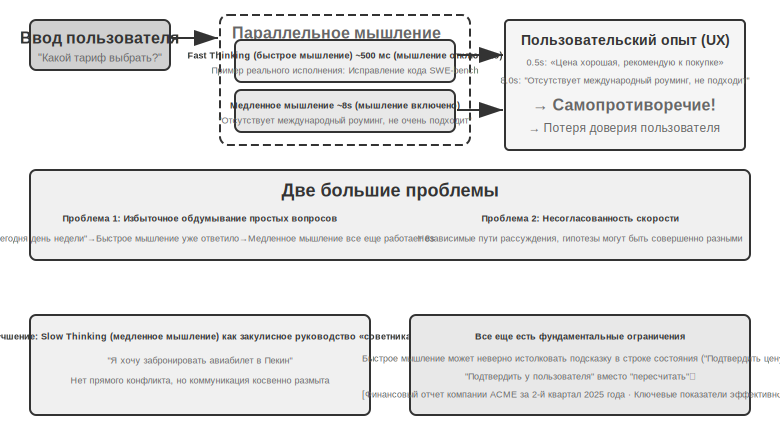

За выбором декоплеринга вместо «обучения одной универсальной модели» стоит прагматичная причина: передовые Reasoning-модели итерируются каждые несколько месяцев, в то время как способности к живому взаимодействию требуют специфических данных и целей обучения. Попытка втиснуть и то, и другое в одну модель равносильна попытке попасть в постоянно движущуюся мишень; кроме того, это может размыть самые ценные способности к рассуждению [^ch9-8]. Напротив, если оставить мощнейшую Reasoning-модель в фоне без изменений и обучить лишь легкую интерактивную модель для фронтенда, можно всегда использовать самый актуальный и сильный «мозг». Именно поэтому в GPT-Live подчеркивается возможность «устойчивой замены на новейшие SOTA-модели». Ниже рассмотрим три варианта в порядке усиления механизма координации.

### Вариант 1: Быстрое мышление для реакции, медленное — для ответа

Быстрое и медленное мышление выполняются параллельно (рис. 9-5): быстрое мышление выдает короткую реактивную реплику в пределах 500 мс (подобно тому, как человек сначала говорит «дай-ка подумать»), а медленное мышление тратит 5–10 секунд в фоне на глубокую проработку, после чего выдает полный ответ. Технология, используемая медленным мышлением, называется Test-time Scaling (масштабирование во время вывода) — проще говоря, это позволяет модели «подумать подольше» при ответе на вопрос: не выдавать результат за один шаг, а подобно человеку, решающему математическую задачу, сначала наметить ход мыслей, пошагово вывести решение и проверить результат, обменивая большее количество вычислительных шагов на более высокое качество ответа.

**Проблема 1: Избыточное обдумывание простых вопросов**. Пользователь спрашивает: «Какой сегодня день недели?». Быстрое мышление уже за 500 мс верно ответило: «Среда», но медленное всё равно прогоняет полный 10-секундный цикл размышлений, чтобы снова повторить: «Среда». Это не только тратит вычислительные ресурсы, но и, что более серьезно, разрушает ритм диалога — пользователь уже получил ответ и готов перейти к следующей теме, как вдруг его прерывают дублирующим ответом. **Проблема 2: Несогласованность быстрого и медленного**. Оба процесса независимы и параллельны; хотя они видят один и тот же контекст, пути их рассуждений могут полностью разойтись. Быстрое мышление может дать предварительный ответ на основе определенного предположения, в то время как медленное обнаружит, что это предположение неверно, и придет к противоположному выводу. Пользователь в течение нескольких секунд слышит два взаимоисключающих ответа, и доверие мгновенно рушится. Первопричина в том, что Вариант 1 разделяет диалог на два независимых процесса мышления, а не на связную когнитивную деятельность — между быстрым и медленным не хватает механизма координации.

### Вариант 2: Быстрое мышление для взаимодействия, медленное — для подсказок

В Варианте 2 медленное мышление видит вывод быстрого и дает советы через строку состояния Agent (механизм динамической инъекции метаинформации, описанный во второй главе), вместо того чтобы напрямую обращаться к пользователю. По сравнению с первым вариантом здесь есть два улучшения: медленное мышление работает асинхронно в фоне, используя паузы в речи для продолжения раздумий; и поскольку оно видит вывод быстрого мышления, прямого конфликта не возникает — оно отходит на второй план в роль «советника». Упомянутые ранее делегирование в GPT-Live и голосовой Agent от Pine AI — это примеры реализации Варианта 2 в продакшене: фоновая Reasoning-модель передает выводы через сжатый текстовый канал интерактивной модели на переднем плане, а та уже решает, когда и в каких формулировках озвучить их пользователю.

Однако у этого подхода все еще есть фундаментальные ограничения. **Быстрое мышление может не слушаться команд** — коммуникация между двумя независимыми инстансами мышления косвенная и нечеткая. Получив данные из строки состояния Agent, быстрое мышление может интерпретировать их неверно: например, понять «нужно перепроверить цену» как «спросить пользователя, приемлема ли цена», вместо того чтобы понять «цена рассчитана неверно, нужно пересчитать». **Невозможность получить промежуточные результаты** — за 10 секунд медленное мышление уже сгенерировало массу ценных промежуточных выводов, но быстрое их не видит и вынуждено просто ждать финального обновления строки состояния. Если пользователь снова задаст вопрос или прервет модель до завершения медленного мышления, быстрое сможет ответить только исходя из своего ограниченного понимания. Это похоже на двух людей, которые вместе решают задачу, но могут общаться только записками, не видя черновиков друг друга.

Вариант 2 также сталкивается с фундаментальной теоретической проблемой: **невозможность реализовать принцип «думай, пока говоришь»**. Человек, сталкиваясь со сложным вопросом, не прокручивает в голове полный ответ, чтобы потом выдать его на одном дыхании; он думает и говорит частями: «Это очень интересный вопрос... (пауза на раздумья) Во-первых, нам нужно рассмотреть... (продолжает думать) Во-вторых...». В Варианте 2 быстрое мышление может лишь вставлять слова-филлеры в ожидании результата от медленного, оно не способно естественно вплетать процесс мышления в ткань диалога.

### Вариант 3: Единство мышления и выражения End-to-End (на примере Step-Audio R1)

Хотя Вариант 2 решает проблему ожидания медленного мышления, архитектурно он все еще остается в рамках парадигмы «сначала подумай, потом скажи» — мышление и выражение остаются двумя разделенными процессами. Чтобы преодолеть это ограничение, необходимо интернализировать способность к мышлению непосредственно внутри модели.

<user>Этот тариф мне подходит?</user>

<!-- Быстрое мышление через 0.5 сек -->

```
<assistant（быстрое мышление）>У этого тарифа очень выгодная цена, я рекомендую вам его приобрести.</assistant>
<user>Хорошо, тогда я...</user>
<!-- Медленное мышление завершено через 8 сек -->
<assistant（медленное мышление）>Подождите, я обнаружил, что в этом тарифе отсутствует нужная вам функция международного роуминга, возможно, он не совсем подходит.</assistant>
<user>（в гневе） Так ты советуешь мне покупать или нет?!</user>
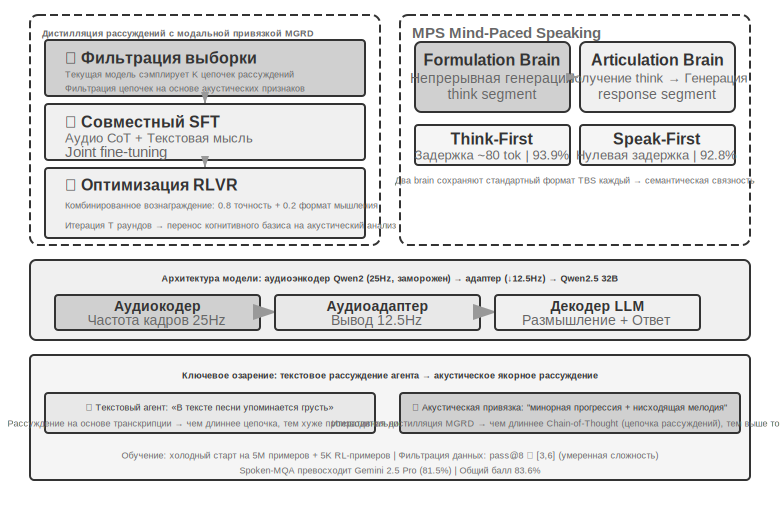
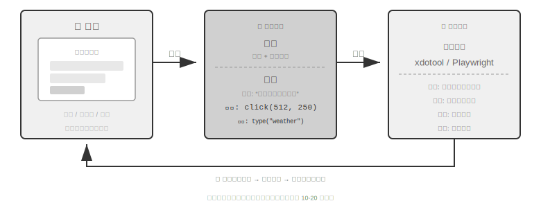
```

**Textual Surrogate Reasoning (текстовое суррогатное рассуждение)**. В идеале речевая модель должна напрямую анализировать акустические характеристики (такие как высота звука, ритм, интонация), чтобы понять эмоции или намерения говорящего. Однако на практике многие модели идут по пути наименьшего сопротивления: в существующих аудио-языковых моделях наблюдается контринтуитивный феномен — чем длиннее Chain-of-Thought (цепочка рассуждений), тем хуже производительность. Команда Step-Audio R1 обнаружила первопричину — «Textual Surrogate Reasoning» (использование текстовой информации вместо акустической для анализа): когда модель «думает», она на самом деле опирается на текстовую транскрипцию для семантических рассуждений, а не анализирует реальные акустические признаки. Например: если попросить модель определить настроение песни, она сделает вывод на основе того, что «в тексте упоминается грусть», а не потому, что «минорная мелодия в сочетании с нисходящим контуром высоты тона передает чувство печали». Это модальное несоответствие проистекает из обучающих данных: данные CoT для большинства аудиомоделей генерируются текстовыми моделями и, естественно, наследуют паттерны мышления, присущие чистому тексту.

**MGRD (Modality-Grounded Reasoning Distillation, дистилляция рассуждений с привязкой к модальности)** решает эту проблему посредством итеративного самосовершенствования (рис. 9-6). Несмотря на сложное название, основная идея интуитивно понятна: отфильтровать те процессы мышления, в которых модель «действительно слушает звук», и использовать их для обучения, чтобы модель научилась анализировать ушами, как учитель музыки, а не просто читать текст, как литературный редактор. Процесс делится на три этапа:

1. Текущая модель генерирует несколько различных цепочек рассуждений для одного и того же аудиофрагмента, после чего отбираются те, что действительно основаны на акустических признаках. Как происходит отбор? Проверяется, упоминаются ли в содержании рассуждений конкретные параметры звука. Например, для гневной речи текстовое рассуждение будет звучать так: «Пользователь сказал негативное слово "ужасно", поэтому я сужу о гневе» — это лишь анализ текста. А рассуждение на основе акустики будет звучать так: «Темп речи на 40% быстрее обычного, громкость заметно повышена, тон стал резким» — вот это и есть настоящее «слушание» звука. MGRD выбирает второй вариант.
2. Модель переобучается на этих высококачественных данных рассуждений, что усиливает её способность «думать ушами».
3. Дальнейшая оптимизация через Reinforcement Learning (обучение с подкреплением), чтобы предотвратить «лень» модели, когда она пытается угадать ответ, пропуская этап рассуждений.

После нескольких итераций фундамент мышления постепенно смещается от текстовых абстракций к акустическому анализу — модель начинает обращать внимание на то, что «контур высоты тона резко падает на 1,2 секунде», вместо того чтобы расплывчато заявлять: «говорящий кажется расстроенным».

**Двухмозговая архитектура MPS** (Mind-Paced Speaking, дословно «речь в темпе мысли») решает противоречие между задержкой мышления и выводом речи (рис. 9-6). Она вдохновлена разделением функций в человеческом мозге: области, отвечающие за мышление и за организацию речи, разделены и могут работать параллельно — вы обдумываете следующую фразу, пока ваш рот произносит предыдущую. MPS имитирует это разделение с помощью двух моделей: **Formulation Brain (формулирующий мозг)** отвечает за непрерывное мышление и выдачу сегментов результатов рассуждений; **Articulation Brain (артикулирующий мозг)** при получении каждого нового сегмента рассуждений объединяет его с предыдущим контекстом и уже имеющимся ответом, преобразуя всё это в голосовой ответ.

Обе части работают параллельно: Formulation Brain не нужно додумывать всё до конца, чтобы Articulation Brain уже начал говорить. Например, в момент t=0ms Formulation Brain начинает анализировать вопрос пользователя и в t=200ms выдает первый сегмент рассуждений (последовательность текстовых токенов); Articulation Brain получает этот результат в t=200ms и, учитывая контекст уже сгенерированного ответа, в t=350ms начинает выводить соответствующие аудио-токены — два модуля работают параллельно в режиме конвейера, и пользователь уже в t=350ms слышит первый слог.

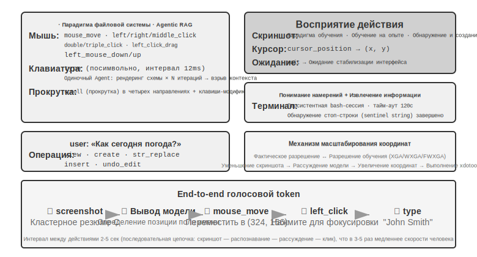

> **Эксперимент 9-4 ★★★: Реализация сквозного (End-to-End) голосового мышления с использованием Step-Audio R1**
>
> В данном эксперименте используется модель Step-Audio R1 для сравнения производительности различных конфигураций в задачах голосового мышления и диалога. Step-Audio R1 состоит из аудио-энкодера (Audio Encoder), аудио-адаптера (Audio Adapter) и декодера Qwen2.5 32B; для развертывания требуется несколько GPU.
>
> Оценка в эксперименте проводится по двум задачам: **Spoken-MQA** (голосовые математические задачи) — проверяет способность модели выполнять многошаговые математические рассуждения после прослушивания продиктованного условия; **URO-Bench** (бенчмарк китайской разговорной речи) — оценивает качество открытого диалога.
>
> Конфигурации тестирования разделены по двум измерениям. Первое — **тайминг мышления**: полный **TBS** (Think-Before-Speak, «подумай, прежде чем сказать»; используется в качестве контрольной базы без ограничений по задержке) сначала генерирует все рассуждения целиком и только потом начинает говорить; для снижения задержки MPS предлагает два варианта «размышления во время речи» — **Speak-First** (также называемый `spkfirst`, нулевая задержка, речь и мышление запускаются одновременно) и **Think-First** (также называемый `thkfirst`, речь начинается только после того, как «мозг» выдаст первый фрагмент рассуждений, задержка составляет около 80 token). Второе — **архитектура**: параллелизм двух «мозгов» MPS против традиционной одиночной модели TBS.
>
> Результаты представлены в таблице 9-1, где сравнивается влияние различных таймингов мышления и архитектурных конфигураций на математическую точность и оценку диалога.
>
> Таблица 9-1 Сравнение различных конфигураций голосового мышления Step-Audio R1
>
> | Конфигурация | Spoken-MQA | URO-Bench |
> |------|-----------|-----------|
> | Ответ напрямую без мышления (Baseline) | 70.6% | 77.4 |
> | MPS Speak-First (нулевая задержка) | 92.8% | 82.5 |
> | MPS Think-First (задержка ~80 tok) | 93.9% | 84.8 |
> | Полный TBS (без ограничений задержки) | 93.0% | — |
>
> Интересное наблюдение: Speak-First оказывает минимальное влияние на задачи мышления (92.8% близки к 93.0% у полного TBS). Причина в том, что начало **CoT** (Chain-of-Thought, цепочка рассуждений) обычно представляет собой лишь пересказ условия задачи и еще не переходит к истинному логическому выводу, поэтому даже если модель начинает говорить одновременно с запуском мышления, итоговая точность почти не страдает. Еще одна примечательная деталь: показатель Think-First (93.9%) даже немного выше, чем у полного TBS без ограничений задержки (93.0%). Возможным объяснением является то, что сегментированная выдача рассуждений и их пошаговое преобразование в экспрессию играют роль, схожую с пошаговым надзором (Step-wise Supervision); впрочем, разница между ними находится в пределах погрешности измерения, и не стоит интерпретировать ее слишком глубоко.

Третий вариант «интернализирует» мышление в единую модель, наиболее элегантно реализуя принцип «размышления во время речи», но ценой этого становится упомянутая в начале раздела «движущаяся мишень»: одна и та же модель должна быть и сильнейшим «рассуждателем» (Reasoner), и спикером в реальном времени. Поскольку обе способности быстро развиваются, унифицированный подход требует постоянного переобучения (Retraining), чтобы соответствовать уровню. Это также объясняет отраслевое разделение на момент написания книги: передовые продукты, стремящиеся к возможности «замены мозга на самый актуальный» (GPT-Live, Grok Voice, Pine AI), в основном делают ставку на путь декупажа (Decoupling) из второго варианта. Третий вариант больше подходит для сценариев, где требуется предельная естественность и есть готовность нести расходы на специализированное обучение. Это не вопрос вытеснения одного другим, а компромисс между «сменным мозгом» и «более тесной связью мышления и речи».

### Интерфейс между быстрым и медленным: что еще можно передать, кроме текста

(Примечание: это обсуждение кросс-сценарных интерфейсов, временно отходящее от основной темы голоса.) Оглядываясь на второй вариант, можно заметить игнорируемое измерение дизайна: «медленное мышление» передает инструкции «быстрому мышлению» через **текстовый** канал (передавая совет одной фразой через строку состояния). Текст понятен и удобен для отладки, но он является лишь «узкой соломинкой» для того объема информации, что содержится в «мозгу» медленного мышления — по-настоящему богатые промежуточные состояния сжимаются до нескольких предложений. Можно ли в этом интерфейсе между быстрым и медленным обойтись без слов?

В сценариях с самыми жесткими требованиями к ритму, таких как игры в реальном времени, этот путь реализуем (его можно назвать «латентным мостом», Latent Bridge)[^ch9-8]: маленькая модель, отвечающая за быструю реакцию (выдающая десятки действий в секунду), и медленная модель, отвечающая за рассуждения (выдающая одну мысль в секунду), остаются **замороженными** (Frozen). Обучается лишь небольшой «мост» между ними объемом в несколько десятков миллионов параметров, который проецирует скрытые состояния (Hidden States) медленной модели напрямую в несколько «латентных токенов» (Latent Tokens). Они вставляются во входные данные быстрой модели подобно тому, как мультимодальные модели вставляют визуальные токены — в обход цикла «идея → текст → повторное понимание». В результате в нескольких играх Atari этот латентный канал показал результаты выше, чем традиционный текстовый канал (в некоторых играх от +26% до +82%), при этом на каждый шаг тратилось лишь около 5 миллисекунд дополнительно, что позволяет укладываться в ритм реального времени.

Это также устанавливает честную границу: **эффективность сотрудничества «быстрого» и «медленного» зависит от того, является ли узким местом задачи «способность додуматься» или «успеваемость реакции»**. Когда медленное мышление изначально сильнее быстрой реакции, этот мост приносит пользу (корреляция в разных играх достигает r≈0.9); напротив, если задача требует чистой скорости реакции, даже самый лучший мост не поможет. Этот вывод справедлив не только для игр — он предвещает ту же проблему, с которой мы столкнемся далее в этой главе при обсуждении Computer Use: когда стоит приглашать «медленного советника», а когда это лишь бессмысленно увеличивает задержку (Latency).

[^ch9-8]: Полный анализ обучения моста в латентном пространстве (Latent Bridge) между двумя замороженными моделями, а также того, «когда стоит приглашать медленного советника», см. в Li, Bojie and Noah Shi. *The Latent Bridge: A Continuous Slow-Fast Channel for Real-Time Game Agents.* arXiv:2606.24470, 2026.

Независимо от того, является ли архитектура End-to-End (сквозной) или модульной, качество уровней восприятия и исполнения по-прежнему имеет решающее значение. End-to-End модели решают проблему задержки на уровне архитектуры, но базовые навыки «точно слышать» и «подражать человеческой речи» не решаются автоматически при смене архитектуры. Потоковое восприятие речи, соответствующее навыку «точно слышать», уже обсуждалось в первой парадигме; здесь мы рассмотрим уровень исполнения для навыка «подражать человеческой речи»: синтез речи, более похожий на человеческий.

## Более человечный синтез речи

«Совершенство» традиционных TTS (синтез речи) как раз и является проблемой: слишком плавная речь, отсутствие пауз и слов-паразитов сразу выдают машину. Человеческие «несовершенства» в речи — это не дефекты. Паузы, слова-наполнители («м-м», «э-э», «ну»), случайные повторы — это естественное внешнее проявление процесса мышления, передающее слушателю важные сигналы: «я думаю», «я не совсем уверен». Однако скорость мышления AI гораздо выше скорости воспроизведения речи, поэтому его вывод естественным образом получается плавным и полным, что при прямом синтезе раскрывает его машинную сущность.

**Решение**: передать право принятия решений о том, «где сделать паузу и какую интонацию использовать», основной LLM. Вывод LLM должен содержать не только текст, но и управляющие теги (control tokens): `[THINKING]` для вставки паузы в 1–2 секунды и наполнителя («м-м...»); `[SEARCHING]` для генерации короткой паузы и поисковых слов («это...», «как бы сказать»); `[EMO:happy]` для корректировки эмоциональной окраски и просодии; `[SPEED:0.8x]` для контроля темпа речи. Только LLM знает, нужно ли сейчас сделать паузу для обдумывания сложного вопроса, или пользователь уже проявляет нетерпение и стоит ускориться, или же это непринужденная беседа, требующая более живого тона.

TTS в этой схеме играет роль мультимодального генератора, принимающего на вход текст + управляющие теги и выдающего аудио. При встрече с обычным текстом выполняется нормальный синтез речи, а при встрече с тегом генерируется соответствующее невербальное аудио: `[THINKING]` создает протяжное «м-м...», `[SIGH]` — звук вздоха, `[LAUGH:small]` — легкий смешок, `[BREATH]` — звук вдоха.

Существует два пути реализации: первый — собственная разработка TTS с нативной поддержкой управляющих тегов (максимальная гибкость, но требует команды специалистов); второй — использование Voice Cloning (клонирование голоса), когда для одного и того же виртуального персонажа подготавливаются десятки эталонных записей с разными эмоциями, скоростью и стилем. В зависимости от тега выбирается наиболее подходящая запись для вызова API TTS (например, ElevenLabs, Fish Audio), что позволяет развернуть систему за несколько недель.

> **Эксперимент 9-5 ★★: TTS на основе управляющих тегов с использованием Fish Audio**
>
> Используйте возможности клонирования голоса Fish Audio S1 (требуется всего 3–10 секунд эталонной записи для Zero-shot клонирования тембра). Создайте библиотеку из 24 эталонных записей, охватывающих комбинации: Эмоции (нейтральная / радость / разочарование / раздумье) x Скорость (нормальная / быстрая / медленная) x Стиль (официальный / непринужденный), каждая длительностью около 5 секунд.
>
> Пример вывода LLM: `[EMO:happy][SPEED:fast]Отлично! Ваш заказ подтвержден. [THINKING]М-м, дайте мне проверить время доставки... [EMO:neutral][SPEED:normal]Ожидаемое время прибытия — завтра во второй половине дня.`
>
> Уровень исполнения парсит теги и сопоставляет их с соответствующими эталонными записями: `[EMO:happy][SPEED:fast]` соответствует эталону «радостный + быстрый + непринужденный», `[THINKING]` — «раздумье + медленный + официальный» (с ритмом пауз и интонацией сомнения), `[EMO:neutral][SPEED:normal]` — «нейтральный + нормальный + официальный». Fish Audio обеспечит единство тембра между разными эталонами, меняя только просодию и эмоции.
>
> Сравните три конфигурации: без управляющих тегов (плавно, но механически, сразу узнается AI), одна эталонная запись (естественно, но эмоционально монотонно), библиотека из нескольких эталонов (радостно и быстро при подтверждении информации, естественные паузы перед объяснениями, в целом близко к манере речи живого оператора).

## Computer Use: Agent для автоматизации GUI

Читая этот текст, вы могли заметить, что теме голоса в этой главе уделено значительно больше места, чем двум последующим сценариям — и это сделано намеренно. В эволюции мультимодальности реального времени голосовое взаимодействие прошло самый полный путь и заслуживает того, чтобы служить точкой отсчета: начав с проблемы «слишком высокой задержки последовательного конвейера», пройдя через End-to-End, Full Duplex (полный дуплекс), генерацию речи во время мышления и другие решения, оно пришло к относительно зрелому состоянию, которое мы видим сегодня. Весь путь от проблемы к решению и финальному результату уже пройден. Поэтому мы разбираем его досконально; последующие сценарии — Computer Use и робототехника — можно рассматривать через призму этой «голосовой» траектории, оценивая, на каком этапе этой эволюционной линии они находятся и где возникли затыки.

Эти три сценария кажутся разными, но сталкиваются с одинаковыми ключевыми вызовами: восприятие в реальном времени, принятие решений с низкой задержкой, непрерывное взаимодействие. Далее мы увидим, как эти технические темы воспроизводятся в визуальном взаимодействии (Computer Use) и физическом взаимодействии (робототехника) — для начала расширим поле зрения с аудиомодальности на визуальную: что, если Agent сможет не только понимать речь, но и «видеть» экран и управлять графическим интерфейсом?

Computer Use (также называемый GUI Automation Agent (агент автоматизации графического интерфейса пользователя)) позволяет AI (искусственному интеллекту) подобно человеку использовать программное обеспечение, наблюдая за экраном и управляя мышью и клавиатурой — например, открывать браузер для поиска информации, заполнять данные в таблицах или изменять конфигурацию в системных настройках. В его основе лежит цикл **Perception-Thinking-Action** (восприятие-мышление-действие) (рис. 9-7):

1. Agent (агент) делает скриншот текущего экрана.
2. Мультимодальная модель получает скриншот и инструкции к задаче, выдает рассуждение и конкретное действие.
3. Слой исполнения выполняет это действие в реальной среде (перемещение мыши, клик, ввод текста и т. д.).
4. После ожидания отклика интерфейса снова делается скриншот, и цикл переходит на следующий раунд.

В этом цикле есть три ключевых проектных измерения: **Action Space** (пространство действий — какие операции может выполнять агент), **Visual Grounding** (визуальное заземление/локализация — как найти целевой элемент на скриншоте) и **Model Architecture** (архитектура модели — как генерировать правильное действие на основе скриншота).

### Проектирование Action Space

Anthropic определяет три категории инструментов, составляющих полную возможность взаимодействия (рис. 9-8):

**Инструмент управления GUI** (computer tool): операции с мышью включают перемещение (`mouse_move`), клики левой/правой/средней кнопкой, двойной/тройной клик, перетаскивание (`left_click_drag`), а также более тонкие нажатия/отпускания (`left_mouse_down/up`). Прокрутка (`scroll`) поддерживает четыре направления и может сочетаться с клавишами-модификаторами. Операции с клавиатурой включают посимвольный ввод (`type`, с интервалом 12 мс между символами для имитации реальной печати), комбинации клавиш (`key`, например, Ctrl+C), долгое нажатие (`hold_key`). Действия восприятия: скриншот (`screenshot`), получение позиции курсора (`cursor_position`), ожидание (`wait`).

**Инструмент выполнения команд** (bash tool): предоставляет устойчивую сессию терминала bash с таймаутом 120 секунд, определяет завершение выполнения команды через контрольную строку (sentinel string) и сохраняет состояние среды между вызовами (например, если вызвать `cd` в определенную директорию, при следующем вызове агент останется в ней же).

**Инструмент редактирования файлов** (str_replace_editor): реализует безопасное редактирование через сопоставление строк, поддерживает просмотр, создание, замену, вставку и отмену операций. Это точнее, чем полная перезапись файла, и снижает риск случайного изменения постороннего контента.

> **Эксперимент 9-6 ★: Запуск Anthropic Computer Use Demo**
>
> Контейнер упакован с полноценной десктопной средой Ubuntu (включая браузер, терминал и другие привычные инструменты). Фронтенд получает инструкции задачи, бэкенд отправляет инструкции и скриншоты в Claude, модель возвращает команды управления (перемещение мыши, клики, ввод текста и т. д.), а слой исполнения выполняет их на виртуальном рабочем столе.
>
> Ключевое наблюдение: интервал между действиями составляет 2–5 секунд (заметно медленнее человека), но модель демонстрирует хорошие способности к планированию в типичных задачах, самостоятельно разбивая их на логичные последовательности операций.
>

### Визуальное заземление (Grounding)

В каждом раунде цикла модели необходимо точно локализовать целевой элемент на скриншоте — «Где находится строка поиска?», «Каковы координаты кнопки отправки?». Это и есть проблема Visual Grounding (визуальное заземление). В настоящее время существует **два основных подхода**: первый превращает локализацию в **Multiple Choice Question** (задачу с выбором варианта) — сначала элементы интерфейса помечаются номерами, и модели нужно лишь выбрать один из них; второй — **чистое предсказание координат**, когда модель, подобно человеку, напрямую «смотрит» на скриншот и называет координаты. Подход с выбором варианта имеет две реализации: **чисто визуальная разметка** (оригинальный Set-of-Mark, использующий модель сегментации для вырезания областей-кандидатов на уровне пикселей) и **индексация структурированных элементов** (DOM/Accessibility Tree, прямое чтение встроенной структуры интерфейса). Общее преимущество подхода с выбором заключается в том, что открытая задача «найти кнопку на скриншоте и предсказать координаты» превращается в закрытую задачу «выбрать один из уже размеченных элементов». Это похоже на то, как в экзамене тесты с выбором ответа легче, чем вопросы с открытым ответом: модели достаточно сказать «нажать на [123]», а не «нажать на синюю кнопку примерно в 200 пикселях правее верхнего левого угла экрана».

**Set-of-Mark: метод визуальной разметки.**

Оригинальный Set-of-Mark (SoM) был предложен Microsoft Research в 2023 году, изначально для раскрытия возможностей визуальной локализации GPT-4V. Это **чисто визуальный** метод: модель сегментации изображений (SAM, SEEM и др.) автоматически вырезает области-кандидаты на скриншоте и накладывает на каждую область маркер с номером. Модель видит изображение с номерами и должна лишь сообщить номер, который система затем преобразует в координаты центра соответствующей области. Весь процесс не требует DOM или какой-либо внутренней структуры интерфейса, поэтому он одинаково применим к нативному десктопному ПО и игровым интерфейсам — до тех пор, пока модель сегментации может выделить области-кандидаты.

**Индексация структурированных элементов: структурная реализация идей SoM в Web.**

Когда сам интерфейс может предоставить структурную информацию, разметка может быть более точной. Современные веб-страницы еще до рендеринга имеют четко определенную структуру элементов (дерево DOM) и семантические роли (что является кнопкой, а что — полем ввода). Интерфейсы доступности (Accessibility Tree) предоставляют аналогичную информацию для многих десктопных приложений. Вместо того чтобы заставлять модель сегментации гадать по пикселям, «какая область является кнопкой», лучше напрямую спросить у самого интерфейса: «Какие интерактивные элементы у тебя есть?». Решения для Web Agent, представленные проектом browser-use, работают именно так: перечисляют интерактивные элементы из DOM и присваивают им номера. Это можно рассматривать как структурную реализацию концепции SoM для Web (рис. 9-9). Процесс делится на четыре этапа:

 Screenshot: [Ключевые элементы на изображении помечены ID [1], [2], [3], [4] и т. д.]

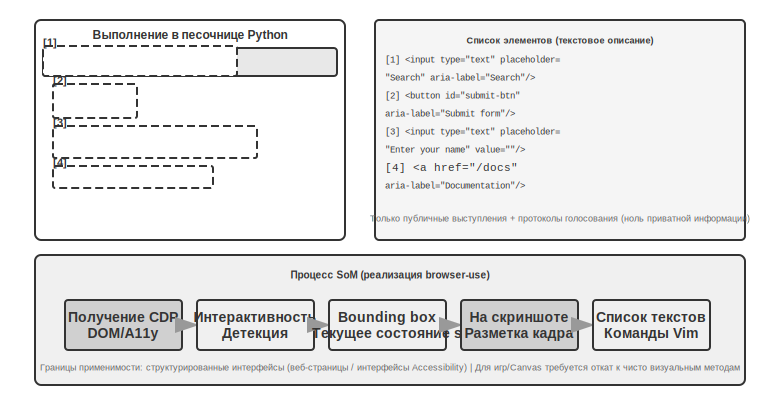

1. Получение структурированного представления веб-страницы (DOM-дерево) и информации о доступности через интерфейс отладки браузера (CDP, Chrome DevTools Protocol).
2. Автоматическое определение интерактивных элементов (кнопки, поля ввода, ссылки и т. д.).
3. Присвоение каждому интерактивному элементу уникального ID и отрисовка ограничивающих рамок (Bounding Box) на скриншоте.
4. Одновременная генерация текстового списка с описанием элементов, соответствующих каждому ID.

Модели достаточно вывести только номер ID, и система автоматически выполнит клик, используя центральные координаты этого элемента. Такое решение не экономит Token (поскольку всю размеченную информацию нужно отправлять модели), но обеспечивает точное и стабильное позиционирование, а также избавляет от пропусков и ложных срабатываний, которые могут возникнуть при использовании моделей сегментации.

**Чистое предсказание координат.**

Третий путь не предполагает никакой разметки — модель напрямую выводит координаты. Типичными представителями являются **SeeClick** и Computer Use от Anthropic: визуальная модель обучается на огромных массивах пар данных из скриншотов GUI (графический интерфейс пользователя) и позиций элементов. Это позволяет ей научиться сопоставлять описания на естественном языке (например, «нажать кнопку отправить») непосредственно с точными координатами на скриншоте — точно так же, как это делает человек, полагаясь исключительно на «зрение» для поиска места клика.

В схемах с предсказанием координат понимание координат моделью сильно зависит от разрешения, использованного при обучении (рис. 9-10). Claude обучался на разрешениях XGA (1024x768), WXGA (1280x800), FWXGA (1366x768). Если разрешение входного скриншота не совпадает, предсказанные моделью координаты будут систематически смещаться — это похоже на то, как если бы вы измерили расстояние на маленькой карте и применили его к большой. Поэтому на уровне Harness необходимо реализовать механизм двустороннего масштабирования координат, причем **выбирать целевое разрешение нужно в соответствии с соотношением сторон**, чтобы избежать непропорционального растяжения, которое исказит изображение и собьет определение координат. Например, если реальное разрешение экрана составляет 2560×1440 (16:9), следует выбрать из трех поддерживаемых Claude вариантов тот, чье соотношение сторон наиболее близко к 16:9 — FWXGA (1366×768) подходит лучше всего. При создании скриншота экран пропорционально масштабируется до 1366×768 и подается в модель; после того как модель выведет координаты клика (683, 384), они обратно проецируются в реальные координаты (683×2560/1366, 384×1440/768) ≈ (1280, 720). Напротив, если принудительно втиснуть 16:9 в формат 4:3 (1024×768), изображение будет сжато по горизонтали, и предсказанные моделью координаты получат систематическую ошибку.

Логику выбора между тремя путями можно резюмировать так: **когда доступна структурированная информация, приоритет отдается индексации через DOM/Accessibility Tree**, так как это наиболее точный и стабильный метод позиционирования; **когда она недоступна** (нативное десктопное ПО вроде Photoshop, интерфейсы на Canvas/WebGL, игры), **можно использовать либо визуальную разметку (оригинальный путь SoM), либо предсказание координат**. Визуальная разметка превращает позиционирование в задачу выбора варианта, что более дружелюбно для универсальных моделей без специальной подготовки; предсказание координат избавляет от этапа разметки и является более прямым методом для моделей, прошедших GUI-обучение. В обоих случаях точность на мелких элементах и плотных интерфейсах все еще требует доработки.

> **Эксперимент 9-7 ★: Использование browser-use для автоматизации действий в браузере**
>
> На базе фреймворка автоматизации браузеров Playwright (библиотека для программного управления браузером) в сочетании с мультимодальными большими моделями реализуется управление браузером с помощью естественного языка. Включается режим визуализации SoM, при котором перед каждым принятием решения сохраняется скриншот с разметочными рамками.
>
> Тестовое задание «Открыть Google и узнать погоду в Сан-Франциско»: после запуска системы на скриншоте отображается страница поиска Google, все интерактивные элементы помечены красными рамками и номерами ID (адресная строка `[1]`, поле поиска `[2]`, кнопка поиска `[3]`, кнопка «Мне повезет» `[4]` и т. д.) → модель после анализа кликает на `[2]` (поле поиска) → после получения фокуса вводится запрос «San Francisco weather today» → клик на `[3]` (кнопка поиска) → происходит переход к результатам поиска, на новом скриншоте размечаются элементы внутри карточки погоды, модель распознает и извлекает информацию о температуре, погодных условиях и т. д. Весь процесс из 5 шагов занимает около 20 секунд.

### Computer Use Agent, способный видеть анимацию и слышать звуки

До сих пор восприятие Computer Use строилось на неявном допущении: **экран статичен** — сделать скриншот, подумать, кликнуть, сделать следующий скриншот. Но в реальности на экране проигрываются видео, всплывают мимолетные уведомления, звучат голоса участников конференций. Agent, который «открывает глаза» лишь раз в 3–5 секунд и при этом совершенно лишен «слуха», не видит и не слышит того, что происходит «между кадрами». Просмотр записей экрана, участие в митингах, прослушивание голосовых подсказок, реакция на мгновенно исчезающие диалоговые окна — вся эта категория повседневных компьютерных операций для сегодняшних Computer Use Agent практически закрыта.

```
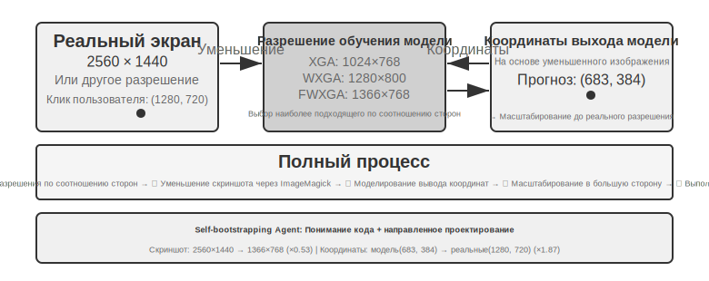

Elements:
[1] <input type="text" placeholder="Search" aria-label="Search" />
[2] <button id="submit-btn" aria-label="Submit form" />
[3] <input type="text" placeholder="Enter your name" value="" />
[4] <a href="/docs" aria-label="Documentation" />
```

Универсальные VLM (мультимодальные модели) уже обладают неплохими способностями к Embodied Reasoning (эмбодированное мышление). **Gemini Robotics-ER 1.5** от Google DeepMind специально оптимизирована для Embodied Reasoning. Она показала средний результат 62,8% на 15 академических бенчмарках (Point-Bench, RefSpatial, RoboSpatial, BLINK и др.), превзойдя GPT-4o (60,6%) и Gemini 2.5 Pro (59,3%). Ключевые преимущества включают: продвинутое пространственное понимание и локализацию объектов, Temporal Reasoning (временные рассуждения — прогнозирование причинно-следственных связей действий, например, «что произойдет, если опрокинуть эту чашку»), оркестрацию задач (разбиение высокоуровневых инструкций на мелкие шаги), а также нативную поддержку механизмов Thinking (рассуждения) и Tool Calling (вызов инструментов).[^ch9-2]

> [^ch9-3]: XLeRobot, «LLM Agent 控制». https://xlerobot.readthedocs.io/en/latest/software/getting_started/LLM_agent.html

То, что здесь действительно следует перепроектировать, — это не «интерфейс действий», а **Observation Interface (интерфейс наблюдения)**[^ch9-9]. Основная идея заключается в том, чтобы отделить **Observation** (наблюдение — непрерывное, адаптивное, мультимодальное) от **Action** (действия — дискретные) и превратить его в слой промежуточного ПО для восприятия (его можно назвать Agent–Computer Observation Interface, AOI), который вставляется между средой и любой готовой моделью Computer Use без необходимости переобучения. Он состоит из трех компонентов, работающих по принципу «открытия шлюза по требованию»: во-первых, **Inter-frame Keyframe Capture (захват ключевых кадров между фреймами)** — сначала используется крайне дешевый «пиксельный затвор» для пропуска практически не изменившихся кадров, затем малая модель определяет, произошли ли в кадре значимые изменения, и делает скриншот только при их наличии, что при статичном изображении обходится почти в нулевую стоимость; во-вторых, **Voice Activity Detection (VAD) для транскрипции речи** — распознавание речи вызывается только при наличии звука, благодаря чему у Agent впервые «вырастают уши»; в-третьих, и это самое критичное, **описание изображения в виде устойчивого текста** — модель описывает захваченный кадр одной фразой (например: «Только что всплыло уведомление о том, что дата релиза перенесена на 28 апреля»), и **даже если исходное изображение позже будет удалено из контекста, эта текстовая фраза останется в памяти**, перенося динамическую информацию дальше в текстовом виде.

Контринтуитивное открытие состоит в том, что по-настоящему работает не «выбор конкретных кадров», а **«превращение кадров в текст, способный сохраняться длительное время»** — именно текст является той модальностью, с которой LLM Agent справляется лучше всего. На восьми моделях — от 7B до флагманских масштабов — этот слой промежуточного ПО обеспечил прирост от +17 до +48 процентных пунктов без какого-либо переобучения. При этом самый большой разрыв наблюдался в задачах, связанных с голосом: с этим уровнем восприятия Agent смог выполнять голосовые задачи, которые раньше он «слышал, но не мог обработать». Однако это не универсальная фиксированная конфигурация — в некоторых более новых моделях избыток визуальных токенов, напротив, может вытеснять рассуждения и снижать производительность, поэтому эти компоненты нужно **подбирать индивидуально под каждую модель**, а не включать всё разом. Это та же логика, что и в выборе между Set-of-Mark и предсказанием координат: в решениях для восприятия нет «серебряной пули», их нужно настраивать, подстраиваясь под «характер» конкретной модели.

[^ch9-9]: Механизм работы трех компонентов — стробирования ключевых кадров, транскрипции по требованию и описания кадров в устойчивый текст, а также абляционные исследования для каждой модели см. в Li, Bojie and Noah Shi. *Agent-Computer Observation Interfaces Enable Dynamic Computer Use.* arXiv:2606.29472, 2026.

### Мобильные устройства: экологические барьеры сложнее технических

Computer Use также расширяется на мобильные устройства. Между мобильными и десктопными платформами действительно есть технические различия: пространство действий здесь обычно представляет собой не «координаты мыши + клавиатура», а доступ к системным API служб специальных возможностей (например, AccessibilityService в Android) для чтения элементов интерфейса, отправки кликов и ввода текста. Способ взаимодействия также меняется с указателя мыши на сенсорные жесты, из-за чего меняется семантика координат — является ли одна и та же точка (x, y) одиночным нажатием, долгим нажатием или начальной точкой жеста смахивания, необходимо определять через дополнительный тип жеста. Мобильные бенчмарки, такие как AndroidWorld, описанный в шестой главе, оценивают способность Agent выполнять задачи в реальных приложениях именно в таком пространстве действий.

Однако то, что действительно сдерживает мобильный сегмент, — это зачастую не технические различия, а экологические барьеры. Были случаи, когда производители телефонов пытались интегрировать AI-помощников в потребительские смартфоны, чтобы те могли автоматически управлять повседневными приложениями вроде WeChat, Taobao или Alipay, но быстро сталкивались с ограничениями платформ.

Это выявляет уникальный вызов, с которым сталкивается Computer Use: **экологические барьеры**. Фундаментальная причина блокировок кроется в конфликте бизнес-моделей. Основная логика монетизации традиционных интернет-приложений — это **трафик и внимание**: пользователь видит рекламу, листая ленту новостей; следует рекомендациям алгоритмов при поиске товаров; совершает импульсивные покупки при просмотре страниц. Когда же Agent действует вместо пользователя, эта цепочка монетизации полностью обходится: AI не обращает внимания на рекламу и не совершает импульсивных покупок — он просто выполняет задачу и уходит. Для платформ, зарабатывающих на рекламе и трафике, каждое действие Agent подрывает основы их бизнес-модели.

Это означает, что Computer Use сталкивается не только с техническим противодействием вроде CAPTCHA (капча), но и со **структурным конфликтом интересов**. Это противоречие трудно разрешить в краткосрочной перспективе, что делает внедрение Computer Use в потребительских сценариях более сложной задачей, чем решение чисто технических проблем.

### Реалтайм: нерешенный ключевой вызов

**OSWorld** (методология оценки которого подробно описана в шестой главе) является широко используемым бенчмарком для Computer Use, тестирующим способности Agent выполнять кросс-приложенные задачи в реальных средах Ubuntu, Windows и macOS. Успешность первых универсальных моделей в этом бенчмарке составляла лишь около 20%, последующие специализированные и более мощные универсальные модели неуклонно повышали точность, постепенно приближаясь к человеческому уровню на момент написания книги. Однако точность — далеко не финал. Настоящий «бутылочное горлышко» сместилось с вопроса «может ли он сделать правильно» к вопросу «может ли он сделать быстро».

Исследование эффективности **OSWorld-Human** выявило удручающий факт: даже если задача в итоге завершается успешно, Agent требуется значительно больше шагов, чем человеку, а задержка рассуждений на каждом шаге продолжает расти по мере продвижения задачи. Чем длиннее Context Window (контекстное окно), тем медленнее модель принимает решения, и время, затрачиваемое на поздние этапы, часто значительно превышает время на начальных. То, что человек делает за десятки секунд (например, корректировка форматирования документа), Agent может выполнять в течение нескольких минут. **Достижение человеческого уровня точности не равно практичности — именно эффективность является реальным препятствием.**

Причина проблем с эффективностью аналогична сценариям с голосовым взаимодействием: в последовательном цикле «скриншот — рассуждение — клик», даже если каждый этап оптимизирован до предела, накопленная за каждый шаг задержка остается неприемлемой. Более глубокая проблема заключается в том, что текущий Computer Use совершенно не умеет «думать наперед». Если бы Agent (агент) мог предсказывать следующий шаг одновременно с выполнением текущего действия — например, продумывать, куда кликнуть дальше, пока загружается страница, — это позволило бы перекрыть время рассуждения временем выполнения и значительно снизить общую задержку (это тот же запрос на асинхронность, что и в сценарии «говорить во время размышления» в начале этой главы или в стиле «непрерывного мышления» в четвертой главе, только здесь он превращается в «действовать во время размышления»).

В отличие от голосовой сферы, для реального времени в Computer Use — то есть ускорения самого цикла «скриншот — рассуждение — клик» — системного решения пока не существует; он все еще остается дискретным циклом с пофреймовым снятием скриншотов. Однако один путь в обход этой проблемы уже проложен, и в нем используется многократно упоминаемое в этой главе разделение на «быстрое» и «медленное» (Fast-Slow Decoupling): раз уж сложно заставить медленного агента для управления компьютером работать быстрее, то **не заставляйте пользователя ждать его**. Разделите «речь» и «управление компьютером» на две модели — быструю и медленную, работающие параллельно[^ch9-10]. Маленькая модель (быстрая) отвечает за голосовой диалог в реальном времени, а передовая VLM (медленная) шаг за шагом действует в браузере. Взаимодействуют они лишь через минимальный «текстовый контракт» (pure text contract): каждое действие медленного агента сопровождается краткой сводкой статуса («Заполняю форму, мне еще нужна ваша дата рождения»), на основе которой быстрый агент отвечает пользователю в реальном времени и передает медленному агенту новую информацию, полученную от пользователя голосом. При этом **быстрому агенту категорически запрещено говорить «готово», пока статусная сводка не подтвердит завершение задачи**. Это в точности сценарий «разговаривать по телефону, пока компьютер сам выполняет операцию». В экспериментах такое разделение позволило давать голосовые ответы примерно в 15 раз быстрее, чем в случае «одной модели, которая и действует, и говорит» (медианная задержка 0,58 сек против 8,64 сек), при этом вероятность успеха задачи не снизилась. Но стоило убрать этот текстовый канал между «быстрым» и «медленным», как вероятность успеха мгновенно падала до нуля — критически важная информация от пользователя больше не попадала в браузер. Это та же логика, что и в Latent Bridge или в сценарии «говорить во время размышления»: когда один этап по природе своей медленный, пусть другой, быстрый этап, заполнит ожидание пользователя. По сути, этот «текстовый контракт» и есть строка состояния агента, о которой мы говорим со второй главы. Ускорение самого цикла Computer Use, возможно, станет следующим важным направлением исследований, но «скрытие медлительности через быстро-медленное разделение» уже является рабочим ответом.

[^ch9-10]: Полное описание архитектуры быстро-медленного разделения голоса и действий, а также «текстового контракта» см. в: Li, Bojie and Noah Shi. *Talking While Acting: Real-Time Voice for Slow Computer-Use Agents.* 2026 (готовится к публикации).

## Робототехника: от управления в реальном времени к обучению и генерализации

> **Примечание к чтению**: В данном разделе обсуждается управление роботами. Эксперименты 9-10 демонстрируют методы переноса из симуляции в реальность (Sim-to-Real) — при этом **часть с обучением в симуляции (этапы 3-4) может быть выполнена на обычном GPU-сервере** без использования оборудования. Однако для полноценного воспроизведения всего конвейера (включая этапы развертывания в реальности) потребуется настоящее оборудование, такое как манипулятор SO100. Если сфера робототехники вам временно не интересна, этот раздел можно пропустить, это не повлияет на понимание других глав.

Голосовой агент сталкивается с задержкой в слуховой модальности, Computer Use — в визуальной, а когда агенту нужно управлять роботом в физическом мире, вызовы задержки и мультимодальности усиливаются. Последствия действий здесь необратимы: одно столкновение может повредить объект или самого робота. В этом разделе мы сначала разберем, как робототехника решает проблему управления в реальном времени с помощью двухуровневой архитектуры и Action Chunking (группировка действий), а затем перейдем к более «крепким орешкам» — обучению и генерализации: откуда брать данные и как переносить модели между задачами и платформами.

### Препятствие не в «железе», а в алгоритмах

Роботы еще не получили широкого применения в универсальных открытых сценариях. В чем же основная проблема — в аппаратном обеспечении (hardware) или в алгоритмах? Проект XLeRobot представил веское доказательство от противного: колесный двухрычажный робот стоимостью менее 1000 долларов уже может плавно выполнять множество домашних задач, когда человек управляет им дистанционно через VR-шлем (Teleoperation, телеуправление). Более сложные домашние задачи, требующие ловких рук (dexterous hands), роботы Unitree также плавно выполняют под телеуправлением человека. Задержка при телеуправлении составляет около 100–200 мс, что уже близко к требованиям отклика для физического взаимодействия. Разрешение сенсоров, точность приводов и частота управления (количество обновлений команд роботу в секунду; чем ниже частота, тем менее плавным будет движение и тем выше риск вибраций или отклонений от траектории) на современных бюджетных платформах уже достаточны для поддержки прикладных задач.

Необходимо четко обозначить границы этого утверждения: успех телеуправления доказывает лишь то, что «существующего бюджетного железа в сочетании с человеческим интеллектом достаточно для выполнения **подобных домашних задач, основанных преимущественно на визуальной обратной связи**». Это не означает, что аппаратная часть идеальна во всех измерениях — отсутствие тактильных датчиков, надежность и стоимость ловких манипуляторов до сих пор признаются слабыми местами «железа». Если задача сильно зависит от точного контроля силы и тактильной обратной связи, аппаратное обеспечение вполне может стать узким местом. Поэтому тезис «железо не является препятствием» ограничен рамками задач, обсуждаемых в этом разделе.

Что касается таких задач, настоящий разрыв находится на уровне алгоритмов, что мы и разберем в следующих двух подразделах.

> **Эксперимент 9-8 ★: Опыт телеуправления XLeRobot**
>
> XLeRobot поддерживает различные способы Teleoperation (телеуправление), такие как клавиатура, геймпад Xbox, Switch Joycon и VR-шлемы. Управляя роботом вручную для выполнения таких задач, как взятие предметов, их размещение или протирка поверхностей, и наблюдая за Latency (задержка отклика), точностью движений и качеством выполнения задач, можно сформировать интуитивное понимание границ возможностей аппаратного обеспечения. Личный опыт показывает: когда человек управляет роботом, тот способен выполнить что угодно, а это доказывает, что текущим «узким местом» является именно алгоритм, а не Hardware (аппаратное обеспечение).[^ch9-1]
>
> [^ch9-1]: XLeRobot, «Документация по Teleop». https://xlerobot.readthedocs.io/en/latest/software/getting_started/XLeRobot_teleop.html

### Двухуровневая архитектура: разделение планирования и управления

Выполнение сложных домашних задач роботом требует принятия решений в двух разных временных масштабах. Первый уровень — это более медленное **Long-horizon Planning** (длинносерийное планирование): разложение высокоуровневых инструкций типа «уберись на кухне» в последовательность подцелей (очистить столешницу, загрузить посудомоечную машину, протереть поверхности). Это требует понимания семантики среды, рассуждений о зависимостях задач и планирования многошаговых схем действий — подобно тому, как человек перед началом работы сначала думает: «что сделать сначала, а что потом». Второй уровень — это более быстрое **VLA**-управление (Vision-Language-Action, визуально-языковая модель действий): выполнение каждого конкретного действия («подойди к раковине», «возьми тряпку», «протри столешницу»), непрерывный вывод сигналов управления на основе текущего визуального ряда и языковых инструкций для обеспечения плавности и связности движений робота.

Такая двухуровневая архитектура эффективно разделяет сложность: Long-horizon Planning отвечает за то, «что делать», а VLA-управление — за то, «как делать». Эта структура «высокоуровневое медленное принятие решений + низкоуровневое быстрое исполнение» по своему строению очень похожа на упомянутую ранее концепцию «быстрого и медленного мышления» в сценариях с голосом — в обоих случаях сложные раздумья и реагирование в реальном времени разделяются на разные модули. Стоит отметить, что здесь «планирование / управление» соответствует разделению по вектору «медленное глубокое мышление / быстрый отклик в реальном времени», а не по вектору «мыслительный мозг / выражающий мозг» (как в схеме MPS из третьего варианта). В последнем случае разделяются «мысли» и «речь», тогда как в первом — «глобальное планирование» и «исполнение в реальном времени»; измерения, по которым разрезаются эти две «двойные архитектуры», различаются.

Однако Real-time (режим реального времени) никуда не исчезает сам по себе, он спускается на уровень VLA-управления и компенсируется за счет **Action Chunking** (агрегирование действий, подробнее см. в разделе «VLA-управление» ниже). Модель за один проход Inference (вывод) генерирует небольшую последовательность будущих действий, а поток управления воспроизводит их с высокой частотой, распределяя задержку одного вывода на всё время выполнения этого фрагмента движений. Но здесь есть неизбежный компромисс: Chunking (агрегирование) — это обмен реактивности на плавность. Чем длиннее «чанк» (фрагмент), тем меньше заметна задержка вывода и тем связнее движения, но в течение этого времени модель «не видит» новых кадров и становится более инертной к внезапным изменениям (предмет убрали, кто-то преградил путь рукой). Этот выбор между Real-time и плавностью — та часть проблемы, которую двухуровневая архитектура не устранила, а лишь перенесла.

Здесь также необходимо обозначить поворот основной сюжетной линии этой главы: в сценариях с робототехникой противоречие Real-time уже частично смягчено двухуровневым разделением и Action Chunking, и основное противоречие сместилось в сторону **Training** (обучение) и **Generalization** (обобщение) — как получить достаточное количество демонстрационных данных и как заставить модель работать на разных задачах и платформах. Следующие подразделы разворачиваются именно вокруг этого нового противоречия, которое является продолжением тем симуляционных сред из шестой главы и Reinforcement Learning (обучение с подкреплением) из седьмой главы в физическом мире.

И это новое противоречие в основном ложится на слой VLA-управления. VLA можно рассматривать как «VLM + вывод действий»: **VLM** (Vision-Language Model, визуально-языковая модель — большая модель, способная одновременно понимать изображения и текст) отвечает за то, чтобы «увидеть и понять», а VLA на этой основе должна еще и «приложить руки». Настоящий вызов заключается именно в слое «действий». В настоящее время слой VLA-управления в основном обучается с помощью Imitation Learning (имитационное обучение) или Behavior Cloning (клонирование поведения) — прямое обучение по принципу «что вижу, то и делаю» на основе большого количества человеческих демонстраций (к этому типу относятся OpenVLA, RT-2, π₀ и др.); Reinforcement Learning в последние годы выступает как дополнение к этому. Хотя VLA, обученные с помощью Reinforcement Learning, могут показывать отличные результаты в одной задаче, им часто не хватает Generalization: даже если SimpleVLA-RL из седьмой главы показал высокие результаты на LIBERO, это было достигнуто путем отдельного RL-обучения для каждой задачи, а не с помощью единой модели с Zero-shot Generalization (обобщение без примеров) на все задачи. Такой режим «одна задача — одно обучение» означает, что при столкновении с новой задачей снова нужно собирать данные и проводить переобучение.

В следующих двух разделах подробно обсуждаются конкретные технические решения для Long-horizon Planning и VLA-управления.

### Long-horizon Planning: от VLM к специализированным моделям воплощенного мышления

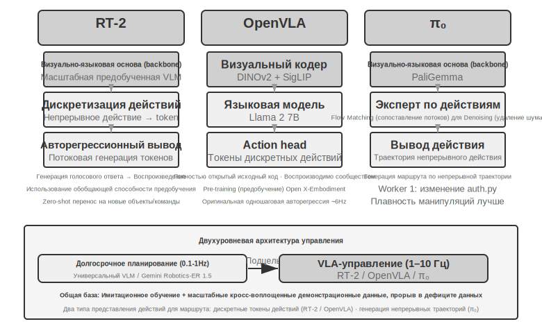

> **Эксперимент 9-9 ★★: Использование Gemini Robotics-ER 1.5 для управления автономной навигацией XLeRobot**
>
> С помощью библиотеки RoboCrew модель Gemini Robotics-ER 1.5 используется в качестве модели долгосрочного планирования, где на изображения с камеры накладываются метки угловой шкалы. Системе предоставляются всего три простых инструмента: движение вперед, поворот налево, поворот направо. При получении задачи «найди кухню и иди туда» модель принимает решения с частотой 0,5–1 Гц: распознает визуальные признаки, такие как коридоры, дверные проемы, мебель, и, если определяет, что «кухня может быть слева», выполняет поворот налево, а при виде «холодильника впереди» продолжает движение вперед. Систему также можно расширить до режима голосового управления (используя пробуждающее слово для запуска новой задачи). Этот эксперимент раскрывает границы возможностей VLM на уровне долгосрочного планирования: пространственные рассуждения и декомпозиция задач уже выполняются хорошо, однако робастность в сложных средах и согласованность многошаговых рассуждений все еще имеют потенциал для улучшения.[^ch9-3]
>
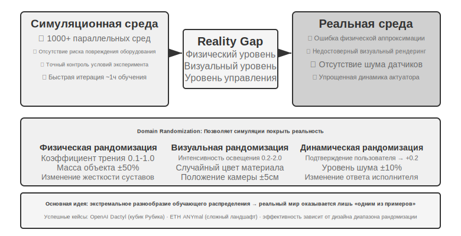

### VLA-управление: от демонстрационных данных к кросс-платформенной генерализации

На исполнительном уровне двухуровневой архитектуры три репрезентативные модели — RT-2, OpenVLA и π₀ — фокусируются на VLA (Vision-Language-Action) управлении, то есть выводе действий робота в реальном времени на основе изображений с камеры и языковых инструкций (рис. 9-11). В представлении действий они разделяются на два направления: дискретные токены действий и генерация непрерывных траекторий.

**RT-2 и OpenVLA: путь дискретных токенов действий.**

**RT-2** стала первопроходцем в этом направлении: она напрямую подвергается Fine-tuning (дообучение) на крупномасштабных визуально-языковых моделях, где непрерывные действия робота дискретизируются в токены. Они выводятся авторегрессионно один за другим, подобно генерации текста. Это позволяет использовать обобщающую способность предобученных моделей для улучшения эффекта Zero-shot (нулевой перенос) на новые объекты и инструкции. **OpenVLA** следует схеме представления действий RT-2, объединяя языковую модель и визуальный энкодер в единую архитектуру, принимая на вход изображения и текстовые инструкции и выдавая токены действий. Обучение проходит в два этапа: сначала Pre-training (предобучение) на масштабном кросс-платформенном датасете Open X-Embodiment (включающем демонстрации реальных операций на более чем 20 роботизированных платформах) для изучения общих знаний об операциях (паттерны действий типа «взять» или «положить» схожи у разных роботов), а затем Fine-tuning на небольшом количестве данных для конкретной платформы. Поскольку представление действий по сути идентично, истинное различие между ними заключается в открытости и инженерных решениях: RT-2 и ее тренировочные данные являются внутренними разработками Google, в то время как OpenVLA полностью открыта — Open-source магистральная модель (Llama 2 плюс визуальный энкодер) в сочетании с публичным датасетом позволила сообществу впервые воспроизводить и улучшать ее.

**Action Chunking: универсальная технология компенсации частоты в области VLA.**

Из-за задержек при выводе LLM частота управления VLA намного ниже требований традиционного управления роботами (традиционное управление обычно требует частоты 50–1000 Гц, тогда как одиночный вывод VLA составляет всего около 1–10 Гц — разрыв может достигать двух порядков). Оригинальная OpenVLA является типичным примером этой проблемы: при каждом выводе она выдает только одно действие (одношаговое авторегрессионное предсказание с частотой около 6 Гц), и прерывистость движений как раз является ее основным недостатком. **Action Chunking** (акциональное сегментирование) — это универсальная технология, созданная для восполнения этого разрыва. Впервые она была предложена в ACT (Zhao et al., 2023), а позже широко адаптирована в π₀, OpenVLA-OFT и других моделях. Модель при каждом выводе генерирует не одно действие, а сразу последовательность действий на короткий период времени вперед (например, в типичной конфигурации π₀ за один раз генерируется блок действий на 0,5–1 секунду, что при частоте управления 50 Гц составляет 25–50 действий). Управляющий поток последовательно выполняет их с высокой частотой, пока модель асинхронно генерирует следующую партию в фоновом режиме. Пока время вывода модели меньше времени выполнения этой партии действий, робот может поддерживать непрерывное и плавное движение — точно так же, как буферизация видео: если загружать контент заранее, воспроизведение не будет прерываться.

**π₀: путь генерации непрерывных траекторий.**

[^ch9-2]: Google DeepMind, “Gemini Robotics-ER 1.5” . https://deepmind.google/models/gemini-robotics/gemini-robotics-er/

## ## Классификационная структура Multi-Agent (мультиагентного) взаимодействия

Настоящий раздел в представлении действий пролегает не между RT-2 и OpenVLA, а между **дискретными токенами и генерацией непрерывных траекторий**. **π₀** представляет собой второй путь: вместо того чтобы предсказывать дискретные токены действий один за другим, она использует Flow Matching (flow matching, метод непрерывной генерации, родственный диффузионным моделям), чтобы, начиная со случайного шума, через многошаговую итеративную «деноизацию» напрямую генерировать гладкую и непрерывную траекторию движения. Такое представление естественным образом сочетается с Action Chunking (группировка действий) и показывает лучшие результаты в задачах, требующих высокой точности и плавности движений, таких как манипуляции с мелкими предметами. Проведем аналогию: путь дискретных токенов похож на пошаговый выбор из меню («влево на 5 градусов», «вперед на 3 сантиметра»), в то время как путь непрерывных траекторий напоминает художника, который сначала намечает всю кривую целиком, а затем штрих за штрихом доводит ее до нужной формы.

### Sim2Real Transfer: преодоление разрыва между симуляцией и реальностью

В разделе о средах симуляции шестой главы уже было разъяснено происхождение Sim-to-Real Gap (реальный разрыв) и принципы работы Domain Randomization (рандомизация областей) для борьбы с ним, поэтому не будем повторяться. Если вкратце: симуляция не может полностью воспроизвести реальные физические, визуальные и аппаратные характеристики, поэтому во время обучения эти параметры случайным образом варьируются в широком диапазоне. Это заставляет Policy (стратегия) вырабатывать набор универсальных представлений, устойчивых к различным изменениям (рис. 9-12). Далее рассмотрим, как эти принципы реализуются на практике с настоящими манипуляторами.

На этом пути уже есть немало успешных примеров: проект Dactyl от OpenAI по манипуляции объектами (реализация переориентации кубика внутри механической кисти, а последующая работа с использованием ADR — автоматической рандомизации областей — позволила собирать кубик Рубика одной рукой) и ANYmal из ETH Zurich (четвероногий робот, демонстрирующий робастную ходьбу по сложной пересеченной местности, такой как снег или гравий).

В этой главе необходимо дополнить информацию двумя инженерными этапами, которые невозможно обойти при переносе рандомизации областей на реальное оборудование. Первый — это **калибровка диапазона рандомизации**: диапазон нельзя определять «на глаз». Слишком узкий диапазон не покроет реальные изменения, а слишком широкий увеличит сложность обучения и приведет к субоптимальной стратегии, которая «умеет справляться со всем, но ни в чем не достигает мастерства». На практике обычно сначала проводят **измерительную калибровку** распределения ключевых параметров на основе данных из реальной среды (например, реальное распределение коэффициентов трения или задержек отклика моторов) и делают выборку в этих пределах. Если стратегия, обученная в симуляции, заметно теряет в качестве на реальном роботе, диапазон рандомизации постепенно расширяют, пока Sim-to-Real Gap не сойдется до приемлемого уровня. Второй этап — это **визуальное выравнивание**: точная калибровка положения и ориентации камер в симуляции и реальности (выравнивание среды), а также случайная замена фона в отрендеренной симуляции на реальные фотографии фона (замена фона по принципу Greenscreen), чтобы изображение в симуляции было максимально приближено к тому, что видит реальный робот. Эти два шага будут детально продемонстрированы в эксперименте 9-10.

> **Эксперимент 9-10 ★★★: Zero-shot Sim2Real захват манипулятором на основе RGB**
>
> Использование LeRobot + симулятор ManiSkill. Обучение проводится только на изображениях с RGB-камеры (без использования датчиков глубины или силы), после чего осуществляется Zero-shot (без каких-либо дополнительных настроек) развертывание на реальном манипуляторе SO100. Процесс состоит из пяти этапов:
>
> 1. **Выравнивание среды**: настройка положения камер в симуляции и реальной среде, проверка совпадения изображений через визуальное наложение.
> 2. **Замена фона** (greenscreen): случайная обрезка реальных фотографий фона и их наложение на рендеринг в симуляции, чтобы фон в симуляции был ближе к реальности.
> 3. **Domain randomization**: рандомизация цвета робота, текстур объектов, условий освещения, поля зрения камеры (FOV) и других параметров.
> 4. **RL-обучение**: использование алгоритма PPO в среде с масштабным параллелизмом до достижения успеха в симуляции >90%.
> 5. **Реальное развертывание**: успешное выполнение задачи захвата на реальном роботе напрямую в режиме Zero-shot.
>
> Ключевые факторы успеха: точное выравнивание среды + визуальная рандомизация областей + рандомизация физических параметров; все три компонента незаменимы. Ограничения: когда форма, размер или материал реальных объектов выходят за рамки обучающего распределения, вероятность успеха значительно снижается. [^ch9-6]
>
> [^ch9-6]: LeRobot, «Sim2Real Tutorial». https://github.com/StoneT2000/lerobot-sim2real/blob/main/docs/zero_shot_rgb_sim2real.md
>
> 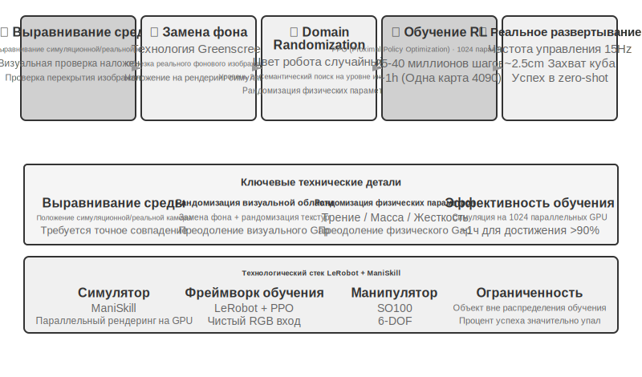

## Резюме главы

Три рассмотренных сценария на первый взгляд сильно различаются, но две преграды — задержка и мультимодальность — всегда идут рука об руку. Голосовые технологии уже прошли путь от последовательных конвейеров до End-to-End и Full-duplex (полнодуплексный режим), от разделения на «быстрое и медленное мышление» до подхода «говорить во время размышления». Точность Computer Use в таких бенчмарках, как OSWorld, уже приблизилась к человеческому уровню, однако количество шагов в операциях заметно больше, чем у человека, а время выполнения шагов растет по мере продвижения задачи — для этого разрыва в эффективности пока нет системного решения. В задачах манипуляции роботов, основанных на визуальной обратной связи, узкое место сместилось с аппаратного обеспечения на способность VLA-уровня управления к кросс-задачной генерализации (хотя тактильные ощущения и ловкие кисти рук все еще остаются нерешенными аппаратными проблемами). В следующей главе мы переключим внимание на взаимодействие между несколькими Agent — это вызов уже другого порядка.

## Вопросы для размышления

### ### Измерение 1: Является ли контекст общим

1. ★★ Энд-ту-энд (end-to-end) модели голосовых Agent (агент) объединяют ASR-LLM-TTS в единую модель, что снижает задержку, но приводит к потере модульности. Если энд-ту-энд модель допускает ошибку на определенном этапе (например, при распознавании речи), отладка и исправление становятся гораздо сложнее, чем в последовательном конвейере (pipeline). Как бы вы спроектировали систему Observability (наблюдаемость) для энд-ту-энд голосового агента?
2. ★ Step-Audio R1 реализует принцип «думай и говори одновременно» через двухмозговую архитектуру MPS. Однако люди, когда «думают и говорят одновременно», часто произносят необдуманные слова, поправляют сами себя или используют слова-паразиты. Должен ли Agent, «думая и говоря», имитировать эти человеческие черты?
3. ★★ SoM (Set-of-Mark) и его структурированные варианты (индексация DOM-элементов) переводят визуальное позиционирование в Computer Use из предсказания открытых координат в выбор закрытых ID, но в обоих случаях требуется предварительное обнаружение и разметка элементов интерфейса — будь то с помощью модели сегментации или через DOM. Если интерфейс содержит нестандартные элементы управления или динамически меняющиеся элементы, разметка может быть неполной или неточной. Стоит ли в таких случаях откатываться к предсказанию координат?
4. ★★ Робототехнические платформы стоимостью около тысячи долларов, такие как XLeRobot, сделали сбор данных телеуправления (teleoperation) дешевым. Однако качество таких данных сильно зависит от навыков оператора. Как данные от неопытного оператора повлияют на обучение VLA (Vision-Language-Action) модели? Как автоматически отсеивать низкокачественные данные на этапе сбора?
5. ★★★ В этой главе рассматриваются три формы взаимодействия: голос, Computer Use и робототехника. Общей тенденцией для всех трех форм является эволюция от последовательных конвейеров к энд-ту-энд моделям. Если этот тренд сохранится, как будет выглядеть слой взаимодействия агентов через пять лет?
6. ★★★ В настоящее время Computer Use работает в дискретном цикле «скриншот → действие → скриншот», где каждое наблюдение — это один статический кадр. Однако человеческое восприятие экрана непрерывно: мы видим анимацию, наблюдаем за прогрессом загрузки, понимаем содержание видео. Это означает, что современный Computer Use принципиально не способен обрабатывать задачи, требующие последовательного визуального понимания времени. Как перепроектировать слой восприятия для поддержки понимания непрерывного визуального потока?
7. ★★ Индексация элементов DOM/Accessibility Tree (дерево доступности) дает отличные результаты в стандартных веб-приложениях, но все больше интерфейсов ПО (рендеринг Canvas/WebGL, кроссплатформенные самописные элементы управления) не предоставляют доступную структурированную информацию, полагаясь только на визуальную разметку или предсказание координат. Считаете ли вы, что Computer Use должен сделать ставку на чисто визуальный путь или одновременно поддерживать как структурированный, так и визуальный пути? Каковы затраты и выгоды от поддержки двух путей?
8. ★★ Модели VLA используют Action Chunking (группировка действий) — как упоминалось в тексте, типичная конфигурация π₀ генерирует от 25 до 50 будущих действий с частотой 50 Гц за один раз — чтобы скрыть задержку инференса за временем выполнения. Но если во время выполнения среда внезапно изменится (например, объект будет убран), предварительно сгенерированная последовательность действий станет невалидной. Как найти баланс между эффективностью Action Chunking и скоростью реакции на изменения среды?
9. ★★★ Три сценария этой главы (голос, Computer Use, робототехника) сталкиваются с проблемой задержки цикла «восприятие-мышление-действие», и все они эволюционируют в сторону параллелизма «быстрого и медленного мышления». В голосовых сценариях это проявляется как «исправление после того, как сказал не то»; в Computer Use — как «сначала кликни, потом посмотри»; в робототехнике — как «делай шаг и смотри». Как гарантировать, что эти действия, основанные на «быстром мышлении», не приведут к необратимым последствиям?