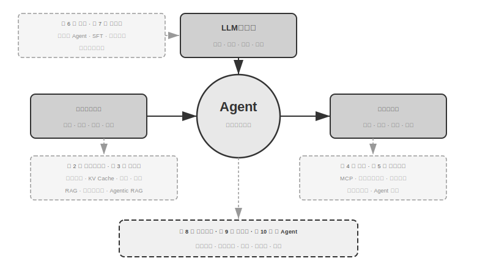
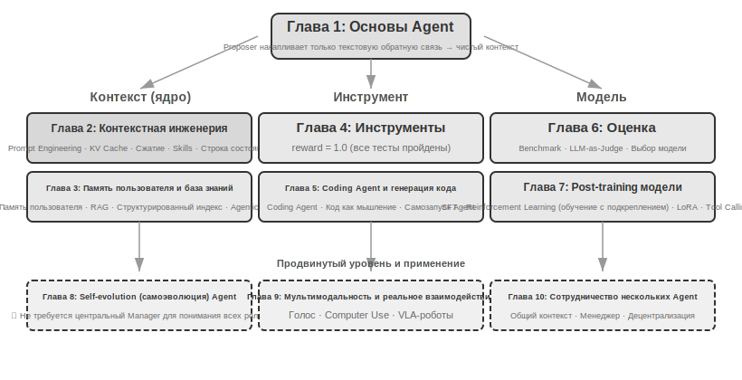

# Введение

С августа по октябрь 2025 года я провел серию технических лекций в рамках «AI Agent Practical Camp» издательства Turing (图灵). Изначальная цель лекций была проста: перевести проектирование AI Agent (агент) из плоскости «интуитивного подхода» в плоскость «подхода, основанного на принципах». Речь шла не просто о том, чтобы научить всех запускать демо-версии, а о том, чтобы глубоко понять, почему Agent проектируется именно так, и какие компромиссы стоят за каждым архитектурным решением. Эта книга была составлена и расширена на основе материалов тех лекций и экспериментов.

 Стоит отметить, что путь этой книги от первоначальной идеи до финального текста сам по себе был реализован методом, который можно назвать **whisper coding** (совместная работа через диктовку), — и для диктовки я использовал наш собственный голосовой Pine Agent. Каждый раз при подготовке материалов я сначала надиктовывал ему примерный план (outline), просил его провести исследование (survey), а затем он составлял черновик. После проведения занятий я, опираясь на обратную связь студентов лагеря, повторно обсуждал и отшлифовывал материал вместе с ним. В ходе таких итераций лекции расширялись и выстраивались в ту книгу, которую вы видите сегодня. Большую часть времени я не печатал, а диктовал свои мысли — пропускная способность голоса гораздо выше скорости печати (скорость обычной речи примерно в четыре раза превышает скорость набора текста), поэтому цикл «диктовка — исследование — обсуждение — правка» вращался очень быстро. В некотором смысле эта книга не только рассказывает об Agent, но и сама является произведением, созданным при участии Agent.

С момента выпуска DeepSeek R1 в начале 2025 года область AI эволюционировала от простых базовых моделей (то есть универсальных фундаментов больших языковых моделей) к «глубоким водам» инженерного внедрения. Прогресс на уровне моделей виден в двух направлениях: с одной стороны, модели через Agentic Reinforcement Learning (агентное обучение с подкреплением) в среде интеллектуальных агентов «вшили» способности к Tool Calling (вызов инструментов) в параметры моделей, наделив их универсальными навыками в программировании (coding), математике и управлении графическим интерфейсом (computer use). Скорость итерации моделей также становится всё выше: путь от GPT-5.2 до GPT-5.5 или от Claude Opus 4.5 до 4.8 занимал всего полгода. На продуктовом уровне такие универсальные Agent, как Manus, Claude Code и OpenClaw, переопределили способы взаимодействия человека и машины, выведя архитектурную парадигму «генерация кода + файловая система» в мейнстрим.

Когда я оглядываюсь на принципы проектирования архитектуры Agent, сформулированные в курсе почти год назад, одно открытие одновременно радует и удивляет меня: **эти принципы не только не устарели, но и стали классическими.** Хотя позже в индустрии Agent один за другим появлялись новые термины, такие как Skill, Harness (обвязка), Loop Engineering и другие, реальный порядок был ровно обратным: дело не в том, что компании вроде Anthropic сначала изобрели эти концепции, а потом многочисленные Agent начали их использовать. Напротив, огромное количество Agent уже давно работали именно так, и только потом Anthropic кристаллизовала и обобщила их в принципы архитектурного проектирования. Сначала практика, потом наименование.

Уверенность в этих принципах проистекает из реального опыта внедрения Agent в длительные процессы и сценарии с высокими рисками. Как главный ученый Pine AI, я вместе с командой создал Pine. Насколько мне известно, это первый универсальный Agent, способный автономно взаимодействовать с реальными людьми и надежно, независимо обрабатывать чувствительные, сложные и долгосрочные задачи, связанные с деньгами: он звонит операторам связи от имени пользователя для обсуждения счетов, ведет переговоры с продавцами о возврате средств и жалобах, отменяет подписки — и всё это без вмешательства человека. Такие задачи часто включают десятки раундов переговоров, где любая ошибка на любом этапе приведет к реальным финансовым потерям. Именно это почти фанатичное требование к надежности заставило нас сформулировать архитектурные принципы, на которых акцентирует внимание эта книга. Следующие примеры взяты из этой практики:

- Задолго до того, как концепция Skill стала популярной, мы уже использовали метод динамической загрузки промптов для решения проблемы бесконечного раздувания Prompt (промпт), использовали выполнение инструментов через командную строку для решения проблемы бесконечного списка инструментов и применяли технологию системной строки состояния (status bar), чтобы Agent осознавал среду выполнения, время пользователя и статус работы.
- Задолго до появления концепции Harness мы использовали методы, аналогичные Claude Code, для решения проблем нестабильности вызова инструментов, Hallucination (галлюцинация), опасных операций, превышения полномочий и несоблюдения инструкций.
- Задолго до популяризации Loop Engineering мы применяли метод, который в этой книге называется «Предлагающий — Рецензент» (proposer-reviewer), чтобы решить проблему преждевременного завершения задачи моделью: мы заставляли Agent проверять свои собственные Artifact (артефакты) и итеративно их улучшать.

И это не было нашим эксклюзивным изобретением; насколько я знаю, большинство ведущих компаний-разработчиков моделей и Agent (агентов) самостоятельно нащупали аналогичные методы. Именно поэтому в августе 2025 года я открыл курс «AI Agent Practical Camp» в Turing (图灵) и с 2024 по 2026 год продолжаю вести практический курс по AI Agent в Университете Китайской академии наук (国科大). Я решил опубликовать эту книгу в открытом доступе, а не закрывать ее ради роялти, в надежде, что эти знания распространятся среди большего числа практиков.

**Сначала практика, потом наименование** — этот порядок имеет очень важное значение для разработки Agent корпоративного уровня: **если вы каждый раз ждете, пока какой-то термин станет популярным в индустрии, прежде чем начать практиковать, вы уже опоздали на шаг.** К моменту популяризации термина ведущие компании обычно уже успевают пройти через соответствующие проблемы. Как же узнать, что делать, до того, как термины станут мейнстримом? Я считаю, что ключевыми являются два момента.

**Во-первых, наличие реального бизнеса с крайне высокими требованиями к верхнему пределу возможностей Agent (агента) и возможность постоянно получать реальную обратную связь от бизнеса.** Взять, к примеру, Pine AI: выполнение одной задачи часто занимает от нескольких часов до нескольких недель, а процесс может включать многократные коммуникации с множеством заинтересованных сторон. Это может потребовать нескольких часов телефонных разговоров, заполнения нескольких страниц сложных форм на компьютере и пересылки множества электронных писем в обоих направлениях. На протяжении всего процесса нельзя допустить ошибку ни в одной цифре, и при этом необходимо постоянно сохранять осторожность в общении, защищая интересы пользователя. Только погрузившись в такой достаточно сложный сценарий, практика естественным образом вынудит вас выстраивать Harness (обвязку), чтобы решать те задачи, которые сама модель на данный момент выполнить не может, но которые критически важны для бизнеса. И наоборот, если требования бизнеса к верхнему пределу возможностей невысоки и достаточно лишь небольшого обновления модели, у вас не будет стимула оттачивать эти архитектурные принципы.

**Во-вторых, необходимо создать механизм Evaluation (оценки).** Это тот момент, который в книге подчеркивается неоднократно: без оценки нет прогресса. Оценка позволяет отличить, действительно ли изменение привело к улучшению или это была просто удача, благодаря чему итерации Agent больше не зависят от интуиции. В конечном счете, мы выступаем за использование научной методологии в инженерии и создании Agent, и оценка является фундаментом этой методологии. Шестая глава будет специально посвящена этому набору методов.

Независимо от того, как обновляются базовые модели и как внедряются инновации в формы продуктов, почти все успешные системы Agent следуют одним и тем же архитектурным паттернам. Это не совпадение: **хорошие принципы проектирования должны проходить сквозь циклы итераций моделей**, потому что они описывают не использование какой-то конкретной модели, а базовую модель взаимодействия интеллектуальной системы с миром.

Лауреат премии Тьюринга, отец Reinforcement Learning (обучения с подкреплением) Richard Sutton однажды сказал, что эволюция Вселенной прошла через четыре стадии: от пыли к звездам, от звезд к жизни и от жизни к созданным сущностям (в оригинале — designed entities, что соответствует понятию Agent). Биологическая эволюция слепа: случайные мутации, естественный отбор. Большинство живых существ не понимают принципов своей работы и не могут самостоятельно проектировать или преобразовывать биологические виды. В то же время Agent — это совершенно новый вид существования в истории эволюции Вселенной: он может осуществлять Bootstrap (самозагрузку) и самоэволюцию через генерацию кода, подобно тому как программист пишет другого программиста, а тот, в свою очередь, продолжает писать следующего. То есть Agent способен понимать механизмы собственного функционирования и создавать совершенно новых агентов или даже улучшать самого себя в соответствии с целями. Миссия этой книги — помочь вам понять и освоить принципы этого созидания.

Основная формула этой книги состоит всего из одной фразы: **Agent = LLM + контекст + инструменты**. Все три компонента незаменимы.

Если говорить более наглядно, то это **мозг + глаза + руки и ноги**. Мозг (LLM) отвечает за мышление и принятие решений, глаза (контекст) определяют, какую информацию может видеть Agent, а руки и ноги (инструменты) определяют, какие действия Agent может совершать. (Строго говоря, «глаза» — это лишь грубая аналогия: контекст содержит не только информацию об окружении и историю диалога, но и определения инструментов. То есть информация, которую «видит» Agent, включает и то, «какие руки и ноги доступны для использования». Эта метафора призвана передать основную интуицию: контекст — это вся информация, которую модель может воспринимать.)

Для читателей, знакомых с Reinforcement Learning, эти три компонента также можно спроецировать на формальный язык RL. В частности, LLM соответствует Policy (стратегии), контекст соответствует Observation Space (пространству наблюдений), а инструменты соответствуют Action Space (пространству действий). Эти три способа описания относятся к одному и тому же объекту, просто на разных уровнях выражения.

Однако значение каждого из этих трех слов гораздо богаче их буквального смысла. В первой главе мы разберем их одно за другим, исходя из практики, и выстроим полное соответствие от интуитивного понимания до академических концепций.

## Структура книги

Книга состоит из десяти глав, разделенных на три части (рис. 0-1, рис. 0-2): первая глава является фундаментом, формирующим глобальное понимание Agent; главы со второй по седьмую последовательно раскрывают три столпа: контекст (главы 2–3), инструменты (главы 4–5) и модели (главы 6–7, оценка и дообучение); главы с восьмой по десятую посвящены продвинутым темам и приложениям, демонстрируя самоэволюцию Agent, мультимодальность и взаимодействие в реальном времени, а также многоагентное взаимодействие.

 

- **Глава 1 (Основы Agent)** на примере нескольких реальных продуктов на базе Agent (агент) формирует интуитивное понимание этой технологии. Подробно разбирается основная формула Agent: от уровня реализации (LLM + контекст + инструменты) до интуитивного уровня («мозг» + «глаза» + «руки и ноги») и академического уровня (Policy (стратегия), Observation Space (пространство наблюдений) и Action Space (пространство действий)). Одновременно с этим через эксперименты анализируется механизм работы цикла ReAct, то есть итерационный процесс «рассуждение → действие → наблюдение», и представляются три парадигмы обучения Agent: Post-training (последующее обучение), In-Context Learning (обучение в контексте) и Externalized Learning (экстернализированное обучение). В завершение обсуждаются паттерны проектирования оркестрации — от Workflow (рабочий процесс) до автономных Agent, что создает единый концептуальный каркас для последующих глав.
- **Глава 2 (Контекст-инженерия)** является самой важной главой книги, в которой системно описывается контекст — «глаза» Agent. Глава начинается со структуры сообщений API и основного цикла Agent, закладывая фундамент понимания того, что «контекст — это список сообщений». Затем подробно рассматриваются принципы работы KV Cache (механизм повторного использования результатов прошлых вычислений в процессе инференса больших моделей), после чего последовательно раскрываются: Prompt Engineering (промпт-инженерия, включая проектирование процессов, описание инструментов и детализацию бизнес-правил) и защита от Prompt Injection (инъекция промпта), механизмы загрузки Agent Skills по требованию, технология статус-бара Agent, а также стратегии Context Compression (сжатие контекста). Полные определения терминов даются при их первом упоминании в тексте.
- **Глава 3 (Пользовательская память и база знаний)** расширяет управление контекстом до систем долгосрочных знаний, выходящих за рамки одной сессии. Это позволяет Agent не только помнить содержание текущего диалога, но и накапливать, а также вызывать знания в ходе множества взаимодействий. Глава охватывает четыре прогрессивные стратегии пользовательской памяти, полный стек технологий RAG (генерация с извлечением — метод, при котором сначала извлекаются релевантные документы, а затем модель генерирует ответ), включая различные методы текстового поиска и оптимизацию ранжирования результатов, извлечение мультимодальной информации, продвинутые методы организации знаний, а также Agentic RAG (агентный RAG, где Agent самостоятельно решает, когда и что именно нужно извлечь).
- **Глава 4 (Инструменты)** исследует мост между Agent и внешним миром: инструменты подобны «рукам и ногам» Agent, позволяя ему искать информацию в вебе, вызывать API, работать с базами данных и т. д. Представляется стандарт взаимодействия инструментов MCP (Model Context Protocol) и принципы проектирования пяти категорий инструментов (восприятие, исполнение, коллаборация, триггеры событий, коммуникация с пользователем). Особое внимание уделяется механизмам безопасности инструментов исполнения и событийно-ориентированной архитектуре асинхронных Agent.
- **Глава 5 (Coding Agent и генерация кода)** обосновывает, что Coding Agent (агент-кодер) в сочетании с файловой системой является важнейшим технологическим фундаментом для всех универсальных Agent. На примере архитектуры OpenClaw анализируются рабочие процессы и приемы реализации Coding Agent, а также демонстрируется широкая ценность генерации кода за пределами программирования: от помощи в рассуждениях и построения баз знаний до динамического создания новых инструментов и саморазвития Agent.
- **Глава 6 (Оценка Agent)** выстраивает научную методологию оценки. Глава охватывает среды оценки (две основные парадигмы: вызов инструментов и человеко-машинное взаимодействие, а также отдельно обсуждаемые в конце главы среды симуляции), принципы проектирования датасетов, методы автоматизированной оценки LLM-as-a-Judge, выбор моделей на основе оценки и создание замкнутого цикла по превращению результатов оценки в улучшения системы.
- **Глава 7 (Post-training модели)** глубоко погружается в две технологии последующего обучения: SFT (Supervised Fine-tuning — контролируемое дообучение, использование размеченных данных для обучения модели «по образцу») и RL (Reinforcement Learning — обучение с подкреплением, позволяющее модели повышать качество через метод проб и ошибок и обратную связь в виде вознаграждения). Основными тезисами являются «SFT для памяти, RL для обобщения» и «данные и среда важнее алгоритмов». Глава охватывает панораму трех этапов (Pre-training / SFT / RL), классическую теорию RL, проектирование сигналов вознаграждения (от бинарных до пошаговых вознаграждений Process Reward, а также штрафы за пути верификации по принципу «награждать результат, ограничивать процесс»), алгоритмы одношагового и многошагового обучения с подкреплением, а также передовые исследования в области оптимизации эффективности выборки.
- **Глава 8 (Самоэволюция Agent)** исследует способы непрерывного усиления Agent без изменения весов модели. Выделяются два основных пути эволюции: обучение на опыте (резюмирование стратегий, запись рабочих процессов, автоматическая оптимизация системных промптов, экстернализация знаний Skills) и активное обнаружение и создание инструментов (MCP-Zero, интеграция инструментов с открытым исходным кодом, создание новых инструментов с помощью кода).
- **Глава 9 (Мультимодальность и real-time взаимодействие)** рассматривает выход Agent из мира текста в физический мир. Глава охватывает голосовых Agent (переход от последовательных конвейеров к сквозным моделям End-to-End), Computer Use (способность Agent управлять графическим интерфейсом подобно человеку) и управление роботами (контроль через VLA (модели «зрение-язык-действие») и перенос Sim2Real), раскрывая общие архитектурные вызовы, связанные с мультимодальностью и работой в реальном времени.
- **Глава 10 (Multi-Agent коллаборация)** обсуждает конечную форму систем AI Agent: как несколько Agent распределяют задачи и сотрудничают. Системно излагается классификация многоагентного взаимодействия (общий/раздельный контекст × равноправные/менеджеры/децентрализованные структуры). На примерах переводческих Agent и связок «телефон + компьютер» демонстрируются методы проектирования архитектур коллаборации, а также дается прогноз развития общества и экономики Agent.

## Как читать эту книгу

Главы этой книги относительно независимы, поэтому вы можете выбрать различные пути чтения в зависимости от ваших потребностей:

- **Если вы разработчик Agent (агент)**, рекомендуется прочитать всю книгу по порядку. Главы с первой по пятую составляют ядро системы знаний, а методологию оценки в шестой главе также нельзя пропускать. Седьмая глава ориентирована на читателей, которым необходимо настраивать модели, а главы с восьмой по десятую демонстрируют продвинутые направления развития.
- **Если ваше время ограничено**, в приоритете прочтите первую главу (для формирования целостного восприятия) и вторую главу (для освоения важнейшего Context Engineering). Низкоуровневые принципы KV Cache во второй главе носят довольно технический характер; при первом чтении можно пропустить теоретическую часть и просто запомнить три основных вывода, приведенных в начале, это не помешает дальнейшему пониманию.
- **Если вас интересует обучение моделей**, вы можете сразу перейти к седьмой главе (Post-training — пост-обучение модели); при этом методы оценки (глава 6) являются обязательным условием для обучения, поэтому их рекомендуется читать вместе, предварительно ознакомившись с первой и второй главами для формирования общего представления.

Каждая глава содержит большое количество **экспериментов** и **задач для размышления**, пронумерованных в формате «Эксперимент X-Y» (где X — номер главы, а Y — порядковый номер внутри главы). Сложность в заголовках экспериментов и задач отмечена звездами: ★ означает начальный уровень, подходящий для всех читателей; ★★ означает среднюю сложность, требующую определенной базы инженерной практики; ★★★ означает продвинутый уровень, обычно включающий открытые вопросы или проектирование сложных систем. Большинство экспериментов сопровождаются полным исполняемым кодом, организованным в соответствующем репозитории с открытым исходным кодом:

> **Репозиторий с кодом**: [https://github.com/bojieli/ai-agent-book](https://github.com/bojieli/ai-agent-book)

Названия проектов в репозитории соответствуют экспериментам в книге, каждый проект содержит полные инструкции по запуску и конфигурацию зависимостей. Я настоятельно рекомендую вам запустить эти эксперименты самостоятельно. AI Agent — это область с очень сильным практическим уклоном, и многие интуитивные решения в дизайне могут быть по-настоящему сформированы только в процессе ручной отладки.

**Терминологическое соглашение**: прямой перевод некоторых английских технических терминов на китайский язык может вызвать неоднозначность, поэтому в данной книге сделано особое различие для двух высокочастотных слов: `Reasoning` (процесс развертывания моделью промежуточных выводов, процесс «размышления») единообразно переводится как «思考» (размышление), а `Inference` (прямое вычисление модели, ее развертывание и работа) — как «推理» (инференс). Использование двух разных слов призвано избежать ситуации, когда термин «推理» несет сразу две концепции, не позволяя читателю их различать. Таким образом, везде, где речь идет о `Chain-of-Thought` (цепочка рассуждений) модели, моделях мыслительного типа (таких как серия OpenAI o, DeepSeek-R1, которые в книге называются «мыслящими моделями» или «мыслителями»), `thinking tokens` (токены размышления) и процессе размышления, в книге неизменно используется «思考». Везде, где речь идет о работе и развертывании модели (`Inference time` — время инференса, стоимость инференса, стек инференса, `Inference-time scaling` и т. д.), используется «推理». Исключением являются несколько сложных слов, уже закрепившихся в языке: **логическое рассуждение, `multi-hop reasoning` (многошаговое рассуждение), пространственное рассуждение, временное рассуждение**, а также повседневное использование вроде «логических игр» — в этих случаях книга следует традиции и сохраняет термин «推理». Просьба к читателям понимать их в соответствии с контекстом как общее значение дедуктивного вывода, а не вышеупомянутый технический смысл `Inference`. Для других ключевых терминов в тексте при первом упоминании будет приведено соответствие между китайским и английским названиями.- **Базовое понимание архитектуры Transformer** (главы 2, 7): Transformer является базовой архитектурой практически для всех современных больших языковых моделей. Читателям, желающим систематически восполнить базовые знания о больших моделях, рекомендуется книга «Иллюстрированные большие модели» издательства Turing (图灵). В этой книге с помощью наглядных иллюстраций объясняются архитектура Transformer, Pre-training (предобучение), Fine-tuning (дообучение) и другие ключевые концепции, что станет отличным дополнением к инженерному взгляду на агентов в данной книге.

## Предварительные знания

Эта книга ориентирована на читателей с определенным техническим бэкграундом, но не требует, чтобы вы были экспертом в какой-то конкретной области. Ниже перечислены предварительные знания на двух уровнях: «необходимые» и «рекомендуемые», чтобы помочь вам оценить свою степень подготовки.

**Необходимые: база для чтения всей книги**

- **Программирование на Python**: почти все эксперименты в книге основаны на Python. Вам необходимо быть знакомым с базовым синтаксисом Python, общепринятыми структурами данных, управлением пакетами (pip) и другими базовыми концепциями. Не требуется быть экспертом, но вы должны уметь понимать и изменять код на Python средней сложности.
- **Базовый опыт использования LLM**: вы должны были пользоваться ChatGPT, Claude или аналогичными продуктами и понимать базовую модель взаимодействия «Prompt (промпт) → ответ модели».
- **Инструмент программирования с помощью AI**: настоятельно рекомендуется установить и ознакомиться хотя бы с одним инструментом AI-ассистированного программирования, таким как Claude Code, Codex, Cursor, Trae и т. д. С одной стороны, эти инструменты могут значительно повысить эффективность разработки экспериментов, так как эксперименты в книге включают большой объем написания и отладки кода. С другой стороны, сами эти инструменты программирования являются зрелыми Coding Agent; в процессе их использования вы наглядно познакомитесь с циклом ReAct, Tool Calling (вызов инструментов), управлением контекстом и другими ключевыми механизмами, неоднократно обсуждаемыми в книге. Этот опыт «из первых рук» чрезвычайно ценен для понимания принципов проектирования Agent.
- **Общие знания в области программной инженерии**: знакомство с работой в командной строке, системой контроля версий Git, форматом данных JSON, REST API и другими базовыми концепциями. Это основа для запуска экспериментов и понимания механизмов вызова инструментов агентами.

**Рекомендуемые: для улучшения опыта чтения определенных глав**

- **Основы Machine Learning (машинное обучение)** (глава 7): понимание таких базовых концепций, как Training (тренировка) и Inference (вывод), Loss Function (функция потерь), Gradient Descent (градиентный спуск) и Overfitting (переобучение), поможет разобраться в Post-training (пост-обучение) модели.
- **Базовая математика** (главы 2–3, 7): интуитивное понимание линейной алгебры (например, знание того, что вектор может представлять направление и величину, а матрица — выполнять пакетные операции) полезно для понимания Embedding (эмбеддинг) и механизмов Attention (внимание); базовые знания теории вероятностей и статистики помогут разобраться в метриках оценки и ожидаемом вознаграждении в Reinforcement Learning (обучение с подкреплением). Математика в книге не включает сложных выводов и ориентирована на интуитивные объяснения.
- **Основы Web-разработки** (главы 4, 9): понимание таких концепций, как HTTP, WebSocket и архитектура разделения фронтенда и бэкенда, поможет в изучении событийно-ориентированной асинхронной архитектуры Agent (агент) и экспериментов по оперативной связи в голосовых агентах.

Если вам не хватает каких-то из этих предварительных знаний, не стоит останавливаться. Основная ценность этой книги заключается в **принципах проектирования архитектуры и методологии инженерной практики**, а не в каком-то конкретном алгоритме или приеме. За исключением седьмой главы о пост-обучении, требования к математике и машинному обучению во всей книге очень низкие, и её вполне можно использовать в качестве отправной точки.

Технологии Agent продолжают стремительно развиваться, но **хорошие принципы проектирования архитектуры обладают силой, проходящей сквозь время**. Овладев пониманием того, «почему это спроектировано именно так», вы сможете сохранять ясность суждений в меняющихся технологических волнах. Надеюсь, эта книга станет вашим надежным путеводителем в создании AI Agent.

## Благодарности

Благодарю преподавателей Мэн Гэ и Лю Мэйин из Turing (图灵) за их кропотливую редакторскую работу и усилия по организации курса «AI Agent 实战营» (Практический лагерь AI Agent); благодарю преподавателя Лю Цзюньминя за открытие практического курса по AI Agent в Университете Китайской академии наук (国科大). Также хочу выразить особую благодарность всем слушателям курса «AI Agent 实战营» и всем студентам практического курса по AI Agent в Университете Китайской академии наук — в процессе преподавания этих курсов вы дали мне много ценных отзывов и предложений, что позволило мне самому четче понять эти концепции.

Благодарю всех коллег из Pine AI. Без таких отличных продуктов, как в Pine AI, и тех вызовов, которые они принесли, я бы не смог получить столь глубокое понимание и практику в области Agent; в ходе постоянных столкновений идей коллеги также внесли огромный вклад в виде ценных мыслей.

Также хочу поблагодарить многих друзей из индустрии AI (не называя всех поименно). В ходе различных отраслевых дискуссий вы давали честные отзывы о моих взглядах, исправляли мои ошибочные суждения и повышали мой уровень познания моделей и Agent.

Больше всего я хочу поблагодарить свою семью, особенно мою жену Мэн Цзяин. Она неизменно поддерживала меня в написании этой книги, а также высказала множество ценных замечаний.